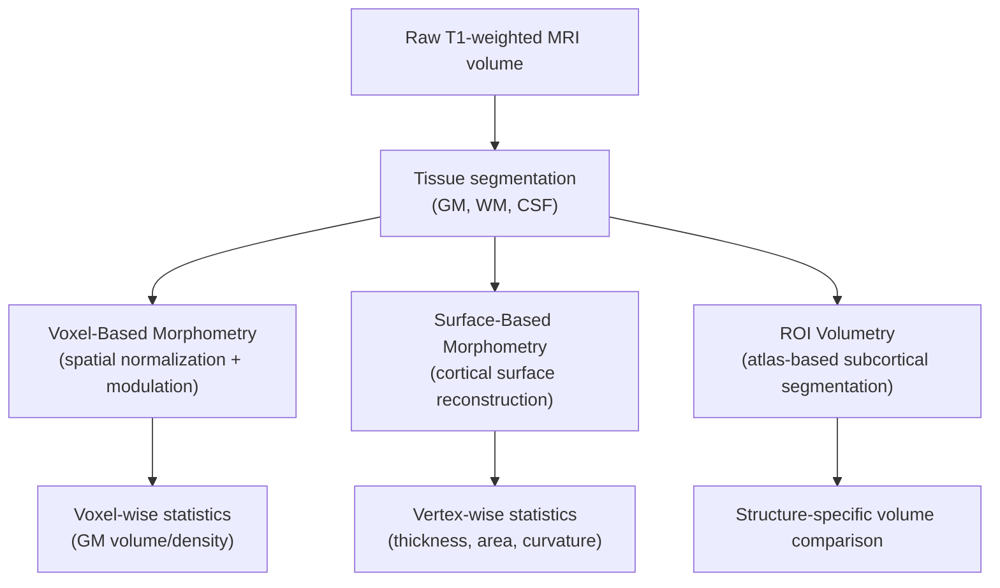

## Structural MRI and Morphometry

### Overview

Structural MRI (sMRI) captures high-resolution anatomical images of brain tissue based on T1, T2, or proton-density contrast, without reference to a task or time-varying signal. **Morphometry** refers to the quantitative analysis of these structural images — measuring volume, thickness, shape, and surface area of brain structures to characterize anatomy, development, aging, and disease-related change. Together, sMRI acquisition and morphometric analysis form the anatomical backbone against which functional and connectivity findings (fMRI, DTI) are typically registered and interpreted.

### Structural MRI Acquisition

**Key Points**

- Most commonly acquired using a **T1-weighted 3D gradient-echo sequence**, such as MP-RAGE (Magnetization-Prepared Rapid Gradient Echo) or SPGR (Spoiled Gradient Recalled), optimized for high gray/white matter contrast at high spatial resolution (typically ~1 mm isotropic or finer)
- **T2-weighted** and **FLAIR** (Fluid-Attenuated Inversion Recovery) sequences are commonly acquired alongside T1 for clinical purposes — FLAIR nulls CSF signal, improving detection of periventricular white matter lesions
- **Proton density (PD)** sequences offer additional tissue contrast, historically useful for distinguishing gray matter from CSF
- Voxel size, field strength, and scan duration trade off against each other: higher resolution and higher field strength (e.g., 3T or 7T) improve tissue boundary delineation but increase acquisition time and susceptibility to motion artifact

[Inference] Subject motion is one of the most consequential practical confounds in structural morphometry, since even sub-millimeter motion can systematically bias derived measures such as cortical thickness; the degree of bias depends on the specific pipeline's motion sensitivity and is not uniform across all software packages.

### Core Morphometric Approaches

**Voxel-Based Morphometry (VBM)**

- A whole-brain, unbiased technique comparing local concentration or volume of gray matter (or white matter) across subjects on a voxel-by-voxel basis
- General pipeline:
  1. Segment T1 images into gray matter, white matter, and CSF tissue probability maps
  2. Spatially normalize all subjects' segmented images into a common stereotactic space (e.g., MNI space)
  3. Modulate (adjust intensity to preserve total tissue volume information lost during normalization)
  4. Smooth with a Gaussian kernel to improve signal-to-noise and accommodate residual anatomical variability
  5. Perform voxel-wise statistical comparison (e.g., general linear model) across groups or against a continuous variable
- **Key Points**
  - Sensitive to regional gray matter volume/density differences without requiring a priori ROI selection
  - Susceptible to registration/normalization errors, particularly in regions with high anatomical variability
  - Statistical results require correction for multiple comparisons across the large number of voxels tested (e.g., family-wise error correction, cluster-based thresholding)

**Surface-Based Morphometry (SBM)**

- Reconstructs the cortical surface as a mesh (typically separate pial and white matter surfaces) and derives geometric properties directly from this reconstruction
- Commonly implemented via pipelines such as FreeSurfer
- **Key Points**
  - **Cortical thickness:** perpendicular distance between the white matter surface and the pial surface at each vertex
  - **Cortical surface area:** local area of the reconstructed cortical sheet
  - **Cortical volume:** the product-like combination of thickness and surface area, though not perfectly separable from either alone
  - Thickness and surface area are governed by distinct developmental and genetic mechanisms [Inference — this dissociation is a well-supported finding in developmental and twin-based genetic studies, though the precise cellular mechanisms remain an active research area], so analyzing them separately can reveal effects obscured when only volume is examined
  - Vertex-wise statistical analysis parallels VBM's voxel-wise approach but operates on the 2D cortical mesh rather than 3D voxel grid

**Deformation-Based Morphometry (DBM) / Tensor-Based Morphometry (TBM)**

- Analyzes the deformation fields required to warp an individual's brain into a common template
- DBM examines the **magnitude** of local volumetric change (Jacobian determinant of the deformation field); TBM extends this to analyze the full deformation tensor, capturing shape and directional information beyond simple volume change
- Useful for detecting subtle, spatially diffuse morphological differences that voxel-wise intensity-based methods may under-detect

**Region-of-Interest (ROI) Volumetry**

- Manually or automatically segments predefined anatomical structures (e.g., hippocampus, amygdala, thalamus) and measures their volume directly
- Automated subcortical segmentation is commonly performed via atlas-based methods (e.g., FreeSurfer's `aseg`, FSL's FIRST)
- **Key Points**
  - Higher anatomical specificity and interpretability than whole-brain voxel-wise methods
  - Requires a priori hypothesis about which structure(s) are relevant
  - Segmentation accuracy depends on image quality, contrast, and the robustness of the atlas/algorithm to individual anatomical variation

### Key Morphometric Metrics Summary

| Metric | Unit | Typical Method | Sensitive To |
| --- | --- | --- | --- |
| Gray matter volume | mm³ | VBM | Neuronal/glial density, cortical folding |
| Cortical thickness | mm | SBM (FreeSurfer-type) | Cell size/density, myelination near GM-WM boundary |
| Cortical surface area | mm² | SBM | Number of cortical columns, gyrification extent |
| Gyrification index | dimensionless ratio | SBM-derived | Cortical folding complexity |
| Subcortical structure volume | mm³ | ROI/atlas segmentation | Nucleus-specific atrophy or hypertrophy |
| Local deformation | Jacobian determinant | DBM/TBM | Diffuse shape/volume change |

### Registration and Normalization

- Individual brains vary substantially in size and shape; morphometric group comparison requires spatial normalization to a common template (commonly **MNI152** or **Talairach** space, historically)
- Normalization algorithms range from linear (affine, 12 degrees of freedom) to nonlinear (high-dimensional warping, e.g., DARTEL, ANTs SyN) approaches
- **Key Points**
  - Nonlinear registration better aligns fine anatomical detail across subjects but at greater computational cost and risk of over-warping (forcing dissimilar anatomy into artificial similarity)
  - Registration quality directly determines morphometric result validity — poor registration is one of the most common sources of spurious VBM findings

### Statistical Considerations

- Morphometric analyses typically use a **general linear model (GLM)** framework, incorporating covariates such as age, sex, and **total intracranial volume (TIV)** to control for global brain size differences
- Multiple comparison correction is essential given the large number of voxels or vertices tested:
  - Family-wise error (FWE) correction
  - False discovery rate (FDR) correction
  - Cluster-based thresholding with permutation testing (e.g., threshold-free cluster enhancement, TFCE)
- [Unverified] The relative sensitivity and specificity trade-offs among these correction methods can vary by dataset characteristics (sample size, effect size, spatial smoothness), so no single correction approach is universally optimal across all study designs

### Applications in Development, Aging, and Disease

**Development**

- Cortical thickness generally **decreases** through adolescence in many regions (interpreted partly as synaptic pruning and increased myelination at the gray-white boundary), while surface area follows a distinct, largely separable developmental trajectory

**Aging**

- Widespread, though regionally heterogeneous, gray matter volume and cortical thickness decline with normal aging, with frontal and medial temporal regions frequently highlighted as more susceptible in the literature

**Neurodegenerative disease**

- **Alzheimer's disease:** disproportionate hippocampal and medial temporal lobe atrophy, often preceding widespread cortical thinning; hippocampal volumetry is a common biomarker in both research and clinical trial contexts
- **Frontotemporal dementia:** frontal and/or temporal lobe atrophy patterns, distinguishable in some cases from Alzheimer's-typical patterns using ROI or surface-based comparison
- **Huntington's disease:** pronounced striatal (caudate, putamen) atrophy detectable via ROI volumetry, often preceding clinical symptom onset

**Psychiatric conditions**

- Findings of reduced cortical thickness or subcortical volume differences have been reported across conditions including schizophrenia, major depressive disorder, and bipolar disorder, though effect sizes at the individual level are typically modest and findings show meaningful heterogeneity across studies and samples

[Speculation] Using any single structural morphometric measure as a standalone diagnostic biomarker for a specific psychiatric disorder in an individual patient remains speculative at present; current applications are predominantly at the group/research level rather than individual clinical diagnosis.

### Worked Example: VBM Group Comparison

**Example**

A researcher compares gray matter volume between a patient group and matched healthy controls:

1. Acquire T1-weighted MP-RAGE scans for all subjects
2. Segment each scan into GM/WM/CSF probability maps
3. Normalize all segmented GM maps to MNI space using a study-specific template (to reduce normalization bias)
4. Modulate normalized GM maps to preserve original volume information
5. Smooth with an 8mm FWHM Gaussian kernel
6. Fit a voxel-wise GLM: $GM_{ij} = \beta_0 + \beta_1(\text{Group}) + \beta_2(\text{Age}) + \beta_3(\text{TIV}) + \varepsilon_{ij}$
7. Apply cluster-based permutation correction for multiple comparisons

**Output**

A statistical parametric map highlighting clusters of significant GM volume difference between groups (e.g., reduced volume in the patient group localized to medial temporal and prefrontal regions), reported with cluster size, peak MNI coordinates, and corrected p-values.

### Conclusion

Structural MRI and morphometry translate raw anatomical images into quantitative measures of brain structure — volume, thickness, area, and shape — enabling systematic comparison across individuals, groups, and time. The choice among VBM, surface-based, deformation-based, and ROI-based approaches depends on the specific anatomical question, with each method carrying distinct assumptions, sensitivities, and failure modes tied largely to registration accuracy and multiple-comparison handling. These structural measures also serve as the anatomical reference frame onto which functional and connectivity data from other neuroimaging modalities are commonly mapped.

**Related Topics**

- FreeSurfer and automated cortical surface reconstruction pipelines
- Spatial normalization algorithms (DARTEL, ANTs, nonlinear registration)
- Longitudinal morphometric analysis and within-subject registration
- Total intracranial volume correction methods
- Cortical gyrification and folding metrics
- Structural covariance networks (morphometric correlation across regions)
- Diffusion-weighted imaging and its relationship to structural connectivity