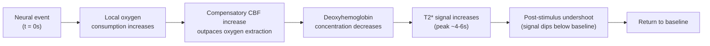

## Functional MRI and the BOLD Signal

### Overview

Functional MRI (fMRI) infers regional neural activity indirectly by measuring hemodynamic (blood flow and oxygenation) changes coupled to neural activity, most commonly via the **blood-oxygen-level-dependent (BOLD)** contrast mechanism. Rather than detecting electrical or metabolic activity directly, fMRI exploits the differential magnetic properties of oxygenated versus deoxygenated hemoglobin, translating local vascular responses into a measurable MRI signal change over time.

### Neurovascular Coupling: The Biological Basis of BOLD

**Key Points**

- Increased local neural activity raises regional metabolic demand, increasing oxygen consumption
- This triggers a **disproportionately larger increase in local cerebral blood flow (CBF)** than the increase in oxygen extraction — a phenomenon sometimes described as "neurovascular overcompensation"
- Net result: local **deoxyhemoglobin concentration decreases** relative to baseline, despite increased neural activity and oxygen consumption
- The biological signaling cascade linking neural activity to vasodilation involves astrocytes, interneurons, and vascular smooth muscle/pericytes, mediated by neurotransmitter and metabolite signaling (e.g., nitric oxide, prostaglandins, potassium ion flux)

[Inference] The precise relative contributions of different neurovascular coupling mechanisms (astrocytic vs. neuronal vs. purely metabolic signaling) remain an active area of cellular neuroscience research, and the balance of evidence continues to be refined; the macroscopic hemodynamic outcome (blood flow increase outpacing oxygen extraction) is well established, but the microcircuit-level mechanistic account is less settled.

### The BOLD Contrast Mechanism

- **Oxyhemoglobin** is diamagnetic — it has minimal effect on the local magnetic field
- **Deoxyhemoglobin** is paramagnetic — it distorts the local magnetic field, creating microscopic field inhomogeneities that accelerate dephasing of precessing protons, shortening **T2*** (and to a lesser degree T2)
- When deoxyhemoglobin concentration **decreases** (as occurs following neural activation, per the overcompensation above), local field homogeneity **improves**, T2* decay slows, and the **T2*-weighted MR signal increases**

$$S(TE) = S_0 \, e^{-TE / T2^*}$$

where $S(TE)$ is signal at echo time $TE$, $S_0$ is initial signal, and $T2^*$ reflects the combined effect of spin-spin relaxation and local field inhomogeneity.

- fMRI acquisitions use pulse sequences sensitized to T2* — most commonly **gradient-echo echo-planar imaging (GRE-EPI)** — because gradient-echo sequences (unlike spin-echo) do not refocus the susceptibility-induced dephasing that BOLD contrast depends on

### The Hemodynamic Response Function (HRF)

The HRF describes the time course of the BOLD signal change following a brief neural event.

**Key Points**

- **Initial dip** (small, transient signal decrease immediately post-stimulus): reported in some studies, attributed to a brief period of oxygen extraction preceding the compensatory blood flow increase; [Unverified] its detectability is inconsistent across studies, field strengths, and acquisition parameters, and it is not considered a universally reliable feature
- **Rise to peak:** signal increases, typically peaking approximately **4–6 seconds** post-stimulus onset
- **Post-stimulus undershoot:** signal often dips modestly below baseline before returning to baseline, commonly attributed to a mismatch between blood volume/flow recovery and metabolic recovery kinetics [Inference — the precise physiological explanation for the undershoot, whether primarily vascular or metabolic, remains debated in the literature]
- The HRF is commonly approximated mathematically using a **double-gamma function**, combining a positive gamma function (main peak) and a smaller negative gamma function (undershoot)

**Key Points on HRF Variability**

- HRF shape and timing vary across brain regions, individuals, age groups, and vascular health status
- This variability has practical implications for fMRI analysis: models assuming a fixed canonical HRF shape may under- or over-estimate activation in regions or populations where the true HRF deviates from that canonical form

### fMRI Acquisition Parameters

| Parameter | Typical Range | Effect |
| --- | --- | --- |
| TR (repetition time) | 0.5–3 s (whole-brain); faster with multiband | Temporal resolution of the time series |
| TE (echo time) | ~30 ms at 3T | Degree of T2*-weighting; tuned near gray matter T2* for optimal contrast |
| Voxel size | 2–3.5 mm isotropic (standard); sub-mm possible at high field | Spatial resolution vs. SNR trade-off |
| Field strength | 1.5T, 3T (most common), 7T (research) | Higher field increases BOLD sensitivity and SNR but also susceptibility artifact |

**Multiband (simultaneous multi-slice) acquisition:** excites and acquires multiple slices simultaneously per RF pulse, substantially reducing TR and enabling sub-second whole-brain sampling — widely used in modern fMRI protocols (e.g., Human Connectome Project acquisition protocols).

### Task-Based fMRI Analysis Pipeline

**Key Points**

1. **Preprocessing:** motion correction, slice-timing correction, spatial normalization to a template space, spatial smoothing
2. **Statistical modeling:** typically a **General Linear Model (GLM)**, convolving a modeled task/stimulus timing function with a canonical HRF to generate predicted BOLD response regressors
3. **Contrast estimation:** statistical comparison between task conditions (e.g., Task A vs. Task B, or Task vs. baseline)
4. **Group-level analysis:** combining individual-subject statistical maps across a sample, typically via a second-level (mixed-effects) GLM
5. **Multiple comparison correction:** cluster-based thresholding, family-wise error correction, or false discovery rate correction, given the large number of voxels tested simultaneously

$$Y = X\beta + \varepsilon$$

where $Y$ is the observed BOLD time series for a voxel, $X$ is the design matrix (HRF-convolved task regressors plus nuisance covariates), $\beta$ are estimated parameter weights, and $\varepsilon$ is residual error.

### Resting-State fMRI

- Acquired without an explicit task, used to study intrinsic functional connectivity (see prior material on resting-state networks and the default mode network)
- Relies on the same BOLD contrast mechanism but analyzes spontaneous low-frequency fluctuations (typically $0.01$–$0.1$ Hz) rather than task-evoked responses

### Common Artifacts and Confounds

**Key Points**

- **Head motion:** one of the most significant confounds; even sub-millimeter motion can produce spurious activation or connectivity estimates, particularly problematic in populations prone to movement (children, certain patient groups)
- **Susceptibility artifacts:** signal dropout and geometric distortion near air-tissue interfaces (orbitofrontal cortex, medial temporal lobe near sinuses/ear canals) due to EPI's high sensitivity to field inhomogeneity
- **Physiological noise:** cardiac pulsation and respiration introduce signal fluctuations that can be mistaken for neural signal; often addressed via physiological noise regression (e.g., RETROICOR) or independent component-based denoising (e.g., ICA-AROMA)
- **Draining vein effect:** BOLD signal can be biased toward larger draining veins downstream of the actual site of neural activity, spatially blurring the true activation locus [Inference — the magnitude of this spatial bias is field-strength and pulse-sequence dependent, generally reduced at higher field strengths and with spin-echo rather than gradient-echo sequences, though exact quantification varies across studies]

### Temporal and Spatial Resolution Limits

- **Temporal resolution** is fundamentally constrained by the sluggishness of the hemodynamic response (seconds), not merely by scanner sampling rate (TR); even with very short TR, the underlying neurovascular signal itself evolves over several seconds
- **Spatial resolution** is limited by both acquisition voxel size and by the spatial extent of the vascular response, which does not perfectly match the spatial extent of the underlying neural activity
- These limits distinguish fMRI from electrophysiological methods (EEG/MEG), which offer millisecond temporal resolution but comparatively poorer spatial localization — a common motivation for multimodal imaging approaches

### Worked Example: Single-Voxel GLM Analysis

**Example**

A voxel in the visual cortex is recorded during an alternating block-design experiment (20s visual stimulation, 20s rest, repeated).

1. The task timing (stimulus "on" periods) is convolved with a canonical double-gamma HRF to create a predicted BOLD regressor
2. This predicted regressor is entered as a column in the design matrix $X$, alongside nuisance regressors (six motion parameters, linear drift term)
3. The GLM estimates $\beta$ for the task regressor via ordinary least squares: $\hat{\beta} = (X^TX)^{-1}X^TY$
4. A t-statistic is computed testing whether $\hat{\beta}$ is significantly different from zero

**Output**

A statistically significant positive $\beta$ weight in visual cortex voxels, exceeding the corrected significance threshold, indicating BOLD signal changes time-locked to visual stimulation consistent with task-driven neural activation in that region.

### Clinical and Research Applications

- **Presurgical mapping:** localizing eloquent cortex (motor, language) relative to a tumor or epileptogenic focus prior to neurosurgery
- **Cognitive neuroscience research:** mapping task-evoked activation across perceptual, cognitive, and affective domains
- **Pharmacological fMRI (phMRI):** examining drug-induced changes in BOLD activity or connectivity
- **Naturalistic and movie-watching paradigms:** increasingly used to study more ecologically valid, continuous cognitive processing

### Conclusion

fMRI's BOLD contrast provides a widely used, non-invasive window into regional brain activity by exploiting the magnetic susceptibility difference between oxygenated and deoxygenated hemoglobin. Its major strength — the ability to image whole-brain activity non-invasively with reasonable spatial resolution — is counterbalanced by its indirect, vascularly mediated nature, which imposes fundamental temporal resolution limits and introduces characteristic confounds (motion, physiological noise, susceptibility artifact, draining vein bias) that must be addressed through careful acquisition and preprocessing design.

**Related Topics**

- General Linear Model (GLM) design matrices and contrast specification
- Resting-state networks and the default mode network
- Physiological noise correction (RETROICOR, ICA-AROMA)
- Multiband/simultaneous multi-slice acquisition
- Multimodal integration of fMRI with EEG/MEG
- Pharmacological fMRI (phMRI) methodology
- Presurgical functional mapping protocols