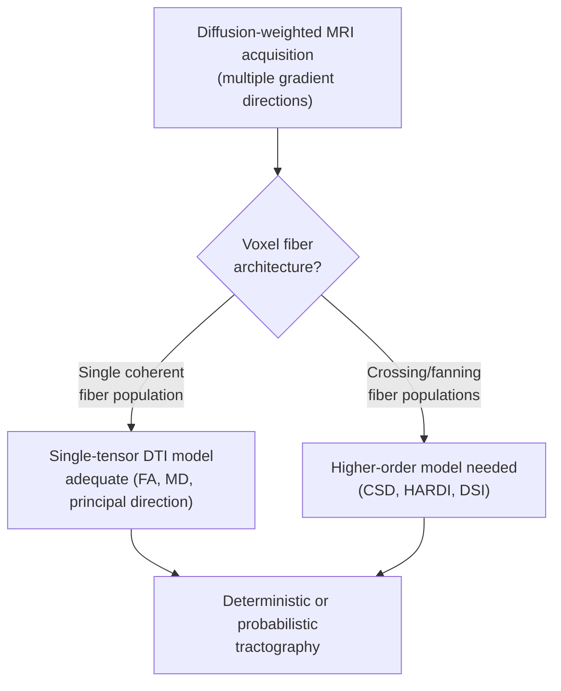

## Diffusion Imaging and White Matter Tractography

### Overview

Diffusion imaging is an MRI-based technique that measures the direction and magnitude of water molecule diffusion within tissue to infer microstructural organization, most notably the orientation of white matter fiber bundles. **Tractography** extends these voxel-wise diffusion measurements into reconstructed, continuous estimates of white matter pathways, forming the primary non-invasive method for mapping structural connectivity in the living human brain.

### Physical Basis: Diffusion-Weighted Imaging (DWI)

**Key Points**

- Water molecules undergo random thermal (Brownian) motion; in unrestricted media this diffusion is **isotropic** (equal in all directions)
- In biological tissue, diffusion is **restricted and hindered** by cellular membranes, myelin sheaths, and axonal structures
- In white matter specifically, axonal membranes and myelin sheaths preferentially restrict diffusion **perpendicular** to fiber orientation while allowing relatively freer diffusion **parallel** to the fiber axis — this directional dependence is termed **anisotropic diffusion**
- DWI sequences apply paired diffusion-sensitizing gradient pulses (typically within a spin-echo EPI sequence) that make the MR signal sensitive to the degree of water displacement along a specified direction during a defined diffusion time

**The b-value:**

$$S = S_0 \, e^{-b D}$$

where $S$ is the diffusion-weighted signal, $S_0$ is the signal with no diffusion weighting, $b$ is the b-value (a sequence parameter encoding gradient strength, duration, and timing), and $D$ is the apparent diffusion coefficient along the applied gradient direction.

- Higher b-values increase sensitivity to diffusion-related signal attenuation but reduce overall signal-to-noise ratio; clinical DWI (e.g., stroke imaging) commonly uses $b \approx 1000\ s/mm^2$, while advanced microstructural models may acquire multiple ("multi-shell") b-values

### Diffusion Tensor Imaging (DTI)

**Key Points**

- DTI models diffusion within each voxel as a **three-dimensional Gaussian process**, characterized by a symmetric $3\times3$ diffusion tensor $D$
- Requires diffusion measurements along a minimum of 6 non-collinear gradient directions (plus one non-diffusion-weighted $b=0$ image) to fully characterize the tensor; modern protocols commonly use considerably more directions (e.g., 30–64+) for improved estimation robustness
- Eigenvalue decomposition of the tensor yields three eigenvalues ($\lambda_1 \geq \lambda_2 \geq \lambda_3$) and corresponding eigenvectors, describing the magnitude and orientation of diffusion along three orthogonal principal axes

**Derived scalar metrics:**

$$FA = \sqrt{\frac{3}{2}} \cdot \frac{\sqrt{(\lambda_1-\bar\lambda)^2 + (\lambda_2-\bar\lambda)^2 + (\lambda_3-\bar\lambda)^2}}{\sqrt{\lambda_1^2+\lambda_2^2+\lambda_3^2}}$$

where $\bar\lambda = (\lambda_1+\lambda_2+\lambda_3)/3$ is the mean diffusivity.

| Metric | Formula Basis | Interpretation |
| --- | --- | --- |
| Fractional Anisotropy (FA) | Normalized variance of eigenvalues | Degree of directional preference; higher in coherently organized white matter |
| Mean Diffusivity (MD) | $(\lambda_1+\lambda_2+\lambda_3)/3$ | Overall magnitude of diffusion, independent of direction |
| Axial Diffusivity (AD) | $\lambda_1$ | Diffusion along the principal (assumed axonal) axis |
| Radial Diffusivity (RD) | $(\lambda_2+\lambda_3)/2$ | Diffusion perpendicular to the principal axis |

[Inference] AD and RD are sometimes interpreted as relatively selective markers of axonal integrity and myelination, respectively, based on animal model studies; however, this interpretation is a simplification, since multiple co-occurring microstructural changes (axon density, membrane permeability, fiber crossing) can independently influence these metrics, so tissue-specific inference from AD/RD alone should be treated cautiously rather than as a direct histological readout.

### The Tensor Model's Limitation: Crossing Fibers

- The single-tensor DTI model assumes **one dominant fiber orientation per voxel**
- A substantial proportion of white matter voxels (commonly cited estimates suggest a large fraction of white matter voxels, though exact figures vary by study and voxel size) contain **crossing, kissing, or fanning fiber populations**, which the single-tensor model cannot correctly resolve — producing artificially low FA and biased principal direction estimates in these regions

**Higher-order models addressing this limitation:**

- **High Angular Resolution Diffusion Imaging (HARDI):** samples many gradient directions on a sphere to better characterize complex diffusion profiles
- **Diffusion Spectrum Imaging (DSI):** densely samples q-space to reconstruct a full diffusion probability density function
- **Constrained Spherical Deconvolution (CSD):** estimates a fiber orientation distribution function (fODF) per voxel, capable of resolving multiple fiber populations
- **Multi-shell, multi-tissue CSD:** extends CSD using multiple b-value shells to separately model white matter, gray matter, and CSF signal contributions, improving fiber orientation estimation accuracy

### Tractography Algorithms

**Deterministic Tractography**

- Follows the single most likely fiber direction (e.g., principal eigenvector) at each step from a seed point, propagating a streamline until it meets a stopping criterion (e.g., FA falls below threshold, or streamline curvature exceeds an angular limit)
- Computationally efficient but produces a single, non-probabilistic estimate per seed, and is particularly vulnerable to error propagation through crossing-fiber regions

**Probabilistic Tractography**

- At each step, samples the fiber orientation from an estimated probability distribution (rather than taking a single deterministic direction), repeating many iterations per seed point
- Produces a **connectivity distribution** reflecting the estimated probability of connection between regions, rather than a single deterministic path
- Better captures uncertainty, particularly in low-anisotropy or crossing-fiber regions, at the cost of substantially greater computation time

**Key Points on Tractography Limitations**

- Tractography reconstructs streamlines that are **model-based inferences**, not direct visualizations of literal axons
- Cannot determine signal directionality (afferent vs. efferent) — DWI is fundamentally insensitive to the direction of information flow
- Prone to both **false positive** connections (spurious streamlines through crossing regions or partial volume effects) and **false negative** connections (failure to track through regions of low anisotropy, sharp curvature, or complex crossing geometry)

[Unverified] The relative balance of false positive versus false negative tractography errors, and how this balance differs between deterministic and probabilistic approaches, has varied considerably across validation studies (including comparisons against ground-truth tract-tracing in animal models); reported error rates are algorithm- and parameter-dependent rather than fixed universal figures.

### Building Structural Connectomes

- Whole-brain probabilistic (or deterministic) tractography, combined with a cortical/subcortical parcellation scheme, produces a **connectivity matrix**: rows and columns representing parcellated regions, cell values representing streamline count, density, or other connectivity-weighted metrics between each region pair
- This matrix forms the basis for structural connectome analysis using graph-theoretical metrics (degree, path length, modularity, hub identification)
- **Key Points**
  - Streamline count is influenced by tract length, curvature, and crossing-fiber prevalence in ways that do not straightforwardly scale with true axonal density — a persistent methodological caveat in connectome construction
  - Group-level (population-averaged) connectomes are commonly used to characterize typical human structural network architecture (e.g., via large consortium datasets)

### Major White Matter Tracts Commonly Reconstructed

| Tract | Connects | Functional Association |
| --- | --- | --- |
| Corpus callosum | Interhemispheric cortical regions | Interhemispheric integration |
| Corticospinal tract | Motor cortex to spinal cord | Voluntary motor control |
| Arcuate fasciculus | Frontal (Broca's-area-adjacent) and temporal (Wernicke's-area-adjacent) language regions | Language processing, phonological loop |
| Superior longitudinal fasciculus | Frontal, parietal, temporal, occipital cortex | Attention, spatial processing |
| Inferior fronto-occipital fasciculus | Frontal and occipital cortex | Semantic processing, visual-language integration |
| Cingulum bundle | Cingulate cortex, hippocampal formation | Memory, emotion regulation circuitry |
| Uncinate fasciculus | Frontal and anterior temporal lobe | Emotion-memory integration, social/affective processing |

### Diffusion Imaging Artifacts and Confounds

- **Susceptibility distortion:** DWI relies on EPI readout, inheriting the same susceptibility-related geometric distortion issues as fMRI, particularly near air-tissue interfaces
- **Eddy currents:** rapid gradient switching induces eddy currents causing image shearing/scaling artifacts; typically corrected during preprocessing (e.g., FSL's `eddy` tool)
- **Subject motion:** particularly disruptive in diffusion imaging since motion during a single diffusion-weighted volume can corrupt directional information; correction typically combines volume-to-volume registration with signal reconstruction adjustments
- **Partial volume effects:** voxels at tissue boundaries (e.g., white matter adjacent to CSF or gray matter) mix diffusion signals from different tissue types, biasing derived metrics

### Worked Example: Estimating and Interpreting FA

**Example**

A voxel within the corpus callosum, a densely packed, highly coherent fiber bundle, is examined:

- Diffusion is markedly greater along the fiber axis than perpendicular to it, producing eigenvalues such as $\lambda_1 = 1.6$, $\lambda_2 = 0.3$, $\lambda_3 = 0.3$ ($\times 10^{-3}\ mm^2/s$, illustrative values)
- Computing $FA$ from these eigenvalues yields a high value (commonly $FA > 0.7$ in dense, coherently oriented callosal white matter), reflecting strong directional preference
- By contrast, a voxel at a crossing-fiber region (e.g., where the corticospinal tract crosses the superior longitudinal fasciculus) with more evenly distributed eigenvalues would yield a substantially lower FA, **not** necessarily because the tissue is less structurally organized, but because the single-tensor model cannot represent multiple simultaneous fiber orientations

**Output**

An FA map showing bright (high FA) values in the corpus callosum and internal capsule, with reduced FA in known crossing-fiber regions such as the centrum semiovale — illustrating a key interpretive caveat: low FA does not always indicate tissue damage and must be interpreted relative to known regional fiber architecture.

### Clinical and Research Applications

- **Stroke:** acute ischemia produces restricted diffusion (reduced apparent diffusion coefficient) visible on DWI within minutes, making it a first-line imaging modality for hyperacute stroke detection
- **Traumatic brain injury:** diffuse axonal injury detected via reduced FA and increased MD along affected white matter tracts
- **Multiple sclerosis:** demyelinating lesions associated with altered diffusion metrics, particularly increased radial diffusivity
- **Presurgical planning:** tractography used to map eloquent white matter tracts (e.g., corticospinal tract, arcuate fasciculus) relative to tumor location to reduce postoperative deficit risk
- **Developmental and aging research:** white matter maturation (increasing FA, decreasing MD through childhood/adolescence) and age-related white matter decline are widely studied using DTI metrics

### Conclusion

Diffusion imaging translates the physics of water molecule Brownian motion into indirect but powerful estimates of white matter microstructure and connectivity. While the diffusion tensor model provides interpretable, widely used scalar metrics (FA, MD, AD, RD), its single-fiber-orientation assumption is a significant limitation addressed by higher-order models (CSD, HARDI, DSI) in more advanced acquisitions. Tractography-derived structural connectomes remain model-based inferences rather than direct anatomical ground truth, requiring careful methodological awareness of both false-positive and false-negative connection risks.

**Related Topics**

- Structural and functional connectivity concepts
- Constrained spherical deconvolution and fiber orientation distribution modeling
- Structural connectome construction and graph-theoretical analysis
- Diffuse axonal injury and traumatic brain injury imaging
- Presurgical white matter tract mapping
- Validation of tractography against tract-tracing methods