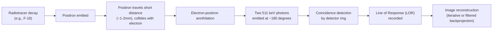

## Positron Emission Tomography

### Overview

Positron emission tomography (PET) is a nuclear medicine imaging technique that visualizes physiological and molecular processes in vivo by detecting radiation emitted from a radiolabeled tracer introduced into the body. Unlike MRI, which derives contrast from intrinsic tissue magnetic properties, PET directly measures the spatial distribution of a specific injected radiotracer, enabling quantification of processes such as glucose metabolism, blood flow, receptor density, and — most relevant to cognitive neuroscience — the distribution of specific neurotransmitter systems and pathological protein deposits.

### Physical Principles: Positron Decay and Annihilation

**Key Points**

- PET tracers are labeled with **positron-emitting radionuclides** (e.g., fluorine-18, carbon-11, oxygen-15)
- Radioactive decay of the labeled isotope emits a **positron** (the antimatter counterpart of an electron)
- The emitted positron travels a short distance through tissue (the "positron range," on the order of ~1–2 mm for common isotopes like F-18, [Inference] shorter positron range generally supports finer theoretical spatial resolution, though actual scanner resolution is also constrained by detector design and reconstruction) before colliding with a nearby electron
- This collision produces **electron-positron annihilation**, converting the combined mass into two **511 keV gamma photons** emitted in (very close to) exactly opposite directions ($180°$ apart), consistent with conservation of momentum
- The PET scanner's ring of detectors identifies these paired photons arriving at two detectors within a narrow **coincidence timing window**, registering a **line of response (LOR)** along which the annihilation event occurred

$$E = mc^2$$

illustrating that each 511 keV photon energy corresponds to the rest mass energy of an electron (or positron), consistent with matter-antimatter annihilation converting rest mass entirely into electromagnetic energy.

### Image Reconstruction

- Millions of recorded coincidence events (LORs) are used to reconstruct a 3D spatial map of tracer concentration
- **Filtered backprojection:** a classical analytic reconstruction method, computationally fast but prone to streak artifacts, largely superseded in modern practice
- **Iterative reconstruction algorithms** (e.g., Ordered Subsets Expectation Maximization, OSEM): iteratively refine an estimated image to best match observed coincidence data, generally producing superior image quality and reduced noise relative to filtered backprojection, at higher computational cost
- Corrections applied during/after reconstruction include attenuation correction (accounting for photon absorption by intervening tissue, often using co-registered CT or MRI data), scatter correction, and random coincidence correction

### Common PET Radiotracers in Neuroscience

| Tracer | Target/Process | Application |
| --- | --- | --- |
| ¹⁸F-fluorodeoxyglucose (FDG) | Glucose metabolism | Regional metabolic activity; widely used across neurology, oncology, cardiology |
| ¹⁵O-water (H₂¹⁵O) | Cerebral blood flow | Functional activation studies (historically important precursor to fMRI-based approaches) |
| ¹¹C-Pittsburgh Compound B (PiB) | Amyloid-beta plaques | Alzheimer's disease amyloid imaging |
| ¹⁸F-florbetapir, florbetaben, flutemetamol | Amyloid-beta plaques | Second-generation, longer-half-life amyloid tracers |
| ¹⁸F-flortaucipir and related tau tracers | Tau neurofibrillary pathology | Tauopathy imaging (Alzheimer's disease and related disorders) |
| ¹¹C-raclopride | Dopamine D2/D3 receptors | Dopaminergic system studies, receptor occupancy/displacement paradigms |
| ¹⁸F-DOPA | Dopamine synthesis capacity | Parkinson's disease and dopaminergic function studies |
| ¹¹C-flumazenil | GABA-A/benzodiazepine receptors | GABAergic system studies, epilepsy focus localization |

[Inference] The choice between C-11 and F-18 labeled tracers often reflects a practical trade-off between radiochemical properties and logistics: C-11's short half-life (~20 minutes) requires an on-site cyclotron and rapid synthesis, while F-18's longer half-life (~110 minutes) permits limited transport and somewhat more flexible scheduling; this is a general pattern rather than a fixed rule for every specific tracer or facility.

### FDG-PET and Glucose Metabolism

- FDG is a glucose analog taken up by cells via glucose transporters and phosphorylated by hexokinase, but — unlike native glucose — is **not further metabolized** and becomes effectively trapped within the cell ("metabolic trapping")
- Regional FDG accumulation over the uptake period (commonly 30–60 minutes post-injection, followed by a static scan) provides a map of regional glucose metabolism, widely interpreted as a proxy for regional neuronal/synaptic activity
- **Key Points**
  - FDG-PET has a well-established role in supporting differential diagnosis among neurodegenerative dementias, based on characteristic regional hypometabolism patterns (e.g., temporoparietal hypometabolism associated with Alzheimer's disease; frontotemporal hypometabolism associated with frontotemporal dementia)
  - FDG-PET's temporal resolution is far coarser than fMRI — a single static scan integrates metabolic activity over the uptake period, precluding fine-grained temporal dynamics; it is generally unsuited to studying rapid task-related neural events on the timescale of BOLD fMRI paradigms

### Molecular and Receptor Imaging

- PET's central advantage over MRI-based methods is its capacity for **molecular specificity**: tracers can be designed to bind selectively to particular receptors, transporters, enzymes, or pathological protein aggregates
- **Receptor occupancy studies:** administering a competing drug alongside a receptor-specific tracer (e.g., ¹¹C-raclopride displacement by dopamine release) allows quantification of endogenous neurotransmitter release or drug-receptor binding in vivo
- **Amyloid and tau imaging:** has become central to Alzheimer's disease research, enabling in vivo staging of pathological protein burden that was previously assessable only post-mortem; amyloid PET status is now commonly used as a biomarker inclusion/stratification criterion in clinical trials

[Unverified] The degree to which amyloid or tau PET burden correlates with cognitive symptom severity at the individual patient level varies considerably across studies and disease stages; group-level associations are well documented, but individual-level predictive precision remains an active research question rather than a settled clinical certainty.

### Kinetic Modeling and Quantification

- Raw PET images reflect tracer concentration but require **kinetic modeling** to derive physiologically meaningful quantitative parameters
- **Standardized Uptake Value (SUV):** a simple semi-quantitative ratio of tissue tracer concentration to injected dose normalized by body weight; widely used but sensitive to numerous non-specific factors (uptake time, blood glucose level, body composition)
- **Distribution Volume Ratio (DVR)** and **Binding Potential (BP):** derived from full kinetic modeling (often requiring either arterial blood sampling for an input function or a reference tissue devoid of the target) to quantify receptor density/availability more rigorously than simple SUV
- **Reference tissue models** (e.g., Simplified Reference Tissue Model, SRTM) avoid the need for invasive arterial sampling by using a tracer-devoid reference region as a surrogate input function

$$BP_{ND} = \frac{f_{ND} \cdot B_{avail}}{K_D}$$

where $BP_{ND}$ is the non-displaceable binding potential, $f_{ND}$ is the free fraction of tracer in non-displaceable tissue compartments, $B_{avail}$ is available receptor density, and $K_D$ is the tracer's dissociation constant.

### PET-MRI and PET-CT Integration

**Key Points**

- Standalone PET has poor intrinsic anatomical resolution; it is routinely co-registered with a structural modality for anatomical localization
- **PET-CT:** widely used in clinical oncology and increasingly in neurology; CT also provides attenuation correction data
- **Simultaneous PET-MRI:** integrated scanner systems enabling concurrent acquisition of PET molecular data and MRI structural/functional data within a single session, avoiding inter-scan motion/registration error and enabling combined analyses (e.g., relating amyloid burden to structural atrophy or functional connectivity within the same imaging session)
- [Inference] Simultaneous PET-MRI offers clear practical advantages for multimodal research (temporal alignment, reduced subject burden, precise registration), though it remains less widely available than PET-CT or standalone MRI due to higher scanner cost and technical complexity

### Radiation Safety and Practical Considerations

- PET necessarily involves **ionizing radiation exposure** from the radiotracer, distinguishing it from MRI (which uses no ionizing radiation)
- Radiation dose is tracer- and activity-dependent; regulatory dose limits and justification requirements govern research and clinical use, particularly restricting repeated-scan research designs in the same individual
- Short-half-life tracers (e.g., C-11, O-15) reduce cumulative radiation burden per scan but impose logistical constraints (on-site cyclotron, rapid radiochemistry, limited scanning window post-synthesis)
- PET's temporal and spatial resolution are both generally coarser than fMRI (spatial resolution commonly on the order of several millimeters, influenced by positron range, detector geometry, and reconstruction method), representing a trade-off against its unique molecular specificity

### Worked Example: Amyloid PET Interpretation

**Example**

A patient undergoes ¹⁸F-florbetapir amyloid PET as part of a diagnostic workup for suspected Alzheimer's disease:

1. Tracer is injected intravenously; after an appropriate uptake period, static PET images are acquired
2. Images are co-registered with a structural MRI for anatomical reference and region-of-interest definition
3. Tracer uptake is quantified using a **Standardized Uptake Value Ratio (SUVR)**, normalizing target region uptake to a reference region (e.g., cerebellar gray matter, generally low in amyloid pathology)
4. SUVR values across cortical regions are compared to established positivity thresholds derived from validated cohorts

**Output**

An SUVR map showing diffuse cortical tracer retention exceeding the positivity threshold in frontal, temporal, and parietal association cortex — a pattern read as "amyloid-positive," consistent with (but not solely diagnostic of, since amyloid positivity also occurs in some cognitively normal older adults) Alzheimer's disease pathology.

### Clinical and Research Applications Summary

- **Neurodegenerative disease:** FDG-PET metabolic staging, amyloid/tau PET pathological staging and clinical trial biomarker stratification
- **Epilepsy:** interictal FDG-PET hypometabolism can help localize seizure foci, particularly in MRI-negative cases
- **Oncology (brain tumors):** distinguishing tumor recurrence from radiation necrosis, tumor grading
- **Movement disorders:** dopaminergic PET (e.g., ¹⁸F-DOPA, dopamine transporter imaging) supporting differential diagnosis of Parkinsonian syndromes
- **Psychiatric and addiction research:** receptor/transporter imaging studies of dopaminergic, serotonergic, and opioid systems in relation to reward, mood, and substance use

### Conclusion

PET provides a fundamentally different and complementary window into brain function relative to MRI-based methods: rather than inferring activity from magnetic or hemodynamic proxies, it directly visualizes the spatial distribution of a molecularly targeted radiotracer, enabling quantification of metabolism, blood flow, and — most distinctively — specific receptor, transporter, and pathological protein targets. This molecular specificity comes at the cost of ionizing radiation exposure, coarser temporal resolution than fMRI, and dependence on radiochemistry infrastructure, making PET and MRI-based techniques largely complementary rather than substitutable tools in the cognitive neuroscience and clinical neuroimaging toolkit.

**Related Topics**

- Amyloid and tau PET biomarkers in Alzheimer's disease research
- Kinetic modeling and reference tissue models in PET quantification
- FDG-PET metabolic patterns in neurodegenerative disease differential diagnosis
- Simultaneous PET-MRI multimodal imaging
- Dopaminergic PET imaging in Parkinson's disease and addiction research
- Radiation dosimetry and safety in nuclear medicine imaging