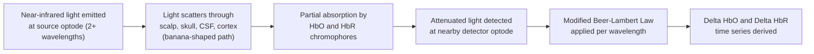

## Functional Near Infrared Spectroscopy

### Overview

Functional near-infrared spectroscopy (fNIRS) is a non-invasive optical neuroimaging technique that measures cortical hemodynamic activity by shining near-infrared light through the scalp and skull and detecting how much light is absorbed and scattered by underlying tissue. Like fMRI's BOLD signal, fNIRS relies on neurovascular coupling, but it measures hemoglobin concentration changes directly via light absorption rather than through magnetic susceptibility effects, offering a portable, motion-tolerant, and comparatively low-cost alternative for studying superficial cortical hemodynamics.

### Physical Principles: Near-Infrared Light and Tissue Optics

**Key Points**

- fNIRS uses light in the near-infrared range, typically **~650–950 nm**, chosen because this band falls within the **"optical window"** of biological tissue — a wavelength range where absorption by water, skin, and skull is comparatively low, allowing sufficient light penetration to reach cortical tissue
- Within this window, **oxygenated hemoglobin (HbO)** and **deoxygenated hemoglobin (HbR)** are the dominant tissue chromophores (light-absorbing substances) and have distinct, wavelength-dependent absorption spectra
- Light emitted at the scalp surface follows a **banana-shaped path** through tissue (scattering extensively rather than traveling in a straight line) before a fraction is detected at a nearby optode, penetrating to a depth roughly proportional to (though generally somewhat less than) half the source-detector separation distance

### The Modified Beer-Lambert Law

fNIRS quantifies hemoglobin concentration changes using an extension of the Beer-Lambert law, which relates light absorption to the concentration of an absorbing substance, modified to account for light scattering in tissue.

$$A(\lambda) = \log_{10}\left(\frac{I_0}{I}\right) = \varepsilon(\lambda) \cdot c \cdot d \cdot DPF(\lambda) + G$$

where $A(\lambda)$ is attenuation at wavelength $\lambda$, $I_0$ and $I$ are incident and detected light intensity, $\varepsilon(\lambda)$ is the wavelength-specific extinction coefficient of the chromophore, $c$ is chromophore concentration, $d$ is the source-detector separation distance, $DPF(\lambda)$ is the **differential pathlength factor** (correcting for the actual, longer scattering-induced photon path relative to the straight-line source-detector distance), and $G$ represents scattering losses assumed constant over the measurement period.

**Key Points**

- Because HbO and HbR have different absorption spectra, measuring attenuation at **at least two wavelengths** allows the two unknowns (ΔHbO and ΔHbR) to be solved simultaneously
- The modified Beer-Lambert law yields **relative** concentration changes from a baseline, not absolute hemoglobin concentration values, since the DPF and baseline optical properties are not precisely known for each individual/region without additional calibration

### Instrumentation and Channel Geometry

**Key Points**

- A basic fNIRS system consists of **light sources** (LEDs or laser diodes at specific wavelengths) and **photodetectors**, arranged in a cap or headband over the scalp
- A **channel** is defined by a source-detector pair; standard adult cortical fNIRS commonly uses source-detector separations around **~3 cm**, balancing adequate cortical penetration depth against excessive signal attenuation
- **Short-separation channels** (source-detector distance ~0.5–1 cm) sample predominantly extracerebral (scalp/skull) tissue and are increasingly used as regressors to help remove systemic physiological noise from the cortical signal
- Multiple sources and detectors can be arranged in overlapping montages to increase spatial sampling and enable basic **diffuse optical tomography (DOT)**-style image reconstruction across a cortical patch, rather than isolated single-channel measurements

### Continuous Wave vs. Frequency Domain vs. Time Domain Systems

| System Type | Measures | Key Capability |
| --- | --- | --- |
| Continuous Wave (CW) | Light intensity attenuation only | Most common, lowest cost; yields relative HbO/HbR changes only |
| Frequency Domain (FD) | Amplitude and phase shift of modulated light | Can separately estimate absorption and scattering coefficients, enabling more absolute quantification |
| Time Domain (TD) | Photon time-of-flight distribution | Highest information content (depth-resolved absorption/scattering), but most complex and costly instrumentation |

[Inference] The large majority of research and portable/wearable fNIRS systems currently in widespread use are continuous-wave systems, given their relative simplicity and cost advantage, though this balance may continue to shift as frequency-domain and time-domain technology becomes more compact and affordable.

### Signal Components and Analysis

**Key Points**

- The measured hemodynamic signal reflects a **superposition** of the neurally relevant cortical response and several systemic physiological signals:
  - Cardiac pulsation (~1 Hz)
  - Respiration (~0.2–0.3 Hz)
  - Mayer waves / low-frequency vasomotor oscillations (~0.1 Hz)
  - Very-low-frequency drift
- These systemic components partly overlap in frequency with the neurally evoked hemodynamic response, complicating simple bandpass filtering as a sole denoising strategy
- Common analytical approaches:
  - **General Linear Model (GLM):** analogous to fMRI task analysis, convolving task timing with a modeled hemodynamic response function and estimating regression coefficients per channel
  - **Short-separation channel regression:** using near-channel (extracerebral) signal as a nuisance regressor to remove systemic physiological contamination from long-separation (cortical) channels
  - **Principal/Independent Component Analysis:** decomposing signal into components to isolate and remove physiological artifact components

$$\Delta HbO(t), \Delta HbR(t) \;\; \text{typically show inverse-going patterns during activation}$$

- **Canonical activation pattern:** cortical activation typically produces an **increase in HbO** and a smaller, often more variable **decrease in HbR** — broadly analogous in direction (though not in underlying physical mechanism) to the BOLD signal increase seen in fMRI, since both reflect the same underlying overcompensatory blood flow response reducing local deoxyhemoglobin

[Unverified] The degree of coupling between HbO/HbR patterns and the fMRI BOLD signal at the same cortical location is generally reported as reasonably consistent at the group level in comparison studies, but individual-level correspondence and the specific magnitude of association vary across studies, populations, and analysis methods.

### Comparison with fMRI

| Property | fNIRS | fMRI |
| --- | --- | --- |
| Signal measured | Direct optical absorption (HbO, HbR separately) | Indirect T2*-weighted BOLD (primarily HbR-driven) |
| Spatial resolution | Moderate-to-low (~1-3 cm typical channel spacing) | High (mm-scale) |
| Depth of measurement | Superficial cortex only (limited penetration depth) | Whole brain, including deep/subcortical structures |
| Temporal resolution | High (comparable to or better than typical fMRI TR) | Limited by TR and hemodynamic response kinetics |
| Motion tolerance | Relatively high; suitable for naturalistic movement | Low; highly motion-sensitive |
| Portability | High; wearable, bedside-compatible systems exist | Low; requires fixed scanner installation |
| Cost | Comparatively low | High |
| Populations well-suited | Infants, young children, naturalistic/ambulatory paradigms | Populations able to remain still in a scanner bore |

### Key Advantages

- **Motion tolerance and portability** make fNIRS uniquely suited to populations and paradigms poorly compatible with fMRI: infants and young children, naturalistic social interaction studies, gait/balance research, and bedside monitoring in clinical settings
- **Direct separation of HbO and HbR** provides two complementary hemodynamic measures rather than the single composite BOLD signal
- **High temporal sampling rates** (often tens of Hz) support fine-grained hemodynamic waveform characterization, though still fundamentally limited by the underlying vascular response speed rather than by sampling rate alone
- Comparatively **low cost and simple setup** relative to MRI or PET, supporting larger sample sizes and field/community-based research settings

### Key Limitations

- **Limited penetration depth:** fNIRS is restricted to superficial cortical tissue (commonly cited as roughly 1–3 cm depending on source-detector separation and individual anatomy), making it unable to directly measure subcortical or deep structures
- **Limited spatial resolution and specificity:** channel-based sampling provides coarser localization than fMRI voxels, and cortical folding/individual anatomical variability introduces uncertainty in mapping optode positions to underlying cortical regions
- **Hair and scalp coupling issues:** hair (particularly thick or dark hair) can substantially attenuate light coupling to the scalp, requiring careful optode placement or specialized hair-parting fiber designs
- **Systemic physiological contamination:** as noted above, extracerebral and systemic vascular signals can confound the cortically relevant signal without appropriate correction methods

### Worked Example: fNIRS Task Activation Analysis

**Example**

A study examines prefrontal cortex activity during a working memory n-back task using a cap-based fNIRS montage with long-separation (~3 cm) and short-separation (~0.8 cm) channel pairs.

1. Raw light intensity data at two wavelengths (e.g., 760 nm and 850 nm) are converted to optical density changes
2. The modified Beer-Lambert law is applied to derive $\Delta HbO(t)$ and $\Delta HbR(t)$ time series per channel
3. Short-separation channel signals are regressed out of long-separation channel signals to reduce systemic physiological contamination
4. A GLM is fit per long-separation channel, convolving task block timing with a canonical hemodynamic response function
5. Channel-wise beta weights for HbO are compared between task and rest conditions

**Output**

Significant task-related increases in $\Delta HbO$ (and corresponding modest decreases in $\Delta HbR$) localized to channels overlying dorsolateral prefrontal cortex during the n-back task relative to a control condition, consistent with expected prefrontal recruitment during working memory demand.

### Applications in Cognitive Neuroscience

- **Developmental neuroscience:** widely used with infants and young children, populations for whom fMRI compliance is difficult or infeasible
- **Naturalistic and social neuroscience:** hyperscanning paradigms (simultaneous fNIRS recording from two or more interacting individuals) to study interpersonal neural synchrony during conversation or joint tasks
- **Clinical and bedside monitoring:** cerebral oxygenation monitoring in neonatal intensive care and during surgery
- **Brain-computer interface research:** fNIRS-based BCI systems exploiting relatively slow but reliable hemodynamic signal changes for communication or control applications
- **Motor and gait research:** studying cortical activity during walking or balance tasks incompatible with a fixed MRI scanner

### Conclusion

fNIRS offers a portable, motion-tolerant, and cost-effective window into superficial cortical hemodynamics by directly measuring light absorption changes attributable to oxygenated and deoxygenated hemoglobin. While its spatial resolution and depth penetration fall well short of fMRI, and its signal requires careful correction for systemic physiological confounds, fNIRS occupies a valuable methodological niche for developmental, naturalistic, clinical bedside, and ambulatory research contexts where traditional MRI-based approaches are impractical.

**Related Topics**

- Neurovascular coupling and the hemodynamic response function
- Diffuse optical tomography and cortical image reconstruction
- fNIRS-based hyperscanning and interpersonal neural synchrony
- Short-separation channel regression and systemic noise correction methods
- Developmental neuroimaging methods for infants and young children
- Brain-computer interfaces based on hemodynamic signals