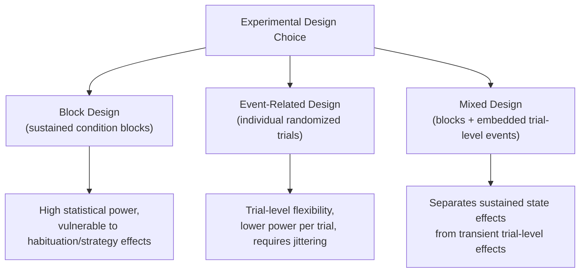

## Neuroimaging Experimental Design

### Overview

Neuroimaging experimental design encompasses the methodological decisions that determine how stimuli, tasks, and conditions are structured and sequenced during data acquisition to maximize statistical power, interpretability, and validity of resulting brain activity or connectivity estimates. Design choices interact directly with the physical and statistical properties of the imaging modality in use (most centrally fMRI's hemodynamic response properties), making experimental design inseparable from the underlying signal-processing pipeline rather than a separable "front-end" concern.

### Block Design

**Key Points**

- Groups trials of the same condition into extended contiguous blocks (commonly 15–30+ seconds), alternating between task and control/baseline blocks
- Maximizes **statistical power** by producing large, sustained BOLD signal changes that accumulate across the block duration, since the hemodynamic response from successive same-condition trials summates
- **Limitations:**
  - Poor for isolating individual trial-level neural events, since responses within a block are pooled
  - Susceptible to **habituation, anticipation, and strategy effects**: participants may adopt different cognitive strategies once they recognize a block's condition, and repeated engagement with a single condition can produce neural adaptation/habituation over the block duration
  - Cannot randomize or counterbalance trial order within condition in a way that dissociates trial-level variables

### Event-Related Design

**Key Points**

- Presents individual trials (events) that can be modeled and analyzed separately, typically with trial types randomly intermixed rather than blocked
- Enables **trial-by-trial analysis**, including post-hoc sorting by behavioral outcome (e.g., correct vs. incorrect responses), trial difficulty, or other parametric trial-level variables
- Reduces habituation and strategy confounds relative to block designs, since condition identity is less predictable
- **Statistical cost:** individual event-related BOLD responses are smaller in amplitude and more susceptible to noise than block-averaged responses, generally requiring larger sample sizes or more trials to achieve comparable statistical power to block designs

**Inter-stimulus interval (ISI) considerations:**

- Because the hemodynamic response to a single event unfolds over several seconds and can overlap with responses to subsequent nearby events, ISI selection and **jittering** (randomizing the interval between trials) are used to statistically deconfound overlapping hemodynamic responses via the GLM framework
- **Fast event-related designs** (short, jittered ISIs, often on the order of a few seconds) rely on this statistical deconvolution approach and are widely used to balance efficiency against the temporal blurring of overlapping HRFs

$$Y(t) = \sum_{k} \beta_k \, h(t - t_k) + \varepsilon(t)$$

where $Y(t)$ is the observed BOLD time series, $h(t)$ is the (assumed) hemodynamic response function, $t_k$ is the onset time of trial $k$, $\beta_k$ is the estimated response amplitude for that trial type, and $\varepsilon(t)$ is residual noise — this deconvolution-style GLM formulation underlies the statistical separation of overlapping event-related responses.

### Mixed (Block + Event-Related) Designs

- Combine block-level manipulations (e.g., sustained task-set or attentional state) with embedded event-related trials within each block, enabling separate estimation of **sustained** ("state") activity and **transient** ("trial-level") activity within the same experiment
- Common in cognitive control research distinguishing tonic task-set maintenance from phasic trial-specific processing

### Design Efficiency

- **Statistical efficiency** in fMRI design refers to how precisely the GLM can estimate parameters of interest given a specific trial sequence, timing, and jitter structure
- Efficiency depends jointly on: trial spacing, condition randomization/counterbalancing, and correlation between regressors of interest in the design matrix (highly correlated regressors reduce the ability to estimate their unique contributions)
- **Design optimization software/algorithms** (e.g., genetic algorithms searching trial-order space) are sometimes used to identify near-optimal trial sequences maximizing efficiency for a specified contrast of interest, particularly in complex multi-condition event-related designs
- [Inference] There is a general trade-off between design efficiency for detecting activation amplitude versus efficiency for estimating the shape of the hemodynamic response itself; designs optimized for one purpose are not automatically optimal for the other, so the intended analysis goal should inform design choice from the outset rather than being decided after data collection

### Control Conditions and Baseline Selection

**Key Points**

- The choice of control/baseline condition fundamentally determines what a given contrast can and cannot isolate — a poorly chosen baseline can leave a contrast confounded by unintended processing differences
- **Resting baseline** (fixation cross, no explicit task): simplest, but risks confounding the contrast with uncontrolled processes occurring during "rest" (including default mode network engagement, as covered in resting-state network material)
- **Active control task:** matched in low-level sensory/motor demands but differing in the cognitive process of interest, providing tighter isolation of the target process but requiring careful matching to avoid introducing new confounds
- **Cognitive subtraction logic:** assumes that comparing Task A (containing process X plus shared baseline processes) to Task B (containing only shared baseline processes) isolates process X; this assumption of "pure insertion" (that adding process X does not alter engagement of the shared baseline processes) is a recognized theoretical simplification, not a guaranteed property of the underlying cognitive architecture

[Inference] The cognitive subtraction assumption of pure insertion has been criticized on theoretical grounds since at least the 1990s cognitive neuroscience literature, though subtraction-based designs remain widely used in practice due to their simplicity and interpretability when the assumption is judged reasonable for a given comparison.

### Parametric Designs

- Rather than comparing discrete categorical conditions, parametric designs vary a continuous or ordinal variable (e.g., stimulus difficulty, working memory load, stimulus intensity) across trials and model brain activity as a function of that parametric variable
- Enables identification of regions showing a **graded (dose-response-like) relationship** with the manipulated variable, offering stronger inferential leverage than simple categorical comparison for questions about processing intensity or load-dependence
- Statistically modeled as a parametric modulator regressor within the GLM, often alongside the main task regressor

### Counterbalancing and Order Effects

- Condition order, stimulus assignment, and response mapping should generally be counterbalanced across trials/blocks and, where relevant, across participants, to prevent systematic confounds from order, practice, or fatigue effects
- **Latin square designs** and similar counterbalancing schemes are commonly used to distribute condition order systematically rather than randomly, ensuring balanced exposure across sequence positions

### Sample Size and Statistical Power Considerations

**Key Points**

- fMRI studies historically often used comparatively small sample sizes; methodological literature over the past decade has emphasized that many task-fMRI effects require considerably larger samples than historically typical to achieve adequate statistical power and reproducibility
- Power depends jointly on: expected effect size, within-subject trial count, between-subject sample size, and the stringency of multiple-comparison correction applied
- [Unverified] Precise minimum recommended sample sizes vary considerably depending on the specific effect under study, contrast type, and analysis pipeline; general "rule of thumb" sample size figures circulating in the field should be treated as approximate heuristics rather than fixed requirements applicable to every study design
- **Reproducibility considerations:** preregistration of hypotheses and analysis pipelines, and the use of held-out or independent replication samples, have been increasingly emphasized as safeguards against false-positive findings, particularly given the large researcher degrees of freedom available in typical neuroimaging analysis pipelines

### Multi-Echo and Acquisition-Level Design Considerations

- **Multi-echo fMRI:** acquires multiple echo times per excitation, enabling T2*-decay-based separation of BOLD (T2*-dependent) from non-BOLD (T2*-independent, e.g., motion or scanner-drift-related) signal components — an acquisition-level design choice that has downstream implications for denoising and analysis strategy
- **Repetition time (TR) and multiband acceleration:** shorter TR (enabled by multiband/simultaneous multi-slice acquisition) improves temporal sampling of the hemodynamic response and physiological noise characterization, but interacts with design timing choices (e.g., jitter granularity relative to TR)

### Naturalistic and Continuous Paradigms

- **Naturalistic designs** (e.g., movie-watching, story-listening) present continuous, unsegmented stimuli rather than discrete trials, analyzed via approaches such as **intersubject correlation (ISC)** — measuring the degree to which different subjects' brain activity time-locks to the same continuously varying stimulus
- **Key Points**
  - Offers improved ecological validity relative to highly controlled, decontextualized trial-based paradigms
  - Sacrifices the tight experimental control and condition-isolation logic of traditional block/event-related designs, complicating strong causal inference about specific isolated cognitive processes
  - [Inference] Naturalistic paradigms are increasingly viewed as a valuable complement to, rather than a replacement for, traditional controlled designs, since each approach addresses different validity trade-offs (ecological validity versus experimental control)

### Design Considerations Specific to Other Modalities

- **EEG/MEG:** benefit from very short ISIs given millisecond temporal resolution, but design must still account for issues such as trial-to-trial habituation, overlapping evoked responses, and adequate trial counts for signal averaging given typically lower single-trial signal-to-noise ratio
- **fNIRS:** design must account for the modality's slower effective temporal resolution relative to its sampling rate (governed by underlying hemodynamics) and its comparatively lower spatial specificity, often favoring block or extended-event designs similar to early fMRI practice
- **PET:** given coarse temporal resolution (particularly for static FDG-type scans), designs are typically restricted to sustained cognitive states over the full uptake period rather than discrete rapid trial-level events

### Worked Example: Choosing a Design for a Working Memory Study

**Example**

A researcher wants to study how prefrontal cortex activity scales with working memory load, while also examining trial-level differences between correct and incorrect trials.

- A **pure block design** would efficiently detect overall load-related activation differences (e.g., high load vs. low load blocks) but would not permit separating correct from incorrect trials within a block
- A **pure event-related design** with randomly intermixed load levels would allow trial-level sorting by accuracy and parametric modeling of load as a continuous regressor, but at reduced statistical power per condition relative to blocking
- A **mixed design** — blocking by sustained load level while jittering individual encoding/probe events within each block — would allow both a block-level sustained-load contrast and event-level correct/incorrect trial modeling within the same dataset

**Output**

The mixed design is selected, with block-level regressors modeling sustained working-memory maintenance state and event-level regressors (parametrically modulated by load and coded by trial accuracy) modeling transient encoding/retrieval-related activity — enabling both research questions to be addressed from a single acquisition.

### Conclusion

Neuroimaging experimental design is not a peripheral logistical step but a foundational determinant of what a given dataset can validly reveal: block, event-related, mixed, and parametric designs each carry distinct trade-offs between statistical power, temporal specificity, and vulnerability to strategy or habituation confounds. Sound design further requires careful control condition selection, counterbalancing, adequately powered sample sizes, and modality-appropriate timing choices — all of which interact directly with the signal-processing and statistical modeling approaches used downstream to analyze the resulting data.

**Related Topics**

- General Linear Model (GLM) design matrices and contrast specification
- Statistical power and sample size considerations in neuroimaging
- Intersubject correlation and naturalistic paradigm analysis
- Multi-echo fMRI acquisition and denoising
- Preregistration and reproducibility practices in neuroimaging research
- Cognitive subtraction logic and its theoretical limitations