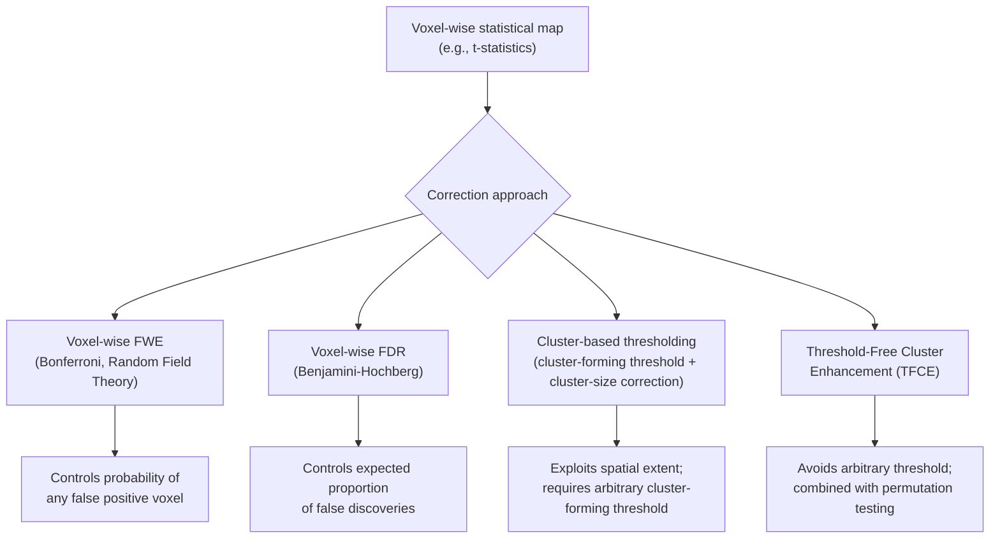

## Statistical Analysis and Thresholding in Neuroimaging

### Overview

Statistical analysis in neuroimaging translates preprocessed voxel-, vertex-, or region-wise time series or scalar measures into inferential claims about brain activity, connectivity, or structural differences. Because neuroimaging datasets involve testing across tens of thousands of spatial units simultaneously, appropriately handling the resulting multiple-comparisons problem, spatial dependency structure, and model specification choices is central to producing valid, reproducible findings rather than an afterthought applied to already-computed results.

### The General Linear Model (GLM) Framework

**Key Points**

- The GLM is the dominant statistical framework across fMRI, PET, and morphometric analyses, modeling observed data as a linear combination of explanatory variables plus residual error

$$Y = X\beta + \varepsilon, \quad \varepsilon \sim N(0, \sigma^2 V)$$

where $Y$ is the observed data (voxel time series or scalar measure), $X$ is the design matrix (task regressors, covariates, nuisance terms), $\beta$ is the vector of parameter estimates, and $\varepsilon$ is residual error, often modeled as having a non-identity covariance structure $V$ to account for temporal or spatial autocorrelation.

- Parameters are typically estimated via **ordinary least squares (OLS)** or, when residual autocorrelation is modeled explicitly, **generalized least squares (GLS)**:

$$\hat{\beta} = (X^TX)^{-1}X^TY$$

- **First-level (single-subject) analysis:** estimates task or condition effects within an individual's data
- **Second-level (group) analysis:** combines first-level parameter estimates across subjects, typically via a **mixed-effects model** treating subject as a random effect, allowing inference to generalize to the broader population rather than being confined to the specific sample studied

### Fixed Effects, Random Effects, and Mixed Effects Models

| Model Type | Assumption | Generalizability |
| --- | --- | --- |
| Fixed effects | All subjects share identical true effect; only within-subject variance considered | Inference limited to the specific sample studied |
| Random effects | True effect varies across subjects (subject sampled from a population); both within- and between-subject variance considered | Inference generalizes to the broader population |
| Mixed effects | Combines fixed effects (e.g., group, condition) with random effects (e.g., subject-level intercepts/slopes) | Standard approach for most group-level neuroimaging inference |

[Inference] Failing to appropriately model between-subject variance (i.e., inappropriately treating a group analysis as a fixed-effects model) can produce artificially inflated statistical significance and reduced generalizability of reported findings; this is a well-established statistical concern in the methods literature, though its practical impact varies with the specific dataset and effect size involved.

### The Multiple Comparisons Problem

**Key Points**

- Whole-brain neuroimaging analyses commonly test tens of thousands of voxels or vertices simultaneously, each represented by its own statistical test
- Without correction, the expected number of false positives at a conventional uncorrected threshold (e.g., $p < 0.05$) scales directly with the number of tests performed — at $p<0.05$ uncorrected across 50,000 voxels, roughly 2,500 false positive voxels would be expected under the null hypothesis alone
- This necessitates **multiple comparison correction** methods that control an appropriately defined error rate across the full set of tests rather than per individual test

$$\text{Expected false positives} \approx \alpha \times N_{tests}$$

### Family-Wise Error (FWE) Correction

- Controls the probability of making **at least one** false positive across the entire set of tests
- **Bonferroni correction:** the simplest FWE method, dividing the desired alpha level by the number of independent tests ($\alpha_{corrected} = \alpha / N$); highly conservative and does not account for spatial correlation between neighboring voxels, making it generally overly stringent for neuroimaging data where adjacent voxels are far from statistically independent
- **Random Field Theory (RFT):** estimates the effective number of independent spatial "resolution elements" (resels) in smooth statistical maps, providing a less conservative correction than Bonferroni by explicitly accounting for spatial smoothness/autocorrelation
- **Permutation-based FWE correction:** empirically estimates the null distribution of the maximum statistic across the whole brain by repeatedly permuting condition labels (or equivalent exchangeability-respecting shuffles) and recomputing the statistical map, then deriving a corrected threshold from this empirical null distribution — widely regarded as making fewer parametric assumptions than RFT-based approaches

### False Discovery Rate (FDR) Correction

- Controls the **expected proportion of false positives among all voxels/vertices declared significant**, rather than the probability of any single false positive occurring
- Generally **less conservative** than FWE correction, tolerating a controlled proportion of false positives in exchange for greater sensitivity (statistical power) to true effects
- Commonly implemented via the **Benjamini-Hochberg procedure**, ranking p-values and applying a step-up thresholding rule

$$p_{(i)} \leq \frac{i}{N} \cdot q$$

where $p_{(i)}$ is the i-th smallest p-value among $N$ tests, and $q$ is the desired FDR level.

[Inference] The choice between FWE and FDR correction reflects a deliberate trade-off between stringency and sensitivity appropriate to the research question (e.g., confirmatory hypothesis testing favoring FWE's stricter control versus exploratory whole-brain mapping potentially favoring FDR's greater sensitivity); neither approach is universally "more correct" independent of the specific inferential goal.

### Cluster-Based Thresholding

**Key Points**

- Rather than thresholding individual voxels, cluster-based approaches first apply a **cluster-forming threshold** (a voxel-level statistical threshold, e.g., $p < 0.001$ uncorrected) to identify contiguous suprathreshold voxel clusters, then evaluate whether each cluster's **size** is statistically significant given the overall smoothness of the data
- Exploits the fact that true neural signal tends to be spatially extended across neighboring voxels, whereas noise-driven false positives tend to be spatially isolated, offering improved sensitivity relative to strict voxel-wise correction when this spatial-extent assumption holds
- **Threshold-Free Cluster Enhancement (TFCE):** avoids the need to specify an arbitrary cluster-forming threshold by integrating cluster-like support across a range of possible thresholds, producing a single enhanced statistic per voxel, subsequently combined with permutation testing for correction

[Unverified] A widely discussed methods paper (Eklund et al., 2016) reported that certain commonly used parametric cluster-based thresholding methods in popular fMRI software packages could produce inflated false-positive rates substantially above nominal levels under some conditions; the generalizability of the reported inflation magnitude across all software versions, parameter settings, and dataset types has been a subject of subsequent methodological discussion and partial revision, so specific numerical inflation figures from that study should not be treated as a fixed, universally applicable constant.

### Permutation Testing

- A non-parametric approach that constructs an **empirical null distribution** by repeatedly shuffling condition labels (or otherwise permuting the data under an exchangeability assumption consistent with the null hypothesis) and recomputing the statistic of interest
- Particularly valuable in neuroimaging because it makes **fewer distributional assumptions** than parametric approaches (e.g., does not require the same Gaussian random field smoothness assumptions underlying RFT-based correction)
- Widely implemented alongside TFCE and cluster-based methods (e.g., FSL's `randomise`, permutation-based tools in SPM and other packages)
- **Key Points**
  - Computationally intensive relative to parametric methods, since it requires many (often thousands of) recomputations of the full statistical map
  - Requires a valid **exchangeability structure** appropriate to the experimental design (e.g., accounting for repeated-measures or hierarchical/nested data structure) to produce a valid null distribution

### Bayesian Approaches to Neuroimaging Inference

- **Bayesian model comparison** frameworks (e.g., as used in Dynamic Causal Modeling) compare the relative evidence for competing models rather than testing a single null hypothesis
- **Posterior probability maps** in some analysis frameworks provide the probability that an effect exceeds a specified magnitude, given the data and a specified prior, offering an interpretive alternative to frequentist p-value thresholding
- [Inference] Bayesian approaches are generally considered a valuable complement to, rather than a wholesale replacement for, frequentist multiple-comparison correction methods in current mainstream neuroimaging practice, given that adoption varies considerably by subfield and specific research question

### Model Specification Considerations

**Key Points**

- **Nuisance regressors:** motion parameters, physiological noise estimates, and scanner drift terms are commonly included in the design matrix to reduce artifactual variance, but excessive or poorly justified nuisance regression risks removing genuine signal of interest ("overfitting" the nuisance model)
- **Non-independence / "double-dipping":** selecting regions of interest based on the same data used subsequently to test an effect within those regions inflates apparent effect sizes and invalidates standard inferential statistics; independent (e.g., anatomically defined or orthogonal-contrast-defined) ROI selection is required to avoid this circularity
- **Small-volume correction:** when a specific a priori anatomical hypothesis justifies restricting correction to a smaller search volume (rather than the whole brain), multiple comparison correction can be appropriately restricted to that smaller volume, increasing power for the hypothesis-driven region while requiring that the restriction be genuinely independent of the current dataset's results

### Effect Size and Reproducibility Considerations

- Statistical significance (surviving a corrected threshold) does not by itself indicate the **magnitude** or **practical/theoretical importance** of an effect; reporting effect sizes (e.g., percent signal change, Cohen's d equivalents) alongside significance is increasingly emphasized as best practice
- **Reproducibility concerns:** methodological literature over the past decade has highlighted that small sample sizes combined with flexible analytic pipelines ("researcher degrees of freedom" — the many defensible choices available across preprocessing, modeling, and thresholding steps) can inflate the rate of non-reproducible findings across the field
- **Preregistration** of hypotheses, analysis pipelines, and thresholding approaches prior to data collection or analysis is an increasingly recommended safeguard against this flexibility-driven inflation

### Worked Example: Choosing a Correction Approach

**Example**

A researcher has a whole-brain fMRI contrast map (task vs. baseline) from a group of 30 subjects and must decide how to threshold it for reporting.

1. **Option A — Voxel-wise FWE (Random Field Theory):** highly conservative; appropriate if the researcher wants to make a strong claim about a small number of robust, spatially precise findings
2. **Option B — Cluster-based thresholding** (cluster-forming threshold $p<0.001$, cluster-corrected $p<0.05$): balances sensitivity and specificity, appropriate for typical whole-brain exploratory reporting, but requires disclosing the cluster-forming threshold since results can be threshold-sensitive
3. **Option C — TFCE with permutation testing:** avoids the arbitrary cluster-forming threshold choice and is robust to certain parametric assumption violations, at higher computational cost

**Output**

The researcher selects TFCE with permutation-based correction (5,000 permutations), reporting corrected cluster locations with peak MNI coordinates, TFCE statistic values, and family-wise error-corrected p-values — accompanied by percent signal change effect size estimates extracted from independently defined anatomical ROIs to avoid circularity.

### Conclusion

Statistical analysis and thresholding in neuroimaging require navigating a substantial multiple-comparisons burden inherent to whole-brain, voxel-wise (or vertex-wise) testing, alongside careful model specification decisions (fixed vs. random effects, nuisance regression, avoidance of circular ROI selection). No single correction method (FWE, FDR, cluster-based, TFCE, permutation, or Bayesian) is universally superior; the appropriate choice depends on the specific balance between sensitivity and specificity the research question demands, and should be considered an integral part of experimental design and preregistration rather than a final, arbitrary reporting step.

**Related Topics**

- Random Field Theory and spatial smoothness estimation
- Permutation testing implementation (e.g., FSL randomise)
- Preregistration and analytic flexibility ("researcher degrees of freedom") in neuroimaging
- Region-of-interest analysis and non-independence/circularity concerns
- Bayesian model comparison and Dynamic Causal Modeling
- Effect size reporting standards in neuroimaging