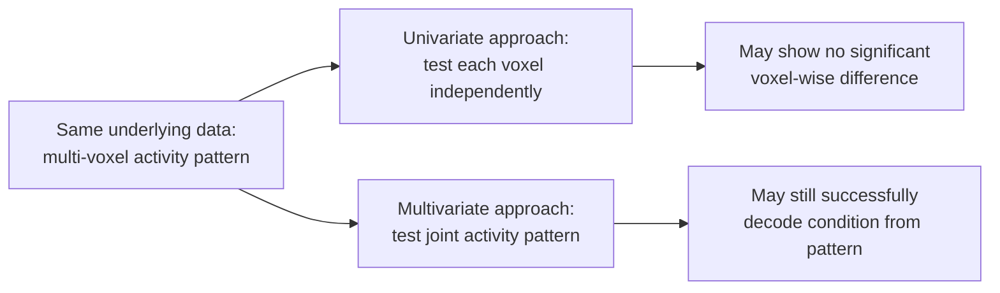

## Multivariate Pattern Analysis and Decoding

### Overview

Multivariate pattern analysis (MVPA), also referred to as "decoding" or "brain reading," is an analytic approach that examines **distributed patterns of activity across multiple voxels simultaneously**, rather than testing each voxel independently as in traditional univariate GLM analysis. By treating spatial activity patterns as the unit of analysis, MVPA can detect information encoded in the relative configuration of activity across a region even when no single voxel shows a statistically significant mean difference between conditions — making it substantially more sensitive to certain forms of information representation than mass-univariate approaches.

### Univariate vs. Multivariate Analysis

**Key Points**

- **Univariate analysis** (standard GLM-based fMRI analysis) tests each voxel's activity independently against a model, asking "does this voxel's average activity differ between conditions?"
- **Multivariate analysis** treats a set of voxels (a "pattern" or "feature vector") as a single joint observation, asking "does the *pattern* of activity across these voxels differ between conditions?"
- A region can carry decodable information about a distinction even when **no individual voxel** shows a significant univariate effect, because information can be encoded in the relative pattern of activation across voxels (e.g., voxel A high/voxel B low vs. voxel A low/voxel B high) rather than in any voxel's overall mean signal level
- [Inference] This sensitivity advantage is one of the primary motivations for MVPA's adoption in cognitive neuroscience, though it comes with corresponding interpretive complexity, since a successful multivariate decode does not straightforwardly localize "where" information is represented in the same intuitive sense a univariate activation map does

### Core MVPA Approaches

**Pattern Classification (Decoding)**

- Trains a **classifier** (a statistical/machine-learning model) to predict a categorical label (e.g., stimulus category, task condition, decision outcome) from a multi-voxel activity pattern
- Common classifiers used in MVPA:
  - **Support Vector Machine (SVM):** finds a hyperplane maximally separating classes in the (often high-dimensional) voxel-pattern feature space; widely used due to reasonable performance with relatively limited training data
  - **Linear Discriminant Analysis (LDA):** models each class as a Gaussian distribution and classifies based on relative likelihood
  - **Logistic regression:** models the probability of class membership as a function of the voxel pattern
  - **Nearest-neighbor classifiers:** classify a test pattern based on similarity to labeled training exemplars
- **Cross-validation** is essential: the classifier is trained on a subset of the data (e.g., a subset of runs or trials) and tested on **held-out** data not used in training, to obtain an unbiased estimate of decoding accuracy
- Common cross-validation schemes: **leave-one-run-out**, **k-fold cross-validation**

$$\text{Decoding Accuracy} = \frac{\text{Correctly classified test patterns}}{\text{Total test patterns}}$$

- Decoding accuracy is compared against **chance level** (e.g., 50% for binary classification) using permutation testing or binomial statistics to establish significance

**Representational Similarity Analysis (RSA)**

- Rather than classifying discrete categories, RSA characterizes the **relational structure** of activity patterns by computing pairwise (dis)similarity between conditions/stimuli, producing a **representational dissimilarity matrix (RDM)**

$$RDM_{ij} = 1 - r(pattern_i, pattern_j)$$

where $r$ is commonly a correlation coefficient (e.g., Pearson or Spearman) between the multi-voxel patterns evoked by stimulus $i$ and stimulus $j$.

- **Key Points**
  - The empirically derived neural RDM can be compared (e.g., via rank correlation) against theoretically predicted RDMs derived from behavioral, computational model, or stimulus-feature-based similarity structures
  - This enables direct comparison of representational geometry across different measurement modalities (fMRI, MEG, single-unit recording) and between brain data and computational models (e.g., deep neural network layer representations), since RDMs provide a common representational format independent of the original measurement space's dimensionality
  - [Inference] RSA's capacity to bridge across modalities and between biological and artificial systems has made it particularly influential in computational cognitive neuroscience, though the interpretation of a significant RDM correlation still requires care regarding what specific representational properties are actually shared versus coincidentally correlated

**Searchlight Analysis**

- Extends MVPA across the whole brain (rather than restricting analysis to a single predefined ROI) by systematically moving a small spherical "searchlight" through every location in the brain, performing a local MVPA (classification or RSA) using only the voxels within that sphere at each position, and assigning the resulting statistic (e.g., decoding accuracy) back to the sphere's center voxel
- **Key Points**
  - Produces a whole-brain map of decoding accuracy (or RSA correlation), analogous in interpretive format to a univariate statistical map, but reflecting local pattern-based information rather than mean-signal differences
  - Searchlight radius selection involves a trade-off: larger searchlights increase the number of voxels contributing pattern information (potentially increasing sensitivity) but reduce spatial specificity of the resulting map
  - Computationally intensive, since a full classification or RSA procedure is repeated at every brain location

### The Multiple Comparisons Problem in MVPA

- Searchlight maps, like univariate statistical maps, involve testing across many spatial locations simultaneously and require appropriate multiple-comparison correction (cluster-based, permutation-based, or FDR approaches, as covered in general neuroimaging statistical thresholding)
- Permutation testing is particularly common in MVPA significance testing, since the null distribution of classifier accuracy under label-shuffling can be empirically constructed without strong parametric assumptions

### Preprocessing Considerations Specific to MVPA

**Key Points**

- **Feature selection/reduction:** given the typically large number of voxels relative to the number of training trials/exemplars, dimensionality reduction (e.g., PCA) or feature selection (e.g., selecting the most univariately informative voxels) is sometimes applied prior to classification, though this introduces its own methodological considerations around circularity if not performed independently of the test data
- **Spatial smoothing:** unlike univariate analysis, MVPA researchers sometimes avoid or reduce standard spatial smoothing, since smoothing can blur the fine-grained spatial patterns that carry decodable information; however, some smoothing may still aid registration/normalization consistency, representing a design trade-off rather than a strict prohibition
- **Multivariate noise normalization:** techniques such as spatial or temporal whitening (e.g., using the residual covariance structure from the GLM) can improve decoding sensitivity by accounting for voxel-to-voxel noise correlations, an approach incorporated into some modern RSA/decoding pipelines (e.g., "crossnobis" or similar cross-validated distance estimators)

### Comparison of MVPA Approaches

| Approach | Output | Primary Question Addressed |
| --- | --- | --- |
| Pattern classification | Decoding accuracy (per region/searchlight) | Can condition/category be predicted from this pattern? |
| Representational Similarity Analysis | Representational dissimilarity matrix, RDM correlations | What is the relational structure among stimulus representations, and does it match a theoretical model? |
| Searchlight analysis | Whole-brain map of local decoding accuracy or RSA fit | Where in the brain is this information locally present? |
| Encoding models | Voxel-wise predicted response from stimulus/feature model | Can voxel activity be predicted from a specified stimulus/feature space (the converse direction to decoding)? |

### Encoding Models: The Converse of Decoding

- **Encoding models** predict voxel (or vertex) activity as a function of stimulus or feature space properties, essentially inverting the decoding logic (feature space → predicted brain response, rather than brain response → predicted category)
- Commonly used with rich, high-dimensional feature spaces (e.g., semantic feature models, visual model layers, deep neural network activations) to characterize what stimulus properties a given voxel or region is tuned to
- **Key Points**
  - Encoding models can subsequently be used to decode novel stimuli by inverting the fitted model, blurring a strict encoding/decoding dichotomy in practice
  - Widely used in vision science and, increasingly, natural language processing-related neuroscience research, using layer activations from deep learning models as the feature space regressed against brain activity

### Interpretive Cautions

**Key Points**

- **Significant decoding does not establish that a region "represents" or "computes" the decoded distinction** in a strong causal or computational sense — it establishes that information sufficient to distinguish conditions is statistically present in that region's activity pattern, which could arise from various underlying sources including feedback signals from other regions
- **Above-chance decoding does not imply the brain itself uses that information** for behavior; establishing behavioral relevance typically requires additional evidence (e.g., correlating decoding strength with behavioral performance, or causal manipulation methods such as TMS/lesion studies)
- [Unverified] The degree to which MVPA decoding accuracy in a given region correlates with that region's necessity for the corresponding behavior (as opposed to reflecting redundant, correlated, or downstream/upstream information) varies across studies and has been a recurring point of methodological discussion in the decoding literature, so decoding results are generally best interpreted as evidence of information presence rather than direct evidence of causal computational role
- Small **sample sizes per class** (a common practical constraint in fMRI given scan time costs) can affect classifier stability and generalizability; adequately powered cross-validation design is an important practical consideration

### Worked Example: Decoding Visual Category from Ventral Temporal Cortex

**Example**

A researcher wants to determine whether ventral temporal cortex activity patterns distinguish faces from houses:

1. Subjects view blocks of face and house images across multiple scanning runs
2. Multi-voxel activity patterns are extracted from a ventral temporal cortex ROI for each trial/block
3. An SVM classifier is trained on patterns from all runs except one ("leave-one-run-out" cross-validation), then tested on the held-out run's patterns
4. This process is repeated, leaving out each run in turn, and accuracy is averaged across folds
5. Resulting mean decoding accuracy (e.g., 82%) is statistically compared against chance (50%) using a permutation test (shuffling condition labels many times to build an empirical null distribution)

**Output**

Decoding accuracy significantly exceeds chance level, indicating that the multi-voxel activity pattern within ventral temporal cortex carries information sufficient to distinguish face versus house viewing, consistent with (though not proof of a singular causal mechanism for) known category-selective organization in this region.

### Applications in Cognitive Neuroscience

- **Visual and object recognition research:** decoding stimulus category, orientation, or identity from visual cortex activity patterns
- **Working memory research:** decoding maintained item identity or feature content during memory delay periods
- **Semantic and conceptual representation:** RSA-based comparison of neural representational geometry against behavioral similarity judgments or computational semantic models
- **Decision-making and value representation:** decoding choice-related or value-related signals prior to or during decision execution
- **Comparing biological and artificial neural networks:** RSA and encoding-model approaches directly comparing brain representational structure to deep learning model layer representations, an increasingly active area at the intersection of computational neuroscience and machine learning

### Conclusion

Multivariate pattern analysis reframes neuroimaging inference around distributed activity patterns rather than isolated voxel-wise means, offering substantially greater sensitivity to certain forms of neural information representation and enabling powerful cross-modal and brain-model comparison approaches through representational similarity analysis. This added sensitivity brings correspondingly greater interpretive complexity: successful decoding establishes the statistical presence of information within a pattern, not necessarily its causal computational role in behavior, requiring careful methodological design (proper cross-validation, appropriate multiple-comparison correction, avoidance of circularity) and cautious interpretation alongside complementary causal or behavioral evidence.

**Related Topics**

- Representational similarity analysis and comparison with computational models
- Searchlight analysis methodology and radius selection trade-offs
- Statistical analysis and thresholding in neuroimaging
- Encoding models and deep neural network comparisons to brain activity
- Cross-validation design in machine learning applied to neuroimaging
- TMS and lesion methods for establishing causal necessity beyond decoding evidence