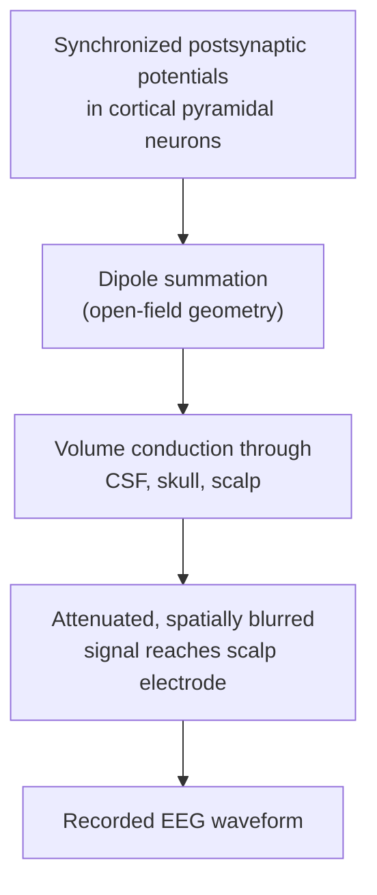
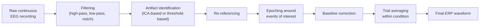

## Electroencephalography Principles and Event-Related Potentials

### Overview

Electroencephalography (EEG) is a non-invasive electrophysiological technique that records electrical potentials generated by synchronized neural activity via electrodes placed on the scalp. Unlike hemodynamically-based methods (fMRI, fNIRS, PET), EEG measures electrical signals directly, at millisecond temporal resolution, making it uniquely suited to studying the fine-grained time course of neural processing. **Event-related potentials (ERPs)** are a core analytic application of EEG: stimulus- or response-locked voltage waveforms extracted by averaging EEG activity across many repeated trials.

### Physiological Basis of the EEG Signal

**Key Points**

- Scalp EEG predominantly reflects **postsynaptic potentials** (excitatory and inhibitory postsynaptic potentials, EPSPs/IPSPs) generated by large populations of synchronously active neurons, primarily **cortical pyramidal neurons**
- Individual action potentials contribute negligibly to scalp-recorded EEG; action potentials are too brief and their associated dipoles too rapidly canceling in aggregate to produce a detectable scalp signal, whereas the slower, longer-duration postsynaptic potentials summate more effectively across large neural populations
- Pyramidal neurons are especially well-suited to generating detectable scalp signals because their **parallel, columnar orientation** perpendicular to the cortical surface causes their individual dipole fields to summate constructively (an "open field" configuration) rather than cancel
- This summated electrical activity must pass through the meninges, cerebrospinal fluid, skull, and scalp before reaching the recording electrode, a process that substantially **attenuates and spatially blurs** the original signal (the skull in particular is a poor electrical conductor relative to brain tissue)

### EEG Recording Setup

**Key Points**

- Electrodes are placed according to standardized montage systems, most commonly the **International 10-20 system** (and higher-density extensions, e.g., 10-10 or 10-5 systems), which position electrodes at proportional distances (10% or 20% of skull landmark measurements) to ensure consistent, comparable placement across individuals and studies
- Recordings require a **reference electrode** (or average reference across all electrodes) since EEG measures voltage **differences** between two points, not absolute potential
- A **ground electrode** is also required to establish a common reference point for the amplifier circuit
- Modern systems commonly use **high-density arrays** (e.g., 64, 128, or 256 channels) to improve spatial sampling, though even high-density EEG's spatial resolution remains substantially coarser than fMRI due to volume conduction blurring
- Electrode-scalp impedance must be kept low (via abrasive gel or conductive paste) to minimize noise; modern **active electrode** and dry-electrode systems have reduced but not eliminated impedance-related considerations

### Signal Characteristics and Frequency Bands

EEG signals are conventionally decomposed into canonical frequency bands, each associated with characteristic behavioral/cognitive states:

| Band | Frequency Range | Common Association |
| --- | --- | --- |
| Delta | 0.5–4 Hz | Slow-wave sleep, some pathological states in waking adults |
| Theta | 4–8 Hz | Drowsiness, memory encoding, hippocampal-cortical interaction |
| Alpha | 8–13 Hz | Relaxed wakefulness, especially prominent over posterior/occipital regions with eyes closed |
| Beta | 13–30 Hz | Active concentration, motor planning/execution |
| Gamma | >30 Hz | Local cortical processing, feature binding, attention (though also more susceptible to muscle artifact contamination) |

[Inference] The functional interpretations attached to each band represent general associations well replicated across many studies, but band boundaries are somewhat conventionally defined rather than sharply discrete in the underlying physiology, and a given band's functional significance can vary by cortical region and behavioral context.

### From Continuous EEG to Event-Related Potentials

**Key Points**

- Raw continuous EEG contains a mixture of stimulus/task-related signal and much larger-amplitude background "noise" (ongoing spontaneous oscillatory activity, physiological artifacts)
- A single trial's stimulus-locked response is typically far too small in amplitude to be visually or statistically distinguished from this background activity
- **ERP averaging** exploits the assumption that the time-locked neural response to a given stimulus type is (approximately) consistent across trials, while background activity is uncorrelated with stimulus timing across trials
- Averaging many trials time-locked to stimulus onset causes the consistent, time-locked signal to summate constructively while the uncorrelated background activity averages toward zero, improving signal-to-noise ratio in proportion to (approximately) the square root of the number of trials averaged

$$SNR_{improvement} \propto \sqrt{N_{trials}}$$

- This averaging logic assumes the ERP component's **latency and amplitude are relatively stable across trials**; substantial trial-to-trial latency jitter can smear/attenuate the averaged waveform, motivating some researchers to use single-trial or latency-adjusted analysis approaches as a complement to simple averaging

### Canonical ERP Components

ERP components are conventionally labeled by polarity (P = positive, N = negative) and approximate latency (in milliseconds) or ordinal position.

| Component | Typical Latency/Polarity | Associated Process |
| --- | --- | --- |
| P1/P100 | ~100 ms, positive | Early visual sensory processing |
| N1/N100 | ~100 ms, negative | Early sensory/attentional processing (auditory and visual variants) |
| N170 | ~170 ms, negative | Face-selective visual processing (occipitotemporal electrodes) |
| P2/P200 | ~150–250 ms, positive | Attention allocation, early stimulus categorization |
| N2/N200 | ~200–350 ms, negative | Conflict monitoring, response inhibition (frontocentral N2) |
| P3/P300 (P3a/P3b subcomponents) | ~250–500 ms, positive | Attention allocation, context updating, stimulus evaluation |
| N400 | ~400 ms, negative | Semantic processing, ease of semantic integration |
| P600 | ~600 ms, positive | Syntactic processing, reanalysis/repair in sentence comprehension |
| Error-Related Negativity (ERN) | ~50–100 ms post-response, negative | Error monitoring/performance monitoring |

**Key Points**

- Earlier components (P1, N1) are generally considered more sensory/exogenous — driven substantially by physical stimulus properties
- Later components (P300, N400, P600) are generally considered more cognitive/endogenous — modulated by task relevance, expectation, and internal cognitive state rather than stimulus physical properties alone
- [Inference] This early/late, exogenous/endogenous distinction is a useful organizing heuristic rather than a strict categorical boundary, since many components show sensitivity to both stimulus properties and cognitive/task factors to varying degrees

### The P300 and N400: Illustrative Component Examples

**P300 (P3):**

- Classically elicited using an **"oddball" paradigm**: a sequence of frequent ("standard") stimuli interspersed with rare ("target" or "deviant") stimuli
- Amplitude is modulated by target probability (rarer targets generally elicit larger P300 amplitude) and task relevance
- **P3a** (more frontally distributed, associated with novelty/orienting) and **P3b** (more parietally distributed, associated with task-relevant target detection/context updating) are commonly distinguished subcomponents

**N400:**

- Classically elicited by words that are **semantically incongruent** with preceding sentence context (e.g., "He spread the warm bread with socks" elicits a larger N400 to "socks" than a semantically congruent completion would)
- Amplitude is inversely related to the ease of semantic integration — greater semantic mismatch or lower cloze probability produces larger N400 amplitude
- Widely used across psycholinguistics and, more broadly, semantic memory and conceptual processing research

### EEG Preprocessing Pipeline

**Key Points**

1. **Filtering:** high-pass filtering removes slow drift; low-pass filtering removes high-frequency noise (e.g., muscle artifact); notch filtering removes line noise (50/60 Hz depending on region)
2. **Artifact identification and correction:** eye blinks/movements (large frontal deflections), muscle artifact, and cardiac artifact are identified via visual inspection, amplitude-threshold rejection, or component-based correction
3. **Independent Component Analysis (ICA)-based artifact removal:** decomposes the multichannel EEG signal into statistically independent components, allowing artifact-related components (e.g., a component with a scalp topography and time course consistent with eye blinks) to be identified and removed before reconstructing the cleaned signal
4. **Re-referencing:** converting recorded data to a desired reference scheme (e.g., average reference, mastoid reference) as appropriate for the analysis
5. **Segmentation (epoching):** extracting fixed-length time windows time-locked to events of interest (e.g., -200 ms to +800 ms around stimulus onset)
6. **Baseline correction:** subtracting the mean pre-stimulus baseline period activity from each epoch to remove pre-existing voltage offset differences
7. **Averaging:** combining epochs within a condition to produce the final ERP waveform, or retaining single-trial data for trial-level analyses

### ERP Analysis Approaches

- **Mean amplitude / peak amplitude analysis:** measuring average or maximum voltage within a predefined time window and electrode set associated with a component of interest, then comparing across conditions using standard inferential statistics (t-tests, ANOVA)
- **Mass univariate / cluster-based permutation approaches:** testing across many time points and electrodes simultaneously, analogous to fMRI's spatial multiple-comparisons problem, addressed via cluster-based permutation testing across the time-electrode space
- **Time-frequency analysis:** decomposing the EEG signal into time-varying power and phase estimates across frequency bands (e.g., via wavelet transform), capturing oscillatory dynamics (event-related synchronization/desynchronization) that simple time-domain ERP averaging can obscure, particularly for signal components not tightly phase-locked to stimulus onset

[Unverified] Some proportion of task-related EEG signal is not strictly phase-locked to stimulus onset (i.e., "induced" rather than "evoked" activity) and can be substantially attenuated or missed entirely by simple linear averaging; the relative contribution of phase-locked versus non-phase-locked activity to a given cognitive process varies by paradigm and frequency band and is not a fixed, universally quantifiable ratio.

### Source Localization

- Scalp EEG signal reflects a **spatially blurred and ambiguous** projection of underlying cortical sources — the same scalp topography can, in principle, arise from many different underlying source configurations (the "inverse problem," which is mathematically ill-posed/underdetermined)
- **Source localization algorithms** attempt to estimate the most likely underlying neural generators using a forward model of head conductivity properties (e.g., boundary element or finite element head models) combined with a source estimation algorithm (e.g., dipole fitting, distributed source models such as LORETA/sLORETA, beamforming)
- **Key Points**
  - Source localization solutions are inherently **non-unique** without additional constraining assumptions (e.g., minimum-norm assumptions, anatomical priors from co-registered MRI)
  - Combining EEG with individual structural MRI substantially improves the accuracy of the forward head model and, consequently, source localization plausibility, relative to using a generic template head model
  - [Inference] EEG source localization is generally regarded as providing useful, hypothesis-generating spatial estimates rather than the same degree of spatial certainty provided by fMRI, given the fundamentally underdetermined nature of the inverse problem

### Comparison with Other Electrophysiological and Hemodynamic Methods

| Property | EEG | MEG | fMRI |
| --- | --- | --- | --- |
| Signal source | Postsynaptic potentials (primarily radial + tangential dipoles detectable) | Postsynaptic potentials (primarily tangential dipole components) | Hemodynamic/BOLD response |
| Temporal resolution | Millisecond | Millisecond | Seconds (limited by HRF) |
| Spatial resolution | Poor-to-moderate (volume conduction blurring) | Moderate (less distorted by skull than EEG) | High (mm-scale) |
| Portability/cost | High/low relative to MRI-based methods | Low; requires magnetically shielded room | Low; requires fixed scanner |
| Depth sensitivity | Limited depth sensitivity, biased toward superficial cortical sources | Limited depth sensitivity, biased toward superficial cortical sources | Whole brain including deep structures |

### Worked Example: N400 Semantic Congruity Paradigm

**Example**

A researcher examines semantic processing using sentences ending in either congruent or incongruent final words, presented word-by-word.

1. EEG is continuously recorded while participants read sentences; the onset of each critical final word is time-stamped
2. Data are epoched from -200 ms to +1000 ms relative to critical word onset, baseline-corrected using the -200 to 0 ms window
3. Epochs are averaged separately for congruent-ending and incongruent-ending trials
4. Mean amplitude within a predefined N400 time window (e.g., 300–500 ms) is extracted from centroparietal electrodes and statistically compared between conditions

**Output**

A significantly larger (more negative) N400 amplitude for incongruent relative to congruent sentence endings, replicating the canonical semantic congruity N400 effect and indexing greater processing cost associated with integrating a semantically unexpected word into sentence context.

### Applications in Cognitive Neuroscience

- **Language processing:** N400 (semantic integration), P600 (syntactic processing), studied extensively in psycholinguistics
- **Attention research:** P1/N1 modulation by spatial attention, P300 indexing attentional resource allocation
- **Cognitive control and performance monitoring:** N2 (conflict monitoring), Error-Related Negativity (post-error processing)
- **Clinical and developmental applications:** ERP abnormalities studied across conditions including ADHD, schizophrenia, and developmental language disorders; EEG's tolerance of movement and lower cost also support developmental and clinical populations less compatible with fMRI
- **Brain-computer interfaces:** P300-based BCI spellers and other ERP-driven communication systems exploit reliable, well-characterized ERP components as control signals

### Conclusion

EEG provides a direct, millisecond-resolution window into synchronized cortical electrical activity, with event-related potentials offering a well-established analytic framework for isolating stimulus- or response-locked neural responses from ongoing background activity through trial averaging. While EEG's spatial resolution and source localization certainty remain fundamentally limited by volume conduction and the ill-posed inverse problem, its temporal precision, portability, and rich library of well-characterized ERP components make it an essential and highly complementary tool alongside hemodynamically based neuroimaging methods.

**Related Topics**

- Time-frequency analysis and event-related (de)synchronization
- EEG source localization methods and the inverse problem
- Magnetoencephalography (MEG) principles and comparison with EEG
- Independent Component Analysis for artifact correction
- Brain-computer interfaces based on ERP components
- Statistical analysis and cluster-based permutation testing in electrophysiology