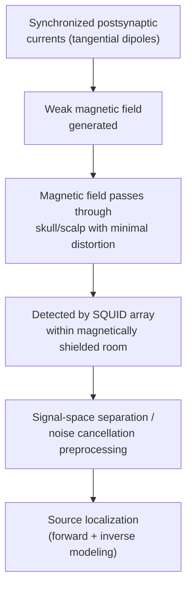

## Magnetoencephalography

### Overview

Magnetoencephalography (MEG) is a non-invasive electrophysiological technique that measures the extremely weak magnetic fields generated by synchronized electrical activity in the brain. Like EEG, MEG achieves millisecond-scale temporal resolution by directly detecting neural electrical activity rather than an indirect hemodynamic proxy; however, because magnetic fields (unlike electrical potentials) pass through the skull and scalp with minimal distortion, MEG generally offers improved spatial localization accuracy relative to scalp EEG for many source configurations.

### Physiological and Physical Basis

**Key Points**

- MEG detects magnetic fields produced by **intracellular postsynaptic current flow** within populations of synchronously active neurons — the same underlying physiological current sources that generate the scalp EEG signal, but measured via their associated magnetic field rather than their electrical potential
- As with EEG, **pyramidal neurons** in an open-field (parallel, columnar) configuration are the primary contributors, since their currents summate constructively across large neural populations
- MEG is preferentially sensitive to **tangentially oriented** current sources (dipoles oriented parallel to the skull surface, arising largely from neurons in the walls of cortical sulci) and comparatively less sensitive to **radially oriented** sources (dipoles perpendicular to the skull surface, arising largely from neurons at the crowns of cortical gyri) — a direct consequence of the physics of magnetic field geometry relative to a spherically symmetric conductor
- The magnetic fields generated by neural activity are extraordinarily weak — many orders of magnitude smaller than the Earth's ambient magnetic field and typical urban magnetic noise — necessitating specialized, highly sensitive detection technology and substantial magnetic shielding

[Inference] The tangential-source sensitivity bias is a well-established consequence of MEG's underlying physics (based on established magnetostatics), though the practical degree to which specific radial sources are entirely undetected versus merely attenuated depends on individual head geometry and sensor array configuration, so it should be understood as a systematic sensitivity gradient rather than a strict all-or-nothing detection boundary.

### SQUID-Based Detection Technology

**Key Points**

- Traditional MEG systems detect these minute magnetic fields using **Superconducting Quantum Interference Devices (SQUIDs)**, extraordinarily sensitive magnetometers based on quantum-mechanical superconducting effects
- SQUIDs require **cryogenic cooling** (typically via liquid helium) to maintain superconductivity, necessitating a specialized, fixed helmet-shaped dewar housing the sensor array
- The dewar/helmet has a **fixed size and shape**, meaning individual head size and position within the helmet affect signal quality and consistency of sensor-to-brain distance across subjects — unlike EEG's flexible cap-based electrode placement
- Sensor arrays typically use combinations of **magnetometers** (measuring the magnetic field directly) and/or **gradiometers** (measuring the spatial gradient/difference of the magnetic field between closely spaced coils), with gradiometers offering better rejection of distant environmental noise sources relative to nearby neural sources

### Magnetic Shielding

- Because neural magnetic fields are minuscule relative to ambient environmental magnetic noise (from power lines, moving vehicles, elevators, the Earth's field, and other sources), MEG recording requires a **magnetically shielded room (MSR)**, typically constructed with multiple layers of mu-metal and/or aluminum to attenuate external magnetic interference
- Even within a shielded room, sophisticated **noise cancellation algorithms** (e.g., signal-space separation, reference sensor subtraction) are commonly applied during preprocessing to further reduce residual environmental and physiological (e.g., cardiac) artifact

### Optically Pumped Magnetometers (OPM-MEG)

**Key Points**

- A more recently developed alternative sensor technology, **Optically Pumped Magnetometers (OPMs)**, measures magnetic fields using laser-based atomic spin precession effects rather than superconducting circuits
- OPMs do **not require cryogenic cooling**, allowing them to be mounted much closer to the scalp in a flexible, wearable cap configuration rather than a fixed rigid helmet
- **Advantages of OPM-MEG:**
  - Closer sensor-to-brain proximity improves signal amplitude and potentially spatial resolution
  - Wearable, motion-tolerant design accommodates natural head movement during recording, expanding feasible paradigms (e.g., naturalistic movement, pediatric populations) relative to fixed-helmet SQUID systems
  - Potentially lower long-term operating cost (no liquid helium consumption)
- **Current limitations:**
  - OPM sensors are highly sensitive to background magnetic field drift and typically still require substantial magnetic shielding (though active shielding/compensation coil approaches are an active area of engineering development)
  - As a comparatively newer technology, OPM-MEG systems have smaller installed research/clinical bases and less extensively standardized analysis pipelines relative to mature SQUID-based systems
  - [Unverified] The degree to which OPM-MEG's practical spatial and temporal resolution advantages over conventional SQUID-MEG are realized varies across published validation studies and specific system implementations, and given the technology's relatively recent adoption, best practices and head-to-head comparative benchmarks continue to be actively established rather than fully settled

### MEG vs. EEG: Comparative Considerations

| Property | MEG | EEG |
| --- | --- | --- |
| Signal measured | Magnetic field from neural currents | Electrical potential from neural currents |
| Distortion by skull/scalp | Minimal (magnetic fields largely unaffected by tissue conductivity boundaries) | Substantial (skull's low conductivity blurs/attenuates signal) |
| Source orientation sensitivity | Preferentially sensitive to tangential sources | Sensitive to both radial and tangential sources |
| Reference requirement | None (absolute field measurement) | Requires a reference electrode/scheme |
| Spatial resolution (typical) | Generally better than EEG for tangential cortical sources | Generally coarser due to volume conduction |
| Equipment cost/portability | High cost, low portability (shielded room, cryogenics or specialized OPM setup) | Comparatively lower cost, higher portability |
| Sensitivity to deep sources | Limited, generally similar or somewhat worse than EEG for deep/subcortical sources | Limited, though not identically constrained |

[Inference] The commonly cited claim that "MEG has better spatial resolution than EEG" is broadly supported for many cortical source configurations given MEG's reduced volume-conduction distortion, but this generalization does not hold uniformly across all source types and depths (e.g., deep or purely radial sources), so the comparative advantage should be understood as source-configuration-dependent rather than a blanket superiority.

### The Forward and Inverse Problem in MEG

- As with EEG, MEG source estimation involves a **forward model** (predicting the sensor-level magnetic field pattern that would result from a hypothesized neural source configuration, given a model of head geometry and conductivity) and an **inverse solution** (estimating the most likely underlying source configuration from observed sensor data)
- MEG's forward modeling is somewhat simplified relative to EEG because magnetic fields are less sensitive to tissue conductivity differences (skull conductivity in particular has comparatively little effect on the magnetic field, unlike its substantial effect on the electrical potential measured by EEG) — a key contributor to MEG's generally improved source localization accuracy
- **Common inverse solution approaches:**
  - **Equivalent Current Dipole (ECD) fitting:** models the source as one or a small number of discrete point dipoles, appropriate for well-localized, focal activity (e.g., early sensory evoked responses)
  - **Distributed source models** (e.g., minimum-norm estimation, LORETA-type approaches): estimate activity across a distributed grid of possible source locations across the cortical surface, appropriate for more spatially extended or less focal activity
  - **Beamforming (e.g., Linearly Constrained Minimum Variance, LCMV):** a spatial filtering approach that estimates activity at a specified location while statistically suppressing contributions from other locations, particularly useful for oscillatory/time-frequency source analysis
- The inverse problem remains **mathematically ill-posed** (non-unique) in MEG just as in EEG, requiring additional constraining assumptions regardless of which inverse method is applied

### Co-registration with Structural MRI

- Accurate source localization requires precise **co-registration** between the MEG sensor array's coordinate system and the subject's individual head geometry, typically obtained via a structural MRI scan
- Co-registration is commonly achieved using fiducial markers (anatomical landmarks) or digitized head-surface points matched to the MRI-derived head surface, or increasingly via optical/laser scanning methods
- **Key Points**
  - Poor co-registration accuracy directly degrades source localization accuracy, regardless of how sophisticated the inverse solution algorithm is
  - Individual (rather than template/generic) structural MRI substantially improves forward model accuracy and, consequently, source localization plausibility

### MEG Signal Analysis Approaches

**Key Points**

- **Evoked responses:** analogous to EEG ERPs, time-locked averaging of MEG data produces **event-related fields (ERFs)**, the magnetic analog of ERP components (e.g., an M100 component corresponding conceptually to the EEG N100/P100)
- **Time-frequency analysis:** MEG's excellent temporal resolution makes it particularly well suited to studying oscillatory dynamics — event-related synchronization and desynchronization across frequency bands (e.g., mu/beta rhythm desynchronization during movement)
- **Connectivity analysis:** MEG's combination of good temporal resolution and reasonable source localization supports estimation of both amplitude-based (e.g., power correlation) and phase-based (e.g., phase-locking value, coherence) functional connectivity between source-localized regions, with less concern about hemodynamic delay confounds than fMRI-based connectivity

### Practical and Methodological Considerations

- **Movement sensitivity (SQUID-MEG):** although MEG is generally considered more motion-tolerant than fMRI, head movement within the fixed helmet still degrades sensor-to-brain distance consistency and can introduce artifact, motivating head-position monitoring/correction methods in many systems
- **Metal and ferromagnetic artifact:** dental work, certain implants, or even some cosmetics containing ferromagnetic particles can introduce substantial artifact, requiring careful subject screening similar in spirit to (though distinct in specific concerns from) MRI screening
- **Muscle and eye-movement artifact:** as with EEG, eye blinks, eye movements, and muscle tension introduce artifacts requiring identification and correction (e.g., via ICA-based approaches analogous to EEG preprocessing)
- **Cost and accessibility:** SQUID-based MEG systems represent a substantial capital and operating cost (cryogenic helium consumption, magnetically shielded room construction), limiting the number of research and clinical MEG installations relative to EEG or even MRI facilities

### Worked Example: Localizing Somatosensory Evoked Response

**Example**

A researcher wants to localize the early cortical response to median nerve stimulation (a common MEG validation/benchmark paradigm):

1. Median nerve electrical stimulation is delivered at the wrist while MEG is continuously recorded
2. Data are epoched around stimulation onset and averaged to produce an event-related field (ERF)
3. A prominent early deflection (commonly referred to as the M20 component, occurring approximately 20 ms post-stimulation) is identified in sensors overlying contralateral primary somatosensory cortex
4. An Equivalent Current Dipole is fit to the sensor topography at the M20 peak latency, using a forward model derived from the subject's co-registered structural MRI

**Output**

A localized dipole solution placing the estimated source within the hand region of contralateral primary somatosensory cortex (consistent with known somatotopic organization), illustrating MEG's combination of precise temporal latency information (~20 ms) with source localization anchored to individual anatomy.

### Applications in Cognitive Neuroscience

- **Language processing:** precise timing of lexical, semantic, and syntactic processing stages, often examined via MEG analogs of EEG language ERP components
- **Sensory and motor mapping:** presurgical functional mapping of primary sensory, motor, and language cortex, sometimes used clinically alongside or as an alternative to fMRI-based presurgical mapping
- **Epilepsy:** localization of interictal epileptiform activity to support surgical planning, leveraging MEG's combination of high temporal resolution and reasonable source localization for focal epileptic discharges
- **Oscillatory dynamics and connectivity:** studying frequency-specific neural communication (e.g., alpha/beta desynchronization, gamma-band local processing, cross-frequency coupling) with a temporal fidelity not available from hemodynamic methods
- **Developmental and clinical research:** increasingly relevant with the advent of wearable OPM-MEG systems, expanding feasibility for populations and paradigms poorly suited to fixed-helmet SQUID systems

### Conclusion

MEG provides a direct, millisecond-resolution measure of neural magnetic fields with generally improved spatial localization relative to EEG for many cortical source configurations, owing to the comparatively minimal distortion magnetic fields experience passing through the skull. Traditional SQUID-based MEG's requirement for cryogenic cooling and a fixed helmet imposes practical constraints on cost, portability, and motion tolerance that emerging OPM-based wearable MEG technology is actively working to address, though OPM-MEG remains a comparatively newer and less standardized technology relative to mature SQUID-based systems.

**Related Topics**

- Electroencephalography principles and event-related potentials
- Source localization methods and the MEG/EEG inverse problem
- Optically pumped magnetometer (OPM) wearable MEG systems
- Time-frequency and oscillatory connectivity analysis
- Presurgical mapping for epilepsy and eloquent cortex localization
- Beamforming and distributed source modeling approaches