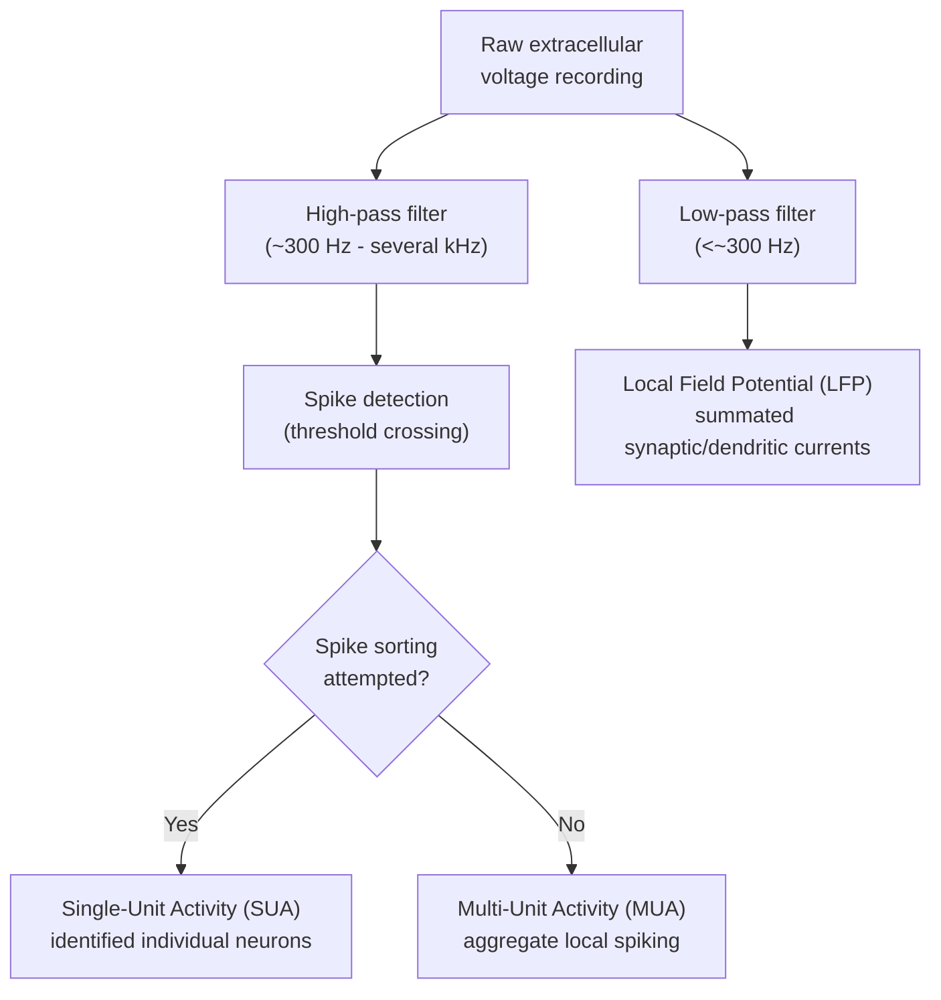

## Single Unit and Multiple Unit Recording

### Overview

Single-unit and multi-unit recording are invasive electrophysiological techniques that directly measure the electrical activity of individual neurons (or small local populations) via microelectrodes placed within or near neural tissue. Unlike EEG/MEG, which measure summated population-level signals at a distance through intervening tissue, single/multi-unit recording provides direct access to the fundamental computational unit of the nervous system — the action potential — offering the highest spatial and temporal resolution among electrophysiological methods, at the cost of invasiveness that generally restricts routine use to animal models, though clinical applications exist in human neurosurgical contexts.

### Distinguishing Signal Types

**Key Points**

- **Single-unit activity (SUA):** action potentials ("spikes") attributable to a single, individually identified neuron, isolated through spike sorting from the raw extracellular recording
- **Multi-unit activity (MUA):** the aggregate spiking activity of multiple nearby neurons recorded by the same electrode, without attempting to isolate individual neuron identity — typically obtained by high-pass filtering the raw signal and detecting threshold-crossing events without full spike sorting
- **Local Field Potential (LFP):** the low-frequency component of the extracellular signal (commonly below ~300 Hz), reflecting summated synaptic and dendritic currents from a local neural population rather than individual action potentials — conceptually more similar in origin to EEG's underlying signal, but recorded at much finer spatial scale and closer proximity to the source
- A single microelectrode recording is typically **band-pass filtered** into these distinct signal bands from the same raw voltage trace: high-pass filtering isolates spike-related activity (SUA/MUA), while low-pass filtering isolates the LFP

### Electrode Types and Technology

**Key Points**

- **Sharp glass micropipette electrodes:** classical intracellular recording tool, capable of recording from inside a single neuron (membrane potential, subthreshold events), but fragile and technically demanding for chronic/awake-behaving use
- **Metal microelectrodes** (e.g., tungsten, platinum-iridium): extracellular recording electrodes with fine tip diameters (typically micrometers), widely used for single/multi-unit extracellular recording in awake-behaving animal research
- **Tetrodes:** bundles of four closely spaced microwires, enabling improved spike sorting accuracy by comparing the relative amplitude of a given spike waveform across the four channels — since a neuron's spike amplitude varies systematically with its distance from each of the four closely spaced contacts, this provides additional discriminating information beyond waveform shape alone
- **Silicon microelectrode arrays** (e.g., multi-shank, multi-site probes such as Neuropixels-type devices): modern high-density probes containing hundreds to thousands of recording sites along a single or multiple shanks, enabling simultaneous recording from large numbers of neurons across multiple brain regions or cortical layers within a single implant
- **Microelectrode arrays (utah arrays, etc.):** grids of multiple independent microelectrodes implanted across a cortical area, used in both animal research and human clinical applications (e.g., brain-computer interface research)

[Inference] The adoption of high-density silicon probe technology has substantially increased the typical number of simultaneously recorded neurons achievable in a single experiment relative to earlier tetrode- or single-wire-based approaches, though the specific yield achieved in any given study depends heavily on probe design, targeted brain region, and surgical/recording technique.

### Spike Detection and Sorting

**Key Points**

- **Spike detection:** identifying candidate action potential events in the high-pass filtered signal, typically via amplitude threshold crossing (often set as a multiple of the estimated background noise standard deviation)
- **Spike sorting:** classifying detected spike waveforms by their presumed neuron of origin, based on waveform shape features (amplitude, width, characteristic shape) that are relatively stable for a given neuron but differ across neurons due to differences in cell morphology, electrode distance, and ion channel properties
- Common spike sorting approaches:
  - **Template matching:** comparing detected waveforms against previously characterized template shapes for identified units
  - **Principal Component Analysis (PCA)-based clustering:** reducing waveform shape to a small number of principal components, then clustering in this reduced feature space (e.g., via k-means or Gaussian mixture models)
  - **Modern automated/semi-automated sorting algorithms:** increasingly used for high-channel-count silicon probe data, given the impracticality of fully manual sorting across hundreds of simultaneously recorded channels
- **Key Points on Sorting Reliability**
  - Spike sorting quality depends on adequate spatial/amplitude separation between distinct neurons' waveforms; overlapping or highly similar waveforms from nearby neurons can be difficult to reliably separate
  - **Sorting errors:** false merges (treating two distinct neurons as one) and false splits (treating one neuron's variable waveforms as multiple neurons) both distort subsequent analysis
  - [Unverified] The overall reliability of fully automated spike sorting algorithms relative to careful manual or semi-automated curation continues to be an active methodological discussion in the field, with reported performance varying considerably depending on recording quality, electrode density, and the specific algorithm evaluated, so blanket claims about automated sorting accuracy should be treated cautiously rather than as an established fixed benchmark

### The Extracellular Action Potential

- An action potential recorded extracellularly reflects the transmembrane current flow associated with the neuron's spike, as sensed at a distance by the electrode, rather than a direct intracellular membrane potential measurement
- Recorded extracellular spike amplitude and waveform shape depend on the electrode's distance and orientation relative to the neuron, as well as the specific ion channel composition and morphology of that neuron
- **Waveform shape** can sometimes support classification of broad cell-type categories (e.g., narrow-spiking neurons often associated with fast-spiking inhibitory interneurons versus broader-spiking neurons often associated with excitatory pyramidal cells), though [Inference] this waveform-based cell-type inference is a probabilistic heuristic supported by convergent evidence from optogenetically identified recordings in some systems, not a definitive one-to-one mapping applicable with certainty to every recorded unit

### Analysis of Spiking Activity

**Key Points**

- **Firing rate:** the number of spikes per unit time, commonly computed within a sliding window or fixed bins, and often related to a stimulus, task variable, or behavioral event
- **Peri-stimulus time histogram (PSTH):** a trial-averaged firing rate function aligned to a specific event, analogous conceptually to an ERP but at the level of individual neuron spiking rather than population-level field potential
- **Tuning curves:** characterizing how a neuron's firing rate varies as a function of a continuous stimulus parameter (e.g., orientation tuning in visual cortex, directional tuning in motor cortex)
- **Inter-spike interval (ISI) analysis:** examining the statistical distribution of time intervals between successive spikes, informative about firing regularity, bursting behavior, and refractory period effects
- **Spike-field coherence:** examining the relationship between individual spike timing and the phase of concurrently recorded LFP oscillations, used to study how spiking activity is coordinated with local network oscillatory dynamics

$$Firing\ Rate = \frac{N_{spikes}}{\Delta t}$$

### Population-Level Analysis

- With modern high-density recording technology enabling simultaneous recording from many neurons, **population-level analysis** approaches have become increasingly central:
  - **Dimensionality reduction** (e.g., PCA, factor analysis) applied to population spiking activity to identify low-dimensional "neural trajectories" capturing coordinated population dynamics
  - **Decoding analyses** analogous in logic to fMRI's MVPA, predicting stimulus or behavioral variables from population spiking patterns
  - **Noise correlation analysis:** examining shared trial-to-trial variability across neuron pairs, informative about functional coupling and its impact on population coding capacity
- [Inference] The shift toward population-level analysis frameworks reflects both the increased availability of large-scale simultaneous recording technology and a broader theoretical emphasis in systems neuroscience on understanding neural computation as an emergent property of coordinated population activity rather than purely through single-neuron tuning properties considered in isolation; this represents an evolving methodological and theoretical emphasis rather than a fully settled consensus replacing single-neuron analysis approaches.

### Local Field Potentials: Complementary Population Signal

- LFPs reflect summated synaptic currents and other slow membrane potential changes from a local neural population within roughly hundreds of micrometers to a few millimeters of the electrode (the precise spatial extent of LFP generation is itself a subject of ongoing methodological discussion)
- LFP oscillations at various frequencies (analogous to but recorded at much finer spatial scale than EEG bands) are studied in relation to attention, memory, and sensorimotor processing
- **Current Source Density (CSD) analysis:** using LFPs recorded simultaneously across multiple depths (e.g., via a linear multi-contact probe spanning cortical layers) to estimate the spatial location and sign (source vs. sink) of underlying transmembrane current flow across cortical layers, providing laminar-resolved information not available from spiking data alone

### Invasiveness and Human Clinical Applications

**Key Points**

- Single/multi-unit recording is inherently invasive, requiring electrode penetration into neural tissue, which in animal research is achieved via surgical implantation under appropriate ethical/regulatory oversight
- **Human single-unit recording** is comparatively rare and generally restricted to clinical contexts where electrode implantation is independently clinically indicated:
  - **Intractable epilepsy surgical evaluation:** microelectrodes are sometimes embedded within clinical intracranial electrode arrays implanted to localize seizure foci, providing a research opportunity to record human single-unit activity during cognitive tasks performed by patients awaiting surgery
  - **Brain-computer interface (BCI) research:** microelectrode arrays (e.g., Utah arrays) implanted in motor cortex of paralyzed patients to enable decoding of intended movement for prosthetic or computer-cursor control
- [Inference] Human single-unit recording opportunities, while scientifically valuable for testing hypotheses about human-specific cognitive processes (e.g., certain memory and language-related single-neuron studies), remain comparatively rare and sample-size-limited relative to animal model research, given their dependence on independently clinically indicated procedures rather than being conducted for research purposes alone

### Worked Example: Orientation Tuning in Visual Cortex

**Example**

A researcher records single-unit activity from primary visual cortex (V1) of an animal model while presenting oriented grating stimuli at multiple angles:

1. A microelectrode is positioned to isolate a well-separated single unit via online spike sorting
2. Gratings are presented at systematically varied orientations (e.g., 0° to 180° in 20° increments) across multiple repeated trials
3. Firing rate is computed for each orientation, averaged across trials, and plotted as a function of stimulus orientation
4. The resulting **tuning curve** typically shows a peak firing rate at the neuron's "preferred orientation," with a graded, often roughly Gaussian-shaped fall-off in firing rate for orientations further from the preferred value

**Output**

An orientation tuning curve with a clear peak, quantified via a preferred orientation estimate and a tuning width (e.g., half-width at half-maximum), providing a quantitative single-neuron characterization of orientation selectivity — a foundational finding in visual systems neuroscience originally established via single-unit recording methodology.

### Applications in Cognitive and Systems Neuroscience

- **Sensory coding:** characterizing tuning properties across visual, auditory, and somatosensory systems
- **Motor control:** directional and kinematic tuning in motor and premotor cortex, foundational to motor BCI decoding approaches
- **Memory research:** hippocampal place cells, grid cells (entorhinal cortex), and human medial temporal lobe single-unit studies of concept/memory-related "concept cells"
- **Decision-making and value-based choice:** single-neuron correlates of accumulating evidence, value representation, and choice-related activity in prefrontal and parietal cortex
- **Population coding and neural dynamics:** large-scale simultaneous recording studies examining how coordinated population activity supports computation, increasingly enabled by high-density silicon probe technology

### Conclusion

Single-unit and multi-unit recording provide the most direct and highest-resolution window into neural computation among electrophysiological methods, measuring the fundamental action potential events (and, via LFP, local population synaptic activity) underlying all higher-level, non-invasively measured signals (EEG, MEG, fMRI). This resolution comes at the cost of invasiveness, generally restricting the technique to animal models and select human clinical opportunities, while modern high-density silicon probe technology continues to expand the scale of simultaneous population recording achievable, driving an increasing methodological and theoretical emphasis on population-level neural coding frameworks alongside traditional single-neuron tuning analysis.

**Related Topics**

- Spike sorting algorithms and high-density silicon probe technology
- Current source density analysis and laminar cortical recording
- Population coding and neural dimensionality reduction methods
- Multivariate pattern analysis and decoding (cross-modality methodological parallels)
- Brain-computer interfaces based on motor cortex single-unit recording
- Place cells, grid cells, and human medial temporal lobe single-neuron memory research