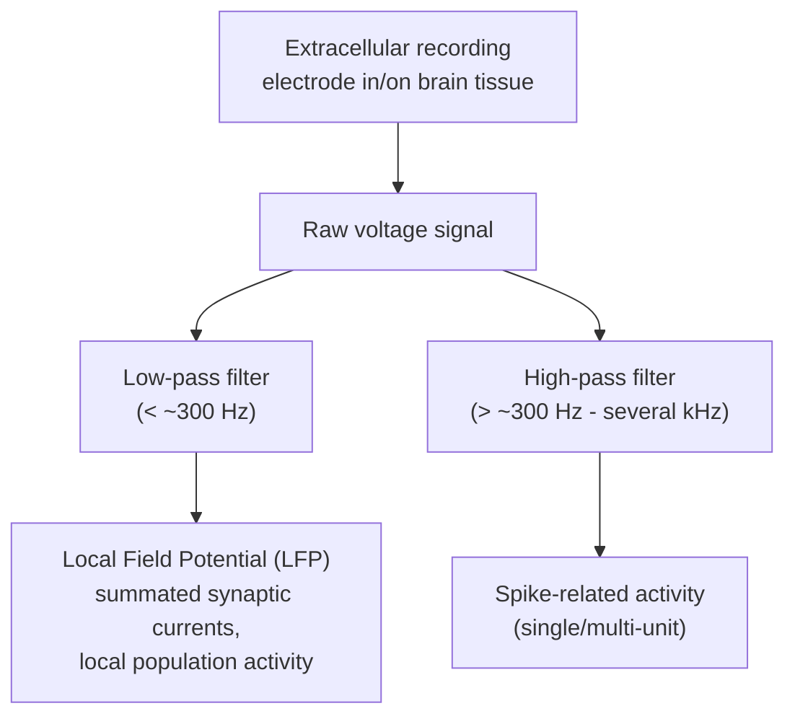

## Local Field Potentials and Intracranial Recording

### Overview

Local field potentials (LFPs) and intracranial recording encompass electrophysiological methods that record electrical activity directly from within or on the surface of brain tissue, bypassing the skull and scalp entirely. This intracranial vantage point provides substantially higher spatial resolution and signal fidelity than scalp EEG, while sampling population-level activity at a coarser spatial grain than single-unit recording — occupying a distinct and complementary methodological niche between these two approaches. Given intracranial recording's invasiveness, its human application is largely restricted to clinical contexts where electrode placement is independently medically indicated.

### The Local Field Potential Signal

**Key Points**

- The LFP is the low-frequency component (conventionally below approximately 300 Hz, though exact cutoff conventions vary across labs and studies) of the extracellular voltage signal recorded by an electrode positioned within neural tissue
- LFPs predominantly reflect **summated synaptic currents** (postsynaptic potentials) and other slow transmembrane current flows from a local population of neurons surrounding the electrode tip, rather than action potentials themselves
- The **spatial extent** of tissue contributing to a given LFP recording is a subject of ongoing methodological discussion; estimates in the literature have ranged from several hundred micrometers to a few millimeters depending on electrode geometry, tissue conductivity properties, and the frequency band examined, so it should not be treated as a single fixed universal value
- Unlike EEG, which measures a signal already substantially attenuated and blurred by intervening skull and scalp tissue, LFPs are recorded directly within the volume-conducting medium of brain tissue itself, yielding markedly higher signal amplitude and spatial specificity

### Distinguishing LFP from Spiking Activity

- As covered in single/multi-unit recording material, the same raw extracellular voltage trace is typically band-pass filtered to separate the low-frequency LFP component from the high-frequency spike-related component
- **Key Points**
  - LFP and spiking activity, while recorded from the same electrode, reflect at least partially distinct physiological processes: LFP is dominated by synaptic input and subthreshold dendritic processing, while spiking reflects each neuron's output (action potential generation)
  - Correlations and dissociations between LFP and local spiking activity are of substantial theoretical interest — for example, situations where LFP oscillatory power changes without a corresponding change in local firing rate suggest network-level synaptic/input dynamics not directly reflected in local spike output, though the precise mechanistic interpretation of any specific such dissociation depends on the particular experimental context

### Current Source Density Analysis

- When LFPs are recorded simultaneously across multiple depths using a **linear multi-contact electrode** spanning cortical (or other layered structure) depth, **Current Source Density (CSD) analysis** can estimate the spatial location and polarity (current source versus current sink) of the underlying transmembrane current flow at each depth
- CSD is derived mathematically from the second spatial derivative of the LFP signal across the depth axis, which helps distinguish genuine local current generators from passively volume-conducted potentials originating at a distance

$$CSD(z) \propto -\frac{\partial^2 \phi(z)}{\partial z^2}$$

where $\phi(z)$ is the recorded LFP as a function of depth $z$ along the electrode's contact positions.

**Key Points**

- CSD analysis provides **laminar-resolved** information about which cortical layer(s) are generating current sinks (typically interpreted as sites of net local excitatory synaptic input) versus sources, information unavailable from a single-depth LFP recording or from EEG/MEG
- Widely used to characterize the temporal sequence of activation across cortical layers following sensory stimulation, informative about feedforward versus feedback/recurrent processing dynamics

### Types of Intracranial Electrodes

| Electrode Type | Placement | Spatial Scale | Primary Signal |
| --- | --- | --- | --- |
| Microelectrodes / microwire arrays | Penetrating, within tissue | Single/local few-neuron scale | LFP + single/multi-unit spikes |
| Electrocorticography (ECoG) grids/strips | Subdural, on cortical surface | Several mm between contacts | Surface LFP-like signal (sometimes termed "local" but reflecting a larger cortical patch than penetrating LFP) |
| Stereo-EEG (sEEG) depth electrodes | Penetrating, multiple contacts along a linear probe reaching deep/subcortical structures | Multiple discrete depths along trajectory | LFP-like signal at each contact, occasionally with embedded microwires for single-unit recording |
| Deep Brain Stimulation (DBS) lead sensing | Penetrating, targeted subcortical structures (e.g., basal ganglia) | Localized to implanted target structure | Local field potential from the stimulation target region |

### Electrocorticography (ECoG)

**Key Points**

- ECoG records electrical activity from electrode grids or strips placed directly on the cortical surface (subdurally, beneath the dura mater, or occasionally epidurally), most commonly in the context of **presurgical epilepsy monitoring**
- Because the electrodes sit directly on cortical tissue rather than outside the skull, ECoG achieves substantially better spatial resolution and signal-to-noise ratio, and captures a broader frequency range (including high-frequency gamma activity, which scalp EEG captures far less reliably due to skull attenuation and myogenic contamination) than scalp EEG
- **Key Points**
  - ECoG is invasive, requiring craniotomy for electrode placement, and is therefore almost exclusively used in patients undergoing electrode implantation for independent clinical purposes (epilepsy surgical evaluation, some tumor resection mapping procedures)
  - This clinical basis means ECoG research samples are inherently drawn from a **non-representative population** (patients with a specific neurological condition, often long-standing epilepsy, whose brain organization or electrode placement may not straightforwardly generalize to the neurologically typical population) — an important interpretive caveat for cognitive neuroscience findings derived from ECoG
  - High-frequency broadband gamma activity (commonly examined in the 70–150+ Hz range) recorded via ECoG has been proposed as a relatively direct correlate of local population firing rate, more closely tracking local neuronal spiking than lower-frequency LFP oscillations [Inference — this proposed relationship between high-gamma ECoG power and local spiking is supported by convergent evidence in some studies but the precise quantitative correspondence varies across brain regions and recording conditions, so it is best regarded as a well-supported approximation rather than a universally exact equivalence]

### Stereo-EEG (sEEG)

- sEEG uses multiple thin, penetrating depth electrodes, each containing several contacts along its length, stereotactically implanted to sample activity from multiple brain regions (including deep and subcortical structures inaccessible to surface ECoG grids) simultaneously
- **Key Points**
  - Enables sampling from widely distributed regions across both cortical and deep structures within a single implantation, useful for characterizing seizure networks that may span multiple non-contiguous regions
  - Provides an important research opportunity for studying human deep/subcortical structure activity (e.g., hippocampus, amygdala) during cognitive tasks, complementing the more surface-restricted sampling of ECoG grids
  - As with ECoG, sEEG research is conducted in a clinical epilepsy population undergoing independently indicated presurgical evaluation, carrying the same population-representativeness caveat

### Deep Brain Stimulation Lead Recording

- Modern deep brain stimulation (DBS) systems implanted for conditions such as Parkinson's disease and essential tremor can, in some research and increasingly clinical contexts, also **record** local field potentials from the stimulation target region (e.g., subthalamic nucleus, globus pallidus) in addition to delivering stimulation
- **Key Points**
  - Has enabled substantial research into pathological oscillatory signatures in basal ganglia circuits (e.g., excessive beta-band, ~13-30 Hz, oscillatory activity associated with Parkinsonian motor symptoms), informing both basic understanding of basal ganglia-cortical circuit dysfunction and the development of **adaptive/closed-loop DBS** systems that adjust stimulation parameters based on real-time LFP feedback
  - [Inference] Closed-loop DBS approaches using LFP biomarkers (such as beta-band power) represent an active and evolving area of both research and emerging clinical translation, with the optimal biomarker(s) and control algorithms still being refined across ongoing studies rather than fully standardized

### Signal Analysis Approaches

**Key Points**

- **Spectral/time-frequency analysis:** characterizing power across frequency bands and its modulation by task events, analogous in logic to EEG/MEG time-frequency analysis but benefiting from higher signal-to-noise ratio and reduced volume-conduction blurring
- **Event-related potentials/fields:** intracranially recorded time-locked averaged responses, analogous to scalp ERPs but with substantially improved spatial specificity and signal amplitude
- **Cross-frequency coupling:** examining relationships between the phase of lower-frequency oscillations (e.g., theta) and the amplitude of higher-frequency oscillations (e.g., gamma), proposed as a mechanism for coordinating information across different temporal/processing scales
- **Inter-regional connectivity:** phase-based (e.g., coherence, phase-locking value) and amplitude-based (e.g., power correlation) connectivity measures between simultaneously recorded intracranial sites, benefiting from precise anatomical localization of each contact relative to scalp EEG's blurred source estimates

### Comparison Across Electrophysiological Recording Scales

| Method | Recording Location | Spatial Resolution | Invasiveness | Typical Human Application Context |
| --- | --- | --- | --- | --- |
| Scalp EEG | Outside skull | Coarse (volume conduction blurring) | Non-invasive | General research, clinical |
| MEG | Outside skull (magnetic) | Moderate | Non-invasive | General research, some clinical |
| ECoG | Cortical surface (subdural) | Fine (mm-scale between contacts) | Invasive (craniotomy) | Epilepsy surgical evaluation |
| sEEG | Penetrating, multi-depth | Fine at each contact, widely distributed sampling | Invasive (stereotactic implantation) | Epilepsy surgical evaluation |
| Microelectrode LFP/single-unit | Penetrating, local tissue volume | Finest (single-neuron to local population) | Invasive | Rare human clinical opportunities; primarily animal research |

### Worked Example: High-Gamma Mapping During Language Task

**Example**

A patient undergoing ECoG monitoring for epilepsy surgical evaluation performs a picture-naming task while a subdural electrode grid records cortical surface activity over frontal and temporal regions.

1. Continuous ECoG is recorded during task performance, with stimulus onset times marked
2. Data are epoched around stimulus onset and band-pass filtered to extract high-gamma power (e.g., 70–150 Hz) using a time-frequency decomposition (e.g., Hilbert transform or wavelet-based approach)
3. High-gamma power time courses are averaged across trials for each electrode contact
4. Electrodes showing significant task-related high-gamma power increases relative to a pre-stimulus baseline are identified and their locations mapped onto the patient's individual cortical surface reconstruction (derived from structural MRI)

**Output**

A spatial map showing sequential high-gamma activation first in visual processing regions, then progressing to temporal language-related areas, and finally to motor/premotor regions associated with articulatory planning — illustrating ECoG's capacity to track the fine-grained spatiotemporal cascade of a cognitive process with a precision unavailable from scalp EEG or fMRI alone.

### Applications in Cognitive Neuroscience

- **Language and semantic processing:** ECoG/sEEG high-gamma mapping of the spatiotemporal dynamics of speech perception and production
- **Memory research:** sEEG recording from hippocampus and medial temporal lobe during memory encoding/retrieval tasks in epilepsy patients
- **Presurgical functional mapping:** electrocortical stimulation mapping (directly stimulating cortex via implanted electrodes) combined with passive LFP/ECoG recording to localize eloquent cortex before resective surgery
- **Basal ganglia circuit research:** DBS lead LFP recording informing understanding of pathological oscillatory dynamics in movement disorders
- **Validating and informing non-invasive methods:** intracranial recordings provide ground-truth-like validation data informing interpretation of scalp EEG/MEG source localization and the physiological basis of fMRI BOLD signal correlates

### Conclusion

LFPs and intracranial recording methods occupy a valuable middle ground between the fine-grained but sparse sampling of single-unit recording and the coarse, distance-attenuated sampling of scalp EEG/MEG, offering high spatial and temporal fidelity population-level signals directly from brain tissue. Their necessarily invasive nature restricts human application predominantly to clinical populations undergoing independently indicated procedures (epilepsy surgical evaluation, deep brain stimulation), an important interpretive caveat for generalizing findings, while continuing to provide uniquely detailed insight into human neural dynamics, laminar processing organization, and pathological oscillatory circuit activity not accessible through non-invasive methods alone.

**Related Topics**

- Single unit and multiple unit recording methodology
- Current source density analysis and laminar cortical dynamics
- Electrocortical stimulation mapping for presurgical planning
- Deep brain stimulation and closed-loop adaptive neurostimulation
- Cross-frequency coupling and oscillatory neural communication
- Epilepsy network localization using sEEG and ECoG