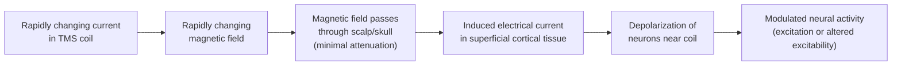
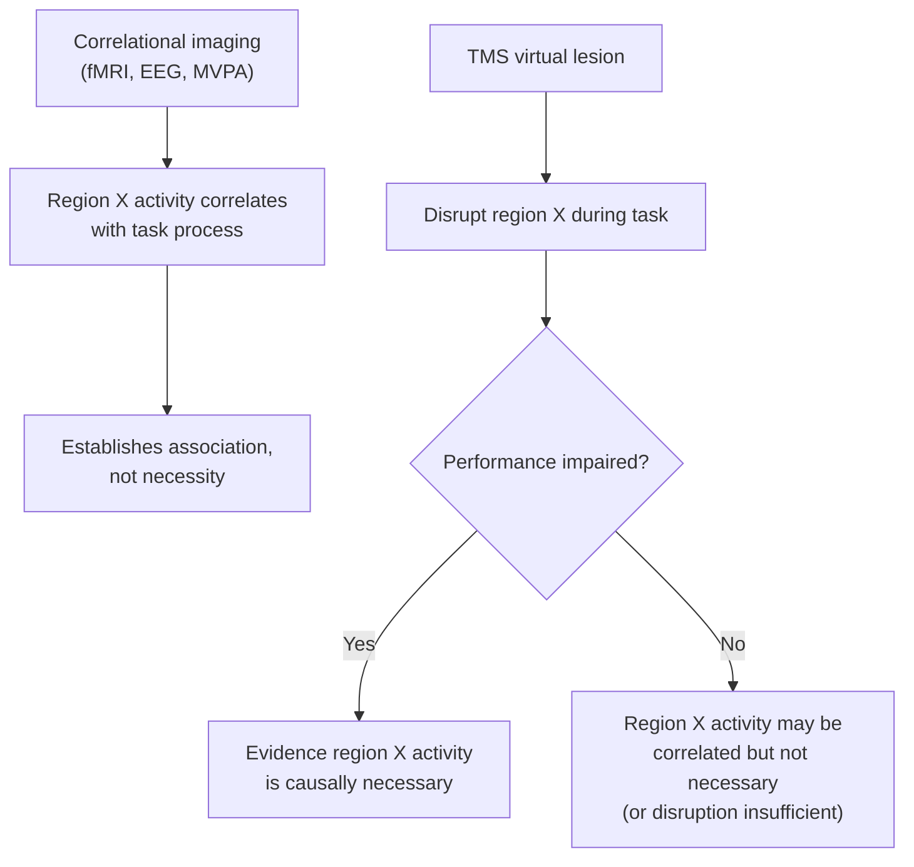

## Transcranial Magnetic Stimulation

### Overview

Transcranial magnetic stimulation (TMS) is a non-invasive neurostimulation technique that uses rapidly changing magnetic fields to induce electrical currents in underlying brain tissue, thereby modulating neural activity. Unlike purely observational neuroimaging methods (fMRI, EEG, MEG), TMS enables **causal** manipulation of brain activity, allowing researchers to test whether a given brain region is functionally **necessary** for a specific cognitive process — distinguishing it methodologically from correlational imaging approaches.

### Physical Principle: Electromagnetic Induction

**Key Points**

- TMS operates on the principle of **Faraday's law of electromagnetic induction**: a rapidly changing electric current passed through a coil placed on the scalp generates a rapidly changing magnetic field, which in turn induces a secondary electrical current in nearby conductive tissue (the brain)

$$\varepsilon = -\frac{d\Phi_B}{dt}$$

where $\varepsilon$ is the induced electromotive force (driving the induced current) and $\frac{d\Phi_B}{dt}$ is the rate of change of magnetic flux through the tissue.

- Because magnetic fields pass through the skull and scalp with minimal attenuation or distortion (the same physical property exploited by MEG), TMS can non-invasively induce current in cortical tissue without requiring any direct electrical contact or the skull-related signal distortion that limits EEG's spatial precision
- The induced current is strongest in **superficial cortical tissue** directly beneath the coil and decreases rapidly with depth, fundamentally limiting standard TMS to influencing relatively superficial cortical regions rather than deep/subcortical structures

### Coil Types and Spatial Targeting

| Coil Type | Field Pattern | Focality | Typical Use |
| --- | --- | --- | --- |
| Circular coil | Diffuse, ring-shaped field | Low focality | Historical/general stimulation, less common in modern targeted research |
| Figure-eight (butterfly) coil | Focal field at the intersection of two adjacent circular windings | High focality | Standard for precise cortical targeting in research and clinical use |
| H-coil (deep TMS) | Extended field geometry designed for greater depth penetration | Lower focality, greater depth reach | Targeting deeper cortical/subcortical-adjacent regions, some clinical depression protocols |

**Key Points**

- The figure-eight coil is the most widely used design in cognitive neuroscience research due to its relatively focal stimulation site (concentrated at the coil's central junction), improving spatial specificity of the induced effect
- **Neuronavigation systems**, using individual structural MRI co-registered with real-time coil position tracking, are commonly employed in research settings to ensure precise and reproducible coil placement over an intended cortical target across sessions and subjects

### Single-Pulse, Paired-Pulse, and Repetitive TMS

**Single-Pulse TMS (spTMS)**

- Delivers isolated individual magnetic pulses, commonly used to study the immediate, transient effect of focal cortical disruption on ongoing task performance, or to map corticospinal excitability (e.g., via motor evoked potentials, see below)

**Paired-Pulse TMS**

- Delivers two pulses in rapid succession (with a defined inter-pulse interval), often used to probe intracortical excitatory/inhibitory circuit dynamics
- **Key Points**
  - **Short-interval intracortical inhibition (SICI):** a subthreshold conditioning pulse followed shortly by a suprathreshold test pulse typically suppresses the test pulse's motor evoked response, interpreted as reflecting local GABAergic inhibitory circuit activity
  - **Intracortical facilitation (ICF):** at longer inter-pulse intervals, the conditioning pulse can instead facilitate (enhance) the test pulse response, interpreted as reflecting a different, less inhibition-dominated circuit interaction

**Repetitive TMS (rTMS)**

- Delivers trains of pulses at a fixed frequency over an extended period, producing effects that can **outlast** the stimulation period itself
- **Key Points**
  - **Low-frequency rTMS** (commonly ≤1 Hz): generally associated with **inhibitory/suppressive** after-effects on cortical excitability
  - **High-frequency rTMS** (commonly ≥5 Hz): generally associated with **excitatory/facilitatory** after-effects on cortical excitability
  - [Inference] This low-frequency-inhibitory versus high-frequency-excitatory generalization is a widely cited heuristic in the literature and holds reasonably well across many studies, but the actual direction and magnitude of after-effects can vary depending on additional parameters (total pulse number, intensity, targeted region, and individual variability in baseline cortical state), so it should not be treated as a strict universal rule

**Patterned/Theta-Burst Stimulation (TBS)**

- Delivers pulses in brief high-frequency bursts (typically bursts of three pulses at ~50 Hz) repeated at a theta-range rate (~5 Hz), designed to more efficiently induce lasting plasticity-like effects in a shorter stimulation duration than conventional rTMS
- **Continuous TBS (cTBS):** uninterrupted burst trains, generally associated with inhibitory after-effects
- **Intermittent TBS (iTBS):** burst trains interspersed with brief pauses, generally associated with facilitatory after-effects

### Neurophysiological Basis of Lasting Effects

- Effects of rTMS/TBS outlasting the stimulation period are commonly interpreted through the lens of **long-term potentiation (LTP)-like and long-term depression (LTD)-like synaptic plasticity mechanisms**, given similarities between the after-effect time course and classic LTP/LTD phenomena described in animal electrophysiology
- [Speculation] While this LTP/LTD-analogy framework is widely used as an interpretive heuristic in the TMS literature, the degree to which human TMS after-effects mechanistically correspond to the same cellular/molecular processes established in animal LTP/LTD research (as opposed to sharing only superficial phenomenological similarity) remains a matter of ongoing scientific discussion rather than a definitively established mechanistic equivalence

### Motor Evoked Potentials and Motor Threshold

**Key Points**

- When TMS is applied over primary motor cortex at sufficient intensity, it can elicit a **motor evoked potential (MEP)** — a measurable muscle twitch/electrical response recorded via electromyography (EMG) from the corresponding contralateral muscle
- **Resting motor threshold (RMT):** the minimum stimulation intensity required to elicit a criterion MEP amplitude (e.g., commonly defined as a threshold producing responses of a specified minimum peak-to-peak amplitude in a defined percentage of trials) in a relaxed target muscle
- RMT serves two key practical purposes:
  - A standardized, individually calibrated way to set stimulation intensity for experiments targeting other (non-motor) brain regions, since raw stimulator output percentage does not directly translate to comparable induced field strength across individuals with different scalp-to-cortex distances and cortical excitability
  - A direct outcome measure of corticospinal excitability in its own right, used in studies of motor system plasticity, recovery after stroke, and pharmacological modulation of cortical excitability

### The "Virtual Lesion" Logic

**Key Points**

- TMS (particularly single-pulse or short rTMS trains) applied over a task-relevant region during task performance can transiently disrupt normal processing in that region, producing a behavioral effect (e.g., slowed reaction time, reduced accuracy) analogous in logic to a focal brain lesion, but reversible and precisely timed
- This "virtual lesion" approach allows testing of **causal necessity**: if disrupting region X during a specific task epoch impairs performance, this provides evidence that region X's normal activity during that epoch is causally important for the process, in a way that correlational imaging (fMRI activation, EEG/MEG signal, or MVPA decoding) cannot establish on its own
- **Chronometric TMS:** applying single-pulse or brief TMS trains at systematically varied time points relative to a stimulus or task event, mapping the specific time window during which a given region's activity is causally necessary for successful task performance

### Combining TMS with Neuroimaging

- **Concurrent TMS-EEG:** recording EEG during and immediately after TMS pulses to directly measure the spread and temporal dynamics of TMS-evoked cortical activity, providing a measure of cortical excitability and effective connectivity (how activity induced at the stimulation site propagates to connected regions) with millisecond precision
- **Concurrent TMS-fMRI:** examining BOLD signal changes resulting from TMS stimulation, informative about both local and distal (network-level) effects of focal stimulation, though technically challenging due to the need for TMS-compatible (non-ferromagnetic) coil hardware and careful artifact management within the MRI environment
- [Inference] TMS-EEG in particular has been increasingly used to derive quantitative measures of cortical excitability and effective connectivity applicable to both basic research and some clinical/diagnostic contexts (e.g., disorders of consciousness research), though standardization of specific derived metrics across labs remains an active area of methodological development

### Safety Considerations

**Key Points**

- **Seizure risk:** the most serious, though rare, safety concern associated with TMS, particularly with high-frequency rTMS; established safety guidelines specify maximum stimulation parameters (frequency, intensity, train duration, inter-train interval) to minimize this risk
- **Contraindications:** include a personal or strong family history of seizures, certain ferromagnetic implants near the stimulation site (e.g., cochlear implants, some aneurysm clips, other metal implants close to the coil), and pregnancy is generally treated as a precautionary contraindication pending further specific safety data
- **Common, non-serious side effects:** scalp discomfort or pain at the stimulation site, transient headache, and facial muscle twitching (particularly with more lateral coil placements activating nearby cranial musculature)
- Published safety guidelines (developed and periodically updated by expert consensus panels) specify parameter limits appropriate to different stimulation protocols, and adherence to these guidelines is standard practice in both research and clinical TMS applications

### Clinical Applications

- **Major depressive disorder:** rTMS targeting dorsolateral prefrontal cortex is an approved treatment for treatment-resistant depression in a number of countries, representing TMS's most established clinical application
- **Presurgical mapping:** TMS-based motor and language mapping (e.g., using TMS-induced speech arrest during naming tasks) to help localize eloquent cortex prior to neurosurgery
- **Stroke rehabilitation:** rTMS protocols investigated as an adjunct to motor rehabilitation, based on theoretical frameworks involving modulation of interhemispheric excitability balance
- [Unverified] Clinical applications of TMS beyond major depressive disorder (e.g., for other psychiatric conditions, chronic pain, or stroke rehabilitation) vary considerably in their current regulatory approval status and evidentiary support across different countries and specific protocols, and this landscape has continued to evolve, so the current approval and evidence status for any specific additional application should be verified against current regulatory and clinical guidance sources rather than assumed to be uniform.

### Worked Example: Chronometric TMS in Visual Awareness Research

**Example**

A researcher investigates the time window during which occipital cortex activity is necessary for conscious detection of a brief visual target:

1. A figure-eight coil is positioned over occipital cortex using neuronavigation guided by the subject's structural MRI
2. Single TMS pulses are delivered at systematically varied delays (e.g., 80, 100, 120, 140 ms) following presentation of a brief visual target
3. Subjects report whether they detected the target on each trial
4. Detection accuracy is plotted as a function of TMS pulse timing relative to target onset

**Output**

A pronounced dip in detection accuracy when TMS is delivered at a specific delay (e.g., ~100 ms post-target), with accuracy recovering at earlier and later delays — providing causal evidence that occipital cortical activity at that specific latency is necessary for the target to reach conscious awareness, a finding that correlational imaging methods alone could not establish with comparable temporal specificity regarding causal necessity.

### Conclusion

Transcranial magnetic stimulation provides a uniquely causal complement to correlational neuroimaging methods by using electromagnetic induction to transiently and reversibly modulate cortical excitability, enabling both direct probing of corticospinal/intracortical circuit properties (via motor evoked potentials and paired-pulse paradigms) and "virtual lesion" tests of a region's causal necessity for specific cognitive processes. Its restriction to superficial cortical targets, careful safety parameter adherence, and combination with concurrent EEG or fMRI for mechanistic insight into stimulation effects make it a central tool in the causal-inference toolkit of cognitive and clinical neuroscience.

**Related Topics**

- Motor evoked potentials and corticospinal excitability measurement
- TMS-EEG combined recording and cortical effective connectivity
- Theta-burst stimulation protocols and plasticity-based after-effects
- Chronometric TMS and causal timing of cognitive processes
- rTMS as a treatment for treatment-resistant depression
- Lesion studies and other causal-inference methods in cognitive neuroscience