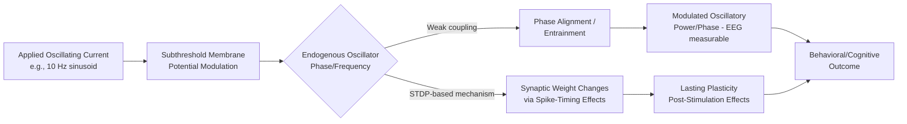

## Transcranial Direct Current and Alternating Current Stimulation

### Overview

Transcranial direct current stimulation (tDCS) and transcranial alternating current stimulation (tACS) are non-invasive brain stimulation (NIBS) techniques that apply weak electrical currents (typically 0.5–2 mA) to the scalp via surface electrodes to modulate cortical excitability. Unlike transcranial magnetic stimulation (TMS), these transcranial electrical stimulation (tES) methods do not directly trigger action potentials; instead, they subthreshold-modulate resting membrane potentials, shifting neuronal populations closer to or further from firing threshold. This distinction—neuromodulation rather than direct neurostimulation—is central to interpreting their mechanisms and effects.

### Historical Context

**Key Points**

- Galvanic stimulation of the brain dates to 19th-century experiments (Galvani, Aldini), but modern tDCS research began with Priori et al. (1998) and Nitsche & Paulus (2000), who demonstrated polarity-specific, lasting changes in motor cortex excitability in humans.
- tACS gained systematic research traction later, particularly from the mid-2000s onward, as interest grew in entraining endogenous oscillatory brain activity rather than simply shifting excitability.
- Both techniques are part of a broader tES family that includes transcranial random noise stimulation (tRNS) and transcranial pulsed current stimulation (tPCS).

### Basic Physical Principles

tDCS and tACS both deliver low-intensity current (usually under 2–4 mA) between two or more electrodes placed on the scalp, using a battery-powered constant-current stimulator.

- **tDCS**: delivers a constant, unidirectional current for a set duration (commonly 10–30 minutes). Current flows from anode to cathode through the scalp, skull, CSF, and cortical tissue.
- **tACS**: delivers a sinusoidal (or other periodic waveform) current that oscillates polarity at a defined frequency (commonly 1–80 Hz, though higher frequencies are used in some protocols), with no net DC offset in most implementations.

Only a fraction of the applied current (estimates vary widely, often cited around 10–50% depending on modeling assumptions and electrode montage) reaches the cortex; the remainder is shunted through the scalp and CSF due to the relatively high conductivity of extracerebral tissue layers.

$$J = \sigma E$$

where $J$ is current density, $\sigma$ is tissue conductivity, and $E$ is the electric field. Current density at the cortical surface depends on electrode montage, size, and the conductivity profile of intervening tissues—this is why individualized current-flow modeling (e.g., via finite element method software) is increasingly used in research to estimate actual field distributions rather than relying on scalp electrode placement alone.

### tDCS Mechanisms of Action

**Key Points**

*Acute/online effects (during stimulation):*

- **Anodal stimulation**: depolarizes resting membrane potential, generally increasing cortical excitability (as measured by motor evoked potential amplitude in motor cortex studies).
- **Cathodal stimulation**: hyperpolarizes resting membrane potential, generally decreasing cortical excitability.
- These polarity-dependent effects are best characterized in primary motor cortex (M1); generalization to other cortical regions is less consistent. [Inference: polarity effects outside M1, particularly in prefrontal and parietal regions, show more variable or even reversed patterns across studies]

*After-effects (persisting post-stimulation):*

- Longer stimulation durations (typically >5–7 minutes) and adequate current intensity can produce after-effects lasting from minutes to over an hour.
- These after-effects are believed to depend on NMDA-receptor-mediated synaptic plasticity, resembling long-term potentiation (LTP)-like and long-term depression (LTD)-like processes, since NMDA receptor antagonists (e.g., dextromethorphan) block the after-effects in pharmacological studies, while effects during stimulation itself persist even under NMDA blockade.
- GABAergic mechanisms are also implicated; calcium channel dynamics and BDNF-dependent plasticity have been proposed as contributing factors. [Inference: the precise molecular cascade remains incompletely characterized and is an active research area]

### tACS Mechanisms of Action

**Key Points**

- The dominant hypothesized mechanism is **neural entrainment**: rhythmic subthreshold modulation of membrane potential biases the timing of endogenous neural oscillations toward the phase and frequency of the applied current, functioning analogously to weak periodic forcing of a coupled oscillator system.
- A second proposed mechanism involves **spike-timing-dependent plasticity (STDP)**: rhythmic modulation may alter the relative timing of pre- and postsynaptic firing, inducing lasting synaptic changes even after stimulation ends.
- Entrainment effects are frequency-specific and are often studied in relation to canonical oscillatory bands (delta, theta, alpha, beta, gamma), based on the premise that different bands support distinct cognitive functions (e.g., alpha with attention/inhibition, gamma with local cortical processing, theta with memory encoding).
- [Inference] The degree to which observed behavioral effects reflect true entrainment versus peripheral confounds (retinal phosphenes, transcutaneous nerve stimulation, cutaneous sensations) is a matter of ongoing methodological debate in the field.

### Electrode Montages

Common montage strategies:

| Montage Type | Description | Typical Use Case |
| --- | --- | --- |
| Bipolar (conventional) | One "active" electrode over target region, one "reference" electrode elsewhere (e.g., contralateral supraorbital area) | Classic motor cortex studies |
| High-definition (HD-tDCS/tACS) | Multiple small "ring" electrodes (e.g., 4×1 configuration) surrounding a central electrode | Increased focality of current delivery |
| Extracephalic reference | Reference electrode placed off the scalp (e.g., shoulder, arm) | Reduces confounding current flow through reference-region cortex |
| Multi-electrode array | Several electrodes with individually controlled current, guided by current-flow modeling | Precision targeting in research settings |

Electrode size and current intensity jointly determine current density (mA/cm²), which is a key safety and dosing parameter; larger electrodes distribute the same current over greater area, reducing focality but also reducing density-related risk under the electrode.

### Dosing Parameters

**Key Points**

- **Intensity**: commonly 1–2 mA in adult research protocols; pediatric and clinical protocols often use lower intensities.
- **Duration**: single sessions typically 10–30 minutes; multi-session protocols (e.g., 5–20 daily sessions) are used in clinical trials targeting cumulative/plasticity effects.
- **Waveform (tACS-specific)**: sinusoidal is standard; some protocols use tRNS-like random frequency spectra as a comparison/control or as a distinct intervention.
- **Ramp-up/ramp-down**: current is gradually increased and decreased (typically over several seconds) at stimulation onset/offset to reduce sensory artifacts (itching, tingling) and abrupt-onset discomfort.
- **Electrode contact medium**: conductive gel or saline-soaked sponges are used to minimize impedance and distribute current density evenly, reducing risk of skin irritation or burns.

### Neurophysiological Outcome Measures

Research studies commonly quantify tES effects using:

- **TMS-based measures**: motor evoked potential (MEP) amplitude as an index of corticospinal excitability; paired-pulse paradigms (short-interval intracortical inhibition, intracortical facilitation) to probe inhibitory/excitatory circuit balance.
- **EEG/MEG**: power spectral density changes in targeted frequency bands (for tACS), event-related potentials, phase-locking measures relative to the stimulation waveform.
- **fMRI/fNIRS**: BOLD or hemodynamic signal changes in stimulated versus non-stimulated regions or networks.
- **Behavioral/cognitive measures**: reaction time, accuracy, working memory span, motor learning rate, depending on the targeted domain.

### Applications in Cognitive Neuroscience Research

**Key Points**

- **Motor learning and rehabilitation**: anodal tDCS over M1 has been studied for augmenting motor skill acquisition and post-stroke motor recovery.
- **Working memory**: anodal tDCS over dorsolateral prefrontal cortex (DLPFC) is among the most studied paradigms for working memory modulation; effects are heterogeneous across studies. [Inference: meta-analytic effect sizes for cognitive enhancement via tDCS are generally small and highly protocol-dependent]
- **Attention and perception**: tACS at alpha frequency over parieto-occipital regions has been used to probe the causal role of alpha oscillations in visual attention and perceptual sampling.
- **Memory consolidation**: slow-oscillation tDCS (applying oscillating currents at <1 Hz during slow-wave sleep) has been studied for enhancing declarative memory consolidation.
- **Clinical/translational research**: depression (DLPFC montages), chronic pain, tinnitus, and rehabilitation following stroke are actively studied applications, though regulatory approval status varies substantially by country and indication.

### Comparison: tDCS vs. tACS vs. TMS

| Feature | tDCS | tACS | TMS |
| --- | --- | --- | --- |
| Current/field type | Constant (DC) | Oscillating (AC) | Pulsed magnetic field inducing current |
| Direct neuron firing | No (subthreshold) | No (subthreshold) | Yes (suprathreshold, can evoke action potentials) |
| Primary mechanism | Excitability shift (polarity-dependent) | Oscillatory entrainment | Direct depolarization |
| Focality | Low–moderate (higher with HD montages) | Low–moderate | High (especially with figure-8 coils) |
| Typical after-effects | Minutes to >1 hour | Variable; some protocols show effects outlasting stimulation | Minutes to hours depending on protocol (e.g., rTMS, theta-burst) |
| Blinding feasibility | Relatively good (sham via ramp up/down only) | Good, similar sham approach | More difficult (audible click, scalp sensation) |

### Sham Stimulation and Blinding

A critical methodological feature of tES research is the **sham condition**, typically achieved by ramping current up and back down over several seconds at the start of a session, then delivering no (or minimal) current for the remainder—this reproduces the initial cutaneous sensation without meaningful cortical modulation, supporting participant blinding. [Inference: blinding efficacy is not perfect, particularly at higher intensities or with experienced participants who can distinguish sham from active stimulation based on sensation duration or intensity]

### Safety Considerations

**Key Points**

- At conventional research intensities (≤2–4 mA, standard electrode sizes), tES is generally considered to carry a low risk profile; serious adverse events are rare in the published literature.
- Common mild/transient effects: tingling, itching, burning sensation under electrodes, mild headache, fatigue, and transient skin redness.
- Skin lesions/burns are a recognized risk primarily associated with inadequate electrode-skin contact, excessive current density, or extended/incorrect protocols—not typical outcomes under standard research parameters.
- Contraindications commonly cited include metallic implants near the stimulation site, implanted electronic medical devices (e.g., pacemakers, in some cases), skin lesions at electrode sites, and a history of seizures (as a precautionary exclusion, though seizure induction by conventional tES is not well documented at standard intensities).
- [Unverified] Long-term safety data for repeated/chronic use (e.g., take-home consumer devices used over months) remains comparatively limited relative to single-session laboratory protocols.
- Regulatory status varies by jurisdiction: some devices/indications have received regulatory clearance for specific clinical uses (e.g., FDA clearance in the U.S. for certain conditions), while off-label and consumer/DIY use is subject to separate—and often less rigorous—oversight. Behavior described here reflects published protocols and may not generalize to all commercial devices; actual regulatory status should be verified against current agency guidance.

### Sources of Variability and Replication Challenges

**Key Points**

- Individual differences in skull thickness, CSF volume, gyral folding, and baseline cortical excitability substantially affect the electric field actually delivered to target cortex, contributing to inter-subject variability in outcomes.
- State-dependency: brain state at the time of stimulation (e.g., attention, arousal, ongoing oscillatory phase) can modulate or even reverse expected effects.
- Non-linear dose-response relationships have been reported in some paradigms, where higher intensity does not straightforwardly produce proportionally larger effects.
- These factors have contributed to a broader replication debate in the tES literature, with meta-analyses reporting mixed conclusions regarding the robustness and consistency of behavioral/cognitive effects. [Inference: this remains a genuinely contested area within the field rather than a settled consensus]

### Simplified tDCS Current Flow Diagram (svg_diagram)

<svg xmlns="http://www.w3.org/2000/svg" viewBox="0 0 700 340">
<text x="350" y="30" font-size="18" font-weight="bold" text-anchor="middle" fill="#1a1a2e">tDCS Current Flow: Anode to Cathode (svg_diagram)</text>

<ellipse cx="350" cy="190" rx="220" ry="130" fill="#f5f0e8" stroke="#333" stroke-width="2" />

<ellipse cx="350" cy="190" rx="200" ry="115" fill="none" stroke="#999" stroke-width="1.5" stroke-dasharray="4,3" />

<ellipse cx="350" cy="195" rx="150" ry="85" fill="#e8d5e5" stroke="#7a5c7a" stroke-width="1.5" />

<rect x="180" y="95" width="55" height="30" rx="4" fill="#d64550" stroke="#8b1a1a" stroke-width="2" />
<text x="207" y="115" font-size="14" font-weight="bold" text-anchor="middle" fill="white">A (+)</text>
<text x="207" y="85" font-size="12" text-anchor="middle" fill="#333">Anode</text>

<rect x="465" y="95" width="55" height="30" rx="4" fill="#3d6cb9" stroke="#1a3a6b" stroke-width="2" />
<text x="492" y="115" font-size="14" font-weight="bold" text-anchor="middle" fill="white">C (−)</text>
<text x="492" y="85" font-size="12" text-anchor="middle" fill="#333">Cathode</text>

<path d="M 220 125 Q 350 165 480 125" fill="none" stroke="#e8a33d" stroke-width="2.5" marker-end="url(#arrow1)" />
<text x="350" y="150" font-size="11" text-anchor="middle" fill="#a5661a">Shunted (scalp/CSF)</text>

<path d="M 225 122 Q 350 240 475 122" fill="none" stroke="#2a9d5c" stroke-width="2.5" marker-end="url(#arrow2)" />
<text x="350" y="255" font-size="11" text-anchor="middle" fill="#1e6e40">Cortical current path</text>

<circle cx="207" cy="200" r="10" fill="#ff6b6b" stroke="#8b1a1a" stroke-width="1.5" />
<text x="207" y="230" font-size="10" text-anchor="middle" fill="#333">Depolarized</text>
<text x="207" y="242" font-size="10" text-anchor="middle" fill="#333">(↑ excitability)</text>

<circle cx="492" cy="200" r="10" fill="#6b9bff" stroke="#1a3a6b" stroke-width="1.5" />
<text x="492" y="230" font-size="10" text-anchor="middle" fill="#333">Hyperpolarized</text>
<text x="492" y="242" font-size="10" text-anchor="middle" fill="#333">(↓ excitability)</text>

<text x="350" y="320" font-size="11" text-anchor="middle" fill="#555" font-style="italic">Only a fraction of applied current reaches cortical tissue; most is shunted through scalp/CSF</text>

</svg>

### tACS Entrainment Concept Diagram

### Worked Example: Interpreting a Motor Cortex tDCS Study

**Example**

A study applies anodal tDCS (1 mA, 20 minutes) over left M1 with the cathode over the contralateral supraorbital region, then measures MEP amplitude via single-pulse TMS at baseline, immediately post-stimulation, and 30 minutes post-stimulation.

- Expected pattern under the classic Nitsche & Paulus framework: increased MEP amplitude relative to baseline, persisting into the post-stimulation window (LTP-like after-effect).
- A sham-controlled comparison group receives ramp-up/ramp-down only, isolating the specific contribution of sustained current flow from non-specific sensory/placebo effects.
- Interpretation caveat: because MEP amplitude reflects the net excitability of a complex corticospinal circuit (including spinal and interneuronal contributions), an increase does not isolate a single cellular mechanism, and individual variability in response direction (some individuals show no change or the opposite direction of change) has been documented in the literature. [Inference: this individual variability is one reason single-session M1 tDCS results do not always generalize predictably to other cortical targets or cognitive domains]

### Common Methodological Pitfalls

**Key Points**

- Assuming scalp electrode placement corresponds directly to the intended cortical target without current-flow modeling; the two frequently diverge due to anatomical variability.
- Underpowered sample sizes relative to the small and variable effect sizes typically reported in the tES cognitive literature.
- Inadequate or implausible sham/blinding procedures at higher current intensities.
- Conflating "online" (during-stimulation) and "offline" (after-effect) results, which reflect potentially distinct mechanisms and should not be treated interchangeably.
- Over-generalizing M1-derived polarity rules (anodal = excitatory, cathodal = inhibitory) to other cortical regions where this relationship is less consistently observed.

### Related Topics

- Transcranial magnetic stimulation (TMS) and repetitive TMS (rTMS) protocols
- Theta-burst stimulation
- Transcranial random noise stimulation (tRNS)
- Closed-loop and EEG-triggered neurostimulation
- Computational current-flow modeling (finite element head models)
- Long-term potentiation (LTP) and long-term depression (LTD) as cellular plasticity frameworks
- Neural oscillations and cross-frequency coupling
- Non-invasive brain stimulation in clinical depression (e.g., DLPFC protocols)
- Sleep-based slow-oscillation stimulation and memory consolidation
- Deep brain stimulation (DBS) as an invasive comparator technique