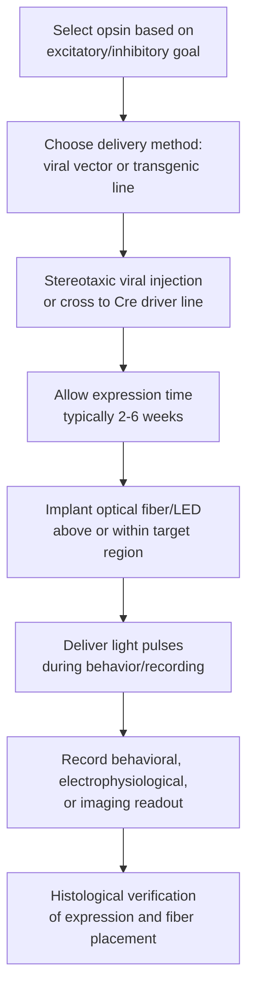
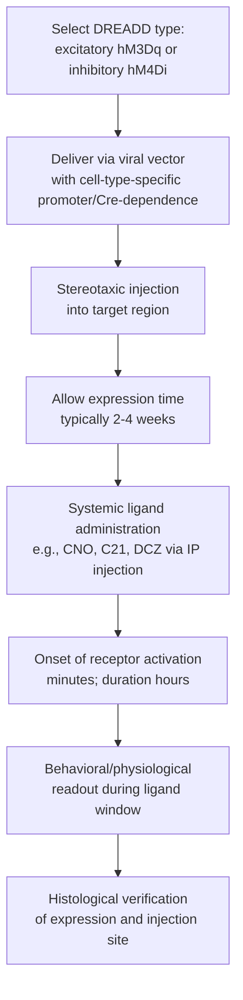

## Optogenetics and Chemogenetics

### Overview

Optogenetics and chemogenetics are complementary genetically-based neuromodulation techniques that allow researchers to control the activity of genetically defined neuronal populations with a specificity that conventional electrical or pharmacological methods cannot achieve. Both approaches require introducing an exogenous gene—encoding a light-sensitive ion channel/pump (optogenetics) or an engineered receptor (chemogenetics)—into target cells, then activating that gene product with an external trigger (light or a synthetic ligand, respectively). Their defining shared feature is **cell-type specificity**: activity can be restricted to genetically, anatomically, or projection-defined neuronal subpopulations, in contrast to electrical/magnetic stimulation methods that indiscriminately affect all tissue within their field.

### Comparison at a Glance

| Feature | Optogenetics | Chemogenetics (DREADDs) |
| --- | --- | --- |
| Trigger | Light (specific wavelength) | Systemically administered synthetic ligand |
| Temporal resolution | Milliseconds | Minutes to hours |
| Spatial resolution | High (limited by light penetration/fiber placement) | Lower (ligand diffuses systemically) |
| Invasiveness of delivery | Requires implanted fiber optic/LED | No implant required (systemic injection) for stimulation, though viral delivery is still needed |
| Typical duration of effect | Transient, tied to light pulses | Prolonged (ligand pharmacokinetics, often hours) |
| Best suited for | Precise timing relative to behavior/circuit events | Sustained state manipulation, chronic/repeated manipulation, less tethering |

### Optogenetics: Core Principles

**Key Points**

- Optogenetics uses **opsins**—light-activated transmembrane proteins, most derived from microbial (archaeal, bacterial, algal) sources—expressed in target neurons via genetic techniques.
- Upon illumination at a specific wavelength, opsins alter ion flux across the neuronal membrane, either depolarizing (excitatory opsins) or hyperpolarizing (inhibitory opsins) the cell, thereby driving or suppressing action potential firing with millisecond precision.
- The foundational demonstration of single-component optogenetic control (channelrhodopsin-2, ChR2, in cultured neurons) is credited to Boyden, Zhuang, Deisseroth and colleagues (2005), building on earlier opsin characterization work (e.g., Nagel et al.).

### Major Opsin Classes

| Opsin | Type | Ion Flux | Effect | Activation Wavelength (approx.) |
| --- | --- | --- | --- | --- |
| ChR2 (Channelrhodopsin-2) | Cation channel | Non-selective cation influx (Na⁺, Ca²⁺, H⁺) | Depolarizing (excitatory) | ~470 nm (blue) |
| ChETA, ChIEF, other ChR2 variants | Cation channel (engineered) | Cation influx | Excitatory, faster kinetics for high-frequency spiking | ~470 nm (blue) |
| NpHR (Halorhodopsin) | Chloride pump | Cl⁻ influx | Hyperpolarizing (inhibitory) | ~580–590 nm (yellow/amber) |
| Arch (Archaerhodopsin) | Proton pump | H⁺ efflux | Hyperpolarizing (inhibitory) | ~560 nm (green/yellow) |
| Chrimson | Cation channel | Cation influx | Excitatory, red-shifted (enables deeper tissue penetration, dual-color experiments with blue-light opsins) | ~590–630 nm (red) |
| Step-function opsins (SFOs), bistable opsins | Cation channel (engineered) | Cation influx | Prolonged excitatory state after brief pulse; separate "off" wavelength required | Variable, bistable |

[Inference: newer opsin variants continue to be engineered for improved kinetics, wavelength separation, and ion selectivity; any specific list of opsins should be treated as a snapshot rather than exhaustive given the pace of tool development in this subfield]

### Optogenetic Experimental Workflow

### Targeting Specificity Strategies

**Key Points**

- **Cell-type specificity**: achieved via cell-type-specific promoters (e.g., CaMKII for excitatory neurons) or, more commonly, the **Cre-lox recombination system**, where opsin expression is conditional on Cre recombinase presence—delivered either via a transgenic Cre-driver mouse line crossed with a Cre-dependent viral construct, or via dual-virus strategies.
- **Anatomical/projection specificity**: retrograde viral vectors (e.g., canine adenovirus, certain AAV serotypes, or retrograde-transported rabies constructs) injected in a downstream target region can restrict opsin expression to neurons projecting to that specific target, enabling projection-defined circuit dissection.
- **Temporal control of expression**: inducible systems (e.g., tetracycline-inducible, tamoxifen-inducible CreER) allow opsin expression to be turned on at a chosen developmental or experimental time point.

### Delivery Methods

| Method | Description | Advantages | Limitations |
| --- | --- | --- | --- |
| Viral vectors (AAV most common; also lentivirus) | Injected stereotaxically into target region | Flexible, works in wild-type and transgenic animals, various serotypes tune spread/tropism | Injection variability, limited packaging capacity for AAV, immune response considerations |
| Transgenic animal lines | Opsin gene inserted into genome, often Cre-dependent (e.g., Ai32 reporter lines in mice) | Consistent, widespread expression without injection | Less anatomical flexibility, generation/breeding time, cost |
| In utero electroporation | DNA delivered to developing embryonic brain | Useful for developmental studies | Technically demanding, restricted window |

### Light Delivery Hardware

**Key Points**

- **Fiber photometry/optogenetic fiber implants**: chronically implanted optical fibers coupled to LED or laser light sources, positioned above or within the target structure.
- **Wavelength-matched light sources**: LEDs are common for single-wavelength, lower-precision applications; lasers provide higher power and precision, useful for deeper structures or higher-resolution stimulation patterns.
- **Wireless/tetherless systems**: miniaturized LED-based head-mounted devices or wirelessly powered implants have been developed to reduce tethering constraints during freely moving behavior. [Inference: adoption of fully wireless systems varies by lab and cost constraints; tethered fiber-optic systems remain the more common standard setup in much published work]
- **Patterned illumination**: digital micromirror devices (DMDs) or spatial light modulators enable two-photon or holographic optogenetic stimulation of individually targeted cells, offering single-cell resolution stimulation in vitro or in accessible superficial cortex.

### Chemogenetics: Core Principles

**Key Points**

- Chemogenetics relies on engineered receptors that are activated by a synthetic ligand with minimal or no activity at endogenous receptors, decoupling induced neuronal activity from naturally occurring neurotransmitter signaling.
- The dominant chemogenetic platform is **DREADDs** (Designer Receptors Exclusively Activated by Designer Drugs), engineered muscarinic acetylcholine receptor variants that no longer respond to acetylcholine but do respond to synthetic ligands such as clozapine-N-oxide (CNO).
- Because DREADD activation works through native G-protein-coupled receptor (GPCR) signaling cascades, effects are slower in onset and longer in duration compared to the direct ion-channel gating of optogenetics.

### Major DREADD Types

| DREADD | G-protein Coupling | Downstream Effect | Typical Use |
| --- | --- | --- | --- |
| hM3Dq | Gq | Increases intracellular Ca²⁺, generally excitatory | Activating a neuronal population |
| hM4Di | Gi/o | Decreases cAMP, hyperpolarizes/inhibits neuronal firing | Silencing a neuronal population |
| GlyR-based / other emerging inhibitory DREADDs | Ligand-gated ion channel-based | Chloride influx, direct hyperpolarization | Alternative inhibitory strategy |
| KORD (kappa-opioid receptor DREADD) | Gi/o | Inhibitory, activated by salvinorin B (distinct ligand from CNO) | Enables independent bidirectional or dual-DREADD experiments alongside hM3Dq |

### Ligand Considerations

**Key Points**

- **Clozapine-N-oxide (CNO)** was the original standard DREADD ligand; however, subsequent pharmacokinetic studies demonstrated that CNO undergoes back-conversion to clozapine in vivo, and clozapine itself has affinity for numerous endogenous receptors and behaviorally active properties at sufficient concentration—raising concern about off-target confounds in earlier studies using higher CNO doses.
- This finding (largely from work published by Gomez et al., 2017 and related studies) prompted a shift toward lower CNO dosing, inclusion of clozapine-only and vehicle control groups, and development of alternative ligands with improved selectivity, such as **compound 21 (C21)** and **deschloroclozapine (DCZ)**, which have shown reduced back-conversion and improved brain penetrance in some studies. [Inference: consensus best practice in the field now emphasizes rigorous dose-response and control conditions given the CNO back-conversion issue, though exact preferred ligand choice varies by lab and continues to be refined]

### Chemogenetic Experimental Workflow

### Comparative Circuit Dissection Logic

Both tools are frequently used within a shared logical framework in systems/cognitive neuroscience:

1. **Necessity**: inhibit/silence a population (inhibitory opsin or hM4Di) during a behavior to test whether that population is required for the behavior.
2. **Sufficiency**: activate a population (excitatory opsin or hM3Dq) in the absence of the natural triggering stimulus to test whether activation alone is sufficient to drive the behavior or a proxy physiological readout.
3. **Circuit mapping**: combine projection-specific targeting with optogenetic terminal stimulation (stimulating axon terminals at a projection target rather than the cell body) or chemogenetic pathway-specific approaches to establish which anatomical pathway mediates an effect.

### Worked Example: Testing Necessity and Sufficiency

**Example**

A researcher hypothesizes that a specific population of prefrontal cortex neurons projecting to the amygdala drives an anxiety-related behavior.

- **Sufficiency test**: express ChR2 in prefrontal neurons using a Cre-dependent viral strategy in a mouse line labeling this population; implant a fiber over amygdala terminals; deliver blue light during an open-field or elevated-plus-maze test; compare anxiety-related behavior (e.g., time in open arms) during light-ON versus light-OFF epochs within the same session.
- **Necessity test**: express hM4Di (inhibitory DREADD) in the same population; administer CNO (with clozapine-only and vehicle controls) before behavioral testing; compare behavior against a no-DREADD or saline-injected control group.
- Combined convergent evidence from both approaches (rather than either alone) strengthens the causal inference, since each technique carries distinct potential confounds (e.g., light-associated heating artifacts for optogenetics; ligand off-target effects for chemogenetics).

### Complementary Readout Techniques

- **In vivo electrophysiology** (single-unit or multi-unit recording) to directly confirm that light or ligand delivery produces the expected change in firing rate of opsin/DREADD-expressing neurons.
- **Fiber photometry / calcium imaging (e.g., GCaMP)** to record bulk or single-cell calcium activity, often combined with optogenetic stimulation in "all-optical" experiments using spectrally separated indicators and opsins.
- **Immunohistochemistry** (e.g., c-Fos staining) as an indirect marker of neuronal activation following DREADD ligand administration, since direct real-time recording during systemic chemogenetic manipulation is less commonly paired with the same session.

### Methodological Limitations and Caveats

**Key Points**

- **Optogenetics**: light-induced tissue heating, especially with high-power/high-frequency stimulation, is a documented confound requiring appropriate control conditions (e.g., light delivery in opsin-negative animals); viral expression variability across animals can affect the number and location of transduced neurons; fiber placement accuracy requires histological verification.
- **Chemogenetics**: slower kinetics preclude fine-grained temporal analysis of circuit dynamics relative to specific behavioral events; ligand off-target/back-conversion issues (as noted above) require careful control design; systemic delivery means the ligand reaches all DREADD-expressing cells in the body (not only the targeted circuit), which is a consideration if expression is not adequately restricted.
- Both techniques depend on adequate expression specificity; off-target viral spread beyond the intended region, or promoter leakiness across cell types, can complicate interpretation if not verified histologically. [Inference: rigor in this field increasingly emphasizes mandatory histological confirmation of expression pattern and fiber/injection placement as a minimum reporting standard, though the extent of confirmation reported varies across the published literature]

### Broader Context Within Neurostimulation Methods

Relative to tDCS/tACS and TMS (non-invasive, spatially coarse, cell-type non-specific) and deep brain stimulation (invasive, electrically direct, but likewise not cell-type specific), optogenetics and chemogenetics occupy the highest-specificity end of the neuromodulation toolkit—at the cost of requiring genetic manipulation, which currently restricts their direct use largely to animal models and organoid/cell-culture systems rather than routine human application, though translational work (e.g., optogenetic approaches in retinal disease, and continued development of human-compatible chemogenetic strategies) is an active area of research. [Inference: human clinical translation of optogenetics remains at an early stage relative to its ubiquity as a basic-science circuit-dissection tool]

### Related Topics

- Cre-lox and other conditional genetic systems
- Viral vector engineering (AAV serotypes, retrograde tracing constructs)
- Fiber photometry and calcium imaging (GCaMP-based approaches)
- All-optical electrophysiology (combined optogenetics and imaging)
- Deep brain stimulation (DBS) as an invasive electrical comparator
- c-Fos and immediate early gene mapping of neuronal activation
- Optogenetic and chemogenetic translational applications (e.g., retinal prosthetics)
- Projection-specific circuit mapping techniques
- Two-photon holographic optogenetic stimulation
- DREADD ligand pharmacokinetics and off-target receptor profiling