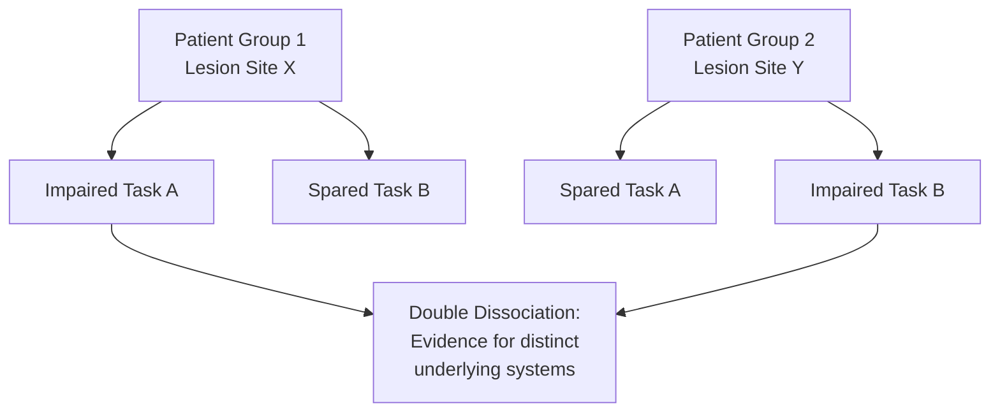

## Lesion Studies and Neuropsychological Methods

### Overview

Lesion studies and neuropsychological methods form the foundational causal-inference tradition in cognitive neuroscience, predating most modern neuroimaging and neurostimulation tools by over a century. The core logic is straightforward: if damage to a specific brain region reliably produces a specific, measurable deficit in cognitive or behavioral function, this supports an inference that the damaged region is **necessary** for that function under normal conditions. This "necessity" framework distinguishes lesion approaches from correlational methods like fMRI, which primarily reveal regions **associated with** (but not necessarily required for) a function.

### Historical Foundations

**Key Points**

- **Paul Broca** (1861) described a patient ("Tan," Louis Victor Leborgne) with a left inferior frontal lesion and profound expressive language deficit, contributing to the identification of what is now termed Broca's area and to early localizationist theory.
- **Carl Wernicke** (1874) described a distinct language deficit pattern (impaired comprehension, fluent but often meaningless speech) associated with left posterior superior temporal lesions, leading to the classic Wernicke-Lichtheim model of language processing and the concept of disconnection syndromes.
- **Phineas Gage** (1848), following a traumatic penetrating injury to ventromedial/orbitofrontal prefrontal cortex, exhibited pronounced personality and social behavior changes despite relatively preserved basic cognitive function—an early (if methodologically limited by modern standards) case illustrating a dissociation between "intellect" and social/executive function.
- The **double dissociation** logic, formalized more rigorously in 20th-century neuropsychology (e.g., via the work of researchers such as Teuber), became the central inferential tool of the discipline.

### The Double Dissociation Logic

**Key Points**

- A **single dissociation** occurs when a lesion impairs performance on Task A while sparing performance on Task B; this is suggestive but not conclusive evidence of functional specialization, since Task A may simply be harder or more sensitive to general damage.
- A **double dissociation** requires two patients (or patient groups) with lesions in different locations: Patient 1 shows impaired Task A / spared Task B, while Patient 2 shows the reverse pattern (impaired Task B / spared Task A).
- Double dissociation is considered stronger evidence that the two tasks depend on at least partially distinct neural/cognitive systems, since a general severity confound cannot easily explain a criss-cross pattern.
- [Inference] Even double dissociations do not by themselves prove that a region is the sole or exclusive substrate of a function; they establish that damage to distinguishable systems produces distinguishable deficits, which is compatible with distributed or network-based accounts as well as strictly modular ones.

### Types of Lesions Studied

| Lesion Type | Cause | Characteristics for Research |
| --- | --- | --- |
| Stroke (ischemic/hemorrhagic) | Vascular occlusion or rupture | Most common source; lesion boundaries follow vascular territories, not necessarily cognitive-system boundaries |
| Traumatic brain injury (TBI) | Physical trauma | Often diffuse, variable, and combined with diffuse axonal injury—complicates precise localization |
| Tumor resection | Surgical removal of neoplasm | Can offer more surgically-defined boundaries, but pre-existing tumor mass effect and edema complicate baseline comparisons |
| Neurosurgical resection (e.g., epilepsy surgery) | Planned surgical removal (e.g., temporal lobectomy) | Relatively well-defined boundaries; enables pre/post-surgical within-subject comparison |
| Focal neurodegenerative atrophy | Progressive disease (e.g., semantic dementia, primary progressive aphasia variants) | Gradual onset allows study of compensatory reorganization; boundaries are diffuse and progressive rather than fixed |
| Congenital/developmental lesions | Present from early life | Raises separate questions about neuroplasticity and functional reorganization during development |

### Methodological Approaches

#### Single Case Studies

**Key Points**

- Historically dominant approach (e.g., patient H.M. for medial temporal lobe/memory research, patient S.M. for amygdala/fear research).
- Advantages: allows deep, detailed characterization of a rare or unusually "clean" lesion; can reveal function-specific deficits not detectable with group averaging.
- Limitations: findings may not generalize; individual differences in premorbid ability, compensatory strategies, and lesion idiosyncrasies limit inferential strength; publication bias toward striking/unusual cases.

#### Group Studies

**Key Points**

- Aggregate patients with lesions in a common region (or overlapping region via lesion mapping) and compare against controls or against patients with lesions elsewhere.
- Advantages: greater generalizability, statistical power to detect effects amid individual variability.
- Limitations: heterogeneity in lesion size/location within the "same" nominal group; requires large patient samples, which are often difficult to recruit for rare lesion locations.

#### Voxel-Based Lesion-Symptom Mapping (VLSM)

**Key Points**

- A statistical technique that correlates the presence/absence of damage at each voxel across a group of patients with continuous behavioral/cognitive performance scores, without requiring a priori binning of patients into discrete lesion-location groups.
- Produces a statistical map indicating which voxels are significantly associated with impaired performance, generating a data-driven structure-function map analogous in spirit to fMRI statistical maps, but from a lesion-deficit rather than an activation-based framework.
- Requires large patient samples with variable, overlapping lesion locations and a well-normalized common brain space (lesions are manually or semi-automatically traced and normalized to a template) for cross-subject comparison.
- [Inference] Statistical power in VLSM is uneven across brain regions because natural lesion distributions (e.g., following vascular territories) do not sample all regions equally, which can create blind spots or reduced sensitivity in less commonly damaged areas.

#### Lesion Network Mapping

**Key Points**

- A more recent extension of lesion-based inference that leverages normative connectome data (functional connectivity maps derived from large healthy-subject datasets) to ask whether lesions producing a given symptom, despite being in heterogeneous locations, share a common functional network.
- This approach (associated with work from groups including Fox and colleagues) has been applied to symptoms such as hallucinations, criminal behavior following lesions, and free will/agency-related deficits, where lesion locations are anatomically diverse but converge on a shared network.
- [Inference] This method represents a shift from strict regional localization toward network-based lesion inference, reflecting a broader theoretical move in the field toward distributed/network models of brain-behavior relationships.

### Neuropsychological Assessment Batteries

**Key Points**

Standardized, normed test batteries are used to characterize cognitive deficits systematically and enable comparison against normative population data.

| Domain | Example Instruments |
| --- | --- |
| General intelligence | Wechsler Adult Intelligence Scale (WAIS) |
| Memory | Wechsler Memory Scale (WMS), California Verbal Learning Test (CVLT), Rey-Osterrieth Complex Figure |
| Language | Boston Diagnostic Aphasia Examination, Token Test |
| Executive function | Wisconsin Card Sorting Test, Trail Making Test, Stroop Task |
| Attention | Test of Everyday Attention, Continuous Performance Test |
| Visuospatial function | Rey-Osterrieth Complex Figure (copy condition), Judgment of Line Orientation, Line Bisection Test (for neglect) |
| Executive/social cognition | Iowa Gambling Task, Theory of Mind tasks (e.g., Reading the Mind in the Eyes) |

### Classic Neuropsychological Syndromes as Case Studies

**Key Points**

- **Amnesia (medial temporal lobe, particularly hippocampus)**: patient H.M., following bilateral medial temporal lobectomy for epilepsy treatment, exhibited profound anterograde amnesia with relatively preserved short-term memory, intelligence, and procedural learning—supporting dissociations between declarative and non-declarative (procedural) memory systems, and between short-term/working memory and long-term consolidation.
- **Hemispatial neglect (typically right parietal/temporoparietal lesions)**: patients fail to attend to or report stimuli in the contralesional (usually left) visual field/space despite intact primary visual pathways, illustrating a dissociation between low-level sensory processing and higher-order spatial attention.
- **Prosopagnosia (typically fusiform/occipitotemporal lesions)**: selective impairment in face recognition despite preserved object recognition and (in "pure" cases) preserved ability to identify familiar people via voice or other cues—used as evidence for domain-specific face-processing mechanisms.
- **Apperceptive vs. associative visual agnosia**: apperceptive agnosia reflects a failure of basic perceptual integration (patients cannot copy or match simple shapes), whereas associative agnosia reflects intact perception but failure to link percepts with stored semantic knowledge (patients can copy a drawing accurately but cannot identify what it depicts)—itself a classic dissociation within visual object recognition.
- **Frontal/executive dysfunction syndromes**: damage to prefrontal cortex, particularly dorsolateral and orbitofrontal regions, associated with deficits in planning, cognitive flexibility, inhibition, and (in ventromedial/orbitofrontal cases) social/emotional decision-making, as illustrated historically by the Phineas Gage case and more systematically studied in subsequent patient cohorts (e.g., work by Damasio and colleagues on ventromedial prefrontal patients and decision-making under the somatic marker framework).

### Worked Example: Designing a Lesion Study

**Example**

A researcher wants to test whether the right temporoparietal junction (rTPJ) is causally necessary for theory-of-mind (ToM) reasoning, building on correlational fMRI evidence that rTPJ activates during ToM tasks.

1. **Patient recruitment**: identify a cohort of stroke patients with lesions involving rTPJ, and a comparison cohort with lesions of similar size/etiology but sparing rTPJ (e.g., lesions in a different, functionally unrelated region).
2. **Task selection**: administer a validated ToM battery (e.g., false-belief tasks, Reading the Mind in the Eyes) alongside control tasks that share superficial task demands (e.g., working memory load, visual processing) but do not require mentalizing, to rule out general deficit confounds.
3. **Lesion mapping**: trace lesions on structural MRI/CT, normalize to standard space, and apply VLSM to identify which voxels statistically predict ToM task impairment across the full patient sample (not just the pre-defined rTPJ vs. non-rTPJ grouping) as a converging analysis.
4. **Interpretation**: if rTPJ-lesioned patients show selectively impaired ToM performance relative to controls on ToM-specific but not control tasks, and VLSM independently implicates the same region, this constitutes converging necessity evidence to complement the pre-existing fMRI correlational evidence.
5. **Caveat check**: assess for confounds such as differences in lesion size, time since injury, general cognitive/attentional impairment, and premorbid ability, since these often differ systematically between lesion groups drawn from clinical populations rather than randomized assignment (lesion studies are inherently quasi-experimental, not truly experimental, since lesion location cannot be randomly assigned).

### Complementary Relationship to Neuroimaging and Neurostimulation

| Method | Type of Inference | Temporal Precision | Causal Strength |
| --- | --- | --- | --- |
| fMRI/PET | Correlational (activation-function association) | Seconds (fMRI, hemodynamic lag) | Low (association only) |
| TMS/tES | Causal (transient, reversible disruption/modulation) | Milliseconds–minutes | Moderate–high (reversible necessity/sufficiency in intact brains) |
| Lesion studies | Causal (permanent, naturally-occurring disruption) | N/A (static, chronic deficit) | High for necessity, but confounded by non-random lesion distribution, compensatory plasticity, and comorbid factors |
| Optogenetics/chemogenetics | Causal (cell-type-specific, reversible) | Milliseconds (opto) to hours (chemo) | Very high specificity, but largely restricted to animal models |

[Inference: the strongest converging evidence for a structure-function claim in cognitive neuroscience typically comes from triangulating across at least two of these method classes—for example, matching lesion-deficit findings with reversible TMS disruption in neurologically intact participants—since each method class carries a distinct and non-overlapping profile of potential confounds]

### Methodological Limitations and Caveats

**Key Points**

- **Lack of randomization**: lesion location and size are determined by disease/injury processes, not experimental assignment, introducing potential confounds related to vascular anatomy, injury mechanism, and patient selection.
- **Diaschisis and network effects**: a lesion can cause dysfunction in distant, anatomically intact regions connected to the damaged area (diaschisis), meaning observed deficits may not solely reflect loss of the damaged tissue's local function but also disruption of a broader network.
- **Neuroplasticity and functional reorganization**: particularly with early-onset or slowly progressive lesions, other regions may partially compensate, complicating straightforward structure-function inference, and creating discrepancies between acute post-lesion deficits and long-term outcomes.
- **Heterogeneity in lesion size/etiology**: even lesions nominally centered on the "same" region vary considerably in extent, which can affect severity and pattern of resulting deficits.
- **Behavioral task sensitivity and specificity**: apparent double dissociations can sometimes reflect differences in task difficulty or psychometric properties (e.g., ceiling/floor effects) rather than genuine functional dissociation—a methodological critique raised prominently in the neuropsychological literature regarding interpretation of dissociation data.
- [Unverified/Inference] The degree to which findings from clinical lesion populations (often older, with comorbidities such as vascular risk factors) generalize to basic mechanistic claims about the healthy young-adult brain (the typical population studied via fMRI) is a standing cross-method generalization question rather than a fully resolved issue.

### Related Topics

- Structural neuroimaging and lesion tracing/normalization methods (CT, structural MRI)
- Diaschisis and network-level consequences of focal brain damage
- Transcranial magnetic stimulation as a reversible "virtual lesion" method
- Split-brain studies and callosal disconnection syndromes
- Aphasia classification systems (Broca's, Wernicke's, conduction, global)
- Hemispatial neglect and models of spatial attention
- Declarative vs. non-declarative memory systems
- Ventromedial prefrontal cortex and decision-making (somatic marker hypothesis)
- Connectome-based lesion network mapping
- Neuroplasticity and functional reorganization following brain injury