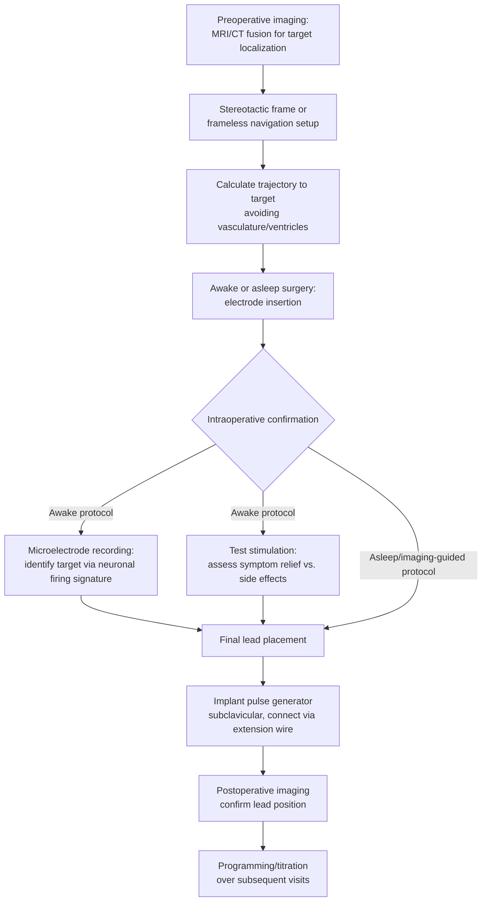
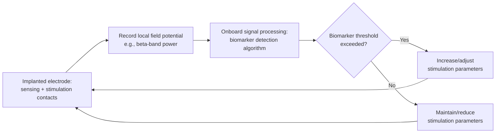

## Deep Brain Stimulation

### Overview

Deep brain stimulation (DBS) is an invasive neurostimulation technique in which electrodes are surgically implanted into specific subcortical targets and connected to an implantable pulse generator (IPG) that delivers continuous or programmed electrical stimulation. Unlike non-invasive methods (tDCS, tACS, TMS), DBS provides direct, chronic, spatially precise access to deep structures inaccessible to surface-based stimulation, at the cost of surgical risk. DBS occupies a distinctive position in cognitive neuroscience: it is simultaneously an established clinical therapy (particularly for movement disorders) and a research platform offering rare direct electrophysiological access to human subcortical circuits during behavior.

### Historical Development

**Key Points**

- Precursors include early stereotactic ablative surgery (e.g., pallidotomy, thalamotomy) for movement disorders in the mid-20th century, which established that discrete subcortical lesions could relieve motor symptoms but carried irreversible risk.
- Modern DBS emerged from the work of Benabid and colleagues in the late 1980s, who observed that high-frequency electrical stimulation of the ventral intermediate (Vim) thalamic nucleus suppressed tremor, offering a reversible, adjustable alternative to ablation.
- Regulatory milestones include approval for essential tremor and Parkinson's disease tremor in the 1990s, followed by expanded approvals for additional Parkinson's disease motor symptoms, dystonia, and (under humanitarian device exemption pathways in some jurisdictions) obsessive-compulsive disorder.

### Surgical and Hardware Components

| Component | Function |
| --- | --- |
| Implanted electrode (lead) | Thin, multi-contact electrode array positioned at the target nucleus |
| Extension wire | Subcutaneous wire connecting the lead to the pulse generator |
| Implantable pulse generator (IPG) | Battery-powered device (typically implanted subclavicular/chest region) generating programmable stimulation pulses |
| External programmer | Clinician-operated device to adjust stimulation parameters post-surgery |
| Patient controller | Allows limited patient-level adjustments (e.g., on/off, preset programs) within clinician-set bounds |

Modern electrode designs increasingly use **directional/segmented contacts** (multiple electrically independent segments around the lead's circumference at a given contact level) rather than simple ring contacts, allowing current steering toward the intended target while avoiding adjacent structures associated with side effects.

### Surgical Targeting Procedure

**Key Points**

- **Awake surgery with microelectrode recording (MER)**: historically the standard approach, allowing intraoperative electrophysiological mapping of target nuclei based on characteristic firing patterns, combined with real-time test stimulation and symptom assessment (feasible because the target structures, e.g., basal ganglia, are not sensitive to pain and local anesthesia suffices for the scalp/skull).
- **Asleep/image-guided surgery**: an increasingly used alternative relying on high-resolution MRI-based direct targeting (sometimes combined with intraoperative MRI or CT verification) without awake patient participation; comparative outcome data across approaches continues to be studied. [Inference: the relative advantages of awake-MER versus asleep-imaging-guided approaches remain an area of active clinical debate rather than settled consensus, with practice varying by center]

### Common Stimulation Targets and Indications

| Target Nucleus | Primary Indication(s) | Rationale |
| --- | --- | --- |
| Subthalamic nucleus (STN) | Parkinson's disease (motor symptoms) | Hyperactive in PD basal ganglia circuit model; high-frequency stimulation normalizes pathological oscillatory activity |
| Globus pallidus interna (GPi) | Parkinson's disease, dystonia | Output nucleus of basal ganglia; stimulation modulates thalamocortical output |
| Ventral intermediate nucleus of thalamus (Vim) | Essential tremor, tremor-dominant Parkinson's disease | Relay node in cerebello-thalamo-cortical tremor circuit |
| Anterior nucleus of thalamus | Refractory epilepsy | Node within circuit of Papez, implicated in seizure propagation |
| Ventral capsule/ventral striatum, subgenual cingulate (research/limited-approval contexts) | Treatment-resistant depression, OCD | Implicated in mood/reward circuitry based on convergent lesion, imaging, and stimulation evidence |
| Nucleus accumbens | OCD (some protocols), under research for other compulsive/addictive disorders | Central node in reward/motivation circuitry |

[Inference: indications and target selection continue to evolve with accumulating trial data; psychiatric DBS indications in particular remain more investigational and less uniformly approved across jurisdictions compared to movement disorder indications]

### Mechanisms of Action

**Key Points**

- The precise mechanism of therapeutic high-frequency DBS (typically 130–185 Hz) remains incompletely understood and multiple, non-mutually-exclusive hypotheses have been proposed:
  - **Depolarization block**: sustained high-frequency stimulation may inactivate voltage-gated channels near the electrode, functionally silencing local neuronal output despite ongoing membrane depolarization.
  - **Synaptic inhibition/jamming**: high-frequency stimulation may override pathological patterned activity (e.g., abnormal oscillatory bursting) with a regularized, high-frequency pattern, effectively "informational lesioning" downstream targets by disrupting pathological signal transmission rather than silencing the region outright.
  - **Network/oscillatory modulation**: DBS is associated with suppression of pathological beta-band (13–30 Hz) oscillatory synchrony in the basal ganglia-thalamocortical circuit in Parkinson's disease, a finding that has informed closed-loop stimulation approaches (see below).
  - **Axonal versus somatic effects**: stimulation likely affects passing axon fibers near the electrode as much as or more than local cell bodies, meaning the "target" of stimulation may functionally include fiber tracts beyond the nominal nucleus.
- [Inference] Current mechanistic understanding suggests DBS effects arise from a combination of local and network-level actions rather than a single unifying mechanism, and mechanism likely differs somewhat across target/indication combinations (e.g., movement disorder STN-DBS versus psychiatric subgenual cingulate DBS).

### Stimulation Parameters

| Parameter | Typical Range | Clinical/Research Relevance |
| --- | --- | --- |
| Frequency | 130–185 Hz (high-frequency, most movement disorder protocols); lower frequencies (e.g., 60–80 Hz) explored for gait/postural symptoms | Frequency-dependent effects on different symptom domains |
| Pulse width | 60–120 µs | Affects current spread and side-effect profile |
| Amplitude/voltage or current | 1–4 mA (current-controlled) or 1–4 V (voltage-controlled), device-dependent | Titrated to balance symptom control against stimulation-induced side effects |
| Contact configuration | Monopolar, bipolar, or directional/segmented steering | Determines current spread pattern relative to target and adjacent structures |

Programming is typically iterative, conducted over multiple postoperative visits, balancing therapeutic benefit against stimulation-induced side effects (e.g., dysarthria, paresthesia, mood changes) that arise from current spreading beyond the intended target.

### DBS as a Research Platform in Cognitive Neuroscience

**Key Points**

- DBS provides a rare opportunity for **direct human subcortical electrophysiological recording** during implantation surgery (via microelectrode recording) and, in some research protocols, via the implanted leads themselves in the perioperative period before the pulse generator is connected (a technique sometimes combined with local field potential, LFP, recording).
- **Local field potential (LFP) recording** from DBS electrodes has been used to study oscillatory dynamics (e.g., beta-band activity in STN during movement, cognitive control tasks) in awake, behaving human patients—a unique window unavailable through scalp EEG due to signal attenuation and volume conduction.
- **Sensing-enabled/closed-loop DBS devices**: newer-generation devices incorporate the capacity to record LFPs from the same or adjacent electrode contacts used for stimulation, enabling **adaptive DBS (aDBS)**, in which stimulation parameters are adjusted in real time based on a detected biomarker (e.g., beta-band power as a proxy for symptom state), rather than delivering constant open-loop stimulation. [Inference: adaptive DBS is an active area of clinical device development and research, with device-specific implementations and algorithms varying by manufacturer and still undergoing validation relative to conventional open-loop stimulation]
- DBS research has contributed to understanding of the basal ganglia's role beyond pure motor control, including studies of cognitive control, decision-making under conflict, and reward processing, by combining behavioral tasks with intraoperative or chronic LFP recording in patient volunteers.

### Adaptive/Closed-Loop DBS Architecture

### Worked Example: Studying Beta Oscillations and Motor Control

**Example**

A research team wants to test whether STN beta-band oscillatory power causally relates to motor slowing in Parkinson's disease patients undergoing DBS implantation.

1. **Recording phase**: during the perioperative window (electrodes implanted, externalized leads available before full IPG connection), record STN LFPs while patients perform a simple reaction-time motor task, on and off dopaminergic medication.
2. **Correlational analysis**: quantify beta-band power during task epochs and correlate with reaction time/movement vigor across trials and patients.
3. **Causal manipulation**: apply brief closed-loop or triggered stimulation pulses timed to detected beta bursts versus non-burst periods, comparing motor performance across conditions.
4. **Interpretation caveat**: because the patient population is not neurologically typical (by definition, all participants have PD and are undergoing a specific clinical procedure), and testing occurs in a constrained perioperative or postoperative clinical context, generalization to basal ganglia function in the neurotypical brain requires caution. [Inference: this constraint—that human DBS research access is inherently limited to patient populations with a specific disorder and surgical indication—represents a structural limitation on how far basic-science conclusions can be extended]

### Risks, Side Effects, and Limitations

**Key Points**

- **Surgical risks**: intracranial hemorrhage, infection, and stroke are recognized but relatively low-probability complications of the implantation procedure itself; hardware-related complications (lead migration, fracture, infection requiring revision) occur at rates that vary by center and device generation.
- **Stimulation-induced side effects**: depend on current spread to adjacent structures and can include dysarthria, paresthesia, gait/balance disturbance, and in some target/patient combinations, mood or cognitive changes (e.g., apathy, impulsivity, or less commonly, hypomania have been reported with certain STN-DBS parameter settings in some patients), which is one reason psychiatric/behavioral outcomes are systematically monitored alongside motor outcomes.
- **Device-related considerations**: battery depletion (requiring replacement surgery for non-rechargeable IPGs, or recharging routines for rechargeable models), MRI-compatibility constraints (device- and era-specific; newer devices are increasingly designed for conditional MRI compatibility, but this must be verified against manufacturer specifications rather than assumed), and electromagnetic interference considerations.
- **Patient selection**: outcomes are highly dependent on appropriate patient selection (e.g., dopamine-responsiveness as a predictor of STN-DBS outcome in Parkinson's disease); DBS is not effective for all symptom domains of a given disease (e.g., axial symptoms like freezing of gait and postural instability in PD respond less reliably than tremor/rigidity/bradykinesia).
- [Unverified/Inference] Long-term (multi-decade) outcome and hardware durability data continue to accumulate as the patient population implanted with DBS ages, and specific long-term rates should be checked against current device-specific and cohort-specific published outcome data rather than assumed to be static across device generations.

### DBS in Comparative Context

| Method | Invasiveness | Spatial Target Depth | Reversibility | Primary Use Context |
| --- | --- | --- | --- | --- |
| tDCS/tACS | Non-invasive | Superficial cortex | Fully reversible, transient | Research, some approved clinical indications |
| TMS | Non-invasive | Superficial-to-moderate cortical depth | Fully reversible, transient | Research, approved for depression (rTMS) and other indications |
| DBS | Invasive (implanted) | Deep subcortical structures | Reversible (device can be turned off/removed) but surgically invasive | Established therapy (movement disorders), investigational (psychiatric) |
| Ablative lesion surgery | Invasive (irreversible) | Deep subcortical structures | Irreversible | Largely superseded by DBS where applicable, still used in select cases |
| Optogenetics/chemogenetics | Invasive (genetic + implant/injection) | Any depth, cell-type specific | Reversible, genetically targeted | Predominantly animal research; limited human translational use |

### Related Topics

- Basal ganglia-thalamocortical circuit models of movement disorders
- Local field potential (LFP) recording and beta-band oscillatory biomarkers
- Adaptive/closed-loop neurostimulation algorithms
- Stereotactic neurosurgery and intraoperative microelectrode recording
- Ablative lesion surgery (pallidotomy, thalamotomy) as a historical comparator
- Psychiatric applications of neuromodulation (subgenual cingulate, ventral capsule/striatum targets)
- MRI-compatible implantable device engineering constraints
- Dopaminergic circuit models of Parkinson's disease
- Directional/segmented electrode current-steering technology
- Human intracranial electrophysiology more broadly (including epilepsy monitoring electrodes)