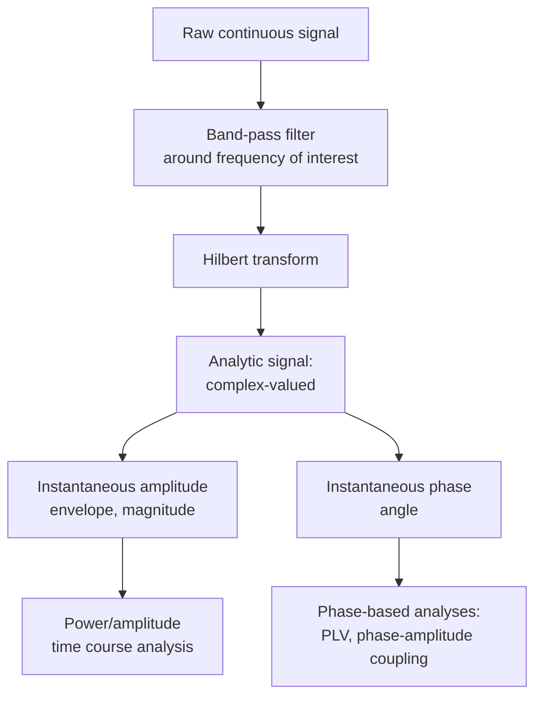

## Signal Processing Fundamentals for Neural Data

### Overview

Signal processing fundamentals underlie nearly every quantitative technique in cognitive neuroscience that involves time-series data—EEG, MEG, local field potentials (LFPs), single-unit spike trains, fMRI BOLD time courses, and fNIRS hemodynamic signals. Neural signals are inherently noisy, non-stationary, multi-scale, and often contaminated by artifacts of non-neural origin. Signal processing provides the mathematical and computational framework for extracting reliable, interpretable information from these raw measurements—filtering noise, characterizing frequency content, aligning signals to events, and reducing dimensionality—before any higher-level statistical or cognitive inference is drawn.

### Sampling and Digitization

**Key Points**

- Continuous neural signals (e.g., voltage fluctuations recorded by an electrode) must be **sampled** at discrete time points to be stored and analyzed digitally, characterized by the **sampling rate** ($f_s$), measured in Hz.
- The **Nyquist theorem** states that a sampled signal can faithfully represent frequency content only up to half the sampling rate (the Nyquist frequency, $f_s/2$); frequency content above this limit is not merely lost but folds back and corrupts lower frequencies, a phenomenon called **aliasing**.

$$f_{Nyquist} = \frac{f_s}{2}$$

- Anti-aliasing hardware filters are applied during acquisition (before digitization) to attenuate frequency content above the Nyquist frequency, preventing aliasing artifacts from entering the digitized signal.
- Typical sampling rates vary substantially by modality: scalp EEG is commonly sampled at 250–1000 Hz (sufficient for standard EEG frequency bands up to ~100 Hz gamma), intracranial recordings (LFP, single-unit) may use much higher rates (e.g., 20–30 kHz) to resolve fast spike waveforms, and fMRI has an inherently slow effective sampling rate (TR, typically 0.5–3 seconds) dictated by hemodynamic and acquisition constraints rather than the underlying neural signal's true bandwidth.

### Time Domain vs. Frequency Domain Representations

**Key Points**

- A signal can be equivalently represented in the **time domain** (amplitude as a function of time) or the **frequency domain** (power/phase as a function of frequency), related by the **Fourier transform**.
- The **Fourier transform** decomposes a signal into a sum of sinusoids of different frequencies, amplitudes, and phases:

$$X(f) = \int_{-\infty}^{\infty} x(t) e^{-i 2\pi f t} \, dt$$

- In practice, neural data analysis uses the **discrete Fourier transform (DFT)**, typically computed efficiently via the **Fast Fourier Transform (FFT)** algorithm, applied to digitized, finite-length signal segments.
- **Power spectral density (PSD)** quantifies how signal power is distributed across frequencies and is commonly estimated using methods such as Welch's method (averaging FFTs of overlapping windowed segments to reduce variance of the spectral estimate) or multitaper methods (using multiple orthogonal tapers, e.g., Slepian/DPSS sequences, to reduce spectral leakage and variance simultaneously).

### Canonical Neural Frequency Bands

| Band | Approximate Range | Common Associations |
| --- | --- | --- |
| Delta | 0.5–4 Hz | Slow-wave sleep, some cognitive/attentional processes |
| Theta | 4–8 Hz | Memory encoding, hippocampal-cortical communication, cognitive control |
| Alpha | 8–13 Hz | Cortical idling/inhibition, attention gating, visual processing |
| Beta | 13–30 Hz | Motor control, sensorimotor cortex, basal ganglia pathological oscillations |
| Gamma | 30–100+ Hz | Local cortical processing, feature binding, feedforward signaling |
| High-frequency/broadband gamma | ~70–200 Hz | Proxy for local multi-unit spiking activity in intracranial recordings |

[Inference: exact band boundaries vary somewhat across labs/publications and are conventions rather than sharply defined physiological cutoffs; treat the table as commonly used reference ranges rather than fixed universal definitions]

### Filtering

**Key Points**

- **Filters** selectively attenuate or pass specific frequency ranges of a signal, essential for isolating frequency bands of interest and removing known noise sources.

| Filter Type | Function | Common Neural Data Use |
| --- | --- | --- |
| Low-pass | Passes frequencies below a cutoff, attenuates above | Removing high-frequency noise/muscle artifact |
| High-pass | Passes frequencies above a cutoff, attenuates below | Removing slow drift (e.g., sweat artifacts, DC offset) |
| Band-pass | Passes a specific frequency range | Isolating a canonical band (e.g., alpha, theta) for oscillatory analysis |
| Notch/band-stop | Attenuates a narrow frequency range | Removing line noise (50/60 Hz electrical interference and harmonics) |

- **Finite impulse response (FIR)** filters have a finite-duration response and can be designed to have exactly linear phase (preserving waveform shape/timing relationships across frequencies), which is often preferred in ERP/time-domain analyses where phase distortion would compromise latency measurements.
- **Infinite impulse response (IIR)** filters (e.g., Butterworth, Chebyshev) achieve sharper frequency roll-off with fewer coefficients but typically introduce nonlinear phase distortion unless applied in a zero-phase configuration (e.g., forward-backward filtering, which cancels phase distortion at the cost of applying the filter's effective magnitude response twice).
- **Filter order and edge artifacts**: higher-order filters achieve sharper cutoffs but can introduce ringing artifacts (Gibbs phenomenon) and edge effects near the start/end of a data segment; padding strategies (e.g., mirror padding) are commonly used to mitigate edge artifacts.
- [Inference] Filter choice and parameters (cutoff frequency, order, filter type) can meaningfully influence downstream results (e.g., apparent oscillatory burst duration, ERP component latency/amplitude), which has motivated increased emphasis on transparent reporting of filter parameters in methods sections in the field.

### Time-Frequency Analysis

**Key Points**

Many neural processes are non-stationary—their frequency content changes over time relative to a task event—requiring methods that preserve joint time and frequency information, unlike a single FFT computed over an entire trial.

- **Short-time Fourier transform (STFT)**: computes the FFT within a sliding window across the signal, producing a spectrogram; involves an inherent time-frequency resolution trade-off governed by the uncertainty principle (a longer window improves frequency resolution but reduces temporal resolution, and vice versa).

$$\Delta t \cdot \Delta f \geq \frac{1}{4\pi}$$

- **Wavelet transform (e.g., Morlet wavelets)**: uses tapered, frequency-scaled basis functions rather than fixed-width windows, allowing adaptive time-frequency resolution—typically better temporal resolution at high frequencies and better frequency resolution at low frequencies—commonly used for analyzing oscillatory power and phase dynamics locked to task events.
- **Hilbert transform**: applied to a narrowband-filtered signal to extract the analytic signal, from which instantaneous amplitude (envelope) and instantaneous phase can be derived; widely used for phase-based analyses (e.g., phase-amplitude coupling, phase-locking value).

### Event-Related Averaging and ERP/ERF Extraction

**Key Points**

- **Event-related potentials (ERPs)** and **event-related fields (ERFs, for MEG)** are extracted by time-locking continuous EEG/MEG data to repeated event onsets (e.g., stimulus presentation) and averaging across trials.
- Averaging across many trials assumes the neural response of interest is time-locked and phase-consistent relative to the event, while background "noise" (ongoing, non-time-locked activity) is assumed to be uncorrelated across trials and therefore cancels out, improving signal-to-noise ratio (SNR) proportional to $\sqrt{N}$ trials (under idealized noise assumptions).
- This averaging logic distinguishes **evoked** activity (phase-locked to the event, revealed by simple time-domain averaging) from **induced** activity (frequency-content changes that are not strictly phase-locked, requiring time-frequency power analysis rather than time-domain averaging to detect, since non-phase-locked oscillatory changes would cancel out under direct averaging).

### Common Neural Data Artifacts and Removal Strategies

| Artifact Source | Signature | Common Correction Approach |

 

| Eye blinks/movements (EOG) | Large, slow deflections, especially frontal channels | Independent component analysis (ICA) to isolate and remove ocular components; regression-based correction using simultaneous EOG recording |

| Muscle activity (EMG) | High-frequency, broadband power increase | High-frequency filtering, ICA, or trial rejection |

| Line noise | Sharp peak at 50/60 Hz and harmonics | Notch filtering, or spectrum interpolation methods |

| Cardiac artifact (ECG) | Rhythmic deflection at heart rate frequency, more prominent in MEG | ICA-based removal, reference ECG channel regression |

| Movement/electrode artifacts | Abrupt, large-amplitude transients | Visual inspection and trial/channel rejection, or amplitude-threshold-based automated rejection |

**Independent Component Analysis (ICA)** deserves particular note as a widely used blind source separation technique: it decomposes multichannel data into statistically independent components based on higher-order statistics (beyond simple decorrelation, unlike PCA), under the assumption that artifact sources (eye movements, muscle activity, heartbeat) are statistically independent from genuine neural sources and from each other—components identified as artifactual (based on characteristic topography, time course, or spectral signature) can then be removed before reconstructing the cleaned signal.

### Dimensionality Reduction Methods

**Key Points**

- **Principal component analysis (PCA)**: identifies orthogonal directions (components) that successively maximize explained variance in the data; useful for data compression, denoising, and visualization, but components are constrained to be uncorrelated (second-order statistics) and are not guaranteed to correspond to physiologically meaningful independent sources.
- **Independent component analysis (ICA)**: as above, separates sources based on statistical independence rather than simple variance maximization, often better suited than PCA for separating physiologically/artifactually distinct sources that may have overlapping variance contributions.
- Both methods are foundational preprocessing steps not only for artifact removal but also for reducing high-dimensional multichannel data (e.g., 64–256 channel EEG) into a smaller set of informative components prior to further analysis or as features for decoding/classification models.

### Signal-to-Noise Ratio (SNR) and Averaging Logic

**Key Points**

- SNR is a central concept governing experimental design decisions (trial counts, filtering choices) in neural signal analysis, generally defined as the ratio of signal power to noise power, often expressed in decibels:

$$SNR_{dB} = 10 \log_{10}\left(\frac{P_{signal}}{P_{noise}}\right)$$

- Because trial averaging improves SNR proportional to $\sqrt{N}$ (assuming independent, zero-mean noise across trials), achieving a given SNR improvement requires quadrupling trial count to double SNR—a key practical consideration in experimental design for ERP and evoked-response studies.
- [Inference] Real neural noise is rarely perfectly independent/stationary across trials in practice (e.g., due to fatigue, habituation, or slow drifts in attentional state), meaning the idealized $\sqrt{N}$ SNR improvement is an approximation rather than an exact guarantee in empirical datasets.

### Worked Example: Extracting Alpha Power Time Course from Raw EEG

**Example**

A researcher wants to quantify how posterior alpha power changes following a visual attention cue, using raw single-channel EEG data sampled at 500 Hz.

1. **Preprocessing**: apply a high-pass filter (e.g., 0.5 Hz) to remove slow drift, and a notch filter at 60 Hz (or 50 Hz, depending on recording region's mains frequency) to remove line noise.
2. **Artifact rejection**: run ICA across all channels, identify and remove components with topography/time-course consistent with eye blinks or muscle artifact.
3. **Band-pass filter**: apply a zero-phase band-pass filter isolating the alpha band (approximately 8–13 Hz) on the cleaned continuous signal.
4. **Hilbert transform**: compute the analytic signal from the alpha-filtered data; take the magnitude of the analytic signal to obtain the instantaneous alpha amplitude envelope.
5. **Epoching and averaging**: segment the continuous amplitude envelope into trials time-locked to the attention cue onset, then average the envelope across trials to obtain a mean alpha power time course, testing for a post-cue power decrease (a well-documented finding associated with engaged visual attention).
6. **Statistical comparison**: compare pre-cue baseline alpha power against post-cue windows using appropriate trial-level or subject-level statistics (e.g., cluster-based permutation testing to address multiple comparisons across the time course, a standard approach in the EEG/MEG literature for controlling family-wise error across many time points).

### Considerations Specific to Different Modalities

**Key Points**

- **EEG/MEG**: high temporal resolution (millisecond-scale) but comparatively low spatial resolution at the scalp level; volume conduction (EEG) and field spread (MEG) mean that scalp-level signals reflect mixed contributions from multiple underlying sources, motivating source localization/inverse modeling as a companion technique to raw sensor-level signal processing.
- **Intracranial LFP/single-unit recordings**: much higher spatial specificity and higher usable frequency range (into high-gamma and beyond), but sampled from a limited, clinically determined set of locations (e.g., in epilepsy monitoring or DBS research contexts) rather than whole-brain coverage.
- **fMRI BOLD signal**: not a direct electrical signal but a slow hemodynamic proxy; standard EEG/MEG-style filtering concepts apply differently, since the relevant "signal processing" concerns include modeling the hemodynamic response function (HRF), motion correction, and physiological noise regression (e.g., cardiac/respiratory-related BOLD fluctuations) rather than oscillatory band-pass filtering in the EEG sense.
- **fNIRS**: subject to distinct artifacts (motion artifacts affecting optode-scalp coupling, systemic physiological signals such as scalp blood flow contaminating the cortical hemodynamic signal of interest), addressed via specific correction approaches (e.g., short-separation channel regression).

### Related Topics

- Source localization and the EEG/MEG inverse problem
- Time-frequency decomposition methods (wavelet analysis, multitaper spectral estimation)
- Independent component analysis for artifact correction
- Cluster-based permutation statistics for multiple comparisons correction
- Phase-amplitude coupling and cross-frequency coupling analysis
- Hemodynamic response function modeling in fMRI
- Local field potential and spike-sorting analysis for intracranial data
- Machine learning-based decoding of neural time-series data
- Connectivity analysis methods (coherence, phase-locking value, Granger causality)
- Preprocessing pipeline standardization and reproducibility in neuroimaging (e.g., BIDS format)