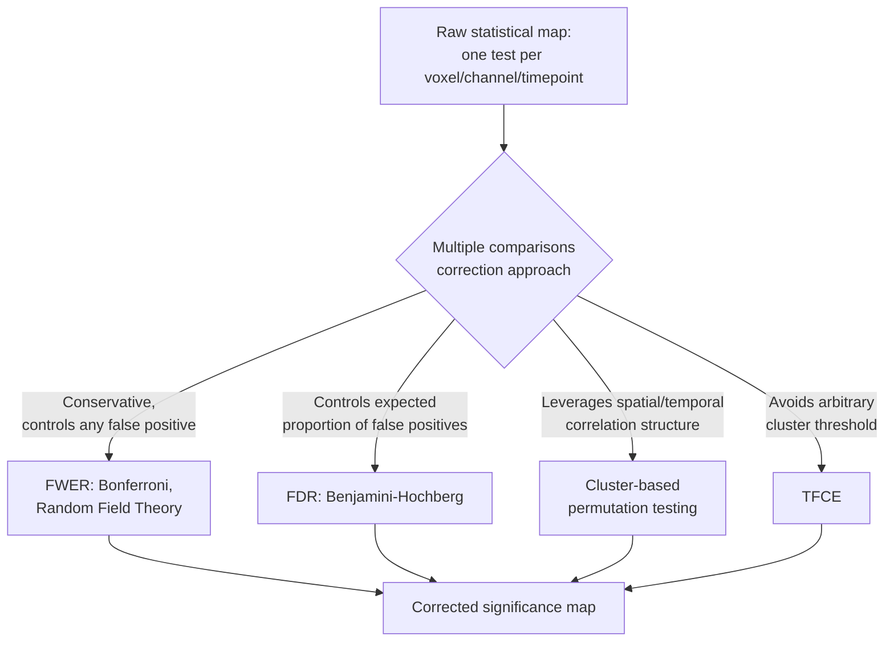

## Statistical Inference in Neuroscience Research

### Overview

Statistical inference in neuroscience provides the formal framework for determining whether observed patterns in neural or behavioral data reflect genuine effects rather than chance variation, and for quantifying uncertainty around effect estimates. Neuroscience data present distinctive statistical challenges relative to many other fields: extremely high dimensionality (tens of thousands of voxels, hundreds of channels/time points), small-to-moderate sample sizes relative to feature counts, complex spatial and temporal autocorrelation structure, and nested/hierarchical data structures (trials within subjects, subjects within groups). These properties have driven the development of neuroscience-specific statistical methodology alongside adoption of general statistical frameworks.

### Foundational Concepts

**Key Points**

- **Null hypothesis significance testing (NHST)**: the dominant traditional framework, in which a null hypothesis (typically "no effect" or "no difference") is tested against observed data, producing a p-value—the probability of observing data at least as extreme as that obtained, assuming the null hypothesis is true.
- **Type I error (false positive)**: incorrectly rejecting a true null hypothesis; the significance threshold ($\alpha$, conventionally 0.05) sets the nominal Type I error rate for a single test.
- **Type II error (false negative)**: failing to reject a false null hypothesis; related to **statistical power**, the probability of correctly detecting a true effect of a given size, which depends on sample size, effect size, variability, and the chosen $\alpha$.
- **Effect size**: a standardized, scale-free measure of the magnitude of an effect (e.g., Cohen's $d$ for mean differences, $\eta^2$ for variance explained), increasingly emphasized as complementary to (or in some frameworks preferred over) p-values, since statistical significance does not by itself indicate practical or biological importance.
- **Confidence intervals**: a range of values consistent with the observed data at a specified confidence level (e.g., 95%); provide information about effect size and precision that a single p-value does not convey.

### The Multiple Comparisons Problem

**Key Points**

- Neuroimaging datasets routinely involve testing thousands to hundreds of thousands of statistical tests simultaneously (one per voxel, channel, time point, or frequency bin), dramatically inflating the family-wise Type I error rate if each test is evaluated at an uncorrected $\alpha = 0.05$.
- **Family-wise error rate (FWER) correction** methods (e.g., Bonferroni correction, which divides $\alpha$ by the number of tests) control the probability of making even one false positive across the entire set of tests, but are often highly conservative given the large number of tests and the spatial/temporal correlation structure typical of neural data (which violates the independence assumption underlying simple Bonferroni correction).
- **False discovery rate (FDR) correction** (e.g., Benjamini-Hochberg procedure) instead controls the expected proportion of false positives among all rejected null hypotheses, offering a less conservative alternative that trades a controlled, non-zero expected false-positive proportion for greater sensitivity.
- **Cluster-based permutation testing**: a widely used approach in EEG/MEG/fMRI analysis that leverages the spatial/temporal correlation structure of neural data directly, by identifying contiguous clusters of suprathreshold statistics (in space, time, and/or frequency) and evaluating cluster-level significance against a null distribution generated by permuting condition labels—addressing multiple comparisons while respecting, rather than ignoring, the correlated structure of the data.
- **Threshold-Free Cluster Enhancement (TFCE)**: an alternative to hard-threshold cluster-based methods that avoids the need to select an arbitrary cluster-forming threshold, instead integrating support across a range of thresholds to produce a continuous enhancement of cluster-like signal.

### Permutation and Non-Parametric Methods

**Key Points**

- **Permutation testing**: constructs an empirical null distribution by repeatedly shuffling condition labels (or otherwise permuting the data under the null hypothesis) and recomputing the test statistic, then comparing the observed statistic to this empirical distribution—advantageous because it does not require strong distributional assumptions (e.g., normality) and naturally accommodates complex test statistics (e.g., cluster mass) for which analytic null distributions are unavailable or intractable.
- **Bootstrap resampling**: repeatedly resamples the observed data (with replacement) to estimate the sampling distribution of a statistic, commonly used for constructing confidence intervals around effect size estimates or complex derived statistics without relying on analytic formulas.
- Both approaches trade increased computational cost for reduced reliance on parametric distributional assumptions, which is particularly valuable given the frequently non-Gaussian and autocorrelated nature of raw neural signal distributions.

### Hierarchical and Mixed-Effects Models

**Key Points**

- Neuroscience data are typically **nested/hierarchical**: multiple trials are collected within each subject, and multiple subjects within a group or study, violating the independence assumption of simple statistical tests if trial-level data are treated as independent observations (pseudoreplication).
- **Linear mixed-effects models (LMMs)** and their generalized extensions (GLMMs) explicitly model this hierarchical structure by including both **fixed effects** (systematic effects of interest, e.g., condition, group) and **random effects** (subject-specific or item-specific variability, e.g., random intercepts/slopes per participant), appropriately partitioning variance across levels of the hierarchy.
- The distinction between **fixed-effects analysis** (treating subjects as a fixed, non-generalizable set, common in early fMRI group analysis) and **random-effects analysis** (treating subjects as a random sample from a population, enabling generalization to the broader population) is a foundational conceptual issue in fMRI group-level statistics, with random-effects (or mixed-effects) approaches now standard in most published fMRI methodology.
- [Inference] The general trend in neuroscience statistical practice has shifted toward hierarchical/mixed-effects modeling as the field has recognized that simpler approaches (e.g., averaging within-subject before conducting a single group-level t-test without modeling within-subject variance appropriately) can misrepresent the true uncertainty in an effect, though practice still varies considerably by subfield and data type.

### General Linear Model (GLM) Framework

**Key Points**

- The **general linear model** is the dominant analytic framework for fMRI and many EEG/MEG analyses, expressing observed data as a weighted linear combination of predictor variables (regressors) plus error:

$$Y = X\beta + \epsilon$$

where $Y$ is the observed data (e.g., BOLD time course at a voxel), $X$ is the design matrix (encoding predicted responses to experimental conditions, often convolved with a hemodynamic response function for fMRI), $\beta$ are estimated parameter weights, and $\epsilon$ is residual error.

- In fMRI, GLMs are fit independently at each voxel (a "mass univariate" approach), producing a statistical parametric map of $\beta$ estimates or associated t/F-statistics across the brain, which then requires multiple comparisons correction as described above.
- **Random Field Theory (RFT)**, an alternative to permutation-based correction, models the spatial smoothness of statistical maps analytically to estimate the expected number of false-positive clusters under the null hypothesis, historically widely used in fMRI software packages (e.g., SPM) as a computationally efficient alternative to permutation testing, though it relies on assumptions (e.g., sufficient spatial smoothness, an assumed random field model) that permutation-based methods avoid.

### Bayesian Approaches

**Key Points**

- **Bayesian inference** treats parameters as random variables with associated probability distributions, combining a **prior distribution** (reflecting existing belief/evidence before the current data) with the **likelihood** of the observed data to produce a **posterior distribution**:

$$P(\theta \mid D) = \frac{P(D \mid \theta) \, P(\theta)}{P(D)}$$

- **Bayes factors** provide a framework for directly comparing evidence for competing hypotheses (including evidence *for* the null hypothesis, which classical NHST cannot formally provide, since a non-significant p-value indicates only failure to reject the null rather than positive evidence for it).
- Bayesian hierarchical models are increasingly used in neuroscience for combining information across subjects, trials, and studies within a unified probabilistic framework, and are particularly well-suited to complex, multi-level neural datasets where explicit modeling of uncertainty at each level is valuable.
- [Inference] Adoption of Bayesian methods in neuroscience has grown substantially but remains less universal than frequentist NHST-based approaches in mainstream published literature as of recent years; the relative merits and appropriate use cases of each framework continue to be actively discussed within methodological subfields of the discipline.

### Cross-Validation and Predictive Modeling Statistics

**Key Points**

- With the rise of **multivariate pattern analysis (MVPA)** and machine-learning-based decoding approaches in neuroimaging, statistical inference increasingly concerns a model's **out-of-sample predictive performance** rather than (or in addition to) traditional hypothesis testing on individual parameters.
- **Cross-validation** (e.g., k-fold, leave-one-subject-out) partitions data into training and held-out test sets to obtain an unbiased estimate of a decoding model's generalization performance (e.g., classification accuracy), which is then typically tested against a chance-level baseline using permutation testing (shuffling labels and re-running the full cross-validated pipeline to build an empirical chance distribution).
- A well-documented methodological pitfall is **double dipping** (circular analysis): using the same data both to select features/regions of interest and to test for an effect within those features, which inflates apparent effect sizes and can produce spurious "significant" results; this has been the subject of influential methodological critiques in the fMRI literature (notably discussions around non-independence error).

### Worked Example: Group-Level fMRI Analysis Pipeline

**Example**

A researcher wants to test whether a brain region shows greater BOLD activation for a memory-encoding condition versus a control condition, across a group of 30 participants.

1. **First-level (subject-level) GLM**: for each participant, fit a GLM to their fMRI time series with regressors for the encoding and control conditions (convolved with the hemodynamic response function), yielding subject-specific contrast maps (encoding minus control) at each voxel.
2. **Second-level (group-level) analysis**: enter the subject-level contrast maps into a random-effects group analysis (e.g., a one-sample t-test against zero at each voxel across subjects), treating subjects as a random sample from the population of interest.
3. **Multiple comparisons correction**: apply cluster-based permutation correction or FDR correction across the whole-brain statistical map to control for the massive number of simultaneous voxel-wise tests.
4. **Effect size reporting**: alongside the corrected significance map, report standardized effect sizes (e.g., Cohen's $d$) for key regions of interest to convey practical magnitude, not just statistical significance.
5. **Pre-registration/ROI justification consideration**: if regions of interest were selected based on a prior independent dataset or anatomical atlas (rather than the current dataset's own activation pattern), this avoids the double-dipping/circularity concern described above.

### Common Statistical Pitfalls in Neuroscience Research

**Key Points**

- **Underpowered studies**: historically, many neuroimaging and neuropsychology studies have used sample sizes insufficient to reliably detect the small-to-moderate effect sizes typical of many cognitive neuroscience effects, contributing to concerns about replicability raised in methodological critiques of the field over the past decade.
- **p-hacking and researcher degrees of freedom**: the flexibility inherent in neuroimaging analysis pipelines (choice of preprocessing steps, statistical thresholds, region-of-interest definitions, multiple comparison correction methods) creates many opportunities, even unintentionally, for analytic choices to be made in ways that favor significant results, motivating pre-registration and analysis pipeline standardization efforts.
- **Non-independence/circular analysis**: as described above, using the same data to both define and test an effect inflates apparent significance.
- **Conflating statistical and practical significance**: a statistically significant effect in a large sample may correspond to a very small, practically negligible effect size, underscoring the importance of reporting effect sizes and confidence intervals alongside p-values.
- **Reverse inference**: inferring the presence of a specific cognitive process from observed activation in a region previously associated with that process in other studies—a logically weak inference (since most brain regions are engaged by multiple cognitive processes) that has been the subject of specific methodological critique in the fMRI literature (notably associated with discussions by Poldrack and colleagues on reverse inference validity).
- [Inference] Broader "replication crisis" discussions across psychology and neuroscience have led to increased emphasis on pre-registration, larger sample sizes (including large-scale multi-site consortium datasets), open data/code sharing, and standardized reporting practices, though the pace and extent of adoption varies across subfields and journals.

### Software and Tooling Landscape

| Tool/Package | Primary Domain | Statistical Approach |
| --- | --- | --- |
| SPM (Statistical Parametric Mapping) | fMRI/PET/EEG | GLM-based, Random Field Theory correction |
| FSL (FMRIB Software Library) | fMRI/diffusion MRI | GLM-based, permutation testing (via Randomise) |
| AFNI | fMRI | GLM-based, various correction approaches |
| FieldTrip | EEG/MEG | Cluster-based permutation testing framework |
| MNE-Python | EEG/MEG | Cluster-based permutation, GLM, multivariate decoding |
| R (lme4, brms, etc.) | General statistics, mixed models, Bayesian modeling | Frequentist and Bayesian hierarchical modeling |
| scikit-learn / nilearn | MVPA/decoding | Cross-validated machine learning pipelines |

[Inference: this list reflects commonly used tools in published neuroscience methodology as of recent years; the tooling landscape continues to evolve, and specific version-dependent features/defaults should be checked against current documentation]

### Related Topics

- General linear model theory and design matrix construction
- Multivariate pattern analysis (MVPA) and neural decoding
- Bayesian hierarchical modeling in cognitive neuroscience
- Pre-registration and open science practices in neuroimaging
- Reverse inference and the logic of forward vs. reverse cognitive inference
- Cluster-based permutation testing implementation details
- Power analysis and sample size estimation for neuroimaging studies
- Machine learning cross-validation pitfalls in neural data
- Meta-analysis methods in neuroscience (e.g., activation likelihood estimation)
- Reproducibility and replication in cognitive neuroscience