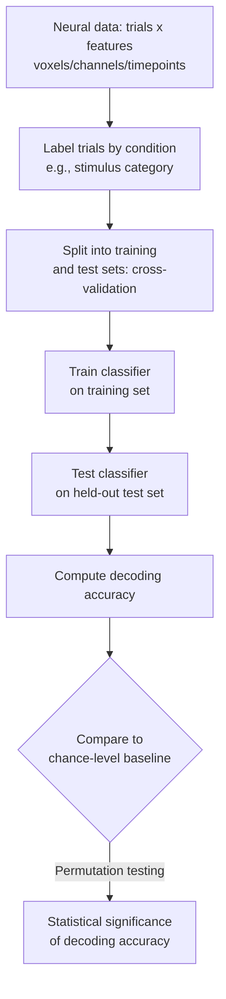
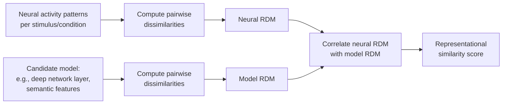

## Machine Learning Approaches in Cognitive Neuroscience

### Overview

Machine learning (ML) has become a central methodological pillar in cognitive neuroscience, offering tools to decode cognitive states from neural data, model brain-behavior relationships with fewer distributional assumptions than classical statistics, and increasingly serve as computational models of neural computation itself. ML approaches broadly fall into two complementary roles in the field: **decoding/prediction** (using neural data to classify or predict cognitive states, stimuli, or behavior) and **encoding/modeling** (using computational models, including deep networks, to predict neural responses and generate mechanistic hypotheses about neural computation).

### Machine Learning vs. Classical Statistical Inference

| Dimension | Classical (Mass Univariate) Statistics | Machine Learning / Multivariate Approaches |
| --- | --- | --- |
| Primary question | Is there a significant difference/effect at each location? | Can a model predict/classify condition or content from patterns of activity? |
| Unit of analysis | Single voxel/channel tested independently | Distributed patterns across many voxels/channels/features jointly |
| Validation | p-values, confidence intervals on parameter estimates | Out-of-sample predictive accuracy via cross-validation |
| Sensitivity to distributed, low-amplitude patterns | Lower (each unit tested in isolation) | Higher (can detect information carried jointly across units even if no single unit is individually significant) |
| Typical output | Statistical parametric map | Classification accuracy, predicted response, model weights/importance |

### Multivariate Pattern Analysis (MVPA) / Neural Decoding

**Key Points**

- **MVPA** treats patterns of activity across multiple voxels, channels, or units as a joint feature vector and asks whether this pattern reliably discriminates between experimental conditions, stimuli, or cognitive states—capitalizing on distributed information that mass-univariate analysis (testing each unit separately) may fail to detect.
- The foundational demonstration in fMRI (Haxby et al., 2001) showed that distributed patterns of ventral temporal cortex activity could discriminate between different visual object categories even when overall regional activation levels were similar across categories, catalyzing widespread adoption of pattern-based analysis in the field.
- **Searchlight analysis**: a spatially localized variant of MVPA in which a small spherical or cubic "searchlight" is moved systematically across the brain volume, with a classifier trained and tested using only the voxels within each searchlight position, producing a whole-brain map of local decoding accuracy—useful when the researcher does not have a strong a priori region-of-interest hypothesis.

### Common Classifiers and Models Used in Decoding

| Model | Type | Common Use Case |
| --- | --- | --- |
| Support vector machine (SVM), especially linear kernel | Discriminative, margin-based | Standard choice for fMRI/EEG decoding due to good performance with high-dimensional, relatively small-sample data |
| Logistic regression (often with L1/L2 regularization) | Discriminative, probabilistic | Interpretable weights, regularization handles high dimensionality |
| Linear discriminant analysis (LDA) | Generative | Common for EEG/MEG single-trial classification, computationally efficient |
| Random forest / gradient boosting | Ensemble, non-linear | Used when non-linear feature interactions are suspected, feature importance estimation |
| Deep neural networks (CNNs, RNNs, transformers) | Non-linear, hierarchical | Increasingly used for large-scale/high-dimensional decoding (e.g., BCI applications, naturalistic stimulus decoding) |

[Inference: linear classifiers remain a common default choice in much of the fMRI/EEG decoding literature partly due to interpretability and robustness with limited trial counts relative to feature dimensionality, though deep learning approaches have grown substantially, particularly for large datasets such as those in brain-computer interface research and large naturalistic neuroimaging datasets]

### Representational Similarity Analysis (RSA)

**Key Points**

- **RSA** provides a complementary multivariate framework to decoding, comparing the **representational geometry** of neural activity patterns (how similar/dissimilar patterns are to one another across conditions) against representational geometries predicted by behavioral models, computational models, or other brain regions/modalities.
- Core steps: construct a **representational dissimilarity matrix (RDM)** for the neural data (pairwise dissimilarity, e.g., 1 minus correlation, between activity patterns for each pair of conditions/stimuli), construct analogous RDMs from candidate models (e.g., pixel-level image similarity, semantic category similarity, deep network layer activations), then compare neural and model RDMs (e.g., via Spearman correlation) to assess which model best explains the neural representational structure.
- RSA is particularly valued because it enables comparison **across modalities and species** (e.g., comparing human fMRI RDMs to monkey electrophysiology RDMs, or to deep neural network layer RDMs) without requiring the underlying measurements to share a common feature space, since only the relative similarity structure is compared.

### Deep Learning as a Computational Model of Neural Processing

**Key Points**

- Beyond decoding, deep neural networks—particularly convolutional neural networks (CNNs) trained on large-scale visual object recognition—have been used as **encoding models**, predicting neural responses (e.g., single-unit firing rates in macaque inferotemporal cortex, human fMRI ventral stream responses) from intermediate layer activations of the trained network.
- Findings that hierarchical CNN layers show a systematic correspondence with the hierarchical organization of the primate ventral visual stream (early layers best predicting early visual areas, deeper layers best predicting higher-level areas such as inferotemporal cortex) have been influential in framing deep learning models as candidate computational hypotheses for biological visual processing, notably in work associated with DiCarlo, Yamins, and colleagues.
- This encoding-model approach has extended to other domains, including language processing (comparing transformer-based language model representations to human language-network fMRI/ECoG responses) and auditory processing.
- [Inference] The interpretation of strong encoding-model correspondence remains actively debated: high predictive correspondence between an artificial network and neural responses does not by itself establish that the biological system uses the same computational mechanism, only that the two systems produce similarly structured representations under the tested conditions—a distinction the field continues to grapple with methodologically and theoretically.

### Encoding Models vs. Decoding Models

| Aspect | Encoding Model | Decoding Model |
| --- | --- | --- |
| Direction of prediction | Stimulus/task features → predicted neural response | Neural response → predicted stimulus/task/cognitive state |
| Typical goal | Test whether a computational model explains neural response variance | Test whether neural data contains decodable information about a variable |
| Example | Predict voxel-wise BOLD response from CNN layer activations to viewed images | Classify which of several images was viewed from voxel activity pattern |
| Interpretability of "reverse" claims | Can support mechanistic hypotheses about representational content | Successful decoding does not imply the represented information is used behaviorally by the brain in that format |

### Feature Selection and Dimensionality Considerations

**Key Points**

- Neural datasets are frequently high-dimensional relative to the number of available trials/subjects (the "curse of dimensionality"), making regularization and dimensionality reduction important for building generalizable models rather than overfitting to noise.
- **Regularization techniques** (L1/Lasso, L2/Ridge, elastic net) penalize model complexity during training, improving generalization to held-out data.
- **Dimensionality reduction** (PCA, and increasingly non-linear methods such as t-SNE or UMAP for visualization, though these are generally not appropriate as direct classifier inputs without care) is often applied prior to classification to reduce noise and computational burden, though this must be done carefully within cross-validation folds (fitting dimensionality reduction only on training data) to avoid data leakage/circularity.
- **Nested cross-validation** is recommended when hyperparameter tuning (e.g., regularization strength) is involved, using an inner loop for hyperparameter selection and an outer loop for unbiased performance estimation, to avoid optimistic bias from tuning on the same data used for final performance evaluation.

### Common Methodological Pitfalls

**Key Points**

- **Data leakage/double dipping**: performing preprocessing steps (e.g., feature selection, normalization parameters) using the full dataset before splitting into training/test sets inflates apparent decoding accuracy; all such steps must be fit exclusively within the training fold and applied to test data without modification.
- **Temporal/spatial autocorrelation leakage**: in time-series data (e.g., fMRI, EEG), adjacent time points/trials are often correlated; naive random train/test splitting can place highly correlated samples in both training and test sets, inflating apparent accuracy—motivating leave-one-run-out or leave-one-subject-out cross-validation schemes that respect the data's dependency structure.
- **Chance-level baseline miscalculation**: with imbalanced class sizes, naive chance level (e.g., 50% for two classes) may not reflect true chance performance; permutation testing (repeatedly shuffling labels and re-running the full pipeline) provides an empirically grounded null distribution.
- **Overinterpreting above-chance decoding as evidence of a specific representational format**: successful decoding demonstrates that information is present and linearly (or otherwise) separable in the measured signal, but does not by itself specify how that information is represented or used by the brain.
- **Generalization across subjects**: models trained and tested within a single subject may not generalize well across subjects due to individual anatomical/functional variability, an important consideration for both scientific generalizability claims and translational brain-computer interface applications.

### Worked Example: Category Decoding from fMRI Patterns

**Example**

A researcher wants to test whether early visual cortex patterns can discriminate between faces and houses viewed by participants.

1. **Data preparation**: extract single-trial (or averaged mini-block) BOLD response patterns from a predefined region of interest (e.g., early visual cortex, defined independently via a retinotopic mapping localizer to avoid circularity) for each face and house trial.
2. **Cross-validation scheme**: use leave-one-run-out cross-validation, training a linear SVM on all runs except one and testing on the held-out run, repeating across all runs.
3. **Performance metric**: compute mean classification accuracy across cross-validation folds.
4. **Statistical testing**: generate a null distribution by repeating the entire cross-validated pipeline with shuffled labels many times (permutation testing), and compare the true decoding accuracy against this empirical null distribution rather than an assumed theoretical chance level.
5. **Interpretation**: above-chance decoding accuracy indicates that early visual cortex activity patterns carry information distinguishing faces from houses; complementary RSA analysis could further characterize whether this distinction aligns more closely with low-level visual feature differences or higher-level categorical structure, addressing a common ambiguity in interpreting simple decoding results from early sensory regions.

### Applications in Brain-Computer Interfaces (BCI)

**Key Points**

- ML decoding methods underlie most modern BCI systems, which translate decoded neural signals (EEG, ECoG, intracortical microelectrode arrays) into control signals for external devices (e.g., communication systems, robotic prosthetics).
- Real-time decoding imposes distinct constraints relative to offline research decoding: computational efficiency, low latency, and robustness to non-stationarity in neural signals over time (requiring online recalibration or adaptive decoding algorithms) become primary engineering concerns alongside raw accuracy.
- [Inference] Recent BCI research has increasingly incorporated deep learning architectures (e.g., recurrent networks, transformers) for decoding complex signals such as attempted speech or handwriting from intracortical recordings, reflecting a broader trend of deep learning adoption in translational neurotechnology, though clinical deployment considerations (reliability, regulatory approval, long-term stability) remain distinct from research-stage performance benchmarks.

### Related Topics

- Representational similarity analysis and cross-species/cross-modal comparison
- Convolutional neural networks as models of the ventral visual stream
- Searchlight analysis methodology and implementation
- Cross-validation design for non-independent/autocorrelated neural data
- Brain-computer interface decoding architectures
- Natural language processing models compared to human language-network responses
- Regularization methods for high-dimensional neural data
- Encoding model frameworks (voxel-wise modeling, receptive field estimation)
- Transfer learning and cross-subject generalization in neural decoding
- Explainability/interpretability methods for deep learning models of brain data