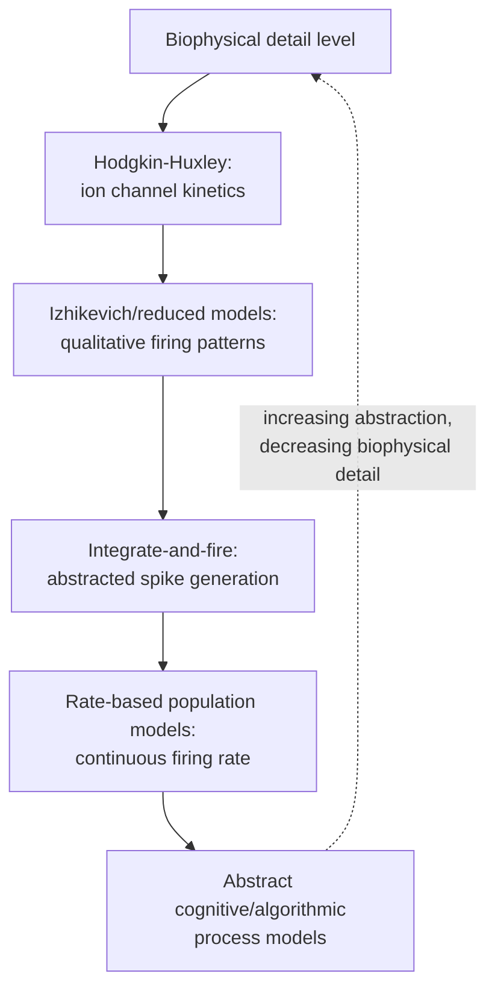

## Computational Modeling of Neural Systems

### Overview

Computational modeling of neural systems is the practice of formalizing hypotheses about neural structure, dynamics, and function as mathematical or algorithmic models, spanning multiple levels of abstraction from single-ion-channel biophysics to whole-brain network dynamics to abstract cognitive process models. Unlike purely descriptive/statistical analysis of neural data, computational models aim to specify a generative mechanism capable of producing observed neural or behavioral phenomena, enabling researchers to test whether a proposed mechanism is sufficient to reproduce data, generate novel testable predictions, and formalize otherwise verbally-stated theories with quantitative precision.

### Levels of Modeling Abstraction (Marr's Framework)

**Key Points**

David Marr's (1982) tri-level framework remains a widely used organizing scheme for classifying computational approaches in neuroscience:

| Level | Question Addressed | Example |
| --- | --- | --- |
| Computational | What problem is being solved, and why? | The brain must infer causes of sensory input under uncertainty |
| Algorithmic/Representational | What representations and processes/algorithm solve the problem? | Bayesian inference over generative models; specific update rules |
| Implementational | How is the algorithm physically realized in neural hardware? | Specific circuit architecture, biophysical mechanisms, synaptic dynamics |

[Inference: while influential as an organizing heuristic, the strict separability of these levels is debated—some phenomena (e.g., certain biophysical constraints) plausibly influence which algorithms are computationally efficient to implement, blurring a clean implementational/algorithmic boundary]

### Biophysical/Mechanistic Models

#### Single-Neuron Models

**Key Points**

- **Hodgkin-Huxley model**: the foundational biophysical model of action potential generation, describing membrane voltage dynamics via coupled differential equations governing voltage-gated sodium and potassium channel conductances, derived from voltage-clamp experiments on the squid giant axon (Hodgkin & Huxley, 1952).

$$C_m \frac{dV}{dt} = -\bar{g}_{Na} m^3 h (V - E_{Na}) - \bar{g}_K n^4 (V - E_K) - g_L (V - E_L) + I_{ext}$$

- **Integrate-and-fire models**: simplified alternatives that abstract away detailed channel kinetics, modeling the membrane potential as a leaky integrator that fires a spike and resets upon reaching threshold—computationally efficient and widely used in large-scale network simulations where full biophysical detail per neuron would be computationally prohibitive.

$$\tau_m \frac{dV}{dt} = -(V - V_{rest}) + R I_{ext}$$

- **Izhikevich model**: a reduced two-variable model designed to reproduce a wide range of qualitative neuronal firing patterns (regular spiking, bursting, chattering) observed across neuron types, while remaining computationally cheaper than full Hodgkin-Huxley-style models—offering a middle ground between biophysical detail and computational tractability.

#### Network/Circuit Models

**Key Points**

- **Rate-based models**: represent neural activity as a continuous firing rate rather than discrete spikes, often used for modeling population-level dynamics (e.g., Wilson-Cowan equations for coupled excitatory-inhibitory population dynamics), trading spike-timing detail for analytical/computational tractability at the population level.
- **Spiking neural network models**: simulate networks of individual spiking units (using integrate-and-fire, Izhikevich, or Hodgkin-Huxley-style neurons) connected via synapses, capturing spike-timing-dependent phenomena (e.g., synchronization, oscillations, spike-timing-dependent plasticity) unavailable in rate-based approximations.
- **Attractor network models**: recurrent network architectures in which stable patterns of activity ("attractor states") emerge from the network's connectivity, used to model phenomena such as working memory maintenance (persistent activity attractors), decision-making (competing accumulator/attractor dynamics), and associative memory (Hopfield networks as a classic example).

### Neural Mass and Whole-Brain Models

**Key Points**

- **Neural mass models** represent the average activity of large populations of neurons (rather than individual units) using a small number of coupled differential equations, commonly used to model EEG/MEG-scale signals and interactions between brain regions (e.g., the Jansen-Rit model for generating realistic EEG-like oscillatory dynamics from interacting excitatory/inhibitory populations).
- **Dynamic causal modeling (DCM)**: a widely used framework (particularly with fMRI and EEG/MEG data) that fits neural mass/mean-field models to observed neuroimaging data, estimating effective connectivity (directed, model-based influence between regions) and comparing competing model architectures via Bayesian model comparison, distinguishing it from purely descriptive functional connectivity measures.
- **Whole-brain network models**: combine neural mass models at each network node (typically corresponding to a parcellated brain region) with empirically derived structural connectivity (e.g., from diffusion MRI tractography) to simulate large-scale brain dynamics and compare simulated to empirical functional connectivity patterns, used to study how structural connectivity constrains functional dynamics.

### Normative/Computational-Level Models

**Key Points**

- **Bayesian brain / predictive processing frameworks**: model perception, learning, and action as approximate Bayesian inference, in which the brain maintains (implicit or explicit) probabilistic beliefs about the world and updates them based on incoming sensory evidence weighted by its precision (reliability); this framework has been influential in modeling perception, motor control, and has been extended to psychiatric symptom models (e.g., predictive processing accounts of certain psychiatric conditions).
- **Reinforcement learning (RL) models**: formalize learning from reward/punishment feedback via frameworks such as temporal-difference (TD) learning, providing quantitative models that have been closely linked to dopaminergic reward prediction error signaling (associated with foundational work by Schultz, Dayan, Montague, and colleagues connecting TD-error computations to midbrain dopamine neuron firing patterns).
- **Drift-diffusion and evidence accumulation models**: model decision-making as a noisy accumulation of evidence toward a decision threshold over time, providing quantitative fits to both choice accuracy and reaction time distributions simultaneously, and offering a bridge between abstract cognitive models and neural implementation (accumulator-like firing patterns have been observed in relevant brain regions during decision tasks).

$$dx = v \, dt + \sigma \, dW$$

where $x$ is accumulated evidence, $v$ is the drift rate (evidence strength), $\sigma$ scales the noise term, and $dW$ represents a Wiener process (Gaussian noise increment).

### Model Fitting and Parameter Estimation

**Key Points**

- **Maximum likelihood estimation (MLE)**: finds model parameters that maximize the likelihood of the observed data given the model, a standard approach for fitting cognitive models (e.g., drift-diffusion model parameters) to behavioral data.
- **Bayesian parameter estimation**: treats model parameters as random variables with prior distributions, updated to posterior distributions given observed data (often via Markov Chain Monte Carlo, MCMC, sampling methods, or variational approximations), providing full posterior uncertainty rather than point estimates alone.
- **Hierarchical Bayesian modeling**: fits cognitive/computational model parameters jointly across multiple subjects, allowing individual-level parameter estimates to be informed by group-level regularities (partial pooling), often improving parameter recovery reliability relative to fitting each subject entirely independently, particularly with limited per-subject data.
- **Model comparison**: formal comparison of competing models' fit to data, accounting for model complexity, using criteria such as the Akaike Information Criterion (AIC), Bayesian Information Criterion (BIC), or (in Bayesian frameworks) Bayes factors and cross-validated predictive likelihood—essential because a more complex model will generally fit training data better by virtue of flexibility alone, requiring explicit penalization for complexity to avoid favoring overfit models.

### Model Validation Practices

**Key Points**

- **Parameter recovery**: simulating synthetic data from the model with known parameter values, then fitting the model to this synthetic data to verify that the fitting procedure can accurately recover the true underlying parameters—a critical sanity check before applying a model to real data, since poor parameter recovery undermines confidence in parameter estimates and their interpretation.
- **Model recovery**: simulating data from each of several candidate models and verifying that model comparison procedures correctly identify the true generating model when fit with the full candidate set, checking for systematic misclassification biases between models.
- **Posterior predictive checks**: simulating data from the fitted model's posterior parameter distributions and comparing simulated data patterns against actual observed data, assessing whether the fitted model can reproduce key qualitative and quantitative features of the empirical dataset.
- [Inference] These validation steps, while methodologically well-established as best practice, are not uniformly reported across all published computational modeling studies in cognitive neuroscience; the rigor of validation reporting varies by subfield and journal, and readers/reviewers increasingly expect them as standard practice in strong methodological work.

### Worked Example: Fitting a Drift-Diffusion Model to Choice/RT Data

**Example**

A researcher has behavioral data (choice accuracy and reaction time) from a perceptual decision-making task and wants to characterize whether a manipulation (e.g., attentional cueing) affects the rate of evidence accumulation versus the decision threshold.

1. **Model specification**: define a drift-diffusion model with parameters for drift rate ($v$), boundary separation ($a$), starting point bias ($z$), and non-decision time ($t_0$).
2. **Parameter recovery check**: simulate synthetic choice/RT data across a range of plausible parameter values, fit the model to each synthetic dataset, and confirm that recovered parameters correlate well with the true generating values before proceeding to real data.
3. **Fitting to empirical data**: fit the model separately to each experimental condition (e.g., cued vs. uncued) using hierarchical Bayesian estimation across subjects, obtaining posterior distributions for each parameter in each condition.
4. **Hypothesis testing via parameter comparison**: compare posterior distributions of drift rate and boundary separation between conditions; a selective increase in drift rate under cueing (with threshold relatively unchanged) would support an attention-as-evidence-quality account, whereas a selective change in boundary separation would support an attention-as-caution/strategy account.
5. **Posterior predictive check**: simulate choice/RT data from the fitted condition-specific posteriors and confirm the simulated reaction time distributions and accuracy levels qualitatively match the empirically observed distributions, ensuring the model captures the relevant features of the data rather than merely fitting a subset of summary statistics.

### Relationship to Machine Learning and Deep Learning Approaches

**Key Points**

- Computational modeling in the classical sense (mechanistic/normative models with interpretable parameters tied to specific hypotheses) is conceptually distinct from, but increasingly intersects with, machine learning approaches (see prior chapter item), particularly where deep neural networks are used as computational-level models of neural representation (e.g., CNN models of visual cortex).
- A key distinction often drawn in the field: traditional computational models are typically designed with interpretable parameters directly tied to a hypothesized mechanism (e.g., drift rate as evidence accumulation speed), whereas deep learning models often prioritize predictive accuracy with less inherent parameter interpretability, motivating a growing subfield of interpretability/explainability methods applied to deep network models of neural data. [Inference: this distinction is increasingly treated as a spectrum rather than a strict dichotomy, as hybrid approaches (e.g., normatively-constrained or mechanistically-inspired deep learning architectures) have become an active area of methodological development]

### Related Topics

- Hodgkin-Huxley and reduced single-neuron biophysical models
- Reinforcement learning models and dopaminergic reward prediction error
- Drift-diffusion and sequential sampling models of decision-making
- Dynamic causal modeling and effective connectivity estimation
- Bayesian brain and predictive processing frameworks
- Hierarchical Bayesian parameter estimation methods
- Whole-brain network modeling using structural connectivity
- Attractor network models of working memory and decision-making
- Deep neural networks as encoding models of neural representation
- Model comparison criteria (AIC, BIC, Bayes factors) and parameter/model recovery