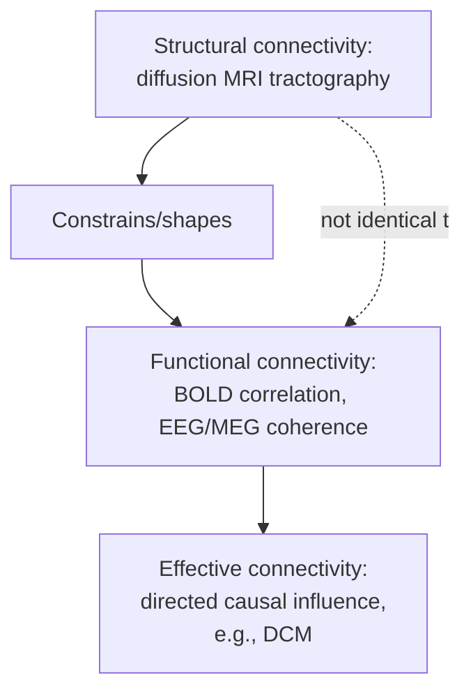
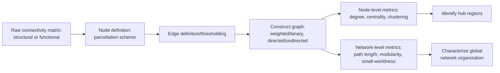

## Connectomics and Graph Theory Network Analysis

### Overview

Connectomics is the study of comprehensive maps of neural connections—the "connectome"—at scales ranging from complete synaptic wiring diagrams of small organisms to macroscale structural and functional connectivity in the human brain. Graph theory provides the mathematical formalism for representing these connectivity maps as networks (graphs) of nodes and edges, enabling quantitative characterization of network topology (organization) using metrics developed originally in mathematics, sociology, and network science, then adapted to neuroscience. Together, connectomics and graph theory reframe brain organization as fundamentally relational: cognitive function is understood not solely in terms of what individual regions do, but how they are organized and interact as an integrated network system.

### Scales of Connectomics

| Scale | Description | Example Methods/Datasets |
| --- | --- | --- |
| Microscale | Synapse-level connectivity between individual neurons | Serial-section electron microscopy (e.g., complete *C. elegans* connectome; *Drosophila* hemibrain/FlyWire connectome) |
| Mesoscale | Connectivity between neuronal populations/local circuits | Viral tracing studies (e.g., Allen Mouse Brain Connectivity Atlas) |
| Macroscale | Connectivity between brain regions/large-scale networks | Diffusion MRI tractography (structural), resting-state/task fMRI (functional), in living human subjects |

[Inference: complete microscale connectomes remain feasible primarily in small model organisms and specific circuits given current electron microscopy throughput constraints; whole human-brain microscale connectomics remains a substantial technical challenge beyond current routine capability, though partial human cortical microconnectome reconstructions from tissue samples have been published]

### Structural vs. Functional Connectivity

**Key Points**

- **Structural connectivity**: physical anatomical connections between regions, in humans typically estimated non-invasively via **diffusion-weighted MRI tractography**, which infers white matter fiber pathways from the directional diffusion pattern of water molecules (diffusion is less restricted along fiber tracts than across them).
- **Functional connectivity**: statistical dependency (commonly temporal correlation) between activity time courses of different brain regions, typically derived from resting-state or task fMRI BOLD signals, or from EEG/MEG signal relationships (e.g., coherence, phase-locking).
- **Effective connectivity**: directed, model-based estimates of causal influence between regions (see dynamic causal modeling, covered under computational modeling), distinguishing it from purely correlational functional connectivity.
- Structural and functional connectivity are related but distinct: functional connectivity can exist between regions without direct structural connection (mediated via indirect polysynaptic pathways), and the relationship between structural and functional connectivity strength is statistically significant but imperfect across the brain, motivating combined structural-functional modeling approaches (see whole-brain network models in computational modeling).

### Graph Theory Fundamentals

**Key Points**

- A **graph** $G = (V, E)$ consists of a set of **nodes/vertices** $V$ (representing brain regions or, at finer scales, individual neurons) and **edges** $E$ (representing connections between nodes, weighted by connection strength/probability where applicable).
- Graphs can be **binary** (edge present or absent, often via thresholding a continuous connectivity measure) or **weighted** (edges carry continuous values reflecting connection strength).
- Graphs can be **directed** (edges have direction, e.g., effective connectivity, mesoscale tracer connectivity) or **undirected** (edges are symmetric, e.g., typical functional connectivity from correlation).
- The choice of **node definition** (parcellation scheme: anatomical atlas, functional parcellation, individually-defined regions) and **edge definition/thresholding** substantially influences resulting network metrics, representing an important methodological choice point requiring justification and, ideally, sensitivity analysis across alternative choices.

### Node-Level (Local) Graph Metrics

| Metric | Definition | Interpretation |
| --- | --- | --- |
| Degree | Number of edges connected to a node (weighted: sum of edge weights) | Overall connectivity of a region |
| Clustering coefficient | Proportion of a node's neighbors that are also connected to each other | Local interconnectedness/segregation around a node |
| Betweenness centrality | Proportion of shortest paths between all node pairs that pass through a given node | Importance of a node as an information-flow bottleneck/bridge |
| Eigenvector centrality | A node's importance weighted by the importance of its neighbors | Influence within the broader network structure, not just local connections |
| Participation coefficient | Diversity of a node's connections across different network modules | Whether a node is a "connector hub" linking multiple modules or confined to one module |

### Network-Level (Global) Graph Metrics

**Key Points**

- **Characteristic path length**: the average shortest path length between all pairs of nodes in the network, reflecting overall network integration/efficiency of information transfer.
- **Global efficiency**: the average inverse shortest path length across all node pairs, a related measure of network integration robust to network fragmentation (disconnected components).
- **Modularity**: the degree to which a network can be partitioned into densely intra-connected but sparsely inter-connected sub-groups (modules/communities); high modularity reflects functional segregation, and community detection algorithms (e.g., Louvain method) are commonly used to identify these modules from empirical connectivity data.
- **Small-worldness**: a network property combining high local clustering (like regular/lattice networks) with short characteristic path length (like random networks), widely reported as a characteristic organizational property of both structural and functional human brain networks, theorized to balance efficient local processing (segregation) with efficient global integration.

$$\sigma = \frac{C/C_{random}}{L/L_{random}}$$

where $C$ is clustering coefficient, $L$ is characteristic path length, and the random subscript denotes values from comparable random networks; $\sigma > 1$ is conventionally interpreted as evidence of small-world organization, though methodological critiques regarding appropriate null model construction have been raised in subsequent literature.

- **Rich club organization**: the tendency for high-degree "hub" nodes to be more densely interconnected with each other than would be expected by chance, suggesting a privileged high-capacity backbone for global integration among a subset of highly connected regions.

### Hub Regions and the Rich Club

**Key Points**

- **Hub regions**: nodes with disproportionately high connectivity (degree), high centrality, and often high participation coefficient, hypothesized to play a privileged role in global information integration across functionally segregated modules.
- Convergent evidence across structural and functional connectivity studies has consistently implicated regions such as posterior cingulate/precuneus, medial/lateral prefrontal cortex, and superior parietal cortex as candidate hub regions in the human brain, often overlapping substantially with regions of the default mode network.
- [Inference] Hub regions have been hypothesized to be particularly vulnerable to disruption in certain neurological and psychiatric conditions (a "hub vulnerability" hypothesis, discussed prominently in work associated with researchers such as Ed Bullmore and colleagues), given their high connectivity and metabolic demand, though the precise causal relationship between hub status and disease vulnerability remains an active area of investigation rather than a fully established mechanism.

### Community Detection and Modular Organization

**Key Points**

- **Community detection algorithms** (e.g., Louvain method, Newman's modularity optimization, spectral methods) partition a network into modules that maximize within-module connectivity relative to between-module connectivity, without requiring pre-specified module assignments.
- Applied to human resting-state functional connectivity, community detection has recovered network organization broadly consistent with previously identified large-scale functional networks derived independently via other methods (e.g., independent component analysis)—including default mode, frontoparietal control, dorsal/ventral attention, sensorimotor, and visual networks—providing convergent validation across methodologically distinct analytic approaches.
- Module structure is not perfectly fixed: **dynamic/temporal network analysis** examines how modular organization and inter-regional connectivity change over time (e.g., across a scanning session or across task states), motivating time-varying/dynamic functional connectivity analysis as an extension of traditional static connectivity approaches.

### Common Large-Scale Functional Networks

| Network | Core Regions (approximate) | Associated Function(s) |
| --- | --- | --- |
| Default mode network (DMN) | Posterior cingulate/precuneus, medial prefrontal cortex, angular gyrus | Self-referential thought, mind-wandering, autobiographical memory |
| Frontoparietal control network | Dorsolateral prefrontal cortex, posterior parietal cortex | Cognitive control, task-switching, working memory |
| Dorsal attention network | Intraparietal sulcus, frontal eye fields | Top-down/goal-directed spatial attention |
| Ventral attention network | Temporoparietal junction, ventral frontal cortex | Bottom-up/stimulus-driven attention reorienting |
| Salience network | Anterior insula, dorsal anterior cingulate cortex | Detecting behaviorally relevant/salient stimuli, network switching |
| Sensorimotor network | Precentral/postcentral gyrus | Primary motor/somatosensory processing |
| Visual network | Occipital cortex | Primary and higher-order visual processing |

### Worked Example: Testing for Altered Network Integration in a Clinical Group

**Example**

A researcher wants to test whether a clinical population shows reduced global network integration relative to healthy controls, using resting-state fMRI.

1. **Preprocessing and parcellation**: preprocess resting-state fMRI data (motion correction, nuisance regression, spatial normalization), then parcellate the brain into a standard set of regions (e.g., a published functional or anatomical atlas) to define graph nodes.
2. **Connectivity matrix construction**: compute pairwise correlation (e.g., Pearson correlation of regional time courses) between all node pairs, producing a weighted connectivity matrix per subject.
3. **Thresholding/graph construction**: apply a consistent thresholding approach (e.g., proportional thresholding to retain a fixed network density across subjects, addressing the confound that raw connectivity strength can differ systematically between groups for reasons unrelated to topology) to construct a graph per subject.
4. **Metric computation**: compute global efficiency and modularity for each subject's graph.
5. **Group comparison**: statistically compare global efficiency and modularity between patient and control groups (with appropriate multiple comparisons correction if computing many nodal-level metrics in addition to global metrics), controlling for confounds such as head motion (a well-documented source of spurious functional connectivity differences requiring careful control in group comparisons).
6. **Interpretation caveat**: given known sensitivity of graph metrics to preprocessing choices, parcellation scheme, and thresholding approach, ideally report sensitivity analyses across multiple reasonable analytic choices to demonstrate the robustness of any reported group difference. [Inference: this sensitivity to analytic pipeline choices has been highlighted as a methodological concern in the graph-theoretic connectomics literature, motivating calls for standardized preprocessing and multi-pipeline robustness reporting]

### Methodological Considerations and Limitations

**Key Points**

- **Parcellation dependence**: graph metrics can vary substantially depending on the chosen brain parcellation (number and boundaries of regions), complicating direct comparison of results across studies using different atlases.
- **Thresholding choices**: converting weighted connectivity matrices to binary graphs (or choosing a specific network density for weighted analysis) involves an inherently somewhat arbitrary threshold choice that can influence resulting topology metrics; density-matched comparisons across groups/subjects are a common mitigation strategy.
- **Head motion confounds**: even small amounts of head motion during fMRI acquisition introduce spurious short-range connectivity changes that can systematically bias graph metrics if not adequately corrected via motion regression/scrubbing procedures, a well-documented concern particularly relevant when comparing groups (e.g., patient populations) that may differ systematically in motion levels.
- **Diffusion tractography limitations**: tractography algorithms are known to have systematic biases (e.g., difficulty accurately resolving crossing fiber populations, length-dependent biases in tract reconstruction), meaning structural connectomes derived from diffusion MRI should be interpreted with awareness of these technical limitations rather than treated as a perfect ground-truth wiring diagram.
- [Inference] The field has increasingly emphasized reporting robustness of graph-theoretic findings across multiple analytic pipeline choices, given documented sensitivity of specific metric values to methodological decisions, though the extent of such robustness reporting still varies across the published literature.

### Related Topics

- Diffusion MRI tractography methods and fiber-crossing resolution
- Resting-state fMRI preprocessing and denoising (motion correction, nuisance regression)
- Dynamic/time-varying functional connectivity analysis
- Default mode network and other canonical resting-state networks
- Community detection algorithms (Louvain method, modularity optimization)
- Hub vulnerability hypotheses in neurological/psychiatric disorders
- Microscale connectomics (electron microscopy-based circuit reconstruction)
- Dynamic causal modeling and effective connectivity
- Graph null models and statistical benchmarking of network metrics
- Multi-species/cross-scale comparative connectomics