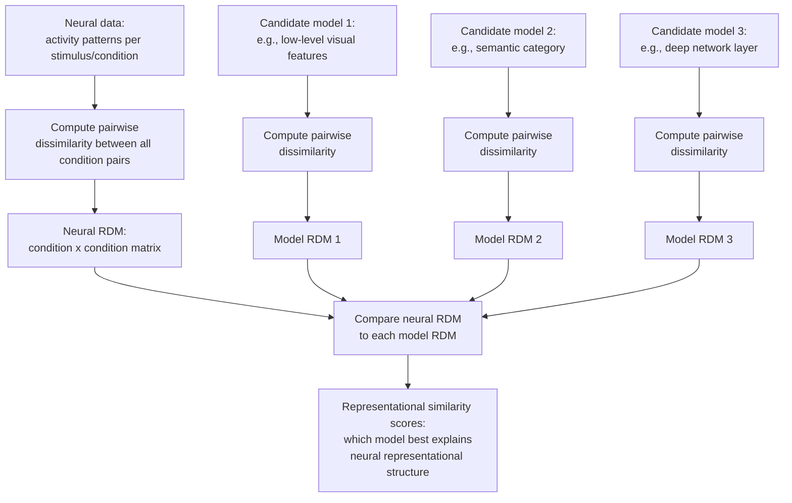
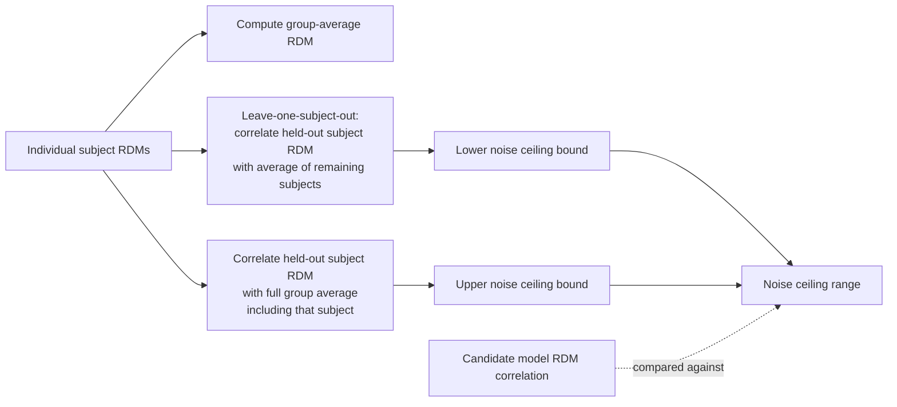

## Representational Similarity Analysis

### Overview

Representational similarity analysis (RSA) is a multivariate analysis framework that characterizes the informational content of neural activity patterns by examining their **representational geometry**—the pattern of pairwise similarities/dissimilarities among neural responses to different stimuli or conditions—rather than analyzing individual voxels, channels, or absolute activation levels. RSA's central methodological innovation is that it enables direct, quantitative comparison of representational structure across radically different measurement modalities (fMRI, EEG/MEG, single-unit electrophysiology) and across biological and artificial systems (human brains, animal brains, computational models), because the comparison operates on a common currency—similarity structure—rather than requiring the underlying feature spaces themselves to be commensurable.

### Origins and Motivation

**Key Points**

- RSA was formalized and popularized primarily through work by Kriegeskorte, Mur, and Bandettini (2008), building on earlier multivariate pattern analysis (MVPA) developments, but framing the core analytic object as a **representational dissimilarity matrix (RDM)** rather than a classifier decision boundary.
- The motivating problem: standard decoding/classification approaches (see MVPA) answer whether information is present and linearly separable, but do not directly characterize the finer-grained geometric structure of how different stimuli/conditions relate to one another in representational space; RSA was designed to fill this gap.
- A key stated goal of the original RSA framework was to provide a "bridge" enabling direct comparison between human neuroimaging data, primate single-unit electrophysiology, and computational models within a unified analytic framework—since RDMs can be computed from any of these data types despite their very different native feature spaces (voxels, spike counts, model unit activations).

### Core RSA Workflow

### Constructing the Representational Dissimilarity Matrix (RDM)

**Key Points**

- For a set of $n$ stimuli/conditions, the RDM is an $n \times n$ symmetric matrix (with a zero, undefined, diagonal representing self-comparisons) in which each off-diagonal entry quantifies the dissimilarity between the neural response patterns evoked by that pair of conditions.
- Common dissimilarity metrics:
  - **1 minus Pearson correlation** ($1 - r$): widely used for fMRI pattern comparisons, invariant to overall amplitude scaling of the pattern.
  - **Euclidean distance**: sensitive to both pattern shape and overall magnitude differences.
  - **Mahalanobis distance / cross-validated Mahalanobis (crossnobis) distance**: accounts for the covariance structure (noise correlations) among features, and the cross-validated variant provides an unbiased distance estimate by computing the distance using independent data partitions for the two conditions being compared, addressing a bias present in naive (non-cross-validated) distance estimates. [Inference: the crossnobis/cross-validated approach has become an increasingly recommended practice in recent methodological literature specifically because naive distance estimates are known to carry a positive noise-driven bias, particularly problematic when comparing distance magnitudes across regions or conditions with different noise levels]
- The choice of dissimilarity metric is not merely a technical detail: different metrics can emphasize different aspects of representational geometry (e.g., correlation-based metrics discount overall response magnitude differences that Euclidean distance would capture), and this choice should be justified relative to the theoretical question being asked.

### Comparing RDMs: Second-Order Statistics

**Key Points**

- RSA compares RDMs using **second-order isomorphism**—the correlation (or other similarity measure) between the *dissimilarity structures* of two RDMs, rather than any direct (first-order) comparison of the underlying raw data/features themselves.
- Common RDM comparison metrics:
  - **Spearman rank correlation**: commonly preferred over Pearson correlation for comparing an empirical neural RDM to a model RDM, since it does not assume the two RDMs share the same underlying similarity scale, only that their rank ordering of pairwise dissimilarities corresponds.
  - **Kendall's tau (particularly tau-a)**: recommended in some methodological work as more appropriate than Spearman correlation specifically when comparing an empirical RDM against RDMs derived from candidate models that predict tied ranks (e.g., categorical models where many pairs are predicted to be equally dissimilar).
- **Statistical inference on RDM correlations**: because entries within an RDM are not independent (each stimulus/condition contributes to multiple pairwise comparisons), standard parametric significance tests are generally inappropriate; permutation-based approaches (e.g., randomizing condition labels and recomputing the RDM correlation) or bootstrap resampling (across stimuli or subjects) are standard practice for establishing statistical significance of RSA correlations.

### Model RDMs and Theoretical Model Comparison

**Key Points**

- A central strength of RSA is the ability to test multiple, theoretically distinct candidate models against the same neural data by constructing a separate model RDM for each candidate hypothesis and comparing each to the empirical neural RDM.
- Common categories of model RDMs:
  - **Low-level perceptual models**: e.g., pixel-wise image similarity, Gabor filter/HMAX-based feature similarity, capturing purely visual/physical stimulus properties independent of any semantic interpretation.
  - **Categorical/semantic models**: e.g., a binary RDM predicting zero dissimilarity within a category and maximal dissimilarity between categories (a "category model"), or richer semantic feature-based models (e.g., derived from behavioral similarity judgments or text-based semantic embeddings).
  - **Behavioral models**: RDMs derived directly from human behavioral similarity judgments or confusion matrices, allowing direct comparison between neural representational geometry and perceived/judged similarity structure.
  - **Deep neural network layer models**: RDMs computed from unit activations at specific layers of a trained deep network (e.g., a CNN processing the same stimulus images), enabling comparison of neural representational geometry against a hierarchy of increasingly abstract computational representations.
- **Variance partitioning / RDM regression**: when multiple candidate models are correlated with each other (a common occurrence, e.g., low-level visual features and semantic category structure often share some variance because visually similar objects are also often semantically related), multiple regression of the neural RDM onto several model RDMs simultaneously (rather than separate pairwise comparisons) can help partition unique versus shared explained variance across competing models.

### The Noise Ceiling

**Key Points**

- Because neural data (whether from fMRI voxels or single units) is inherently noisy, no model—including a hypothetical "perfect" model of the true underlying representation—can be expected to perfectly correlate with a noisy empirical RDM.
- The **noise ceiling** estimates the best possible RDM correlation achievable given the level of measurement noise in the data, typically computed using a leave-one-subject-out (or leave-one-session-out) approach: the upper bound is estimated from the average correlation between individual-subject RDMs and the group-average RDM (including that subject), and the lower bound uses the group-average RDM excluding that subject.
- Comparing candidate model RDM correlations against the noise ceiling provides critical interpretive context: a model whose correlation with the neural RDM falls within (or close to) the noise ceiling is performing about as well as the data's inherent reliability allows, whereas a model falling well below the noise ceiling still leaves room for improved models to potentially explain additional systematic representational structure.

### Searchlight RSA

**Key Points**

- Analogous to searchlight decoding in MVPA, **searchlight RSA** computes a local RDM using only the voxels/features within a small spatial neighborhood (searchlight) moved systematically across the brain volume, then compares each local RDM against candidate model RDMs, producing a whole-brain map of representational correspondence to each model rather than requiring a priori region-of-interest selection.
- This approach enables data-driven mapping of where in the brain different types of representational content (e.g., low-level visual versus semantic category structure) are most strongly expressed, complementing hypothesis-driven region-of-interest RSA.

### RSA Across Modalities and Species

**Key Points**

- Because RSA operates on similarity structure rather than raw feature values, it is particularly well suited to cross-modality and cross-species comparisons that would otherwise require an implausible assumption of shared feature spaces.
- Notable applications include comparing human fMRI ventral temporal cortex RDMs to macaque inferotemporal single-unit RDMs (testing for representational correspondence despite the vastly different native measurement types: voxel patterns versus individual neuron firing rates), and comparing biological RDMs (human or animal) to RDMs derived from deep neural network model layers, a widely used approach in computational visual/auditory/language neuroscience for evaluating candidate computational models of neural representation.
- **Temporal RSA (time-resolved RSA)**: applied to EEG/MEG data, computes RDMs at each time point (or sliding time window) following stimulus onset, tracking how representational geometry evolves over the time course of processing—often revealing an early emphasis on low-level perceptual model correspondence followed by later emergence of semantic/categorical model correspondence, consistent with a broadly hierarchical, temporally extended processing cascade. [Inference: while this general early-perceptual-to-later-semantic temporal pattern has been reported across multiple studies, the precise timing and degree of overlap between representational stages varies by stimulus domain, task, and specific paradigm, and should not be treated as a fixed universal timeline]

### Worked Example: Comparing Visual Object Representations to Model Hierarchies

**Example**

A researcher wants to test whether human ventral temporal cortex representational geometry for a set of object images corresponds more closely to low-level visual features or to a deep CNN's learned hierarchical representations.

1. **Stimulus and data preparation**: present a set of object images (e.g., 60 images spanning multiple categories) during fMRI scanning, and extract single-trial or condition-averaged multi-voxel activity patterns from a ventral temporal cortex region of interest for each image.
2. **Neural RDM construction**: compute the 60×60 neural RDM using cross-validated Mahalanobis distance (or 1 minus correlation) between activity patterns for every pair of images.
3. **Model RDM construction**: compute RDMs for (a) a low-level visual model (e.g., Gabor-filter-based pixel similarity), (b) a semantic category model (binary within/between category), and (c) each layer of a pretrained CNN processing the same images.
4. **Comparison and noise ceiling estimation**: correlate the neural RDM with each candidate model RDM (Spearman correlation), and separately compute the noise ceiling from repeated-measures/multiple-subject data.
5. **Interpretation**: if deeper CNN layers show progressively higher correlation with the neural RDM than early CNN layers or the low-level visual model, and this correlation approaches the noise ceiling, this supports the interpretation that ventral temporal cortex representational geometry aligns with higher-level, more abstract computational features rather than purely low-level visual similarity—consistent with the ventral stream's role in higher-order object representation.

### Methodological Considerations and Limitations

**Key Points**

- **Correlational, not causal**: as with other purely observational neuroimaging analyses, high RSA correspondence between a model and neural data establishes correlational alignment of representational structure, not that the brain implements the same computational mechanism as the model; causal claims require complementary methods (e.g., lesion, stimulation).
- **Dependence on chosen dissimilarity and comparison metrics**: as noted above, different distance metrics (correlation-based vs. Euclidean) and different RDM comparison statistics (Spearman vs. Kendall's tau) can yield different quantitative results, making transparent methodological reporting important for reproducibility and cross-study comparison.
- **Sensitivity to region-of-interest/searchlight definition**: as with other multivariate methods, the spatial scale and boundaries chosen for pattern extraction can influence RSA results, and ideally should be justified independently of the current dataset (e.g., via an independent functional localizer) to avoid circularity.
- **Model RDM correlation limitations**: correlated candidate model RDMs (e.g., low-level visual and semantic models sharing variance) can complicate straightforward interpretation of simple pairwise RSA correlations, motivating variance partitioning or regression-based approaches as described above when strong model correlations are present.

### Related Topics

- Multivariate pattern analysis (MVPA) and neural decoding
- Deep neural networks as encoding/representational models
- Cross-validated distance metrics (crossnobis/Mahalanobis distance)
- Searchlight analysis methodology
- Time-resolved/temporal RSA for EEG/MEG data
- Cross-species comparative representational analysis
- Noise ceiling estimation methods
- Variance partitioning and RDM regression
- Behavioral similarity judgment paradigms
- Computational models of the ventral visual stream