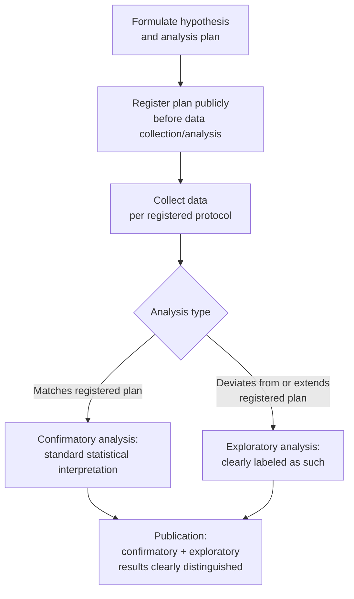

## Open Science, Reproducibility, and Preregistration

### Overview

Open science, reproducibility, and preregistration form an interconnected set of methodological reform practices that have substantially reshaped research norms in cognitive neuroscience over the past decade, largely in response to documented concerns about replicability across psychology and neuroscience. These practices aim to increase the transparency, verifiability, and reliability of published findings by making data, code, materials, and analytic decisions available for scrutiny, and by separating hypothesis-generating (exploratory) from hypothesis-testing (confirmatory) research through formal pre-specification of analysis plans.

### Terminology and Conceptual Distinctions

**Key Points**

- **Reproducibility** (sometimes called "computational reproducibility"): the ability of an independent researcher to obtain the same results from the same data using the same analytic code/methods—a relatively narrow, technical criterion concerning whether an analysis pipeline is fully documented and executable.
- **Replicability**: the ability of an independent researcher to obtain consistent findings when repeating a study with new data, ideally following the original methodology as closely as possible—a broader empirical question concerning whether an effect is genuine and generalizes beyond the original sample.
- **Generalizability**: the extent to which a finding extends beyond the specific conditions (population, task, stimuli, context) of the original study—a distinct question from either reproducibility or replicability.
- These terms are sometimes used inconsistently across the literature, but the reproducibility/replicability distinction in particular is widely treated as important: a study can be perfectly reproducible (the original code correctly regenerates the original results) while the underlying finding fails to replicate in new data (e.g., due to an underpowered original sample, a false-positive result, or genuine boundary conditions on the effect).

### Historical Context: The Replication Crisis

**Key Points**

- Concerns about widespread replication failures gained substantial visibility in the early-to-mid 2010s, catalyzed in part by high-profile controversies (e.g., disputed studies within psychology and social priming research) and systematic large-scale replication efforts.
- The **Reproducibility Project: Psychology** (Open Science Collaboration, 2015) attempted direct replications of 100 psychology studies and found that a substantial proportion of original effects did not replicate at conventional statistical significance thresholds, or replicated with substantially smaller effect sizes than originally reported—a finding widely discussed as catalyzing broader methodological reform efforts across psychological and cognitive science.
- Neuroimaging-specific methodological critiques during this period highlighted issues including inflated correlations in social/personality neuroscience research due to non-independence/circular analysis (the "voodoo correlations" controversy associated with Vul et al., 2009), concerns about statistical software cluster-inference false-positive rates in fMRI analysis (Eklund et al., 2016, raising concerns about certain widely used fMRI cluster-correction implementations), and broader concerns about chronic underpowering given typical neuroimaging sample sizes relative to the field's effect sizes.
- [Inference] These combined concerns contributed to a broad shift in methodological norms across cognitive neuroscience, though the pace and extent of adoption of specific reform practices (preregistration, large-sample consortium studies, mandatory data sharing) continues to vary across subfields, journals, and funding bodies.

### Preregistration

**Key Points**

- **Preregistration** involves publicly time-stamping a detailed research plan—hypotheses, methods, sample size/power justification, and planned analyses—before data collection (or, in some designs, before viewing/analyzing existing data), typically via a dedicated registry (e.g., the Open Science Framework, OSF; ClinicalTrials.gov for clinical work; AsPredicted for briefer preregistrations).
- The core statistical rationale: preregistration formally distinguishes **confirmatory** analyses (planned in advance, subject to standard interpretation of p-values/significance) from **exploratory** analyses (conducted post hoc, useful for hypothesis generation but subject to inflated false-positive risk if presented and interpreted as if they were confirmatory), directly addressing the "researcher degrees of freedom" and p-hacking concerns discussed under statistical inference.
- **Registered Reports**: an extension of preregistration in which the study rationale, hypotheses, and methods are peer-reviewed and provisionally accepted for publication *before* data collection begins, with publication decision based on the quality of the methodology rather than the direction/significance of results—explicitly designed to reduce publication bias against null/non-significant findings.
- Preregistration does not prohibit exploratory analysis; rather, it requires that exploratory analyses be clearly labeled and distinguished from pre-specified confirmatory analyses in the resulting publication, maintaining analytic flexibility for discovery while preserving the interpretability of formal hypothesis tests.

### Open Data and Materials Sharing

**Key Points**

- **Open data**: making raw or minimally processed research data publicly available (subject to privacy/ethical constraints, particularly relevant for neuroimaging data given its potential re-identifiability, e.g., via facial reconstruction from structural MRI, which motivates defacing/skull-stripping procedures before public sharing in many cases).
- **Open materials**: sharing experimental stimuli, task code, and instruments used in a study, enabling exact replication of experimental procedures rather than approximate reconstruction from a methods section description alone.
- **Open code**: sharing full analysis pipeline code (preprocessing, statistical analysis, visualization), which is foundational to computational reproducibility—without code sharing, independent verification of reported results from shared data is often impractical given the complexity of modern neuroimaging pipelines.
- **Large-scale open datasets** have become an important resource in cognitive neuroscience, enabling well-powered secondary analyses, methods development, and reproducibility checks without requiring new data collection. Examples researchers commonly reference include the Human Connectome Project, UK Biobank imaging cohort, ABIDE (Autism Brain Imaging Data Exchange), and OpenNeuro as a general-purpose open neuroimaging data repository. [Inference: the specific composition and scale of prominent open datasets continues to expand, and researchers should verify current dataset availability, size, and access requirements directly with the relevant repository rather than relying on a fixed historical description]

### Standardized Data and Reporting Formats

**Key Points**

- **BIDS (Brain Imaging Data Structure)**: a widely adopted community standard specifying a consistent file/folder organization and metadata convention for neuroimaging datasets (originally MRI-focused, since extended to EEG, MEG, and other modalities), facilitating both data sharing and the use of standardized, automated analysis pipelines that expect BIDS-formatted input.
- Standardized formats reduce the burden of dataset-specific custom preprocessing code, support automated quality control tooling, and facilitate large-scale meta-analytic or multi-dataset aggregation efforts by ensuring consistent data organization across studies from different labs.
- Reporting checklists and guidelines (e.g., domain-specific reporting standards for fMRI methods sections) have also been proposed to standardize the level of methodological detail reported in publications, addressing historical variability in how thoroughly preprocessing and analysis choices were documented.

### Statistical Power and Sample Size Considerations

**Key Points**

- A central driver of replication concerns has been chronic underpowering in cognitive neuroscience research, particularly in earlier-era small-sample neuroimaging and neuropsychology studies, where sample sizes were often insufficient to reliably detect the small-to-moderate effect sizes typical of many cognitive effects.
- **A priori power analysis**: estimating the sample size required to detect a hypothesized effect size with adequate statistical power (conventionally 80% or higher), ideally conducted and reported as part of study planning (and, where preregistered, specified in the registration) rather than post hoc.
- The rise of **large-scale consortium/multi-site studies** (pooling data across many research sites to achieve substantially larger sample sizes than any single lab could recruit) reflects a structural response to power concerns, particularly for individual-differences research (e.g., relating brain measures to behavior/personality/psychopathology) where effect sizes are often especially small and require large samples for reliable detection.
- [Inference] Some methodological commentary has argued that certain classes of individual-differences brain-behavior correlational findings require substantially larger samples than were historically typical in the field to achieve stable, replicable effect size estimates, a point that has informed increased emphasis on large consortium datasets for this type of research question specifically, though appropriate sample size requirements vary considerably by effect type and research question.

### Analytic Multiverse and Robustness Reporting

**Key Points**

- Given the substantial researcher degrees of freedom inherent in neuroimaging analysis pipelines (preprocessing choices, statistical thresholds, parcellation schemes, model specifications), a single analytic pipeline's result may not represent a robust finding but rather one point in a large space of "reasonable" alternative analytic choices.
- **Multiverse analysis**: systematically conducting the same core analysis across many reasonable combinations of analytic choices (a "multiverse" of pipelines) and reporting the distribution of resulting effect estimates/p-values across this space, rather than a single result from one arbitrarily chosen pipeline—providing a more complete picture of how sensitive a finding is to defensible methodological variation.
- Large-scale collaborative efforts applying this logic across independent analysis teams (having many separate research teams independently analyze the same dataset to test the same hypothesis, then comparing the resulting distribution of conclusions) have demonstrated that substantial variability in reported results can arise from legitimate analytic flexibility alone, even without any deliberate p-hacking, reinforcing the value of robustness-focused reporting practices.

### Worked Example: Designing a Reproducible, Preregistered Study

**Example**

A researcher plans a study testing whether a specific ERP component amplitude differs between two experimental conditions.

1. **Preregistration**: before data collection, register the hypothesis (directional or non-directional), the specific ERP component and time window/electrode(s) of interest, planned sample size with an accompanying power analysis based on a pilot or prior published effect size, and the exact statistical test to be used.
2. **Data collection per protocol**: collect data following the registered sample size and exclusion criteria (e.g., pre-specified artifact rejection thresholds), avoiding post hoc adjustment of these criteria based on how they affect the eventual result.
3. **Open materials**: share the experimental task code/stimuli via a public repository, enabling exact procedural replication by other labs.
4. **Open data and code**: upon publication, deposit raw (or appropriately de-identified/defaced) EEG data in a BIDS-formatted public repository, alongside the complete preprocessing and analysis code used to generate the reported results.
5. **Confirmatory vs. exploratory reporting**: report the preregistered analysis as the primary confirmatory result; if additional analyses are conducted (e.g., an unplanned different time window shows an interesting effect), report these explicitly as exploratory, clearly distinguished from the confirmatory result, and appropriately caveated regarding their preliminary/hypothesis-generating status.
6. **Multiverse/robustness check (optional but strengthening)**: additionally report whether the key result holds under a small number of alternative reasonable preprocessing choices (e.g., different baseline correction windows), providing readers with information about the finding's sensitivity to specific analytic decisions.

### Benefits and Critiques of Open Science Practices

**Key Points**

*Commonly cited benefits:*

- Increased detectability of errors and increased accountability, since shared data/code allow independent verification.
- Reduced publication bias, particularly via Registered Reports, since publication decisions are decoupled from result significance/direction.
- Facilitation of secondary analyses, meta-analyses, and methods development using shared open datasets, increasing overall research efficiency.
- Improved distinction between confirmatory and exploratory findings, reducing inflated false-positive rates from undisclosed analytic flexibility.

*Commonly discussed critiques/challenges:*

- Preregistration can be experienced as constraining for genuinely exploratory or discovery-oriented research questions, where flexibility to follow unexpected patterns in the data is often central to the scientific value of the work; not all research is well-suited to a strictly confirmatory preregistered framework.
- Data sharing raises legitimate privacy and ethical considerations, particularly for clinical/patient neuroimaging data or data linked to sensitive individual characteristics, requiring careful de-identification and, in some cases, controlled-access rather than fully open sharing arrangements.
- Implementing full open science practices (data/code sharing, detailed preregistration, large consortium recruitment) can impose substantial additional time, infrastructure, and resource burdens, which may disproportionately affect researchers with fewer institutional resources. [Inference: this resource-burden concern has been raised in methodological/policy discussions as a potential equity consideration in how open science norms are implemented and enforced across the field, though views on how to best address it vary]

### Related Topics

- Statistical inference and multiple comparisons correction (relationship to p-hacking concerns)
- Power analysis and sample size estimation methods
- BIDS (Brain Imaging Data Structure) and standardized data formats
- Large-scale consortium neuroimaging datasets (e.g., Human Connectome Project, UK Biobank)
- Registered Reports as a publishing format
- Multiverse analysis and analytic robustness reporting
- Meta-analysis methods in neuroscience
- Data anonymization and privacy considerations in neuroimaging sharing
- Machine learning cross-validation and circularity/double-dipping concerns
- Research ethics and institutional review in human neuroscience research