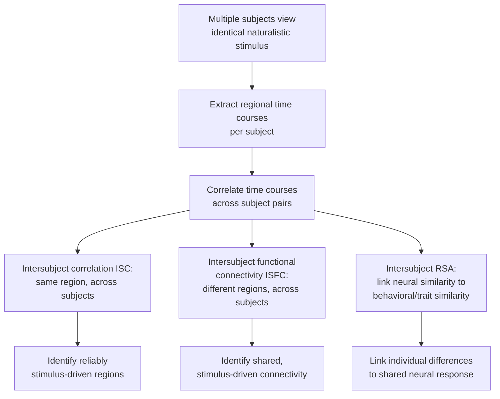

## Naturalistic and Big Data Neuroscience

### Overview

Naturalistic and big data neuroscience represent a methodological shift away from traditional tightly controlled, trial-based experimental paradigms toward studying the brain under conditions that more closely resemble real-world experience (naturalistic stimuli and tasks), combined with a parallel shift toward analyzing very large-scale datasets (large sample sizes, long recording durations, or richly multidimensional data) to achieve the statistical power and generalizability that small, tightly controlled studies often lack. These two threads are conceptually distinct but frequently intertwined in practice, since naturalistic paradigms often generate large, complex, high-dimensional datasets that themselves demand big-data analytic approaches.

### Motivation for Naturalistic Paradigms

**Key Points**

- Traditional cognitive neuroscience experiments typically isolate variables using simplified, repeated, discrete trial structures (e.g., single words, isolated images, brief tones) to maximize experimental control and interpretability, but this approach has been critiqued for potentially sacrificing **ecological validity**—the extent to which findings generalize to real-world cognition and behavior, which typically unfolds continuously, is context-dependent, and involves richly multimodal, dynamically changing input.
- Naturalistic stimuli (feature films, narrated stories, real-world navigation, unscripted conversation, music) engage a broader and more ecologically representative range of perceptual, attentional, memory, emotional, and social processes simultaneously, compared to artificially isolated single-variable paradigms.
- [Inference] This does not imply that traditional controlled paradigms are obsolete; rather, naturalistic and controlled approaches are increasingly viewed as complementary, addressing different but equally important questions—controlled paradigms for precise mechanistic isolation of variables, naturalistic paradigms for characterizing how the brain operates under more representative real-world conditions and for capturing dynamic, integrative processes difficult to isolate with simplified stimuli.

### Naturalistic Neuroimaging Paradigms

| Paradigm Type | Description | Example Use Case |
| --- | --- | --- |
| Movie-watching fMRI | Participants passively view a full-length film/clip during scanning | Studying narrative comprehension, emotion, social cognition, attention dynamics |
| Naturalistic auditory narratives | Participants listen to spoken stories | Studying language processing, memory encoding of continuous narrative |
| Free viewing/exploration | Unconstrained visual exploration of complex scenes (often with eye tracking) | Studying natural gaze/attention allocation |
| Real-world mobile EEG/fNIRS | Ambulatory recording during naturalistic movement/behavior | Studying cognition during actual physical activity, outside the scanner |
| Naturalistic social interaction (hyperscanning) | Simultaneous recording from two or more interacting individuals | Studying interpersonal neural synchrony during real conversation/collaboration |

### Intersubject Correlation (ISC) and Related Analytic Approaches

**Key Points**

- **Intersubject correlation (ISC)**: a foundational analytic approach for naturalistic neuroimaging data, computing the correlation of BOLD (or other neural signal) time courses at each voxel/region between different subjects who experienced the identical naturalistic stimulus (e.g., the same movie), under the logic that reliable stimulus-driven brain activity should produce correlated responses across independent brains exposed to the same input, whereas idiosyncratic/non-stimulus-driven activity should not.
- High ISC in a region indicates that the naturalistic stimulus reliably drives similar activity across individuals in that region, providing an alternative to traditional condition-based GLM contrasts (which are often poorly suited to continuous, non-repeating naturalistic stimuli lacking discrete, repeatable trial structure).
- **Intersubject functional connectivity (ISFC)**: extends the ISC logic to connectivity, correlating one region's time course in one subject with a different region's time course in other subjects, isolating stimulus-driven, shared inter-regional coupling from purely idiosyncratic within-subject connectivity patterns.
- **Intersubject representational similarity analysis (IS-RSA)**: combines the RSA framework with the intersubject logic, testing whether pairs of subjects who are behaviorally/psychologically more similar to each other on some measure (e.g., similar personality traits, similar interpretation of an ambiguous narrative) also show more similar neural response patterns to the same naturalistic stimulus, linking individual differences to shared neural response profiles.

### Encoding Models for Naturalistic Stimuli

**Key Points**

- Because naturalistic stimuli lack the discrete, repeatable trial structure of controlled experiments, **voxel-wise/channel-wise encoding models** have become a central analytic tool: rich, continuous feature representations of the naturalistic stimulus (e.g., low-level visual/auditory features, semantic content, motion energy, or deep neural network layer activations for the corresponding movie frames/audio) are used as regressors to predict continuous neural response time courses at each voxel/region.
- This encoding-model approach extends the GLM/computational modeling framework (see prior chapter items) to a setting with a much richer, higher-dimensional, and more naturalistic set of predictors than traditional condition-based designs, and has been particularly influential in mapping semantic representation across cortex using large naturalistic narrative/movie datasets (e.g., voxel-wise semantic mapping studies associated with work from the Gallant lab and others).
- Held-out data (a portion of the naturalistic stimulus/response not used for model fitting) is used to evaluate encoding model generalization performance, following standard cross-validation logic, since naturalistic designs still require rigorous held-out validation to avoid overfitting to a highly flexible, high-dimensional feature space.

### Big Data Neuroscience: Large-Scale Consortium Datasets

**Key Points**

- Separately from naturalistic paradigms specifically, "big data neuroscience" broadly refers to the increasing use of very large sample sizes and/or very large per-subject data volumes, motivated substantially by concerns about underpowered small-sample studies (see open science/reproducibility) and by the recognition that certain effects (particularly individual-differences brain-behavior associations) require large samples for stable, replicable estimation.
- Prominent large-scale initiatives commonly referenced in the field include population neuroimaging cohorts (e.g., UK Biobank imaging arm, scanning tens of thousands of participants with structural, functional, and diffusion MRI alongside extensive phenotypic/health data), developmental cohorts (e.g., the ABCD Study, a large longitudinal study of child brain development), and dense within-subject sampling designs (e.g., precision neuroimaging approaches collecting many scanning sessions from a small number of individuals to characterize stable individual-specific brain organization with high reliability). [Inference: as with other rapidly evolving large dataset initiatives, specific current sample sizes, available data modalities, and access procedures for any named study should be verified directly against the study's current documentation rather than assumed static]
- These large-scale efforts generally trade off two complementary strategies for statistical power: **large-N, modest per-subject data** (many subjects, standard scan duration) versus **small-N, extensive per-subject data** (few subjects, many repeated sessions, enabling highly reliable individual-level characterization)—each suited to different scientific questions (population-level generalizability versus stable individual-specific mapping, respectively).

### Data Management and Computational Infrastructure Challenges

**Key Points**

- Big data neuroscience datasets pose distinct infrastructure challenges relative to traditional single-lab studies: data storage and transfer at scale (multi-terabyte to petabyte-scale datasets for some large consortium efforts), computational requirements for preprocessing/analyzing thousands of subjects' worth of high-resolution imaging data, and the need for standardized, automated, reproducible processing pipelines (see BIDS and related tooling under open science) to consistently process data at this scale without prohibitive per-subject manual intervention.
- **Federated/distributed analysis approaches**: in some cases (particularly for datasets with data-sharing restrictions, e.g., certain clinical or genetically sensitive data), analysis code is sent to the data (executed locally at each data-holding site) rather than centralizing raw data at a single location, addressing privacy/governance constraints while still enabling large-scale multi-site analysis.
- Cloud computing platforms and containerized analysis pipelines (e.g., Docker/Singularity-based standardized pipelines) have become increasingly important infrastructure components for making large-scale, computationally intensive naturalistic and big-data neuroscience analyses feasible and reproducible across different computing environments.

### Multimodal and Multidimensional Big Data Integration

**Key Points**

- Big data neuroscience increasingly involves integrating multiple data modalities per subject (structural MRI, functional MRI, diffusion MRI, genetics, extensive behavioral/cognitive phenotyping, and in some cohorts, environmental/socioeconomic data), motivating multivariate statistical and machine learning approaches capable of jointly modeling relationships across these heterogeneous, high-dimensional data types.
- **Brain-wide association studies (BWAS)**, analogous in spirit to genome-wide association studies (GWAS), systematically test associations between brain measures and behavioral/phenotypic variables across very large samples; methodological work examining BWAS statistical properties (e.g., Marek et al., 2022) has highlighted that reproducible brain-behavior associations for many individual-differences phenotypes require considerably larger sample sizes than were historically typical in the field, directly motivating the shift toward large consortium datasets for this class of research question.
- [Inference] This finding regarding required sample sizes for stable brain-behavior associations has been influential in shaping funding and study design priorities toward large-N consortium approaches specifically for individual-differences research, though the generalizability of specific required-sample-size estimates across different types of brain measures and phenotypes continues to be discussed and refined in ongoing methodological work.

### Worked Example: Naturalistic Movie-Watching Study Design

**Example**

A researcher wants to study how narrative comprehension and emotional engagement are reflected in shared neural responses across a group of participants watching an emotionally engaging short film.

1. **Stimulus preparation**: select or produce a naturalistic film stimulus, and independently annotate its content (e.g., time-stamped emotional valence/arousal ratings, scene/character labels, semantic content) to serve as continuous feature regressors for later encoding-model analysis.
2. **Data collection**: scan a sample of participants (sized according to a power analysis appropriate for intersubject correlation/encoding model designs, which have somewhat different power considerations than traditional condition-contrast fMRI designs) while they passively view the identical film.
3. **ISC analysis**: compute voxel-wise intersubject correlation across the participant sample to identify brain regions showing reliable, stimulus-driven synchronization across individuals.
4. **Encoding model analysis**: fit voxel-wise encoding models using the annotated emotional/semantic features as regressors, using cross-validation (e.g., held-out portions of the film) to evaluate which features best predict activity in different brain regions.
5. **Individual differences extension**: collect independent trait measures (e.g., empathy questionnaires) and apply intersubject RSA to test whether participants with more similar trait scores show more similar neural response patterns during emotionally salient portions of the film.
6. **Interpretation caveat**: because naturalistic designs sacrifice some experimental control relative to isolated trial-based designs (multiple correlated features co-occur naturally within the stimulus, e.g., emotional content often co-occurs with specific visual/narrative features), causal attribution of neural responses to any single stimulus feature requires caution, and converging evidence from controlled follow-up experiments isolating specific features is often valuable to complement naturalistic findings. [Inference: this control-versus-ecological-validity tradeoff is a well-recognized, inherent property of naturalistic designs rather than a flaw specific to any particular study, and is generally addressed through complementary use of both naturalistic and controlled paradigms rather than treating either as sufficient alone]

### Methodological Considerations and Limitations

**Key Points**

- **Reduced experimental control**: naturalistic stimuli involve many co-occurring, often correlated features, complicating clean attribution of neural responses to specific isolated variables relative to fully controlled designs.
- **Non-repeatability across studies**: unlike standardized, widely reused controlled stimulus sets, naturalistic stimuli (e.g., a specific film) are less standardized across labs, potentially complicating direct cross-study comparison, though some naturalistic stimulus sets (e.g., certain widely used short films/narratives) have become de facto standards adopted across multiple research groups to partially address this.
- **Statistical methods still maturing**: analytic approaches for naturalistic data (ISC, ISFC, encoding models) are less standardized and have a shorter track record than traditional GLM-based approaches, and best-practice methodological guidelines continue to be refined.
- **Big data does not eliminate the need for careful causal inference**: large sample size increases statistical power to detect small effects reliably, but does not by itself resolve confounding or causal ambiguity in purely observational brain-behavior association data; large-N correlational findings still require appropriate caution regarding causal interpretation, similar to correlational findings from smaller studies.

### Related Topics

- Intersubject correlation and intersubject functional connectivity methods
- Voxel-wise encoding models and feature-based neural prediction
- Large-scale consortium datasets (UK Biobank, ABCD Study, Human Connectome Project)
- Brain-wide association study (BWAS) statistical properties and required sample sizes
- Precision/dense-sampling individual-subject neuroimaging designs
- Hyperscanning and interpersonal neural synchrony
- Standardized data formats and reproducible pipeline infrastructure (BIDS, containerization)
- Deep learning feature extraction for naturalistic stimulus annotation
- Ecological validity in cognitive neuroscience experimental design
- Federated/distributed data analysis approaches for sensitive datasets