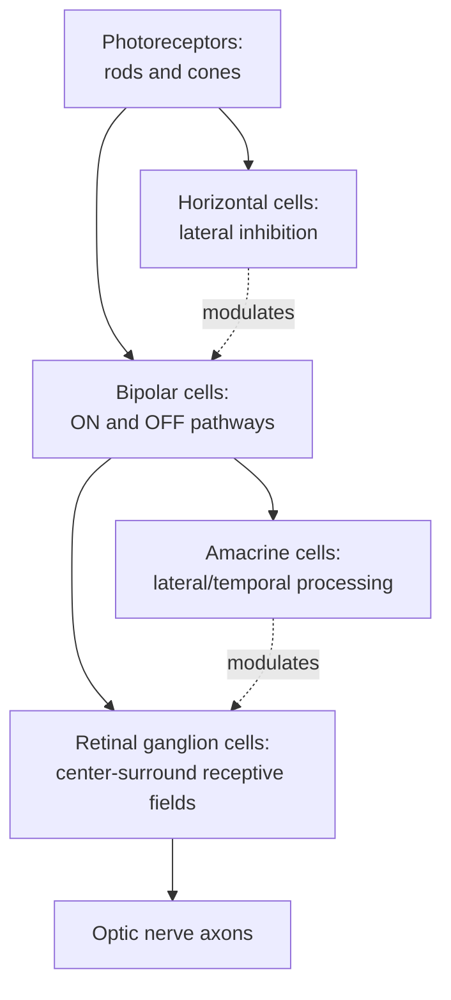

## Retinal Processing and Early Visual Pathways

### Overview

Retinal processing and early visual pathways describe the sequence of neural transformations that convert patterns of light striking the retina into structured neural signals transmitted to the brain, beginning with phototransduction in retinal photoreceptors and continuing through retinal circuitry, the optic nerve, subcortical relay structures, and into primary visual cortex. This early processing stage establishes the foundational computational transformations—light adaptation, spatial and temporal filtering, chromatic opponency, and parallel channel segregation—upon which all subsequent visual cognition depends.

### Retinal Anatomy and Layered Organization

**Key Points**

- The retina is a layered neural structure at the back of the eye, organized (from the light-entry side inward, i.e., light passes through several layers before reaching photoreceptors, an "inverted" arrangement in vertebrate retinas) into: photoreceptor layer, outer plexiform layer (photoreceptor-bipolar-horizontal synapses), inner nuclear layer (bipolar, horizontal, amacrine cell bodies), inner plexiform layer (bipolar-amacrine-ganglion cell synapses), and ganglion cell layer.
- **Photoreceptors**: two main types—**rods** (highly light-sensitive, mediate scotopic/low-light vision, achromatic, saturated at higher light levels) and **cones** (less light-sensitive, mediate photopic/daylight vision, provide the basis for color vision via multiple spectrally distinct cone types).
- **Cone subtypes**: typically three types in humans, classified by peak spectral sensitivity—**S-cones** (short-wavelength, "blue"), **M-cones** (medium-wavelength, "green"), and **L-cones** (long-wavelength, "red")—though their functional naming as "blue/green/red" is a simplification, since their spectral sensitivity curves overlap substantially rather than corresponding to narrow, non-overlapping wavelength bands.
- **Fovea**: the central retinal region with the highest cone density and no rods, providing maximal visual acuity, at the cost of relatively poor performance in low-light conditions where the (rod-populated) peripheral retina is more sensitive.

### Phototransduction

**Key Points**

- Light absorption by photopigment molecules (opsins bound to retinal, a vitamin A derivative) in photoreceptor outer segments triggers a G-protein-coupled signaling cascade (involving transducin and phosphodiesterase) that closes cyclic-nucleotide-gated ion channels, hyperpolarizing the photoreceptor.
- Notably, photoreceptors are hyperpolarized (not depolarized) by light—the opposite polarity from the depolarizing response typical of most sensory transduction—and photoreceptors, uniquely among most neurons in the visual pathway, release neurotransmitter (glutamate) tonically in darkness, with light reducing this release.
- **Light/dark adaptation**: photoreceptors and downstream retinal circuits adjust their sensitivity across an enormous range of ambient light levels (many orders of magnitude), involving both photopigment bleaching/regeneration dynamics and neural gain-control mechanisms at multiple retinal processing stages.

### Retinal Circuitry and Receptive Field Organization

**Key Points**

- **Bipolar cells**: receive direct synaptic input from photoreceptors and provide the primary vertical excitatory pathway to ganglion cells; critically, bipolar cells are divided into **ON-bipolar cells** (depolarized by light increments, via sign-inverting metabotropic glutamate receptor signaling) and **OFF-bipolar cells** (depolarized by light decrements, via sign-preserving ionotropic glutamate receptors), establishing parallel ON and OFF pathways from the earliest stage of post-receptor processing.
- **Horizontal cells**: provide lateral inhibitory feedback/feedforward connections at the outer plexiform layer, contributing to the antagonistic surround component of receptive field center-surround organization and to light adaptation/contrast gain control.
- **Amacrine cells**: a diverse class of interneurons providing lateral interactions at the inner plexiform layer, contributing to temporal processing, motion sensitivity, and further shaping of ganglion cell response properties; numerous amacrine cell subtypes exist with distinct specialized functional roles.
- **Center-surround receptive field organization**: retinal ganglion cells (and bipolar cells) typically exhibit a roughly circular receptive field with an antagonistic center and surround—an **ON-center/OFF-surround** cell is excited by light in the center and inhibited by light in the surround (and vice versa for **OFF-center/ON-surround** cells)—a computational arrangement that enhances sensitivity to spatial contrast (edges, local luminance differences) rather than uniform illumination.

### Center-Surround Receptive Field Diagram (svg_diagram)

<svg xmlns="http://www.w3.org/2000/svg" viewBox="0 0 500 260">
<text x="250" y="30" font-size="18" font-weight="bold" text-anchor="middle" fill="#1a1a2e">ON-Center / OFF-Surround Receptive Field (svg_diagram)</text>

<g transform="translate(120,130)">
<circle cx="0" cy="0" r="80" fill="#2a2a3e" stroke="#555" stroke-width="1" />
<circle cx="0" cy="0" r="35" fill="#f4d35e" stroke="#8b7500" stroke-width="2" />
<text x="0" y="6" font-size="12" text-anchor="middle" fill="#1a1a1a" font-weight="bold">+</text>
<text x="0" y="-55" font-size="12" text-anchor="middle" fill="#ccc">−</text>
<text x="0" y="115" font-size="13" text-anchor="middle" fill="#333">ON-center cell</text>
<text x="0" y="132" font-size="10" text-anchor="middle" fill="#666">excited by light in center,</text>
<text x="0" y="145" font-size="10" text-anchor="middle" fill="#666">inhibited by light in surround</text>
</g>

<g transform="translate(370,130)">
<line x1="-90" y1="0" x2="90" y2="0" stroke="#888" stroke-width="1" />
<line x1="0" y1="50" x2="0" y2="-70" stroke="#888" stroke-width="1" />
<path d="M -80,10 Q -35,40 -20,15 Q 0,-55 20,15 Q 35,40 80,10" fill="none" stroke="#c1440e" stroke-width="3" />
<text x="0" y="70" font-size="11" text-anchor="middle" fill="#333">Spatial position</text>
<text x="-105" y="-30" font-size="11" text-anchor="middle" fill="#333" transform="rotate(-90 -105 -30)">Response</text>
<text x="0" y="-90" font-size="12" text-anchor="middle" fill="#333" font-weight="bold">Response Profile</text>
</g>
</svg>

### Retinal Ganglion Cell Types and Parallel Pathways

**Key Points**

Retinal ganglion cells (RGCs) form multiple distinct functional/anatomical classes, giving rise to parallel information channels that remain at least partially segregated through subcortical relays and into cortex:

| RGC Type | Key Properties | Primary Downstream Pathway |
| --- | --- | --- |
| Parvocellular (P) / midget RGCs | Small receptive fields, sustained response, color-opponent (particularly red-green), high spatial resolution, low contrast sensitivity | Parvocellular layers of LGN → ventral ("what") stream contributions |
| Magnocellular (M) / parasol RGCs | Larger receptive fields, transient response, high contrast sensitivity, high temporal resolution, largely achromatic | Magnocellular layers of LGN → dorsal ("where/how") stream contributions |
| Koniocellular (K) / bistratified RGCs | Distinct chromatic properties (notably blue-yellow opponency, S-cone input) | Koniocellular layers/interlaminar zones of LGN |
| Intrinsically photosensitive RGCs (ipRGCs) | Contain melanopsin, directly photosensitive independent of rod/cone input, slow sustained responses | Not primarily involved in conscious pattern vision; project to circadian/pupillary control centers (e.g., suprachiasmatic nucleus, pretectal olivary nucleus) |

[Inference: this parvocellular/magnocellular/koniocellular tripartite scheme is a widely used organizing framework, though the mapping from these RGC/LGN channels onto later cortical "what/where" stream distinctions is an approximation rather than a strict one-to-one correspondence, since substantial mixing and cross-talk occurs at and beyond primary visual cortex]

### Color Opponency

**Key Points**

- Retinal ganglion cell chromatic responses are organized via **color-opponent processing** rather than independent processing of each cone type's signal: midget/parvocellular pathway RGCs commonly show red-green opponency (e.g., L-cone excitatory center, M-cone inhibitory surround, or vice versa), while a separate small bistratified RGC population carries blue-yellow opponency (S-cone versus combined L+M cone input).
- This opponent-process organization at the retinal/early pathway level is the physiological substrate underlying the classic psychophysical opponent-process theory of color vision (as opposed to a simpler trichromatic-only account), explaining phenomena such as the impossibility of perceiving a "reddish-green" or "yellowish-blue" color.

### The Optic Nerve, Chiasm, and Subcortical Pathways

**Key Points**

- Retinal ganglion cell axons converge to form the **optic nerve**, which partially decussates (crosses) at the **optic chiasm**: fibers from the nasal (medial) retina cross to the contralateral hemisphere, while fibers from the temporal (lateral) retina remain ipsilateral—this arrangement means each hemisphere receives input from the contralateral visual hemifield (since the nasal retina of one eye and temporal retina of the other eye both view the same contralateral hemifield).
- Post-chiasm, fibers form the **optic tract**, projecting primarily to the **lateral geniculate nucleus (LGN)** of the thalamus, the dominant subcortical relay to primary visual cortex, but also to several other targets:
  - **Superior colliculus**: involved in reflexive/rapid orienting eye movements (saccades) and spatial attention, part of a phylogenetically older visual pathway sometimes discussed in relation to "blindsight" phenomena (residual visual capacity in cortically blind patients, attributed in part to preserved subcortical/collicular processing).
  - **Suprachiasmatic nucleus**: receives input primarily from ipRGCs, entraining circadian rhythms to the light-dark cycle.
  - **Pretectal area**: mediates the pupillary light reflex.

### Lateral Geniculate Nucleus (LGN) Organization

**Key Points**

- The LGN is organized into six primary layers (in primates), alternating in eye-of-origin (ipsilateral/contralateral) and cell type: two ventral **magnocellular layers** (larger cells, M-pathway input), four dorsal **parvocellular layers** (smaller cells, P-pathway input), with **koniocellular** cells interspersed between the main layers.
- LGN receptive fields largely preserve the center-surround organization inherited from retinal ganglion cells, without yet introducing the orientation selectivity that emerges at the cortical level—meaning the LGN is often characterized as performing relatively modest additional transformation of the retinal signal, though it is not a passive relay: it receives substantial descending feedback from visual cortex and is subject to attentional and state-dependent modulation.
- [Inference] The functional significance of the LGN's extensive corticothalamic feedback connections (which numerically exceed the ascending retinal input in some estimates) remains an active area of investigation, with proposed roles including attentional gain modulation and predictive/contextual modulation of early visual signals, though this is less definitively established than the LGN's basic relay function.

### Primary Visual Cortex (V1) as the Terminus of Early Visual Processing

**Key Points**

- LGN projections terminate primarily in layer 4 of primary visual cortex (V1, striate cortex, area 17), with magnocellular and parvocellular inputs remaining partially segregated into distinct V1 sublayers (4Cα receiving predominantly magnocellular input, 4Cβ receiving predominantly parvocellular input) before subsequent intracortical processing begins to integrate and further transform these signals.
- V1 introduces computational properties not present at earlier stages, most notably **orientation selectivity** (neurons responding preferentially to edges/bars of a specific orientation, foundational to the classic Hubel and Wiesel simple/complex cell characterization) and the beginnings of **binocular integration** (combining input from both eyes, relevant to stereoscopic depth perception), marking the transition from "early visual pathway" processing to cortical visual processing proper (covered as its own subsequent topic).

### Worked Example: Tracing a Point of Light Through the Early Visual Pathway

**Example**

Consider a small spot of light presented briefly in the right visual field.

1. **Retinal transduction**: light falls on the left (nasal) hemiretina of the left eye and the left (temporal) hemiretina of the right eye (since a right-visual-field stimulus projects to the left/nasal side of the left eye and left/temporal side of the right eye, given the eye's optics), triggering photoreceptor hyperpolarization at the corresponding retinal locations.
2. **Retinal circuit processing**: bipolar, horizontal, and amacrine cells shape the signal into center-surround organized ganglion cell responses; ON-center ganglion cells at the stimulated location show increased firing.
3. **Chiasmatic routing**: the nasal-retina (left eye) fibers cross at the optic chiasm to the left hemisphere; wait—correcting for consistency, the crossing nasal fibers carrying this right-visual-field signal, combined with the temporal (right eye) fibers, which do not cross, both ultimately route information from the right visual field to the **left** hemisphere's LGN and V1, consistent with the general rule that each hemisphere processes the contralateral visual hemifield.
4. **LGN relay**: signals reach the appropriate magnocellular/parvocellular/koniocellular layers of the left LGN, organized retinotopically (preserving spatial relationships from the retina) and by eye-of-origin.
5. **V1 arrival**: LGN output terminates in layer 4 of left V1 at a retinotopically corresponding cortical location, where orientation-selective and binocularly-integrated processing begins—marking the handoff from early visual pathway processing to cortical visual processing.

### Related Topics

- Hubel and Wiesel's cortical receptive field characterization (simple/complex cells, orientation columns)
- Dorsal ("where/how") and ventral ("what") visual processing streams
- Color vision theories (trichromatic and opponent-process integration)
- Blindsight and subcortical visual processing via the superior colliculus
- Circadian photoentrainment and intrinsically photosensitive retinal ganglion cells
- Binocular vision and stereopsis
- Retinotopic mapping methods in visual neuroscience
- Visual attention and corticothalamic feedback to the LGN
- Motion perception and the magnocellular pathway
- Clinical visual field deficits and lesion localization (e.g., chiasmatic vs. post-chiasmatic lesions)