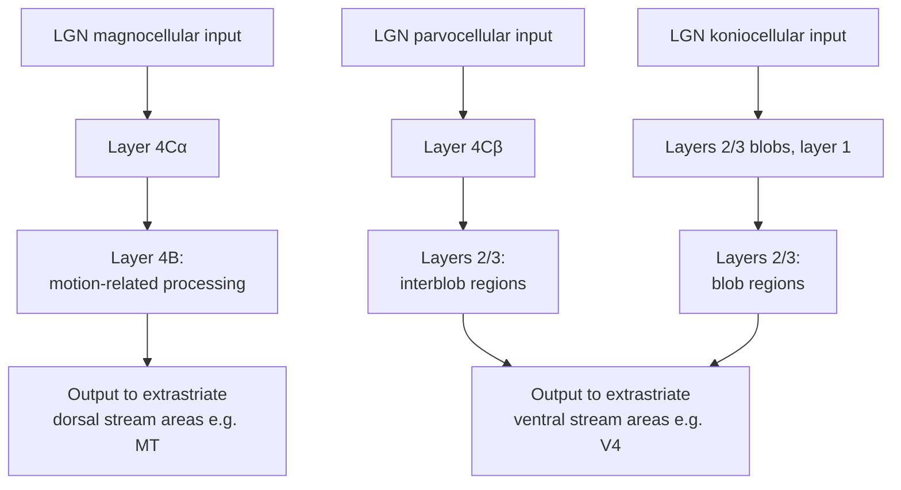

## Primary Visual Cortex Organization

### Overview

Primary visual cortex (V1, striate cortex, Brodmann area 17) is the first cortical processing stage in the visual system, situated in the occipital lobe primarily along the calcarine sulcus. V1 receives its principal input from the lateral geniculate nucleus (LGN) and performs foundational transformations—orientation selectivity, spatial frequency filtering, binocular integration, and the beginnings of feature extraction—that are not present at earlier retinal or thalamic processing stages. V1's laminar, columnar, and retinotopic organization represents one of the most thoroughly characterized microarchitectures in the mammalian cortex, making it a foundational model system for understanding cortical circuit organization more broadly.

### Retinotopic Organization

**Key Points**

- V1 maintains a **retinotopic map**: neighboring locations on the retina project to neighboring locations in V1, preserving the spatial layout of the visual field in an orderly, continuous cortical representation.
- This mapping is not uniform in scale: **cortical magnification** describes the disproportionately large area of V1 devoted to central/foveal vision relative to peripheral vision, reflecting the far higher density of foveal photoreceptors and retinal ganglion cells relative to peripheral retina.
- The retinotopic map in humans can be measured non-invasively using **population receptive field (pRF) mapping** with fMRI, in which visual stimuli (e.g., rotating wedges, expanding/contracting rings) systematically traverse the visual field while cortical responses are modeled to estimate each voxel's effective receptive field location and size—a standard technique for delineating the boundaries of V1 and adjacent extrastriate visual areas in individual human subjects.
- The **vertical meridian and horizontal meridian representations** in the visual field map onto specific anatomical landmarks in V1 (the calcarine sulcus organization places the horizontal meridian representation roughly along the sulcus fundus, with upper and lower visual field representations mapping to opposite banks), a feature exploited in both animal and human retinotopic mapping studies.

### Laminar Organization

**Key Points**

V1 exhibits the six-layer laminar structure characteristic of neocortex generally, with layer-specific input/output specialization particularly well characterized in V1:

| Layer | Key Characteristics |
| --- | --- |
| Layer 1 | Sparse cell bodies, mostly dendrites/axons; receives feedback and modulatory input |
| Layer 2/3 | Pyramidal neurons; major source of feedforward output to extrastriate visual areas; contains cytochrome oxidase "blobs" (see below) |
| Layer 4 | Primary thalamic (LGN) input layer; subdivided into sublayers 4A, 4B, 4Cα, and 4Cβ in primates |
| Layer 4Cα | Receives predominantly magnocellular LGN input |
| Layer 4Cβ | Receives predominantly parvocellular LGN input |
| Layer 5 | Pyramidal neurons; projects to subcortical targets (e.g., superior colliculus) |
| Layer 6 | Pyramidal neurons; major source of corticothalamic feedback projections back to the LGN |

- This layer-specific segregation of magnocellular and parvocellular input (into 4Cα and 4Cβ respectively) preserves, at least initially, the parallel channel organization established at the retinal/LGN level, before intracortical circuitry begins to mix and further transform these signals in superficial and deep layers.

### Orientation Selectivity and the Classic Hubel & Wiesel Cell Classification

**Key Points**

- The foundational discovery of **orientation-selective neurons** in cat V1, made by Hubel and Wiesel beginning in the late 1950s/early 1960s (work recognized with the 1981 Nobel Prize in Physiology or Medicine, shared with Roger Sperry), established that individual V1 neurons respond preferentially to edges or bars of light at a specific orientation, unlike the circularly symmetric center-surround receptive fields of retinal ganglion cells and LGN neurons.
- **Simple cells**: exhibit spatially segregated excitatory and inhibitory subregions within their receptive field, arranged in an elongated pattern consistent with orientation tuning; their responses can be reasonably well predicted by linear summation of light falling within these excitatory/inhibitory subregions, and they are sensitive to the precise spatial phase/position of a stimulus within the receptive field.
- **Complex cells**: also orientation-selective, but respond to an appropriately oriented stimulus across a range of positions within the receptive field (position/phase invariance) and cannot be well modeled by simple linear summation, implying that complex cell responses reflect a nonlinear combination of input from multiple simple cells with different receptive field positions/phases (in the classic hierarchical model) or from other complex circuit mechanisms.
- **Hypercomplex/end-stopped cells**: show reduced response to stimuli extending beyond a certain length, exhibiting sensitivity to the endpoints/termination of oriented edges, of potential relevance to processing corners, curvature, and object boundaries.
- [Inference] The precise circuit mechanism generating orientation selectivity in the first place (rather than simply how it propagates from simple to complex cells) remains an area of ongoing investigation, with proposed contributions from feedforward LGN input convergence (the classic Hubel-Wiesel feedforward model), intracortical excitatory/inhibitory circuit dynamics, and recurrent cortical amplification, and current understanding likely involves a combination of these mechanisms rather than a single definitive answer.

### Columnar Organization

**Key Points**

- **Orientation columns**: V1 neurons with similar preferred orientation are organized into vertically-oriented columns spanning the cortical layers, such that moving perpendicular to the cortical surface (through the different layers) tends to encounter neurons with similar orientation preference, while moving tangentially across the surface reveals systematic, continuous changes in preferred orientation.
- **Pinwheel organization**: orientation preference maps (visualized via optical imaging techniques) reveal a characteristic pattern in which orientation preference changes continuously around focal points ("pinwheel centers"), with all orientations represented around each pinwheel center—a widely replicated organizational motif across several mammalian species with orientation columns (though notably absent or different in some species, such as rodents, which show a more scattered "salt-and-pepper" organization of orientation preference rather than clear columnar/pinwheel structure). [Inference: the functional significance of the pinwheel arrangement specifically, versus the salt-and-pepper arrangement seen in some other species, remains a topic of ongoing comparative and theoretical investigation regarding what computational advantage, if any, columnar organization confers]
- **Ocular dominance columns**: alternating stripes of cortex responding preferentially to input from one eye or the other, reflecting the maintained (though not absolute) segregation of eye-of-origin information at the level of layer 4 before binocular integration occurs in other layers; classically visualized via anatomical tracing techniques and more recently via optical/functional imaging.
- **Cytochrome oxidase blobs**: patches of elevated cytochrome oxidase (a mitochondrial enzyme, used as a metabolic activity marker) staining in layers 2/3, spaced in a regular array and associated with distinct functional properties (color-selective, less orientation-selective processing) compared to the surrounding "interblob" cortex (more orientation-selective, less color-selective)—contributing to the broader concept of parallel, partially segregated functional processing streams within V1 itself.
- Together, orientation columns, ocular dominance columns, and cytochrome oxidase blob/interblob organization are frequently described as forming repeating **"hypercolumn"** or "cortical module" units, each hypothesized to contain a full complement of orientation preferences, both eyes' input, and both blob/interblob processing types, sufficient to process a local patch of visual field.

### Binocular Integration and Stereopsis

**Key Points**

- While layer 4 largely maintains eye-of-origin segregation (ocular dominance columns), V1 neurons outside layer 4 (particularly in layers 2/3) frequently show genuine **binocular integration**, receiving convergent input from both eyes and, in a subset of neurons, exhibiting **binocular disparity tuning**—differential sensitivity to small positional differences between the two eyes' retinal images of the same object, which is the primary basis for stereoscopic depth perception.
- This disparity-tuned population provides the initial cortical substrate for **stereopsis**, though full stereoscopic depth perception is understood to involve further processing in extrastriate areas beyond V1 as well.

### Spatial Frequency and Contrast Processing

**Key Points**

- V1 neurons are tuned not only for orientation but also for **spatial frequency** (the fineness/coarseness of a grating stimulus, typically measured in cycles per degree of visual angle), with different neurons preferring different spatial frequency bands, collectively supporting the visual system's ability to process both fine detail and coarse global structure.
- **Contrast sensitivity**: V1 neurons show characteristic contrast response functions (firing rate as a function of stimulus contrast, typically following a sigmoidal/saturating relationship), and contrast gain control mechanisms (including divisive normalization, a broadly influential computational principle for describing V1 response properties) shape how responses scale with local stimulus contrast and surrounding context. [Inference: divisive normalization has become an influential general computational framework applied well beyond V1 contrast processing specifically, to other cortical areas and modalities, though its precise biophysical implementation in V1 circuitry involves ongoing mechanistic investigation]

### V1's Role Relative to Extrastriate Cortex

**Key Points**

- V1 serves as an obligatory relay for the great majority of visual information reaching extrastriate (beyond-V1) visual areas in primates, feeding forward into the broader cortical visual hierarchy, including the two broadly characterized processing streams: the **dorsal stream** (extending toward parietal cortex, associated with spatial/motion processing, "where/how" functions) and the **ventral stream** (extending toward temporal cortex, associated with object/form recognition, "what" functions)—streams that receive differentially weighted input from V1's magnocellular- and parvocellular-derived processing channels, respectively, though with substantial mixing rather than strict channel purity.
- V1 damage produces a **scotoma** (localized blind spot) in the corresponding retinotopic location of the visual field; complete unilateral V1 destruction produces **cortical blindness** (hemianopia) in the contralateral visual field, though some patients with V1 damage retain limited, non-conscious visual capacity for certain stimulus properties (motion, gross localization)—the **blindsight** phenomenon, attributed to preserved subcortical pathways (e.g., via the superior colliculus and pulvinar) that bypass V1 to reach extrastriate cortex directly.

### Worked Example: Interpreting an Orientation Tuning Curve Experiment

**Example**

A researcher records single-unit activity from a V1 neuron while presenting oriented grating stimuli spanning 0° to 180° in 10° increments, holding spatial frequency and contrast constant, and wants to characterize and interpret the resulting orientation tuning curve.

1. **Data collection**: record firing rate responses across repeated presentations of each orientation, plotting mean firing rate as a function of stimulus orientation.
2. **Curve characterization**: fit the resulting tuning curve (commonly well-approximated by a Gaussian or von Mises function centered on the neuron's preferred orientation) to extract the preferred orientation and tuning bandwidth (width at half-maximum response).
3. **Simple vs. complex cell classification**: additionally test the neuron's response as the oriented grating is shifted in spatial phase/position within the receptive field at the preferred orientation; a response that fluctuates strongly with phase (following the alternating light/dark bars) suggests a simple cell, whereas a response that remains relatively constant across phase shifts suggests a complex cell.
4. **Contextual manipulation**: test responses to the same preferred-orientation stimulus at varying contrast levels to characterize the neuron's contrast response function, and potentially test responses with the addition of a surrounding context stimulus (e.g., an iso-oriented versus cross-oriented surround) to probe contextual modulation/normalization effects, which are well-documented in V1 and often invoked as evidence for divisive normalization-type computations.
5. **Interpretation caveat**: single-unit tuning properties characterized under highly controlled, isolated grating stimulation conditions may not fully predict the neuron's response to complex, naturalistic stimuli containing multiple overlapping contours/features, given the well-documented contextual and normalization effects that modulate V1 responses beyond simple feedforward orientation tuning. [Inference: this gap between classical simple-stimulus characterization and naturalistic-stimulus response prediction has motivated some of the broader shift toward naturalistic stimulus paradigms and encoding-model approaches, discussed as a general trend in cognitive neuroscience methodology]

### Related Topics

- Retinal processing and the lateral geniculate nucleus as V1's primary input source
- Dorsal and ventral visual processing streams
- Population receptive field (pRF) mapping methodology
- Divisive normalization as a general cortical computational principle
- Extrastriate visual areas (V2, V4, MT/V5) and their specialized functional roles
- Blindsight and subcortical visual pathways bypassing V1
- Binocular disparity processing and stereoscopic depth perception
- Optical imaging of orientation preference maps
- Convolutional neural networks as models of hierarchical visual processing (relating to V1-like early layers)
- Visual cortical plasticity and critical period development (e.g., ocular dominance plasticity)