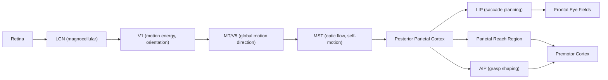

## Dorsal Stream and Spatial Vision

### Overview

The dorsal visual stream — the "where/how" pathway — is the cortical route specialized for spatial localization, motion processing, and the visuomotor guidance of action. It originates in V1 and projects dorsally through the occipitoparietal cortex into the posterior parietal cortex (PPC), with further projections to premotor and prefrontal regions. Formalized by Ungerleider and Mishkin (1982) and later refined by Goodale and Milner (1992) into the "vision-for-action" framework, this pathway is functionally and anatomically distinct from the ventral "what" stream.

### Anatomical Pathway

**Key Points**

- **V1**: Encodes low-level motion energy and orientation via magnocellular-dominant input.
- **V2/V3**: Processes coarse form and early motion-boundary information.
- **MT/V5 (middle temporal area)**: Core motion-direction and speed selectivity; integrates local motion signals into coherent global motion (the aperture problem solution).
- **MST (medial superior temporal area)**: Processes optic flow, self-motion, and complex motion patterns (expansion, rotation).
- **Posterior parietal cortex (PPC)**: Integrates spatial, motion, and body-position (proprioceptive) signals; contains subregions for reach (parietal reach region), grasp (anterior intraparietal area, AIP), and eye movement planning (lateral intraparietal area, LIP).

The pathway is dominated by the **magnocellular** subsystem of the retino-geniculate pathway, characterized by high temporal resolution, low spatial resolution, high contrast sensitivity, and color insensitivity — in contrast to the parvocellular-dominant ventral stream.

### Computational Principles

**Motion Integration and the Aperture Problem**

Local motion detectors (e.g., V1 direction-selective cells) can only sense motion component perpendicular to a local edge, producing ambiguity known as the aperture problem. MT neurons pool across many local V1 signals with different receptive field orientations to recover unambiguous 2D motion vectors via mechanisms resembling vector averaging or intersection-of-constraints computation.

$$\vec{v}_{\text{true}} = \arg\min_{\vec{v}} \sum_i \left( \vec{v} \cdot \hat{n}_i - c_i \right)^2$$

where $\hat{n}_i$ is the local edge normal and $c_i$ is the observed local motion component — a formalization of how population pooling resolves local ambiguity into global motion estimates. [Inference] This is a computational-level description; the precise biophysical mechanism by which MT achieves this pooling remains an active area of study.

**Egocentric and Allocentric Spatial Coding**

PPC represents space in multiple, partially overlapping reference frames:

- **Eye-centered (retinotopic)**: Common in LIP for saccade planning.
- **Head-centered / body-centered**: Used for reaching coordination.
- **Gain-field modulation**: Neurons combine retinotopic position with eye/head/body posture signals multiplicatively, enabling coordinate transformations between reference frames.

### Vision-for-Action Framework (Goodale & Milner)

**Key Points**

- The dorsal stream computes moment-to-moment metrics for action (object size, orientation, distance) in real time, largely outside conscious awareness.
- The ventral stream supports perceptual judgment, recognition, and conscious report, operating on more stored, allocentric representations.
- Actions guided by the dorsal stream can be dissociated from conscious perceptual reports, as demonstrated in visual illusion paradigms where grip aperture scales to true object size even when perceptual judgment is illusion-biased.

### Illustrative Processing Diagram

### Example: Reaching to Grasp a Cup

1. V1/MT detect the cup's edges and any relative motion between the hand and object.
2. PPC (AIP) computes the cup's size, orientation, and graspable affordances in real time, using egocentric depth and orientation cues.
3. Parietal reach region computes the reach vector in a body-centered frame, continuously updated as the hand moves (closed-loop online control).
4. Premotor cortex translates this into a motor program shaping finger aperture to match object size — a process that proceeds largely independent of whether the person consciously perceives the object's size correctly.
5. This dissociation is demonstrated experimentally by size-contrast illusions (e.g., the Ebbinghaus illusion), where perceptual size judgments are biased by context but grip-aperture scaling remains largely accurate. [Unverified] The magnitude and robustness of this dissociation across illusion types has been debated in the literature, with some replication studies reporting smaller effects than originally reported.

### Clinical and Lesion Evidence

- **Optic ataxia**: Damage to posterior parietal cortex (often bilateral, near the parieto-occipital sulcus) impairs visually guided reaching and grasping despite intact object recognition and conscious perception of object location — a direct dissociation supporting the dorsal "how" function.
- **Akinetopsia**: Rare lesions to MT/V5 produce motion blindness — objects are perceived as a series of static snapshots rather than continuous movement, while form, color, and depth perception remain largely intact.
- **Patient D.F. (visual form agnosia)**: Bilateral ventral stream (LOC) damage from carbon monoxide poisoning leaves her unable to consciously report object shape or orientation, yet she can accurately orient her hand to post a letter through a slot of varying angle — a classic double dissociation demonstrating intact dorsal processing despite ventral damage.
- **Hemispatial neglect**: Right parietal lesions (particularly inferior parietal lobule/temporoparietal junction) produce impaired attention to and awareness of contralesional space, implicating dorsal/parietal circuits in spatial attention allocation as well as motor guidance.

### Relationship to Broader Attention and Motor Systems

The dorsal stream substantially overlaps with networks supporting spatial attention (frontoparietal attention network) and oculomotor control. [Inference] Some researchers argue "dorsal stream" should be subdivided into a dorso-dorsal pathway (action-oriented, PPC–premotor) and a ventro-dorsal pathway (space perception, action understanding, PPC–prefrontal), reflecting more recent anatomical parcellation proposals beyond the original two-stream model; this finer subdivision is not universally adopted terminology.

### Common Misconceptions

- **Myth**: The dorsal stream is exclusively about "where" an object is.

  **Fact**: Goodale and Milner's revision emphasizes "how" — the stream computes action-relevant metrics (size, orientation, grip configuration), not merely spatial location.
- **Myth**: Dorsal and ventral streams process entirely separate, non-interacting information.

  **Fact**: Substantial connectivity exists between streams, particularly via posterior parietal-to-inferotemporal projections and convergence in prefrontal cortex, supporting integrated perception-action behavior.

### Related Topics

- Ventral stream and object recognition
- Optic ataxia and visuomotor dissociation
- Motion perception and area MT/V5
- Spatial attention and the frontoparietal network
- Visual illusions and perception-action dissociation
- Magnocellular vs. parvocellular visual pathways
- Hemispatial neglect and parietal cortex function