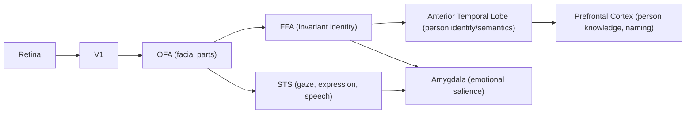

## Face Perception and Recognition

### Overview

Face perception is a specialized domain of visual cognition involving the detection, structural encoding, and identification of faces, as well as extraction of socially relevant information such as expression, gaze direction, age, and identity. It is supported by a distributed but partially domain-specific cortical network, most notably the fusiform face area (FFA), and is theorized to rely on distinct computational mechanisms — particularly holistic/configural processing — that differentiate it from generic object recognition.

### Core Neural Network

**Key Points**

- **Occipital Face Area (OFA)**: Early stage; processes face parts and low-level facial features, feeding into both downstream nodes.
- **Fusiform Face Area (FFA)**: Core node for invariant facial identity representation; located in the lateral mid-fusiform gyrus, typically right-lateralized.
- **Superior Temporal Sulcus (STS)**: Processes changeable facial aspects — eye gaze, expression, lip movement — supporting social and communicative inference.
- **Extended system**: Includes amygdala (emotional salience), anterior temporal lobe (person-identity/semantic knowledge), and orbitofrontal cortex (trait/attractiveness judgments).

This maps onto the influential **Haxby et al. (2000) core-extended model**, distinguishing a core system (OFA, FFA, STS) for visual analysis from an extended system for interpreting socially and emotionally relevant information.

### Computational/Representational Principles

**Holistic and Configural Processing**

Faces are processed as integrated wholes rather than as independent collections of parts, distinguishing face perception from typical object recognition, which is more part-based/componential.

- **Configural processing**: Sensitivity to the spatial relations between features (e.g., inter-eye distance, nose-to-mouth distance).
- **Holistic processing**: Integration of features into a single, non-decomposable perceptual representation.

**Signature Behavioral Markers**

1. **Composite face effect**: Aligning the top half of one face with the bottom half of another creates a new, blended percept that is difficult to recognize as coming from separate identities; misaligning the halves restores independent recognition of each half — demonstrating obligatory holistic integration.
2. **Face inversion effect**: Recognition accuracy drops disproportionately for inverted faces relative to inverted non-face objects, indicating that face-specific configural processing is highly orientation-dependent.
3. **Thatcher illusion**: Locally inverting the eyes and mouth within an upright face context is strikingly grotesque, but the same manipulation is far less noticeable when the whole face is inverted — because inversion disrupts configural processing needed to detect the local anomaly.

### Norm-Based Coding Model

Face identity is theorized to be encoded relative to a average/prototype "norm face" in a multidimensional face space, where each dimension encodes some physiognomic feature (e.g., face width, eye separation).

$$d(\vec{f}) = \|\vec{f} - \vec{f}_{\text{norm}}\|$$

where $\vec{f}$ is a given face's position in face space and $\vec{f}_{\text{norm}}$ is the population-average norm face; identity strength/distinctiveness is proportional to displacement from the norm. This model accounts for behavioral phenomena such as:

- **Face adaptation aftereffects**: Prolonged exposure to a distorted face shifts perceptual norms, making a previously "normal" face appear distorted in the opposite direction.
- **Caricature effects**: Exaggerating a face's deviation from the norm along its identity-defining dimensions improves recognizability.

[Inference] Norm-based coding is one of several competing computational accounts (alongside exemplar-based and feature-based models); the degree to which FFA population activity strictly implements norm-based vector coding versus a more general similarity space remains debated in the literature.

### Illustrative Processing Diagram

### Example: Recognizing a Familiar Face

1. OFA extracts basic facial features (eyes, nose, mouth) from the retinal image.
2. FFA integrates these into a holistic configural representation, comparing the face's position in face-space to stored identity templates.
3. If a close match to a stored representation is found, this activates person-identity nodes in the anterior temporal lobe, linking to semantic knowledge (occupation, relationship, biographical facts) and eventually name retrieval — consistent with **Bruce and Young's (1986) sequential model** of face recognition (structural encoding → face recognition units → person identity nodes → name retrieval).
4. Simultaneously, STS processes the face's current expression and gaze direction, informing real-time social inference independent of identity recognition.

### Clinical Evidence

- **Prosopagnosia (acquired)**: Damage to right (or bilateral) fusiform/occipitotemporal cortex causes a selective deficit in face identity recognition, often with preserved object recognition, supporting domain-specific processing.
- **Developmental prosopagnosia**: A lifelong face-recognition impairment without identifiable brain lesion, [Inference] believed to reflect atypical development of face-processing circuitry, with prevalence estimates in the literature varying based on diagnostic criteria used.
- **Capgras delusion**: Patients recognize a face as familiar-looking but report the person is an impostor; one influential account attributes this to a disconnection between the ventral face-recognition pathway (intact overt recognition) and the amygdala-mediated affective familiarity signal normally elicited by that recognition.
- **Autism spectrum studies**: Some research reports reduced FFA activation and atypical gaze patterns (reduced eye-region fixation) during face processing tasks. [Unverified] Findings on FFA hypoactivation in autism are mixed across studies, with some attributing early results to reduced fixation on the eye region rather than a categorical face-processing deficit.

### Development of Face Perception

- Newborns show a preference for face-like stimuli (schematic configurations) within hours of birth, suggesting early perceptual biases toward face-like patterns.
- The "other-race effect" (better recognition of own-race faces) emerges through differential perceptual experience/tuning during infancy and childhood, consistent with experience-dependent narrowing.
- Full adult-level holistic processing and FFA specialization continue developing through adolescence.

### Common Misconceptions

- **Myth**: Face recognition relies on a single dedicated "face module" that is entirely separate from general object recognition.

  **Fact**: While FFA shows strong face-selectivity, it also responds (to a lesser degree) to other stimuli, and expertise-based accounts propose the region may support any category of stimuli processed with high individuation demands and holistic strategies. [Inference] The domain-specificity vs. expertise (e.g., Greeble-training studies) debate remains unresolved, with evidence on both sides.
- **Myth**: Face inversion effects prove faces are processed by dedicated hardware unrelated to general vision.

  **Fact**: Inversion effects are consistent with, but do not uniquely prove, domain-specific modularity; they are also compatible with strong perceptual expertise accounts.

### Related Topics

- Ventral stream and object recognition
- Emotional expression processing and the amygdala
- Prosopagnosia (acquired vs. developmental)
- Holistic vs. featural processing models
- Own-race/other-race face recognition effects
- Person identity and semantic memory retrieval
- Perceptual expertise and category-selective cortex