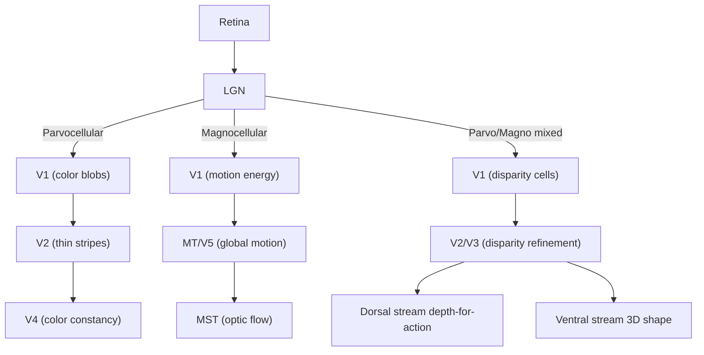

## Color, Motion, and Depth Perception

### Overview

Color, motion, and depth constitute three foundational dimensions of visual perception, each supported by partially dissociable neural subsystems that begin diverging as early as the retina and remain at least partially segregated through extrastriate cortex before converging in higher-order integrative regions. Each dimension solves a distinct inverse-optics problem: recovering a stable perceptual property (surface reflectance, object movement, 3D layout) from inherently ambiguous 2D retinal input.

---

### Part 1: Color Perception

**Key Points**

- **Trichromacy**: Human color vision is based on three cone photoreceptor types (S, M, L cones), each with distinct but overlapping spectral sensitivity curves, peaking roughly in short (~420 nm), medium (~530 nm), and long (~560 nm) wavelengths.
- **Opponent-process coding**: Retinal ganglion cells and LGN neurons encode color via opponent channels: red-green (L vs. M), blue-yellow (S vs. L+M), and a luminance (black-white) channel — reconciling trichromatic receptor input with opponent perceptual phenomena (afterimages, unique hues).
- **Cortical processing**: Parvocellular LGN input feeds into V1 (blob regions), then V2 (thin stripes), converging on **V4**, considered a key locus for color constancy computation.

**Color Constancy**

The visual system estimates surface reflectance relatively independent of the spectral composition of the illuminant, allowing an object to appear a stable color under varying lighting.

$$C_{\text{perceived}} = f\left(\frac{L_{\text{surface}}}{L_{\text{illuminant}}}\right)$$

where perceived color depends on an estimate of surface reflectance relative to illuminant properties, rather than raw retinal luminance. [Inference] The precise algorithm the visual system uses (e.g., retinex-style local contrast normalization vs. more complex scene-statistics inference) is still an area of active computational modeling debate, and phenomena such as "The Dress" illusion illustrate that individual differences in illuminant assumptions can produce dramatically different percepts from identical retinal input.

**Clinical Evidence**: Cerebral achromatopsia — acquired color blindness from bilateral V4/fusiform lesions — causes patients to perceive the world in grayscale despite normal retinal cone function, dissociating cortical color processing from photoreceptor-level color sensing.

---

### Part 2: Motion Perception

**Key Points**

- **V1**: Direction-selective simple/complex cells detect local motion energy but are subject to the aperture problem.
- **MT/V5**: Integrates local motion signals into coherent global motion vectors; lesions produce akinetopsia (motion blindness).
- **MST**: Processes complex optic flow patterns (expansion/contraction, rotation), supporting heading judgments and self-motion perception during locomotion.

**Motion Energy Models**

A dominant computational framework (Adelson & Bergen's motion energy model) proposes that direction-selective V1 neurons compute motion via spatiotemporally oriented filters — essentially detecting orientation in a joint space-time domain rather than tracking discrete features frame-by-frame.

**Apparent Motion**

The visual system perceives continuous motion from discrete, alternating static stimuli (as in film/animation) when spatial and temporal gaps fall within specific psychophysical limits — demonstrating that motion perception is a constructed inference rather than a direct readout of retinal displacement.

**Biological Motion**

Point-light-walker displays (a small number of moving dots marking joint positions) are sufficient to convincingly perceive human movement, gender, action, and even emotional state, implicating specialized processing in the STS region for socially relevant motion, distinct from MT/MST object-motion processing.

---

### Part 3: Depth Perception

**Key Points**

Depth perception relies on integrating multiple, partially redundant cues:

| Cue Type | Examples | Key Region |
| --- | --- | --- |
| Binocular | Stereopsis (retinal disparity), convergence | V1 (disparity-tuned cells), V2/V3 |
| Monocular (pictorial) | Occlusion, relative size, linear perspective, texture gradient, shading | V1–V4, higher visual areas |
| Monocular (motion-based) | Motion parallax, optic flow | MT/MST |
| Oculomotor | Accommodation (lens focus) | Integrated with cortical estimates |

**Stereopsis and Binocular Disparity**

Because the two eyes are horizontally separated, they receive slightly different retinal images of the same scene; the visual system computes **binocular disparity** — the positional difference between corresponding points in the two images — to derive depth.

$$\theta_{\text{disparity}} \approx \frac{I \cdot \Delta d}{D^2}$$

where $I$ is interocular distance, $D$ is viewing distance, and $\Delta d$ is the depth difference between two points — illustrating why disparity-based depth sensitivity declines with increasing viewing distance. Disparity-tuned neurons first emerge in V1 and are further refined in V2/V3, contributing ultimately to depth representations used by both dorsal (action-guidance) and ventral (3D shape recognition) streams.

**Cue Integration**

The brain combines multiple depth cues in a manner consistent with statistically optimal (Bayesian) cue combination, weighting each cue according to its reliability (inverse variance) in the current context.

$$\hat{D} = \frac{\sum_i w_i D_i}{\sum_i w_i}, \quad w_i \propto \frac{1}{\sigma_i^2}$$

where $\hat{D}$ is the combined depth estimate, $D_i$ is the estimate from cue $i$, and $w_i$ its reliability-based weight. [Inference] Near-optimal Bayesian cue integration is well-supported psychophysically for several cue pairings (e.g., visual-haptic, disparity-texture), though the neural implementation of these reliability-weighted computations is still being characterized.

---

### Illustrative Processing Diagram

### Example: Catching a Thrown Ball

1. **Motion**: MT computes the ball's trajectory and speed from retinal motion signals; MST integrates this with observer self-motion (if the catcher is running).
2. **Depth**: Binocular disparity (at close range) and motion parallax/size-change cues (as the ball approaches) are integrated to estimate time-to-contact.
3. **Color**: While not essential to the catch itself, V4-mediated color constancy ensures the ball's color (e.g., "red") appears stable as lighting changes across the trajectory, aiding continuous tracking and identification.
4. These streams converge in parietal cortex for real-time visuomotor guidance of the reaching/catching action.

### Clinical and Experimental Dissociations

- **Achromatopsia** (V4 damage): Loss of color perception with preserved motion and depth perception — demonstrating separability of the color pathway.
- **Akinetopsia** (MT/V5 damage): Loss of motion perception with preserved color and (largely) depth perception via static cues.
- **Stereoblindness**: Loss of binocular disparity-based depth perception (e.g., from strabismus disrupting binocular development), with monocular depth cues remaining available as compensation.

### Common Misconceptions

- **Myth**: Depth perception depends primarily on binocular stereopsis.

  **Fact**: Monocular cues (occlusion, relative size, motion parallax) provide robust depth information and are sufficient for functional depth perception even in individuals lacking stereopsis (e.g., from early strabismus).
- **Myth**: Color, motion, and depth are processed in completely separate, non-communicating channels through the entire visual system.

  **Fact**: While early extrastriate areas show relative functional segregation, substantial cross-talk and convergence occur, particularly from V2/V3 onward, and behavior (e.g., catching a colored moving ball in depth) requires their integration.

### Related Topics

- Ventral stream and object recognition
- Dorsal stream and spatial vision
- Binocular disparity and stereopsis neural mechanisms
- Bayesian cue integration in perception
- Biological motion and STS processing
- Color constancy computational models
- Optic flow and self-motion perception