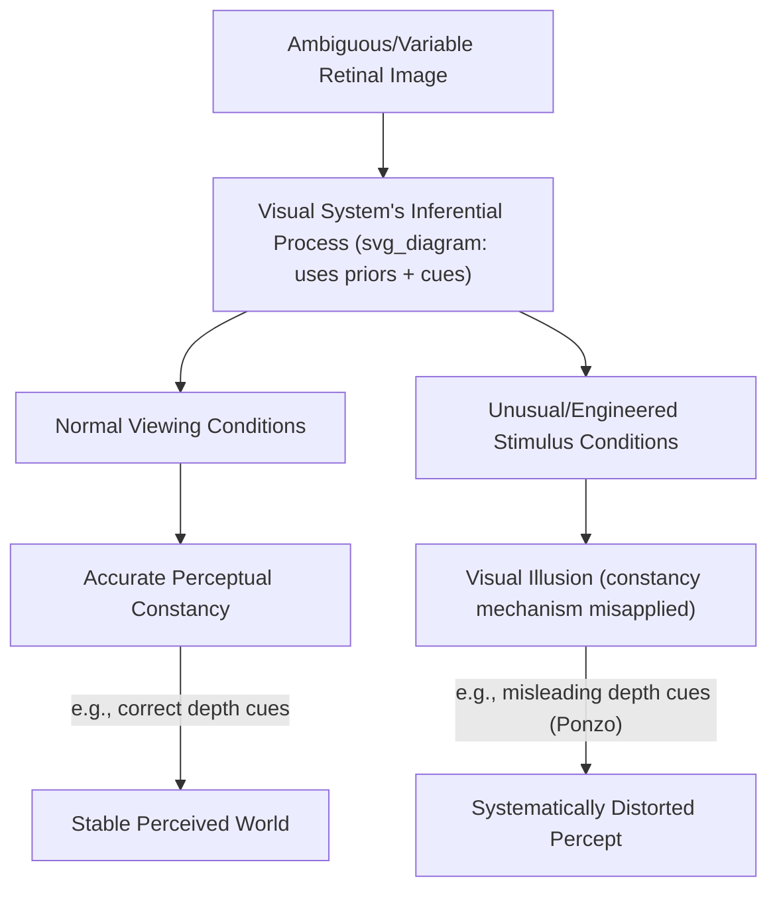

## Visual Illusions and Perceptual Constancy

### Overview

Perceptual constancy and visual illusions are two sides of the same computational coin: constancy mechanisms allow the visual system to infer stable properties of the world (size, shape, color, lightness) from a variable and ambiguous retinal image, while illusions arise when the assumptions underlying those inference mechanisms are violated or exploited by unusual stimulus configurations. Studying illusions provides a powerful window into the implicit inferential rules and prior assumptions the visual system uses to solve otherwise underdetermined perceptual problems.

---

### Part 1: Perceptual Constancy

**Key Points — Major Constancy Types**

| Constancy Type | What Is Stabilized | Primary Cue Basis |
| --- | --- | --- |
| Size constancy | Perceived physical size despite retinal image size changes with distance | Distance cues (binocular, monocular) |
| Shape constancy | Perceived object shape despite retinal image distortion with viewing angle | Surface orientation cues |
| Lightness/color constancy | Perceived surface reflectance despite illumination changes | Illuminant estimation, local contrast |
| Position constancy | Perceived stable world position despite eye/head movement | Efference copy, vestibular signals |

**Size Constancy**

The visual system scales perceived size using a computation that (implicitly) incorporates perceived distance, such that objects at greater distances — despite producing smaller retinal images — are not perceived as physically smaller.

$$S_{\text{perceived}} \propto \theta_{\text{retinal}} \times D_{\text{perceived}}$$

where $\theta_{\text{retinal}}$ is retinal image angular size and $D_{\text{perceived}}$ is the perceived (inferred) distance to the object — this relationship, sometimes summarized as **Emmert's Law**, predicts that if perceived distance is miscalibrated, perceived size will be systematically distorted even though retinal size is unchanged.

**Shape and Lightness Constancy**

Shape constancy relies on the visual system discounting the retinal distortion produced by viewing an object at a slant, using surface-orientation cues (texture gradients, contour information) to recover the object's true 3D shape. Lightness constancy relies on estimating and factoring out the illuminant, so a white object under dim light and a gray object under bright light — which may produce identical retinal luminance — are correctly perceived as differing in reflectance.

---

### Part 2: Visual Illusions as Failures/Exploitations of Constancy Mechanisms

**Geometric-Optical Illusions**

- **Müller-Lyer illusion**: Two equal-length lines appear different in length depending on whether their end-caps point inward or outward. [Inference] The leading explanation (the "misapplied size-constancy theory," Gregory 1963) proposes the visual system misinterprets the arrow configurations as depth/corner cues (analogous to inside vs. outside building corners), triggering inappropriate size-scaling; this account is influential but not universally accepted, and cross-cultural studies (e.g., reduced susceptibility in some non-"carpentered" environments) are cited as supporting evidence, though such cross-cultural findings have also faced methodological critique.
- **Ponzo illusion**: Two identical horizontal lines superimposed on converging lines (suggesting linear perspective/receding railway tracks) appear different in length; the upper line, appearing more "distant" due to perspective cues, is perceived as larger — directly analogous to size-constancy scaling based on inferred depth.
- **Ebbinghaus (Titchener) illusion**: A central circle appears larger when surrounded by small circles and smaller when surrounded by large circles — attributed to relative-size context effects and, in some accounts, contextual assimilation/contrast in visual comparison judgments rather than depth-based scaling specifically.

**Lightness/Brightness Illusions**

- **Checker-shadow illusion (Adelson)**: Two patches of identical physical luminance appear markedly different in perceived lightness because one is interpreted as being in shadow — the visual system discounts the inferred shadow, "correcting" the reflectance estimate upward for the shadowed patch.
- **Simultaneous contrast**: A gray patch appears lighter against a dark background and darker against a light background, reflecting local contrast-normalization mechanisms operating early in the visual pathway (retina through V1).

**Ambiguous and Bistable Figures**

- **Necker cube, Rubin's vase**: Stimuli compatible with two mutually exclusive interpretations, with perception spontaneously alternating between them — demonstrating that the visual system commits to single, internally consistent scene interpretations rather than representing raw sensory ambiguity, and providing a behavioral window into the dynamics of perceptual inference/competition.

**Motion-Based Illusions**

- **Waterfall illusion (motion aftereffect)**: After prolonged viewing of consistent unidirectional motion, a subsequently viewed static scene appears to drift in the opposite direction — attributed to adaptation-induced imbalance in opponent direction-selective neural populations in MT.
- **Autokinetic effect**: A single stationary point of light in an otherwise dark, featureless field appears to move erratically, illustrating that motion perception depends on relative reference frames, which are absent in this impoverished stimulus.

---

### Computational Framework: Perception as Unconscious Inference

A unifying theoretical account (tracing to Helmholtz's concept of "unconscious inference," formalized in modern Bayesian perceptual models) holds that the visual system combines noisy sensory evidence with learned prior expectations about the world to generate the most probable interpretation of the scene.

$$P(\text{scene} \mid \text{image}) \propto P(\text{image} \mid \text{scene}) \, P(\text{scene})$$

where the posterior probability of a given scene interpretation is proportional to how well it explains the retinal image (likelihood) combined with how probable that scene configuration is a priori (prior). Illusions emerge when stimuli are constructed such that the prior-driven interpretation diverges from the physically "true" stimulus property, or when the stimulus falls outside the range of configurations the prior was tuned to (e.g., natural scenes rarely contain isolated geometric line configurations like the Müller-Lyer arrows). [Inference] This Bayesian framework is widely used as an explanatory heuristic across perceptual illusions, but for many classic illusions the specific prior distributions and inference computations are inferred post hoc from the illusion itself rather than independently measured and verified, which limits its status as a fully predictive (rather than descriptive) model in some cases.

---

### Illustrative Diagram: Constancy-Illusion Relationship

### Example: The Ames Room

1. An irregularly shaped room is constructed so that, from one specific viewpoint, its trapezoidal geometry produces a retinal image identical to that of a normal rectangular room.
2. The visual system, relying on the strong prior that rooms are rectangular (a "carpentered world" assumption), infers a standard rectangular room shape.
3. Because the true room geometry places one back corner much closer to the viewer than the other, two people of equal height standing in opposite corners produce dramatically different retinal image sizes.
4. Since the visual system has already (incorrectly) resolved depth under the rectangular-room assumption, it attributes the retinal size difference to actual physical size difference — producing the striking illusion that one person appears "giant" and the other "tiny."
5. This illustrates size constancy actively producing an illusion when its underlying distance-inference assumption is deliberately violated by the stimulus construction.

### Clinical and Individual-Difference Considerations

- **Schizophrenia spectrum research**: Some studies report reduced susceptibility to certain illusions (e.g., some visual context effects) in individuals with schizophrenia. [Unverified] Findings are mixed across illusion types and studies, and the interpretation — whether reflecting altered prior-weighting, reduced top-down integration, or task/attention confounds — remains debated in the literature.
- **Autism spectrum research**: Some studies report reduced susceptibility to certain context-dependent illusions (e.g., Ebbinghaus), which has been interpreted under "weak central coherence" or enhanced local-processing theoretical frameworks. [Unverified] As with schizophrenia research, results vary across specific illusions and study populations, and replication has been inconsistent for some effects.
- **Developmental trajectory**: Susceptibility to many classic geometric illusions changes across development, consistent with the idea that priors are shaped and refined through cumulative visual experience with regularities in the natural/built environment.

### Common Misconceptions

- **Myth**: Illusions represent "errors" or malfunctions of the visual system.

  **Fact**: Most illusions are consequences of adaptive inferential mechanisms that are highly effective in typical, ecologically valid viewing conditions; illusions typically arise only under artificially engineered or atypical stimulus configurations.
- **Myth**: All visual illusions share a single common mechanism.

  **Fact**: Illusions span multiple distinct mechanisms — low-level contrast/adaptation effects, mid-level grouping and context effects, and high-level inferential/depth-cue misapplications — and should not be treated as a unitary phenomenon.

### Related Topics

- Bayesian models of perception and unconscious inference
- Depth cue integration and size constancy mechanisms
- Lightness and color constancy computations
- Bistable perception and perceptual rivalry
- Motion aftereffects and neural adaptation
- Cross-cultural studies of illusion susceptibility
- Perceptual priors in atypical populations (autism, schizophrenia)