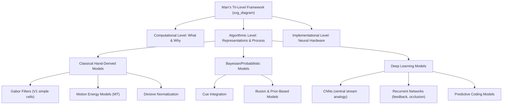

## Computational Models of Visual Processing

### Overview

Computational models of visual processing formalize how the brain transforms raw retinal input into structured perceptual representations, spanning multiple levels of analysis from biophysically detailed neural models to abstract normative (ideal-observer) frameworks. David Marr's tri-level framework — computational, algorithmic, and implementational levels of analysis — remains a foundational organizing structure for this field, and modern approaches increasingly integrate classical hand-derived models with data-driven deep learning architectures.

---

### Part 1: Levels of Computational Analysis (Marr's Framework)

**Key Points**

- **Computational level**: What problem is being solved and why (e.g., recovering 3D structure from 2D retinal images; achieving invariant object recognition).
- **Algorithmic/representational level**: What representations and processes/algorithms achieve the computational goal (e.g., edge detection via local contrast gradients; hierarchical feature pooling).
- **Implementational level**: How the algorithm is physically realized in neural hardware (e.g., specific circuit connectivity, receptive field properties, spike-based coding).

[Inference] Marr's framework remains widely taught as an organizing heuristic, though many contemporary models (particularly deep learning-based ones) blur the boundary between algorithmic and implementational levels, since learned weights in artificial networks do not map cleanly onto either category.

---

### Part 2: Classical (Hand-Derived) Computational Models

**Early Vision: Filtering and Feature Extraction**

- **Difference-of-Gaussians (DoG) and center-surround models**: Model retinal ganglion cell and LGN receptive fields as spatial bandpass filters, approximating edge and contrast detection.
- **Gabor filter models of V1 simple cells**: V1 simple-cell receptive fields are well-approximated by 2D Gabor functions (sinusoidal gratings windowed by a Gaussian envelope), jointly tuned for orientation and spatial frequency.

$$G(x, y) = \exp\left(-\frac{x'^2 + \gamma^2 y'^2}{2\sigma^2}\right) \cos\left(2\pi \frac{x'}{\lambda} + \psi\right)$$

where $x', y'$ are rotated coordinates aligned to the filter's preferred orientation, $\sigma$ controls the Gaussian envelope size, $\lambda$ is spatial wavelength, and $\psi$ is phase — this formalization, derived independently in engineering contexts, closely matches empirically measured V1 simple-cell tuning properties.

**Motion Energy Models**

Adelson and Bergen's motion energy model computes local motion direction using pairs of space-time oriented filters in quadrature (90° phase-shifted), squaring and summing their outputs to produce a phase-invariant "motion energy" signal — providing an algorithmic account of V1 direction-selective complex cells without requiring explicit feature tracking across frames.

**Normalization Models**

The **divisive normalization** model (Heeger and colleagues) proposes that a neuron's response is suppressively normalized by the pooled activity of neighboring neurons:

$$R_i = \frac{r_i^n}{\sigma^n + \sum_j r_j^n}$$

where $R_i$ is the normalized output, $r_i$ is the neuron's driven (unnormalized) response, and the denominator reflects pooled activity across a local population $j$. [Inference] Divisive normalization is considered by many researchers a strong candidate for a "canonical cortical computation" because similar normalization equations fit response data across many visual areas and even non-visual cortical regions, though this canonical-computation claim remains a hypothesis rather than a fully established, universally accepted principle.

---

### Part 3: Bayesian and Probabilistic Models

Building on the "vision as inference" framework, Bayesian models formalize perception as combining sensory likelihood with prior expectations to produce a posterior estimate of scene properties.

$$\hat{\theta} = \arg\max_{\theta} \, P(\theta \mid \text{image}) = \arg\max_{\theta} \, P(\text{image} \mid \theta)\, P(\theta)$$

where $\hat{\theta}$ is the inferred scene parameter (e.g., depth, motion direction, surface reflectance). These models have successfully predicted specific quantitative patterns in cue-integration psychophysics (e.g., reliability-weighted combination of depth cues) and various illusion phenomena, framing them as rational inference given plausible priors about the world (e.g., "light comes from above," "objects tend to be stationary" — the latter used to explain certain motion-related perceptual biases).

---

### Part 4: Neural Network and Deep Learning Models

**Convolutional Neural Networks (CNNs) as Ventral Stream Models**

Deep CNNs trained on large-scale object recognition tasks have become a dominant modern tool for modeling ventral stream hierarchical processing, motivated by structural analogies:

- Convolutional layers with local receptive fields and weight-sharing parallel retinotopic, translation-tolerant cortical organization.
- Layer depth correlates with representational complexity, paralleling the V1→V4→IT hierarchy.
- Intermediate/late CNN layers show strong correlation with neural population responses recorded in macaque V4 and IT, and are used to generate quantitative, image-computable predictions of neural activity — a capability earlier hand-derived models generally lacked.

[Inference] The strength of CNN-brain correspondence is typically measured via representational similarity analysis or linear "neural predictivity" mapping; while these correlational metrics are often strong for object-recognition-optimized networks, this does not establish that CNNs use biologically identical mechanisms, and standard backpropagation training is widely considered biologically implausible as a literal learning rule.

**Recurrent and Predictive Coding Models**

- **Recurrent neural networks (RNNs)**: Incorporate feedback/recurrent connections, better capturing temporal dynamics and recognition under challenging conditions (occlusion, clutter) than purely feedforward CNNs, and offering closer correspondence to the known extensive feedback connectivity in visual cortex.
- **Predictive coding models**: Propose that cortical hierarchies primarily transmit prediction errors — the difference between top-down predicted input and actual bottom-up sensory input — rather than raw sensory data itself, with higher areas continuously generating predictions that are compared against and used to refine lower-area representations.

$$\epsilon_l = x_l - \hat{x}_l(\text{top-down prediction from } l+1)$$

where $\epsilon_l$ is the prediction error at level $l$, propagated forward to update higher-level representations. [Inference] Predictive coding is an influential theoretical framework with growing but still incomplete direct neurophysiological validation; it remains one of several competing accounts of cortical feedback function rather than a fully settled empirical conclusion.

---

### Illustrative Diagram: Model Landscape

### Example: Modeling a Simple Object Recognition Pipeline

1. **Computational level**: The goal is invariant categorization — correctly labeling an object despite variation in pose, lighting, and position.
2. **Algorithmic level (classical)**: Apply Gabor-filter banks to approximate V1 edge detection, followed by hand-designed pooling and feature-combination rules (e.g., HMAX model) to build translation/scale tolerance.
3. **Algorithmic level (deep learning)**: Train a CNN end-to-end on labeled images; convolutional layers learn hierarchical filters without explicit hand-derivation, and tolerance emerges from pooling operations (e.g., max-pooling) combined with data-driven optimization.
4. **Model evaluation**: Compare each model's internal layer activations to recorded neural responses (via representational similarity analysis) to assess which model architecture best predicts biological visual cortex activity at each processing stage.
5. **Implementational level**: Investigate whether specific circuit motifs (e.g., normalization circuits, recurrent lateral connections) found in cortex can be mapped onto specific computational operations within the winning model.

### Model Validation Approaches

- **Neural predictivity**: Using model layer activations as regressors to predict single-neuron or population (fMRI/ECoG) responses to novel images.
- **Representational similarity analysis (RSA)**: Comparing the geometric structure (pairwise dissimilarity patterns) of model representations to neural representational geometry, independent of the specific coordinate system used.
- **Behavioral benchmarking**: Comparing model error patterns, confusion matrices, and psychophysical thresholds to human behavioral data (e.g., do model and human errors correlate on the same difficult images?).
- **Adversarial and out-of-distribution testing**: Assessing whether models fail in human-like or non-human-like ways under challenging conditions (adversarial perturbations, textural vs. shape bias manipulations), often revealing systematic divergences between standard CNNs and human perceptual biases (e.g., documented texture-bias tendencies in some standard-trained CNNs relative to humans' shape-bias tendencies).

### Common Misconceptions

- **Myth**: Deep learning models of vision are essentially biologically accurate simulations of the visual cortex.

  **Fact**: While CNNs show meaningful representational correspondence to visual cortex at a population level, they differ substantially in learning rules, energy efficiency, recurrent processing, and specific failure modes (e.g., susceptibility to adversarial perturbations that do not fool humans), so correspondence should be interpreted as partial and level-specific rather than complete equivalence.
- **Myth**: Bayesian models and neural network models are competing, mutually exclusive frameworks.

  **Fact**: They operate largely at different levels of Marr's hierarchy (Bayesian models often at the computational/normative level, neural networks often at the algorithmic/implementational level) and are increasingly combined, e.g., in Bayesian deep learning and probabilistic generative model architectures.

### Related Topics

- Ventral stream and object recognition
- Bayesian models of perception and unconscious inference
- Predictive coding and cortical feedback processing
- Convolutional neural networks and biological vision correspondence
- Representational similarity analysis methodology
- Divisive normalization as a canonical cortical computation
- Motion energy models and area MT