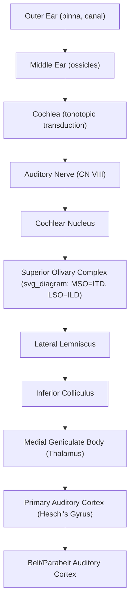

## Auditory Pathway from Cochlea to Cortex

### Overview

The auditory pathway transforms mechanical sound energy into neural signals at the cochlea and relays this information through a complex, multi-synaptic subcortical pathway before reaching primary auditory cortex. Unlike the visual system's relatively direct thalamic relay, the auditory pathway involves multiple brainstem nuclei performing substantial pre-cortical computation, particularly for sound localization and temporal pattern extraction.

### Peripheral Transduction

**Key Points**

- **Outer ear**: Pinna and ear canal collect and funnel sound waves, with the pinna shape contributing direction-dependent spectral filtering used for elevation localization.
- **Middle ear**: Tympanic membrane vibrations are mechanically transmitted via the ossicles (malleus, incus, stapes), which provide impedance matching between air-conducted sound and the fluid-filled cochlea, amplifying pressure roughly 20-fold.
- **Cochlea**: The spiral, fluid-filled structure containing the basilar membrane and organ of Corti; performs mechanical frequency analysis via **tonotopic organization** — the basilar membrane's stiffness gradient causes high frequencies to maximally displace the base (near the oval window) and low frequencies to maximally displace the apex.
- **Hair cells**: Inner hair cells (IHCs, ~3,500 in humans) are the primary sensory transducers, synapsing onto auditory nerve fibers; outer hair cells (OHCs, ~12,000) provide active mechanical amplification (the cochlear amplifier), sharpening frequency tuning and enhancing sensitivity to faint sounds via electromotility.

**Mechanotransduction**

Hair cell stereocilia are connected by tip-links; sound-induced basilar membrane displacement deflects stereocilia, mechanically gating transduction channels and producing graded receptor potentials that trigger neurotransmitter (glutamate) release onto auditory nerve fiber terminals.

### Subcortical Pathway

**Key Points — Ascending Stations**

1. **Auditory (cochlear) nerve (CN VIII)**: Spiral ganglion neurons project tonotopically to the cochlear nucleus; each fiber's spontaneous and driven firing preserves frequency-specific (tonotopic) and intensity information from its cochlear origin.
2. **Cochlear nucleus (CN)**: First central auditory relay in the brainstem, comprising dorsal and ventral subdivisions with distinct cell types performing parallel processing of different acoustic features (e.g., onset timing, sustained rate coding, spectral shape).
3. **Superior olivary complex (SOC)**: First site of binaural (bilateral) convergence; critical for sound localization computations — medial superior olive (MSO) computes interaural time differences (ITDs), lateral superior olive (LSO) computes interaural level differences (ILDs).
4. **Lateral lemniscus**: Ascending fiber tract with embedded nuclei performing further temporal and spectral processing.
5. **Inferior colliculus (IC)**: Major integrative midbrain hub; nearly all ascending auditory pathways converge here, and it is essential for the auditory startle reflex and further localization/pattern-integration processing.
6. **Medial geniculate body (MGB) of the thalamus**: Auditory thalamic relay, analogous to LGN in vision; ventral division preserves tonotopic organization en route to primary auditory cortex, while other divisions project more diffusely, feeding non-tonotopic/multisensory processing.
7. **Primary auditory cortex (A1, Heschl's gyrus)**: Located in the superior temporal gyrus; maintains tonotopic organization and performs initial cortical spectral/temporal feature analysis.

### Sound Localization Computations

**Interaural Time Difference (ITD)**

For low-frequency sounds, the MSO computes microsecond-scale differences in arrival time between the two ears using coincidence-detector neurons, formalized in the classic **Jeffress model**: neurons receive inputs from both ears via axons of systematically varying conduction delay, such that a given coincidence-detector neuron fires maximally when the delay exactly compensates for a specific ITD, creating a labeled-line map of azimuthal position.

$$\text{ITD} \approx \frac{r \, (\theta + \sin\theta)}{c}$$

where $r$ is head radius, $\theta$ is the azimuthal sound source angle, and $c$ is the speed of sound — approximating the geometric path-length difference reaching the two ears (the Woodworth formula). [Inference] While the Jeffress coincidence-detection model is classically well-supported in the avian auditory system (barn owl), [Unverified] the degree to which mammals (including humans) implement ITD detection via the same delay-line coincidence-detector architecture versus alternative mechanisms (e.g., relying more on relative firing-rate codes across two broadly-tuned channels) remains actively debated in the comparative auditory neuroscience literature.

**Interaural Level Difference (ILD)**

For high-frequency sounds, where the head casts an acoustic "shadow," the LSO compares sound intensity between ears via an excitatory-inhibitory (ipsilateral excitation, contralateral inhibition) mechanism, producing a rate-based code for azimuthal position that complements the ITD-based low-frequency mechanism (the **duplex theory of localization**).

### Illustrative Pathway Diagram

### Cortical Organization Beyond A1

- **Tonotopic core**: A1 and surrounding "belt" areas maintain frequency-organized maps, analogous to retinotopy in vision.
- **Dual-stream model of audition**: Analogous to the visual system, auditory processing is proposed to bifurcate into a **"what" pathway** (anterior temporal, supporting sound/speech identification) and a **"where/how" pathway** (posterior/parietal-directed, supporting spatial localization and sensorimotor integration for speech production). [Inference] This dual-stream framework, while influential and supported by lesion and neuroimaging dissociations, is an extension by analogy from the visual model and continues to be refined regarding the precise boundaries and computations of each proposed pathway.

### Example: Localizing a Sound Source (Someone Calling Your Name from the Left)

1. Sound reaches the left ear microseconds before the right ear and at higher intensity (due to head shadow effects).
2. Cochlear tonotopic transduction encodes the frequency content in both ears in parallel.
3. MSO neurons perform ITD-based coincidence detection for the low-frequency components; LSO neurons perform ILD-based comparison for high-frequency components.
4. These converge at the inferior colliculus, generating an integrated azimuthal location estimate.
5. Signals ascend via MGB to A1 and are further processed in the posterior "where" auditory stream for orienting behavior (e.g., turning the head toward the source), while parallel processing in the "what" stream identifies the acoustic pattern as a spoken name.

### Clinical and Experimental Evidence

- **Sensorineural hearing loss**: Typically arises from hair cell or auditory nerve damage (e.g., noise-induced OHC loss), producing elevated thresholds and, notably, reduced frequency selectivity due to loss of the active cochlear amplifier mechanism.
- **Auditory brainstem response (ABR)**: A clinical/research EEG technique measuring sequential neural volleys through the subcortical pathway (waves I–V corresponding roughly to auditory nerve through lateral lemniscus/IC), used to assess pathway integrity and estimate hearing thresholds in non-verbal populations (e.g., infants).
- **Cortical deafness**: Rare bilateral A1/auditory cortex lesions can abolish conscious sound perception despite an intact peripheral and subcortical pathway, dissociating cortical from subcortical auditory processing.
- **Auditory neuropathy spectrum disorder**: Dysfunction at the level of the inner hair cell synapse or auditory nerve, producing disrupted temporal coding despite preserved cochlear amplification (intact otoacoustic emissions), illustrating a specific dissociation within the peripheral-to-central pathway.

### Common Misconceptions

- **Myth**: The auditory pathway is a simple, direct relay analogous to a single-synapse reflex arc.

  **Fact**: The subcortical auditory pathway is unusually multi-synaptic and computationally active compared to other sensory systems, performing substantial localization and temporal-pattern processing before signals ever reach cortex.
- **Myth**: Sound localization is computed entirely in auditory cortex.

  **Fact**: The foundational binaural computations (ITD, ILD) occur in brainstem nuclei (MSO, LSO) well before cortical involvement; cortex integrates and refines this pre-processed spatial information rather than computing it from scratch.

### Related Topics

- Sound localization and binaural processing (ITD/ILD)
- Speech perception and auditory "what/where" streams
- Tonotopic organization and cortical maps
- Cochlear implants and auditory prosthetics
- Auditory scene analysis and the cocktail party effect
- Vestibular system and balance processing
- Cross-modal (audiovisual) integration in cortex