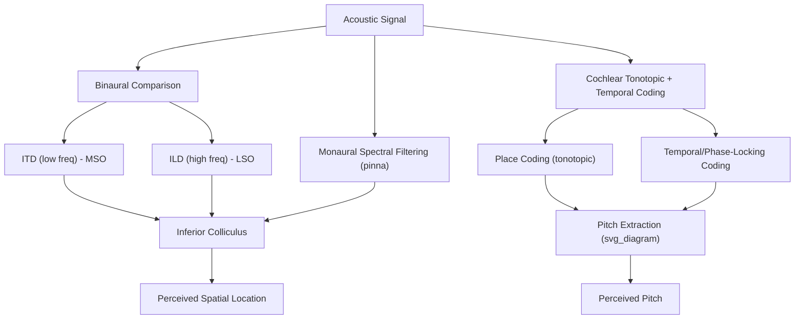

## Sound Localization and Pitch Processing

### Overview

Sound localization and pitch processing represent two of the most computationally demanding tasks performed by the auditory system, each requiring the brain to extract behaviorally critical information from acoustic signals that do not directly encode either property in an obvious, labeled format. Localization relies on comparing signals across the two ears (binaural cues) and monaural spectral filtering, while pitch is derived from the temporal and/or spectral structure of periodic sound waves via mechanisms that remain only partially resolved.

---

### Part 1: Sound Localization

**Key Points — Cue Types**

| Cue | Plane | Mechanism | Primary Neural Site |
| --- | --- | --- | --- |
| Interaural Time Difference (ITD) | Azimuth (horizontal) | Low-frequency phase/onset delay between ears | Medial Superior Olive (MSO) |
| Interaural Level Difference (ILD) | Azimuth (horizontal) | High-frequency head-shadow intensity difference | Lateral Superior Olive (LSO) |
| Spectral (pinna) cues | Elevation, front-back | Direction-dependent filtering by pinna shape | Auditory cortex (with subcortical contributions) |
| Dynamic/head-movement cues | All planes | Change in ITD/ILD/spectral cues with head rotation | Integration across brainstem and cortex |

**Duplex Theory**

Lord Rayleigh's duplex theory holds that ITDs dominate localization for low-frequency sounds (below ~1500 Hz, where the wavelength is long relative to head size, preventing phase ambiguity) while ILDs dominate for high-frequency sounds (where the head effectively casts an acoustic shadow). Mid-frequency sounds fall into an ambiguous "duplex gap," relying more heavily on envelope-based ITD cues and spectral cues for disambiguation.

**Jeffress Coincidence-Detection Model**

MSO neurons are proposed to act as coincidence detectors, receiving inputs from both ears via axons with systematically graded conduction delays; a given neuron responds maximally when input timing from each ear coincides, effectively encoding a specific ITD via a place-coded (labeled-line) map.

$$\text{ITD}_{\max} = \Delta t_{\text{contra}} - \Delta t_{\text{ipsi}}$$

where a neuron's best ITD corresponds to the difference in axonal delay from each ear that produces synchronous arrival at the coincidence-detector cell body. [Inference] This model is well-validated anatomically and physiologically in the barn owl auditory system (in the analogous nucleus laminaris). [Unverified] Whether mammalian MSO neurons implement localization via the same delay-line place-code architecture, or rely more heavily on a two-channel rate-difference code between hemispheric populations, remains an actively contested question in the field, with evidence from different mammalian species (including humans) not fully converging.

**Spectral (Monaural) Cues and the Cone of Confusion**

Because ITD and ILD are ambiguous for sound sources located on a "cone of confusion" (a conical surface of locations equidistant from both ears, producing identical binaural cues), elevation and front-back discrimination rely substantially on direction-dependent spectral filtering imposed by the pinna's complex shape, which the brain learns to interpret through experience (demonstrated by adaptation studies using modified pinna molds).

**Precedence Effect**

In reverberant environments, the auditory system suppresses the localization influence of later-arriving, delayed reflections in favor of the first-arriving wavefront, preventing echo-induced localization confusion — a robust perceptual phenomenon with proposed neural correlates involving inhibitory processing at the level of the inferior colliculus and beyond.

---

### Part 2: Pitch Processing

**Key Points — Competing/Complementary Theories**

- **Place theory**: Pitch is derived from which location along the tonotopically organized basilar membrane (and correspondingly organized central auditory pathway) shows peak activation, consistent with the cochlea's mechanical frequency-to-place mapping.
- **Temporal (periodicity) theory**: Pitch is derived from the temporal pattern of auditory nerve firing, which tends to phase-lock to the stimulus waveform (firing preferentially at a consistent phase of the sound cycle) up to frequencies of roughly 4–5 kHz in humans.
- **Modern consensus (dual mechanism)**: [Inference] Most current models propose that place coding dominates for higher frequencies (where phase-locking degrades) while temporal/periodicity coding contributes substantially for lower frequencies and, critically, for extracting the pitch of complex tones — though the precise weighting and the specific site of "pitch extraction" computation remain debated.

**The Missing Fundamental Phenomenon**

A complex tone consisting only of higher harmonics (e.g., 400, 600, 800 Hz) with the fundamental frequency (200 Hz) physically absent is still perceived as having the pitch corresponding to that missing fundamental. This demonstrates that pitch perception for complex tones is not a simple place-code readout of energy at the fundamental frequency, but instead reflects extraction of the periodicity common to the harmonic series.

$$f_0 = \gcd(f_1, f_2, f_3, \ldots)$$

where the perceived pitch $f_0$ corresponds (approximately) to the greatest common divisor / fundamental periodicity implied by the harmonic components present, even when that literal frequency is physically absent from the stimulus.

**Temporal Fine Structure vs. Envelope**

Complex sounds can be decomposed into a rapidly varying **temporal fine structure** (carrier-like fine timing) and a more slowly varying **envelope** (amplitude modulation pattern). [Inference] Pitch perception for resolved harmonics is thought to rely more heavily on temporal fine structure and place information, while envelope-based periodicity cues become more important for unresolved harmonics and for certain clinical populations (e.g., cochlear implant users, whose devices primarily convey envelope information) — though the relative contributions continue to be refined through ongoing psychophysical research.

**Candidate Cortical Pitch-Processing Region**

Neuroimaging and lesion studies have implicated a region anterior/lateral to primary auditory cortex — sometimes termed a "pitch center" near the anterolateral Heschl's gyrus — showing selective responsiveness to pitch-evoking (periodic) sounds relative to spectrally matched noise. [Unverified] The degree to which this reflects a single, anatomically discrete, domain-general "pitch processing module" versus a more distributed and graded computation remains an open question, with some studies reporting inconsistent localization of this putative region across individuals and paradigms.

---

### Illustrative Diagram

### Example: Locating and Identifying a Musical Note from an Unseen Source

1. **Localization**: If the note is low-frequency (e.g., a cello's low string), MSO-based ITD processing dominates spatial estimation; head-shadow-based ILD contributes for any higher harmonic content present.
2. **Front-back/elevation disambiguation**: Pinna-based spectral filtering, combined with small head movements (if permitted), resolves the cone-of-confusion ambiguity.
3. **Pitch identification**: The auditory nerve's phase-locked firing pattern and cochlear place-of-maximal-excitation jointly encode the note's fundamental frequency; even if the instrument's timbre emphasizes higher harmonics, the missing-fundamental mechanism ensures the correct musical pitch is perceived.
4. Both localization and pitch information converge in auditory cortex, where the "what" (identity/pitch/timbre) and "where" (spatial) streams support, respectively, recognizing the note being played and orienting attention toward its source.

### Clinical and Experimental Evidence

- **Cochlear implants**: Provide relatively coarse place-of-stimulation coding (limited to the number of implanted electrodes, typically far fewer than natural cochlear frequency channels) and largely convey envelope rather than fine temporal structure, which contributes to documented difficulties with pitch perception and music appreciation in many implant users relative to normal-hearing listeners.
- **Congenital amusia**: A neurodevelopmental condition marked by impaired pitch discrimination and music perception despite normal hearing thresholds and typically intact speech processing, [Inference] hypothesized to involve atypical structural/functional connectivity between auditory cortex and frontal regions, though the precise underlying mechanism remains under investigation.
- **Interaural time difference sensitivity loss**: Some forms of central auditory processing disorder and certain brainstem lesions selectively impair ITD-based localization while sparing ILD-based localization, supporting the anatomical/functional separation of MSO and LSO pathways.

### Common Misconceptions

- **Myth**: Pitch perception is simply a readout of "which cochlear location is most active."

  **Fact**: The missing fundamental phenomenon and phase-locking-based temporal coding demonstrate that pitch, especially for complex tones, cannot be fully explained by a pure place-coding account.
- **Myth**: Sound localization relies on a single unified mechanism across all frequencies and spatial planes.

  **Fact**: Localization is cue- and frequency-dependent (duplex theory), and different spatial dimensions (azimuth vs. elevation) rely on largely distinct cue types (binaural timing/level vs. monaural spectral filtering).

### Related Topics

- Auditory pathway from cochlea to cortex
- Cochlear implants and auditory prosthetics
- Auditory scene analysis and the cocktail party effect
- Congenital amusia and music cognition
- Temporal coding vs. place coding in sensory systems
- Precedence effect and echo suppression
- Cross-modal integration of auditory and visual spatial cues