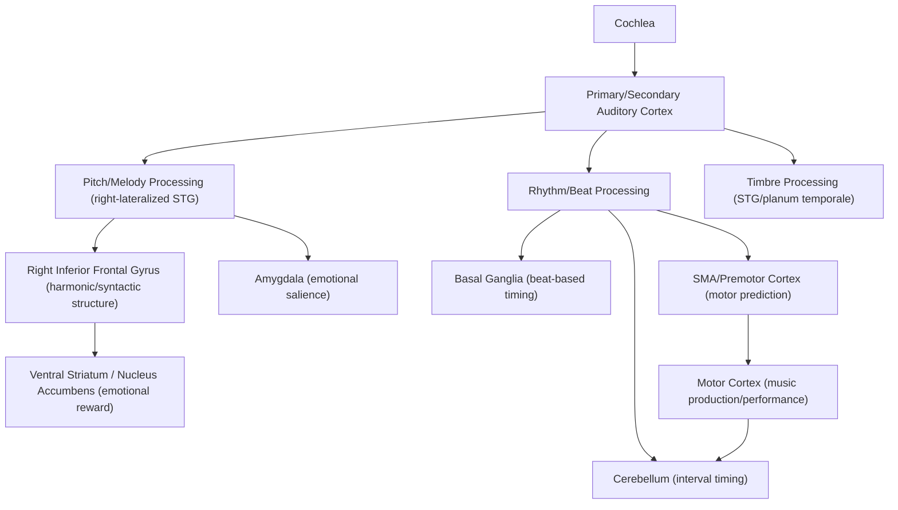

## Neuroscience of Music Perception and Production

### Overview

Music perception and production engage a broad, bilaterally distributed but functionally lateralized network spanning auditory, motor, limbic, and prefrontal systems. Unlike speech, which shows strong left-hemisphere dominance, music processing recruits substantial right-hemisphere involvement for pitch and melodic contour, while sharing key structural and temporal-hierarchical processing mechanisms with language — making music a valuable comparative domain for studying both domain-specific and domain-general auditory-cognitive architecture.

### Core Perceptual Components

**Key Points**

- **Pitch and melody**: Processing of individual note pitch (see prior pitch-processing mechanisms) and melodic contour (the pattern of pitch rises/falls over time), relying on right-lateralized superior temporal and inferior frontal regions.
- **Rhythm and meter**: Temporal pattern extraction, beat induction, and hierarchical metrical structure perception, engaging auditory cortex, basal ganglia, cerebellum, and supplementary motor area (SMA) even in the absence of overt movement.
- **Harmony and tonality**: Processing of chord structure and key-based expectations, implicating right anterior temporal and inferior frontal (particularly right inferior frontal gyrus, an analog of Broca's area) regions.
- **Timbre**: Perception of tone "color"/quality (distinguishing, e.g., a violin from a trumpet playing the same pitch), relying on spectral envelope analysis in secondary auditory cortex (planum temporale, superior temporal gyrus).

### Rhythm, Beat, and the Motor System

**Beat Perception and Auditory-Motor Coupling**

Perceiving a regular beat engages motor-related regions — SMA, premotor cortex, and basal ganglia — even during passive listening without movement, supporting the **Action Simulation for Auditory Prediction (ASAP)** hypothesis and related frameworks proposing that beat perception is fundamentally linked to motor system timing/prediction mechanisms rather than being a purely auditory-perceptual computation.

$$P(\text{onset}_{t+1}) \propto f(\text{predicted period } T, \text{ phase } \phi)$$

where the auditory-motor system generates temporally precise predictions of upcoming beat onsets based on an inferred underlying periodic structure, consistent with dynamic attending theory, which proposes that attention oscillates in synchrony with a perceived beat to enhance processing of temporally predictable events.

**Basal Ganglia and Cerebellar Contributions**

[Inference] Neuroimaging and patient studies suggest a partial functional dissociation in rhythm processing: the basal ganglia (particularly putamen) appear more strongly implicated in beat-based (regular, metrical) timing, while the cerebellum appears more implicated in duration-based/interval timing of non-metrical or more complex temporal sequences — though this dissociation is not absolute, and both structures show involvement across various timing tasks in different studies.

### Harmonic and Tonal Expectation Processing

**Key Points**

- Listeners implicitly learn statistical regularities of tonal harmony (which chords/notes are probable within a given key) through cumulative musical exposure, without necessarily having explicit music-theoretic knowledge.
- Violations of harmonic expectation (e.g., an unexpected out-of-key chord) elicit a characteristic ERP component — often compared to (though functionally and topographically distinguishable from) language-related syntactic violation responses — implicating shared or parallel predictive/structural-processing mechanisms between music and language.
- The right inferior frontal gyrus shows activation for processing harmonic structure and syntax-like musical relationships, paralleling (in a right-hemisphere-shifted manner) Broca's area's role in linguistic syntax.

[Inference] The "shared syntactic integration resource hypothesis" (Patel) proposes that music and language share domain-general neural resources for processing hierarchical, rule-governed structure, even while relying on largely separate domain-specific representations (e.g., separate stores for specific words vs. specific pitch/chord knowledge); this remains an influential but actively debated theoretical position, with some researchers favoring more domain-specific accounts based on selective patient dissociations (see below).

### Illustrative Network Diagram

### Music Production and Performance

**Key Points**

- Skilled musical performance requires precise integration of auditory feedback with fine motor control, engaging a tightly coupled auditory-motor loop involving auditory cortex, premotor cortex, primary motor cortex, and cerebellum.
- **Feedforward and feedback control**: Trained musicians increasingly rely on feedforward (predictive, internally modeled) motor control for well-practiced sequences, reducing dependence on real-time auditory feedback — demonstrated experimentally by relatively small performance disruption from delayed or altered auditory feedback in highly trained performers on well-rehearsed material, though feedback remains important for fine-tuning and error correction.
- **Mirror neuron system involvement**: [Inference] Some researchers propose that audio-motor "mirror" mechanisms — neurons/regions active both when producing and merely perceiving a corresponding action/sound — contribute to musicians' enhanced auditory-motor coupling and to action-perception links in music generally, though the specific role and even the broader validity of "mirror neuron" frameworks in humans remains debated in the literature.

### Music and Emotion/Reward

Music reliably engages the mesolimbic dopaminergic reward system, including the ventral striatum/nucleus accumbens, particularly at moments of strong emotional response (e.g., "chills" or frisson experiences), with neuroimaging studies reporting dopamine release patterns comparable in circuitry (though not necessarily magnitude) to other rewarding stimuli. [Inference] The precise mechanism by which abstract, non-survival-relevant auditory patterns come to engage primary reward circuitry is not fully settled, with proposed explanations ranging from prediction-error/expectation-violation accounts (reward tied to the resolution of harmonic/melodic expectation) to broader accounts involving learned cultural and autobiographical associations.

### Example: Listening to and Predicting a Familiar Melody

1. Auditory cortex extracts pitch, timbre, and onset-timing information from the incoming acoustic signal.
2. Right-lateralized superior temporal and inferior frontal regions track melodic contour and build an evolving representation of tonal/harmonic context, generating ongoing expectations for upcoming notes based on learned statistical regularities of the musical style.
3. SMA and basal ganglia generate a predictive beat/meter framework, temporally aligning attention with anticipated note onsets (dynamic attending).
4. If the melody proceeds as expected, this fluent, successfully predicted processing (in some theoretical accounts) contributes to reward-circuit engagement; if an unexpected note occurs (e.g., an out-of-key deviation), harmonic-violation-related processing is engaged in right inferior frontal regions.
5. If the listener is also a trained musician mentally "playing along," premotor and motor cortex show covert activation patterns resembling actual performance, reflecting auditory-motor coupling even without overt movement.

### Clinical and Comparative Evidence

- **Congenital amusia**: Selective impairment of pitch discrimination/melody perception with typically preserved rhythm perception and language processing, supporting at least partial domain-specificity for pitch-based musical processing distinct from general auditory or linguistic mechanisms.
- **Aphasia with preserved musical ability**: Some patients with severe language production deficits (e.g., non-fluent aphasia) retain the ability to sing learned songs, a phenomenon underlying **Melodic Intonation Therapy**, which uses the musical/prosodic structure of speech to help recruit right-hemisphere resources for language rehabilitation. [Inference] The precise mechanism of MIT's efficacy—whether it reflects genuine right-hemisphere compensatory recruitment, engagement of spared bilateral prosodic networks, or other factors—remains debated, and reported effect sizes vary across studies.
- **Parkinson's disease**: Basal ganglia dysfunction is associated with impaired beat-based rhythm perception and production in some studies, consistent with proposed basal ganglia involvement in metrical timing, though rhythm deficits in Parkinson's are not universal across all patients or all rhythm task types.
- **Musician vs. non-musician structural differences**: Long-term musical training is associated (in cross-sectional studies) with structural differences including increased gray matter volume in auditory and motor regions and greater corpus callosum connectivity; [Unverified] because most such studies are correlational/cross-sectional, causal direction (training-induced plasticity vs. pre-existing traits predisposing individuals toward musical training) cannot be fully established, though some longitudinal training studies provide supporting evidence for training-induced structural change.

### Common Misconceptions

- **Myth**: Music processing is entirely right-hemisphere, with language entirely left-hemisphere ("music is the right-brain, language is the left-brain").

  **Fact**: While music shows a general right-hemisphere weighting (particularly for pitch/melody) and language a general left-hemisphere weighting (particularly for syntax/phonology), both domains recruit substantial bilateral processing, and rhythm processing in particular is not strongly lateralized.
- **Myth**: The "Mozart effect" demonstrates that listening to music causally enhances general intelligence.

  **Fact**: The original Mozart effect findings reflected transient improvements in specific spatial-temporal task performance, [Unverified] plausibly attributable to arousal/mood effects from an enjoyable stimulus rather than music-specific cognitive enhancement; subsequent replication attempts have largely failed to support broad or durable intelligence gains from music listening.

### Related Topics

- Sound localization and pitch processing
- Auditory pathway from cochlea to cortex
- Language processing and the shared syntactic integration hypothesis
- Basal ganglia and cerebellar contributions to timing
- Melodic Intonation Therapy and aphasia rehabilitation
- Reward circuitry and dopaminergic prediction-error signaling
- Auditory-motor coupling in skilled performance