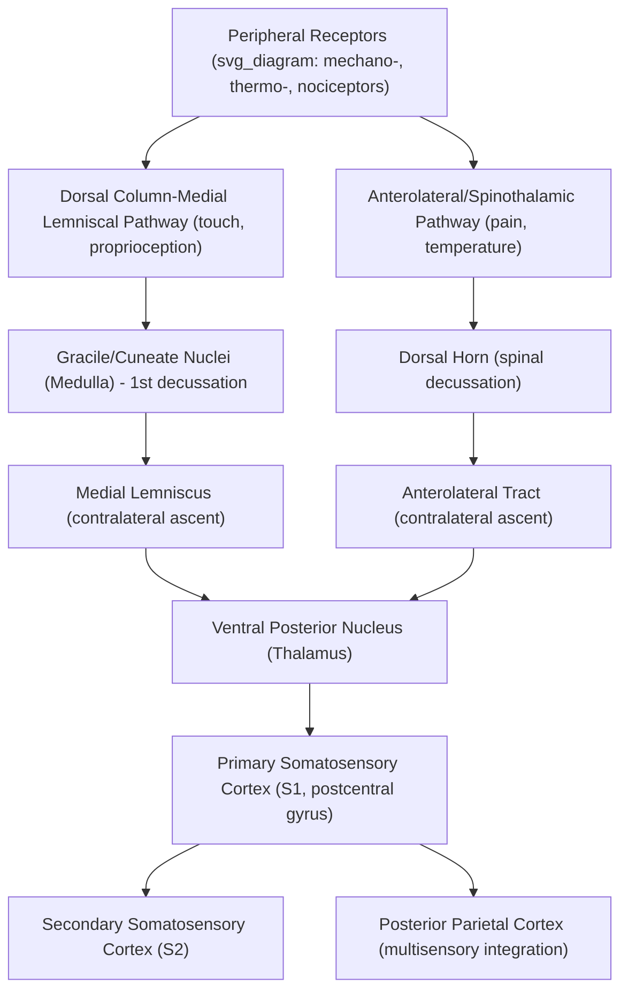

## Somatosensory System and Cortical Body Maps

### Overview

The somatosensory system encodes tactile, proprioceptive, thermal, and nociceptive information from the body surface and internal structures, relaying it through a well-defined ascending pathway to a topographically organized cortical representation. This system is notable for its highly precise **somatotopic** organization — a point-for-point spatial mapping of the body surface onto cortex — famously visualized as the "sensory homunculus," and for the substantial experience-dependent plasticity these body maps retain throughout life.

### Peripheral Receptors and Submodalities

**Key Points — Mechanoreceptor Types**

| Receptor | Adaptation | Receptive Field | Primary Function |
| --- | --- | --- | --- |
| Merkel cells | Slow | Small | Fine spatial detail, pressure, texture |
| Meissner corpuscles | Fast | Small | Light touch, flutter, grip control |
| Ruffini endings | Slow | Large | Skin stretch, joint angle |
| Pacinian corpuscles | Fast | Large | Vibration, deep pressure |

- **Thermoreceptors**: Free nerve endings responding to warmth or cold, mediated substantially by TRP-family ion channels (e.g., TRPV1 for heat/capsaicin, TRPM8 for cold/menthol).
- **Nociceptors**: Free nerve endings responsive to potentially tissue-damaging mechanical, thermal, or chemical stimuli; subdivided into fast-conducting A-delta fibers (sharp, localized "first pain") and slower unmyelinated C-fibers (dull, diffuse "second pain").
- **Proprioceptors**: Muscle spindles (muscle length/stretch) and Golgi tendon organs (muscle tension/force) provide information about body position and movement, essential for motor control and body-position sense independent of vision.

### Ascending Pathways

**Key Points — Two Major Somatosensory Pathways**

1. **Dorsal column–medial lemniscal (DCML) pathway**: Carries fine touch, vibration, and proprioceptive information. First-order neurons ascend ipsilaterally in the dorsal columns of the spinal cord to the medulla (gracile and cuneate nuclei), where second-order neurons decussate (cross) and ascend as the medial lemniscus to the thalamus (ventral posterior nucleus), with third-order neurons projecting to primary somatosensory cortex (S1). This pathway is characterized by large-diameter, fast-conducting, heavily myelinated fibers, supporting high spatial and temporal precision.
2. **Anterolateral (spinothalamic) pathway**: Carries pain, temperature, and crude touch information. First-order neurons synapse in the dorsal horn of the spinal cord almost immediately upon entry; second-order neurons decussate near the level of entry and ascend contralaterally in the anterolateral spinal cord directly to the thalamus, with generally smaller-diameter, more slowly conducting fibers than the DCML pathway.

This anatomical and functional segregation — different decussation points, different fiber types, different information content — produces clinically distinctive dissociation patterns following spinal cord injury (see below).

### Cortical Somatotopic Organization

**Key Points**

- **S1 (primary somatosensory cortex)**: Located in the postcentral gyrus, organized into four cytoarchitectonically and functionally distinct subregions (Brodmann areas 3a, 3b, 1, 2), each maintaining a somatotopic map but emphasizing different submodalities (e.g., area 3b for texture/cutaneous input, area 2 for size/shape and proprioceptive integration).
- **Sensory homunculus**: A cortical map in which body regions with higher innervation/receptor density and greater behavioral/sensory importance (e.g., lips, fingertips, tongue) occupy disproportionately large cortical territory relative to their physical body surface area, while regions with sparser innervation (e.g., trunk, back) occupy comparatively small cortical territory — reflecting **magnification factor** scaling with peripheral receptor density rather than simple physical body size.

$$\text{Cortical Area} \propto \rho_{\text{receptor density}} \times A_{\text{body region}}$$

where cortical territory allocated to a body region scales with the product of peripheral innervation density and (to a lesser degree) the physical area of that region — explaining the disproportionate cortical "magnification" of high-acuity body parts like the fingertips and lips relative to less densely innervated regions like the back.

- **Secondary somatosensory cortex (S2)**: Located in the parietal operculum; receives convergent bilateral input (unlike the largely contralateral S1), integrates information across body regions, and contributes to tactile object recognition and sensorimotor integration, with some evidence implicating it in pain processing and tactile working memory.

### Cortical Plasticity of Body Maps

Somatotopic maps are not fixed; they undergo experience-dependent reorganization based on sensory input patterns and use.

- **Use-dependent expansion**: Classic studies (e.g., in owl monkeys trained on tactile discrimination tasks) demonstrated that cortical territory representing frequently stimulated/trained digits expands relative to less-used digits, demonstrating activity-dependent cortical map plasticity in adulthood.
- **Deafferentation-induced reorganization**: Following amputation or nerve damage, the cortical territory previously representing the lost/deafferented body part can become responsive to input from adjacent, still-intact body regions (e.g., after hand amputation, face-representing cortex may expand into the former hand territory) — a phenomenon proposed as one contributing mechanism, among several competing accounts, to certain phantom limb sensations.

### Illustrative Pathway and Map Diagram

### Example: Reading Braille with a Fingertip

1. Fine spatial pressure patterns are transduced by densely packed Merkel cells and Meissner corpuscles in the fingertip, which has exceptionally high mechanoreceptor density and correspondingly fine two-point discrimination acuity.
2. This information ascends via the DCML pathway, preserving high spatial fidelity due to the pathway's large-diameter, fast-conducting fibers.
3. In S1, the fingertip's disproportionately large cortical representation (reflecting its high peripheral innervation density) supports fine-grained spatial discrimination of the raised dot patterns.
4. With extensive Braille-reading practice, use-dependent cortical plasticity can further expand or refine the reading finger's cortical representation, consistent with experience-dependent map reorganization findings in trained tactile discrimination tasks.
5. S2 and posterior parietal cortex integrate sequential tactile input into higher-order pattern/letter recognition, supporting fluent reading.

### Clinical and Experimental Evidence

- **Brown-Séquard syndrome**: Spinal cord hemisection produces a classic dissociated sensory loss pattern — ipsilateral loss of fine touch/proprioception below the lesion (DCML pathway, which crosses in the medulla, well above the spinal lesion) combined with contralateral loss of pain/temperature below the lesion (spinothalamic pathway, which crosses near its spinal entry level) — directly demonstrating the differing decussation points of the two pathways.
- **Phantom limb phenomena**: Amputees frequently report vivid sensory experiences, including pain, referred to the missing limb. [Inference] Proposed mechanisms include cortical remapping/reorganization (adjacent body-part representations "invading" former limb territory), persistent central pattern generators, and altered peripheral nerve signaling at the stump; the relative contribution of each mechanism remains debated, and evidence (including from mirror-box therapy outcomes) has been used to support multiple, potentially complementary explanations rather than a single settled account.
- **Cortical stimulation mapping**: Direct intraoperative electrical stimulation of S1 (historically pioneered by Penfield) reliably evokes localized tactile sensations in specific body regions corresponding to the stimulated cortical site, providing direct causal evidence for somatotopic organization in humans.
- **Two-point discrimination testing**: A clinical/psychophysical measure of spatial acuity that varies dramatically across body regions (finest at fingertips and lips, coarsest at the back), directly reflecting differences in peripheral receptor density and corresponding cortical magnification.

### Common Misconceptions

- **Myth**: The sensory homunculus is a literal, fixed anatomical map identical across all individuals.

  **Fact**: While the general topographic layout (body regions represented in a broadly consistent spatial order) is a robust finding, the precise boundaries and territory sizes show individual variability and are subject to experience-dependent plasticity throughout life.
- **Myth**: Pain and touch are processed by the same neural pathway.

  **Fact**: Pain/temperature (anterolateral/spinothalamic pathway) and fine touch/proprioception (dorsal column-medial lemniscal pathway) are carried by anatomically and physiologically distinct ascending pathways, as demonstrated by their differential vulnerability in specific spinal cord lesions.

### Related Topics

- Cortical plasticity and use-dependent reorganization
- Phantom limb phenomena and mirror-box therapy
- Pain processing and nociceptive pathways
- Proprioception and motor control integration
- Spinal cord injury patterns and clinical dissociations
- Multisensory integration in posterior parietal cortex
- Penfield's cortical stimulation mapping studies