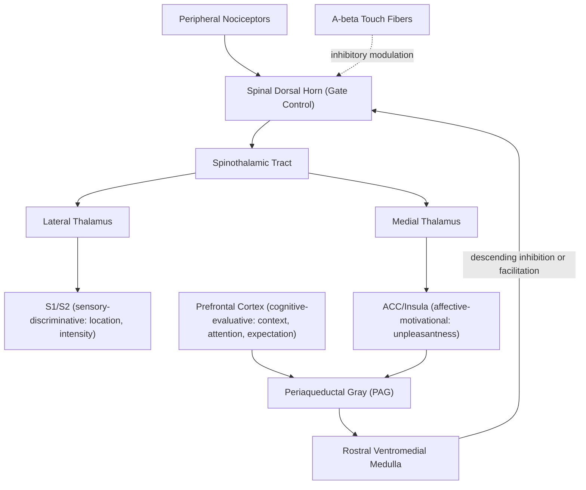

## Pain Processing and Modulation

### Overview

Pain is a multidimensional experience integrating sensory-discriminative (location, intensity, quality), affective-motivational (unpleasantness, distress), and cognitive-evaluative (meaning, context, attention) components, supported by a distributed neural network rather than a single dedicated "pain center." Pain processing is subject to extensive top-down and bottom-up modulation, making it one of the clearest examples in neuroscience of a percept that is actively constructed and regulated rather than a fixed, linear readout of peripheral tissue damage signals.

### Peripheral Nociception

**Key Points**

- **Nociceptors**: Free nerve endings that respond to noxious mechanical, thermal, or chemical stimuli, expressing specialized transduction channels (e.g., TRPV1 for noxious heat/capsaicin, ASIC channels for acidic/ischemic conditions).
- **A-delta fibers**: Thinly myelinated, faster-conducting (~5–30 m/s), mediating sharp, well-localized "first pain."
- **C-fibers**: Unmyelinated, slower-conducting (~0.5–2 m/s), mediating dull, diffuse, longer-lasting "second pain."
- **Sensitization**: Tissue injury releases inflammatory mediators (e.g., prostaglandins, bradykinin, substance P) that lower nociceptor activation thresholds (peripheral sensitization), contributing to primary hyperalgesia at the injury site.

### Spinal Cord Processing: Gate Control Theory

**Key Points**

Melzack and Wall's **gate control theory** (1965) proposed that dorsal horn "gate" circuits modulate the transmission of nociceptive signals to higher centers, based on the relative activity of nociceptive (A-delta/C) versus large-diameter non-nociceptive (A-beta) afferent fibers, as well as descending modulatory input.

$$\text{Output signal} \propto \left(\text{C/A-}\delta \text{ input}\right) - \left(\text{A-}\beta \text{ input}\right) - \left(\text{descending inhibition}\right)$$

where activation of large-diameter A-beta touch fibers (e.g., via rubbing an injured area) can inhibit dorsal horn transmission neurons via inhibitory interneurons, reducing perceived pain — providing a physiological account for common pain-relief behaviors and underlying the rationale for treatments like transcutaneous electrical nerve stimulation (TENS). [Inference] While the specific circuit details proposed in the original 1965 model have been substantially revised by subsequent research (e.g., more complex interneuron circuitry than originally proposed), the core principle that spinal cord gating mechanisms modulate ascending nociceptive transmission remains a foundational and largely supported concept in pain neuroscience.

### Ascending Pathways and Cortical Processing

**Key Points**

- **Spinothalamic tract**: The primary ascending nociceptive pathway; second-order neurons in the dorsal horn decussate near their level of entry and ascend contralaterally to the thalamus (see also Somatosensory System entry for pathway comparison).
- **Lateral pain system**: Projects to lateral thalamic nuclei and then to primary/secondary somatosensory cortex (S1/S2), supporting the sensory-discriminative dimension of pain (location, intensity, quality).
- **Medial pain system**: Projects to medial thalamic nuclei and then to anterior cingulate cortex (ACC) and insular cortex, supporting the affective-motivational dimension of pain (unpleasantness, emotional distress, autonomic responses).

**The "Pain Matrix" and Its Reinterpretation**

Neuroimaging studies have consistently identified a network — commonly including S1/S2, insula, ACC, thalamus, and sometimes prefrontal cortex — that activates during painful stimulation, historically termed the "pain matrix." [Inference] More recent work has substantially challenged the specificity of this network for pain per se, showing that a similar network activates for other salient, behaviorally significant, or novel non-painful stimuli, leading many researchers to reinterpret this activity pattern as reflecting a more general salience/threat-detection network rather than a pain-specific neural signature; this reinterpretation remains an active area of ongoing debate and refinement in the field.

### Descending Modulation

**Key Points**

The brain exerts substantial top-down control over spinal nociceptive transmission via descending pathways, primarily originating in the **periaqueductal gray (PAG)** of the midbrain, which projects to the **rostral ventromedial medulla (RVM)**, which in turn projects to the spinal dorsal horn.

- **Descending inhibition**: PAG-RVM circuits can suppress dorsal horn nociceptive transmission, mediated substantially by endogenous opioid systems (enkephalins, endorphins acting on mu-opioid receptors) — the physiological basis exploited pharmacologically by opioid analgesics.
- **Descending facilitation**: The same general circuitry can also enhance nociceptive transmission under certain conditions (e.g., contributing to central sensitization in chronic pain states), illustrating that descending modulation is bidirectional rather than purely inhibitory.
- **Stress-induced analgesia**: Acute stress or extreme threat can trigger PAG-mediated descending inhibition sufficient to substantially suppress pain perception (e.g., injured individuals in emergency situations often report minimal pain until the immediate threat has passed), demonstrating the behavioral relevance of descending modulatory circuits.

### Illustrative Modulation Diagram

### Example: The Placebo Analgesia Effect

1. A patient is given an inert substance but strongly expects pain relief based on context, prior conditioning, or verbal suggestion.
2. Prefrontal cortex, encoding this expectation, engages the ACC and activates descending modulatory circuits via the PAG.
3. PAG-RVM projections trigger descending inhibition of spinal dorsal horn nociceptive transmission, substantially mediated by endogenous opioid release — demonstrated experimentally by the partial reversal of placebo analgesia with the opioid antagonist naloxone in multiple studies.
4. This produces a measurable reduction in both subjective pain report and, in neuroimaging studies, reduced activity in pain-related regions — illustrating that cognitive-evaluative top-down processes can causally and physiologically modulate nociceptive processing at early (even spinal) stages, not merely alter later conscious pain report.

### Clinical Conditions and Modulatory Dysfunction

- **Central sensitization**: Persistent nociceptive input can produce lasting changes in dorsal horn and central pain-processing circuits (including NMDA-receptor-dependent plasticity), lowering pain thresholds and expanding receptive fields — a proposed contributing mechanism in chronic pain conditions such as fibromyalgia, where pain is disproportionate to identifiable peripheral tissue pathology.
- **Neuropathic pain**: Arises from damage to the nervous system itself (peripheral nerve or central pathway) rather than from ongoing tissue damage, often producing allodynia (pain from normally non-painful stimuli) and hyperalgesia (exaggerated pain response), reflecting maladaptive plasticity in nociceptive processing and/or loss of normal inhibitory control.
- **Congenital insensitivity to pain**: Rare genetic conditions (e.g., certain SCN9A gene mutations affecting sodium channel function in nociceptors) can abolish pain perception despite normal other sensory modalities, demonstrating the specificity of dedicated nociceptive transduction mechanisms and, clinically, illustrating pain's protective biological function through its striking absence.
- **Phantom limb pain**: As discussed in relation to somatosensory cortical plasticity, altered central processing (cortical reorganization, persistent central sensitization from pre-amputation pain, or other mechanisms) can produce pain referred to a missing limb; [Inference] the relative contribution of peripheral, spinal, and cortical mechanisms to phantom pain specifically (as distinct from non-painful phantom sensations) remains an area of ongoing research with multiple proposed, potentially interacting explanations.

### Common Misconceptions

- **Myth**: Pain intensity is a direct, linear readout of tissue damage severity.

  **Fact**: Pain perception is substantially modulated by spinal gating, descending facilitation/inhibition, attention, expectation, and emotional context, such that identical tissue damage can produce markedly different pain experiences depending on these modulatory factors.
- **Myth**: There is a single, dedicated "pain center" in the brain.

  **Fact**: Pain processing engages a distributed network spanning sensory, affective, and cognitive-evaluative regions, and much of this network's activity is not pain-specific but shared with general salience and threat-processing functions.

### Related Topics

- Somatosensory system and cortical body maps
- Placebo and nocebo effects in clinical neuroscience
- Central sensitization and chronic pain mechanisms
- Endogenous opioid systems and analgesia
- Stress physiology and the HPA axis
- Descending pain modulation and the periaqueductal gray
- Interoception and the insular cortex