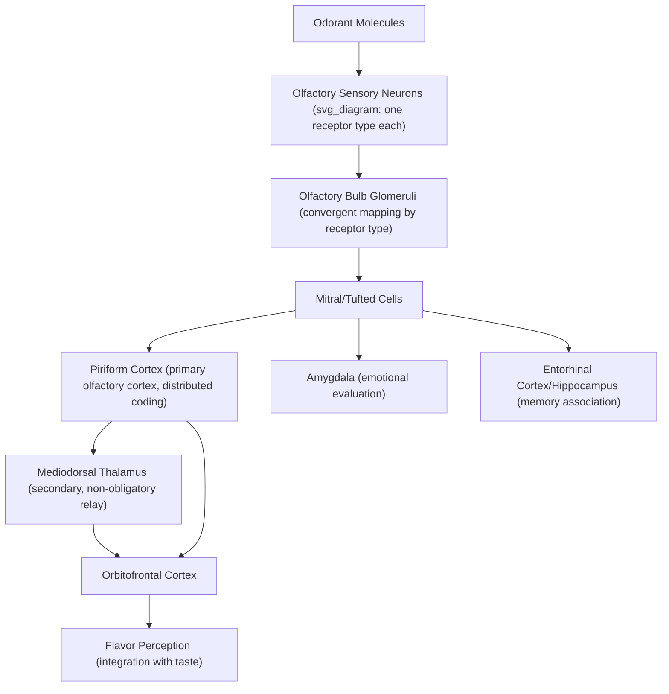

## Olfactory System Organization

### Overview

The olfactory system is anatomically and functionally distinctive among sensory systems: it is the only sensory modality whose primary receptor neurons project directly to cortex without an obligatory thalamic relay, and it uses a combinatorial receptor-coding scheme of remarkable scale (~400 functional receptor genes in humans) to discriminate an enormous space of possible odorant structures. Its close anatomical relationship to limbic structures also underlies smell's unusually strong and direct links to emotion and memory.

### Peripheral Transduction

**Key Points**

- **Olfactory epithelium**: Located in the nasal cavity, containing olfactory sensory neurons (OSNs), supporting cells, and basal (stem) cells; OSNs are unusual among neurons in undergoing continuous replacement throughout life.
- **Olfactory receptor neurons**: Each OSN expresses (with rare documented exceptions) only a single functional odorant receptor gene type, following the **"one neuron–one receptor" rule**, a foundational organizing principle established by Buck and Axel's Nobel Prize-winning work identifying the odorant receptor gene family.
- **Odorant receptors**: G-protein-coupled receptors (GPCRs) that bind odorant molecules with broad, overlapping tuning — a single receptor typically responds to multiple structurally related odorants, and a single odorant typically activates multiple different receptor types.
- **Transduction cascade**: Odorant binding activates a G-protein (Golf) cascade, stimulating adenylyl cyclase to produce cyclic AMP, which opens cyclic-nucleotide-gated (CNG) ion channels, depolarizing the neuron and triggering action potentials.

### Combinatorial Coding

**Key Points**

Because each odorant activates a distinctive combination of receptor types (rather than a single dedicated "labeled line" per odorant), odor identity is encoded combinatorially across a population of differentially-activated receptor types — allowing a relatively limited receptor repertoire (~400 functional genes in humans, though many more in some other mammals) to discriminate an extremely large number of distinct odorant molecules and mixtures.

$$\vec{R}(\text{odorant}) = [r_1, r_2, \ldots, r_n]$$

where the odor's neural representation is the activation vector across the full receptor population $r_1$ through $r_n$, such that odor identity is encoded by the overall pattern rather than by any single receptor's response — conceptually analogous to combinatorial coding schemes used elsewhere in sensory neuroscience, though with distinctly different peripheral architecture than vision or audition.

### Central Pathway: Olfactory Bulb Organization

**Key Points**

- **Glomeruli**: OSNs expressing the same receptor type, though scattered throughout the olfactory epithelium, converge their axons onto the same one or two glomeruli in the olfactory bulb — a striking anatomical convergence that transforms a spatially distributed peripheral receptor-type expression pattern into a spatially organized "odor map" at the level of the bulb.
- **Mitral/tufted cells**: Second-order projection neurons that receive input from a single glomerulus (and thus, indirectly, from a single receptor type), relaying processed olfactory signals onward to olfactory cortex.
- **Local circuit processing**: Periglomerular cells and granule cells provide lateral inhibition and gain control within and between glomeruli, sharpening odor representations and contributing to concentration-invariant odor identity coding.

**Direct Cortical Projection (No Obligatory Thalamic Relay)**

Unlike vision, audition, and (most) somatosensation, mitral/tufted cell axons project directly to primary olfactory (piriform) cortex and other olfactory-related structures without a mandatory thalamic relay — a distinctive architectural feature among the major sensory systems, though the mediodorsal thalamic nucleus does receive olfactory input and participates in some higher-order olfactory processing (e.g., odor-related attention and discrimination tasks), representing a secondary, non-obligatory thalamic pathway.

### Cortical and Limbic Targets

**Key Points**

- **Piriform cortex**: Primary olfactory cortex; unlike the topographically organized primary cortices of other sensory systems, piriform cortex representations are distributed and non-topographic — spatially similar odorant receptor activation patterns do not map onto spatially adjacent cortical locations, and odor identity appears to instead be represented by more distributed ensemble/associative coding, [Inference] a finding that has motivated comparisons between piriform cortex organization and associative memory network models rather than classical topographic sensory maps.
- **Amygdala**: Direct olfactory bulb and piriform projections to the amygdala provide an anatomically short pathway linking odor processing to emotional/affective evaluation, [Inference] proposed as a partial anatomical basis for the well-documented strong and rapid emotional responses odors can evoke, relative to comparably processed stimuli in other sensory modalities.
- **Entorhinal cortex/hippocampus**: Olfactory projections to medial temporal lobe memory structures provide a relatively direct anatomical link, [Inference] proposed as a contributing anatomical basis for the well-documented phenomenon of vivid, emotionally-laden autobiographical memories triggered by odors (the "Proust phenomenon"), though the specific mechanism producing this particularly strong olfactory-memory association compared to other sensory triggers is not fully established at the mechanistic level.
- **Orbitofrontal cortex (OFC)**: Receives olfactory input (both directly and via thalamic relay) and integrates it with other sensory modalities (notably taste) to construct the perception of **flavor**, and supports higher-order odor discrimination, identification, and hedonic (pleasant/unpleasant) evaluation.

### Illustrative Pathway Diagram

### Example: Smelling Coffee and Recalling a Memory

1. Volatile coffee-derived odorant molecules bind multiple distinct odorant receptor types on OSNs distributed throughout the olfactory epithelium, each odorant compound activating its own characteristic combination of receptors.
2. OSNs of each activated receptor type converge onto their designated glomeruli in the olfactory bulb, producing a spatially organized activation pattern ("odor map") specific to coffee's complex odorant mixture.
3. Mitral cells relay this pattern directly to piriform cortex (bypassing an obligatory thalamic relay), where distributed ensemble activity supports recognition of the smell as "coffee," and simultaneously to the amygdala, contributing to any immediate affective/emotional response.
4. Direct entorhinal/hippocampal projections may trigger associative retrieval of a specific autobiographical memory linked to that scent (e.g., a childhood kitchen), consistent with the well-documented strength of odor-cued autobiographical memory.
5. Orbitofrontal cortex integrates the olfactory signal with concurrent taste input (if drinking the coffee) to construct the unified perceptual experience of flavor.

### Clinical and Experimental Evidence

- **Anosmia**: Loss of smell, which can result from peripheral causes (nasal obstruction, epithelial damage) or central causes (olfactory nerve/bulb damage, certain neurodegenerative conditions); notably, anosmia substantially impairs flavor perception even with taste function intact, since much of what is commonly experienced as "taste" is actually retronasal olfaction.
- **Early biomarker in neurodegenerative disease**: Reduced olfactory function is a well-documented early feature in Parkinson's disease and Alzheimer's disease, often preceding classical motor or cognitive symptoms by years, [Inference] consistent with early pathological involvement of olfactory bulb and related medial temporal structures in these conditions' typical anatomical progression, though olfactory testing alone lacks the specificity to be a standalone diagnostic tool.
- **COVID-19-associated anosmia**: SARS-CoV-2 infection is associated with a distinctive pattern of (often sudden-onset) anosmia; [Inference] proposed mechanisms have implicated infection of olfactory epithelium support cells (sustentacular cells) rather than direct infection of OSNs themselves, though research on precise mechanisms and long-term recovery patterns continued to evolve substantially through the pandemic period and specific findings should be verified against current literature.
- **Buck and Axel's discovery of the odorant receptor gene family** (1991) was foundational to modern molecular understanding of olfactory coding and was recognized with the Nobel Prize in Physiology or Medicine in 2004.

### Common Misconceptions

- **Myth**: Humans have a poor sense of smell compared to other sensory modalities and other species across the board.

  **Fact**: While humans have fewer functional odorant receptor genes than some other mammals (e.g., rodents, dogs), human olfactory discrimination capacity is substantial, and older claims of humans being able to distinguish only a few thousand odors have been challenged by more recent research suggesting a much larger discriminable odor space; comparative "olfactory acuity" also depends heavily on which specific odorants and tasks are tested.
- **Myth**: Taste and flavor are the same thing, both mediated by the tongue.

  **Fact**: Much of what is perceived as "taste" or "flavor" during eating is actually retronasal olfaction (odorant molecules reaching the olfactory epithelium via the back of the throat), integrated with genuine gustatory (tongue-mediated) taste information in orbitofrontal cortex — which is why anosmia so severely impairs food flavor perception despite intact basic taste function.

### Related Topics

- Gustatory system and taste-flavor integration
- Limbic system and emotional memory circuits
- Olfactory bulb glomerular mapping and combinatorial coding
- Early olfactory biomarkers in neurodegenerative disease
- Orbitofrontal cortex and multisensory integration
- Autobiographical memory and odor-cued recall (Proust phenomenon)
- Neurogenesis in the adult olfactory system