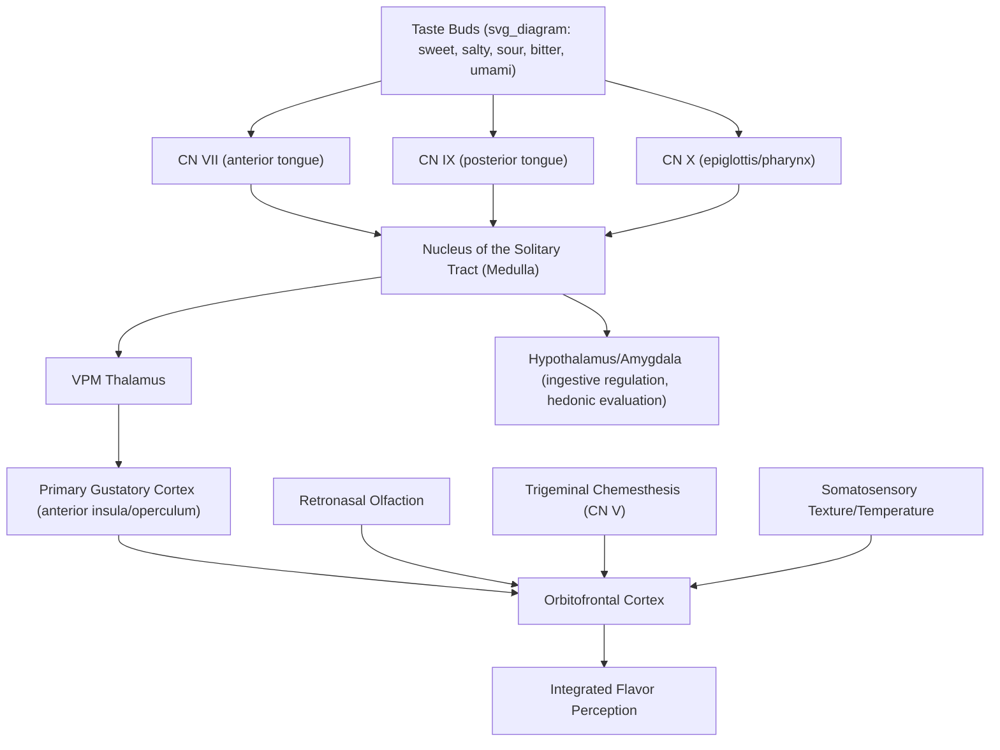

## Gustatory Processing

### Overview

Gustatory (taste) processing detects a limited set of basic chemical qualities in the oral cavity — sweet, salty, sour, bitter, and umami — via specialized receptor cells on the tongue and palate, relaying this information through a distinctive cranial-nerve-based pathway to cortex. While often colloquially conflated with "flavor," true gustatory processing is only one component of flavor perception, which more heavily depends on retronasal olfaction integrated with taste, texture, and trigeminal (chemesthetic) input in orbitofrontal cortex.

### Peripheral Transduction

**Key Points — Basic Taste Qualities and Mechanisms**

| Taste Quality | Receptor Mechanism | Representative Stimulus |
| --- | --- | --- |
| Sweet | GPCR (T1R2+T1R3 heterodimer) | Sugars, some amino acids, artificial sweeteners |
| Umami | GPCR (T1R1+T1R3 heterodimer) | Glutamate, certain nucleotides (savory taste) |
| Bitter | GPCRs (T2R family, ~25 subtypes in humans) | Alkaloids, many toxic compounds |
| Salty | Ion channel (ENaC, amiloride-sensitive) | Sodium chloride |
| Sour | Ion channel (proposed: OTOP1 proton channel) | Acids (hydrogen ion concentration) |

- **Taste buds**: Clusters of ~50–100 taste receptor cells embedded within papillae (fungiform, foliate, circumvallate) distributed across the tongue, and also present on the soft palate and epiglottis; contrary to the popular but discredited "tongue map" myth, all taste qualities can be detected across most taste-bud-containing regions, with only modest regional sensitivity differences.
- **Sweet, umami, and bitter transduction**: Mediated by G-protein-coupled receptors coupled to a shared downstream signaling cascade (involving gustducin, phospholipase C-β2, and IP3-mediated calcium release), ultimately depolarizing the taste receptor cell and triggering neurotransmitter release.
- **Salty and sour transduction**: Mediated more directly by ion channels — sodium ions directly depolarizing the cell via ENaC channels for salty taste, and (per a leading but [Unverified] not fully settled model) protons (H+) activating OTOP1 channels for sour taste.

### Neural Pathway

**Key Points — Cranial Nerve Convergence**

Unlike most sensory systems, gustatory input is carried by three distinct cranial nerves, each innervating a different oral region:

1. **Facial nerve (CN VII), chorda tympani branch**: Anterior two-thirds of the tongue.
2. **Glossopharyngeal nerve (CN IX)**: Posterior third of the tongue.
3. **Vagus nerve (CN X)**: Epiglottis and pharyngeal region.

These converge onto the **nucleus of the solitary tract (NTS)** in the medulla, the first central relay for gustatory information (and notably also a major convergence site for visceral/autonomic afferent information, reflecting taste's close functional relationship to ingestive and digestive regulation).

**Ascending Pathway**

$$\text{CN VII/IX/X} \rightarrow \text{NTS (medulla)} \rightarrow \text{VPM thalamus} \rightarrow \text{Gustatory (Insular) Cortex}$$

From the NTS, gustatory information ascends (in primates, via a direct ipsilateral pathway, differing somewhat from the pathway organization described in some non-primate models) to the ventral posteromedial (VPM) nucleus of the thalamus, then to primary gustatory cortex, located in the anterior insula and adjacent frontal operculum.

### Cortical Processing

**Key Points**

- **Primary gustatory cortex (anterior insula/frontal operculum)**: Encodes basic taste quality and intensity information; [Inference] evidence from both animal single-unit recording and human neuroimaging suggests some degree of spatially organized ("gustotopic") representation of different taste qualities within this region, though the degree of spatial segregation versus overlapping/distributed coding remains an area of ongoing investigation and is less settled than, for example, tonotopic organization in audition.
- **Orbitofrontal cortex (OFC)**: A key secondary/associative gustatory processing region that integrates taste with olfactory, somatosensory (texture, temperature), and visual input to construct the unified perceptual experience of **flavor**; OFC taste-responsive neurons also show experience- and satiety-dependent modulation, contributing to the hedonic (pleasant/unpleasant) evaluation of food.
- **Amygdala and hypothalamus**: Receive gustatory input relevant to affective evaluation and homeostatic/ingestive regulation (e.g., linking taste signals to hunger/satiety states and motivated feeding behavior).

### Flavor as Multisensory Integration

Gustatory input alone provides only coarse chemical-quality information; the rich, differentiated perceptual experience commonly called "flavor" or "taste" in everyday language depends substantially on:

- **Retronasal olfaction**: Volatile compounds released during chewing/swallowing travel from the oral cavity to the olfactory epithelium via the nasopharynx, providing the majority of what is perceptually attributed to "taste" (demonstrated by the dramatic reduction in perceived food flavor complexity when retronasal olfaction is blocked, e.g., by pinching the nose).
- **Trigeminal chemesthesis**: The trigeminal nerve (CN V) detects chemically-induced somatosensory qualities such as the "heat" of capsaicin (chili), the "cooling" of menthol, and carbonation, contributing texture-like and thermal-like qualities to overall flavor perception distinct from true gustatory taste-receptor signaling.
- **Texture and temperature**: Somatosensory qualities processed via standard mechanoreceptive/thermoreceptive pathways, integrated with taste and smell in OFC.

### Illustrative Pathway Diagram

### Example: Tasting a Spicy, Sweetened Lime Beverage

1. Sugar molecules activate T1R2+T1R3 sweet receptors, while citric acid activates sour-transduction mechanisms (proton-sensitive channels) on taste receptor cells across tongue regions innervated by CN VII and CN IX.
2. Capsaicin-like or chili-derived compounds (if spicy) do not activate classical taste receptors at all but instead activate TRPV1 channels on trigeminal nerve (CN V) free nerve endings, producing a burning chemesthetic sensation processed via somatosensory pathways rather than the gustatory pathway proper.
3. Volatile aromatic compounds (e.g., from lime zest oils) reach the olfactory epithelium retronasally during swallowing, contributing the characteristic "lime" identity that basic taste receptors alone cannot provide.
4. Gustatory signals converge at the NTS and ascend via VPM thalamus to insular gustatory cortex, encoding basic sweet/sour quality and intensity.
5. OFC integrates the sweet/sour taste signal, the retronasal lime aroma, and the trigeminal "heat" sensation into a single, unified perceptual experience of a specific, recognizable flavor, while also generating a hedonic evaluation (pleasant/unpleasant) that can be modulated by current hunger/thirst state via hypothalamic input.

### Clinical and Experimental Evidence

- **Ageusia and dysgeusia**: Loss (ageusia) or distortion (dysgeusia) of taste can result from peripheral causes (e.g., zinc deficiency, certain medications, oral radiation therapy affecting taste bud turnover) or central/neural causes (cranial nerve damage, certain neurological conditions); notably, many patients presenting with "loss of taste" are found on clinical testing to have intact basic gustatory function but impaired retronasal olfaction, again illustrating the common conflation of taste and flavor.
- **Bell's palsy and taste**: Because the chorda tympani (a branch of CN VII) carries anterior tongue taste information alongside its more commonly recognized facial motor function, some Bell's palsy cases (facial nerve dysfunction) present with concurrent ipsilateral taste disturbance in the anterior two-thirds of the tongue — a clinically useful localizing sign.
- **PROP/PTC bitter-tasting studies**: Genetic variation in bitter receptor genes (notably TAS2R38) produces measurable individual differences in sensitivity to certain bitter compounds (propylthiouracil/phenylthiocarbamide), historically used as a model system for studying genetic variation in chemosensory perception and its downstream influence on food preference.
- **OFC lesion studies**: Damage to orbitofrontal cortex can impair flavor-based reward learning and hedonic food evaluation while leaving basic taste quality discrimination relatively intact, supporting OFC's proposed role as a higher-order integrative/evaluative rather than primary sensory-discriminative gustatory region.

### Common Misconceptions

- **Myth**: The tongue has distinct regional zones exclusively dedicated to each basic taste ("the tongue map").

  **Fact**: This popular diagram, derived from a misinterpretation of early 20th-century psychophysical data, has been thoroughly discredited; all basic taste qualities can be detected across most taste-bud-bearing tongue regions, with only modest, non-exclusive sensitivity gradients.
- **Myth**: "Taste" and "flavor" refer to the same underlying sensory process.

  **Fact**: True gustatory taste is limited to a small set of basic chemical qualities detected by tongue/palate receptors; the rich, differentiated experience commonly called flavor depends predominantly on retronasal olfaction integrated with taste, texture, and trigeminal input in orbitofrontal cortex.

### Related Topics

- Olfactory system organization
- Flavor perception and multisensory integration
- Trigeminal chemesthesis and nociceptive chemosensation
- Orbitofrontal cortex and hedonic evaluation
- Hypothalamic regulation of feeding and satiety
- Genetic variation in chemosensory perception (TAS2R38)
- Cranial nerve anatomy and clinical localization