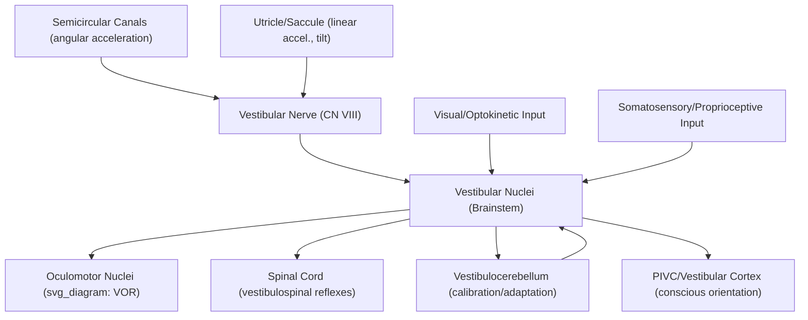

## Vestibular System and Balance

### Overview

The vestibular system detects head motion and orientation relative to gravity, providing critical input for postural balance, gaze stabilization during head movement, and spatial orientation. Unlike most sensory systems, vestibular signals rarely reach conscious awareness in isolation under normal conditions; instead, they operate largely as an automatic, reflexive system tightly integrated with the oculomotor and postural control systems, and their perceptual salience typically becomes apparent primarily when the system is disrupted (e.g., producing vertigo) or during unusual/conflicting sensory conditions (e.g., motion sickness).

### Peripheral Apparatus

**Key Points — Two Functional Subdivisions**

| Structure | Detects | Mechanism |
| --- | --- | --- |
| Semicircular canals (3 per ear) | Angular (rotational) acceleration | Endolymph flow deflecting cupula |
| Utricle | Linear acceleration, head tilt (horizontal plane) | Otoconia displacing otolithic membrane |
| Saccule | Linear acceleration, head tilt (vertical plane) | Otoconia displacing otolithic membrane |

- **Semicircular canals**: Three fluid-filled canals per ear, oriented roughly orthogonally to one another, each maximally sensitive to rotation in its corresponding plane; angular head acceleration causes inertial lag of the endolymph fluid, deflecting the gelatinous cupula and bending embedded hair cell stereocilia.
- **Otolith organs (utricle and saccule)**: Contain a gelatinous otolithic membrane embedded with calcium carbonate crystals (otoconia); linear acceleration or static head tilt relative to gravity causes inertial displacement of this denser otoconial layer relative to the underlying hair cells, deflecting stereocilia and encoding both gravitational orientation and linear (translational) acceleration.
- **Hair cell transduction**: Mechanically analogous to cochlear hair cells — stereocilia deflection modulates mechanotransduction channel opening, producing graded receptor potentials that increase or decrease afferent nerve firing depending on deflection direction relative to the cell's kinocilium (directional polarization).

### Central Vestibular Pathways

**Key Points**

- **Vestibular nerve (CN VIII, vestibular branch)**: Carries primary afferent signals from both semicircular canals and otolith organs to the brainstem, with tonic (resting) firing rates that increase or decrease bidirectionally with head movement direction, allowing the system to signal both acceleration and deceleration.
- **Vestibular nuclei (brainstem)**: The primary central relay, integrating vestibular afferent input with visual (optokinetic) and somatosensory/proprioceptive signals; projects extensively to oculomotor nuclei, spinal cord (for postural reflexes), and cerebellum.
- **Cerebellum (particularly the flocculonodular lobe/vestibulocerebellum)**: Critical for calibrating and adaptively fine-tuning vestibular-motor reflexes, including motor learning-based recalibration of reflex gain in response to sustained sensory discrepancies.
- **Vestibular cortex**: A less unified, more distributed cortical representation than other sensory systems, involving parietal-insular vestibular cortex (PIVC) and adjacent temporoparietal regions; supports conscious spatial orientation perception and self-motion awareness, and shows extensive multisensory convergence with visual and somatosensory self-motion cues.

### Key Reflexes

**Vestibulo-Ocular Reflex (VOR)**

The VOR stabilizes gaze during head movement by generating compensatory eye movements equal in magnitude and opposite in direction to head rotation, maintaining a stable retinal image despite head motion.

$$\dot{\theta}_{\text{eye}} = -\dot{\theta}_{\text{head}}$$

where compensatory eye rotational velocity is equal and opposite to head rotational velocity — a remarkably fast (latency as short as ~10 ms), largely brainstem-mediated three-neuron reflex arc (vestibular afferent → vestibular nucleus → oculomotor neuron) that operates too quickly to rely on visual feedback loops, and is the physiological basis for the clinical head impulse test used to assess vestibular function.

**Vestibulospinal Reflexes**

Vestibular signals project to spinal motor neurons via vestibulospinal tracts, generating rapid postural adjustments (e.g., compensatory limb/trunk muscle activation) to maintain balance during unexpected perturbations, operating largely below the level of conscious awareness.

### Illustrative Pathway Diagram

### Multisensory Integration for Balance

Postural balance and self-motion perception rely on integrating vestibular signals with visual (optic flow, horizon cues) and somatosensory/proprioceptive (joint position, pressure distribution on feet) information, weighted according to their relative reliability in a manner broadly consistent with Bayesian sensory cue-integration principles seen elsewhere in perception (e.g., depth cue integration in vision).

$$\hat{S} = \frac{w_{\text{vest}} S_{\text{vest}} + w_{\text{vis}} S_{\text{vis}} + w_{\text{prop}} S_{\text{prop}}}{w_{\text{vest}} + w_{\text{vis}} + w_{\text{prop}}}$$

where the combined self-motion/balance estimate $\hat{S}$ weights each sensory channel's contribution ($w$) according to its context-dependent reliability — explaining phenomena such as increased postural sway when visual input is removed (eyes closed) or degraded (dark environments), since balance control then relies more heavily on vestibular and proprioceptive channels alone.

### Example: Turning the Head While Reading a Sign

1. Angular head rotation deflects endolymph within the relevant semicircular canal(s), bending the cupula and modulating hair cell firing proportional to rotational velocity.
2. This signal ascends via the vestibular nerve to the vestibular nuclei, which rapidly compute and drive a compensatory VOR eye movement via oculomotor projections — stabilizing the retinal image of the sign despite ongoing head motion, all within a latency too short to depend on visual feedback.
3. Simultaneously, vestibulospinal projections make small postural adjustments to maintain balance and body orientation during the head turn.
4. The vestibulocerebellum continuously monitors the accuracy of this reflex (e.g., detecting any retinal slip indicating VOR miscalibration) and can adaptively adjust reflex gain over time — a mechanism demonstrated experimentally through prism/magnifying-lens adaptation paradigms that require recalibrated VOR gain.
5. Cortical vestibular regions (PIVC and related areas), integrating this vestibular signal with visual and proprioceptive input, support the conscious sense that "I am turning my head" and maintain a stable subjective sense of spatial orientation throughout the movement.

### Clinical and Experimental Evidence

- **Benign paroxysmal positional vertigo (BPPV)**: The most common cause of vertigo, typically resulting from displaced otoconia debris migrating into a semicircular canal (most often the posterior canal), causing abnormal endolymph flow and false rotational sensation with specific head position changes; often effectively treated with canalith repositioning maneuvers (e.g., the Epley maneuver) that mechanically guide the debris out of the affected canal.
- **Vestibular neuritis/labyrinthitis**: Inflammation (often presumed viral) of the vestibular nerve or labyrinth, producing acute severe vertigo, nausea, and characteristic nystagmus (involuntary rhythmic eye movement reflecting VOR dysfunction/asymmetry), typically with gradual central compensation over subsequent weeks.
- **Bilateral vestibular hypofunction**: Loss of vestibular function on both sides (e.g., from certain ototoxic medications, such as some aminoglycoside antibiotics) impairs VOR function, producing oscillopsia (perceived visual instability/"bouncing" of the world during head movement, particularly noticeable while walking) due to the loss of the normally rapid compensatory eye-movement reflex.
- **Motion sickness**: [Inference] Widely explained by "sensory conflict theory," proposing that mismatch between vestibular, visual, and expected (efference-copy-predicted) self-motion signals — such as reading in a moving vehicle, where the vestibular system signals motion but visual fixation on a stationary book does not — triggers a maladaptive response, though the precise underlying neural mechanism connecting this sensory mismatch to the physiological symptoms of nausea remains only partially characterized.

### Common Misconceptions

- **Myth**: The vestibular system's primary function is to produce conscious sensations of movement.

  **Fact**: The vestibular system operates predominantly as a fast, largely non-conscious reflexive system for gaze and postural stabilization; conscious vestibular perception (via cortical regions like PIVC) is a smaller, secondary component of its overall function.
- **Myth**: Balance depends solely on the vestibular system ("inner ear balance").

  **Fact**: Balance is a multisensory computation integrating vestibular, visual, and proprioceptive information, with the relative weighting of each channel adjusting dynamically based on context and sensory reliability — which is why balance can be maintained (albeit less robustly) even with vestibular dysfunction, by relying more heavily on visual and proprioceptive cues.

### Related Topics

- Vestibulo-ocular reflex and gaze stabilization
- Multisensory integration and Bayesian cue combination
- Cerebellar motor learning and reflex calibration
- Benign paroxysmal positional vertigo and canalith repositioning
- Motion sickness and sensory conflict theory
- Postural control and proprioceptive integration
- Spatial orientation and parietal-insular vestibular cortex