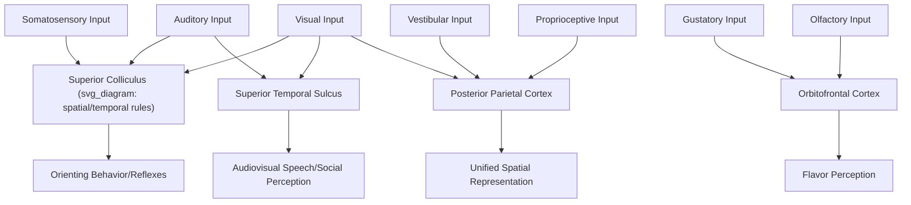

## Multisensory Integration

### Overview

Multisensory integration refers to the neural processes by which information from different sensory modalities (vision, audition, touch, vestibular, olfaction, taste) is combined to produce unified, more reliable, and often qualitatively distinct perceptual experiences and behavioral responses. Rather than being merely additive, multisensory integration frequently follows specific quantitative principles governing when and how strongly different sensory signals are combined, and is supported by both dedicated multisensory convergence zones and, increasingly recognized, multisensory influences within traditionally "unisensory" cortical areas.

### Foundational Principles of Multisensory Integration

**Key Points — Classic Superior Colliculus Rules (Stein and Meredith)**

Established primarily through single-unit recordings in the cat/primate superior colliculus, three principles have proven broadly influential across the multisensory integration literature:

1. **Spatial rule**: Multisensory enhancement is maximal when stimuli from different modalities originate from the same spatial location; when stimuli are spatially disparate, response depression (rather than enhancement) can occur.
2. **Temporal rule**: Multisensory enhancement is maximal when stimuli from different modalities occur within a relatively narrow temporal window of coincidence; large temporal disparities reduce or eliminate integration.
3. **Principle of inverse effectiveness**: The relative magnitude of multisensory enhancement is greatest when the individual unisensory stimuli are weak or ambiguous, and comparatively smaller when unisensory stimuli are already highly salient/effective on their own — reflecting a form of superadditive gain that is proportionally largest for uncertain unisensory input.

$$R_{\text{multi}} \gg R_{\text{uni}_1} + R_{\text{uni}_2} \quad \text{(when individual responses are weak)}$$

where multisensory response magnitude $R_{\text{multi}}$ can substantially exceed the simple linear sum of unisensory responses under conditions of low individual stimulus effectiveness — a superadditive interaction pattern considered a hallmark signature of genuine multisensory neural integration, as opposed to mere co-activation.

### Bayesian/Statistically Optimal Cue Integration

**Key Points**

At the computational/behavioral level, human multisensory integration for estimating a single underlying environmental property (e.g., spatial location, size, or self-motion) often approximates statistically optimal combination, weighting each modality's contribution according to its relative reliability (inverse variance).

$$\hat{S} = w_V S_V + w_A S_A, \quad w_i = \frac{1/\sigma_i^2}{\sum_j 1/\sigma_j^2}$$

where the combined estimate $\hat{S}$ weights visual ($S_V$) and auditory ($S_A$) estimates according to their respective reliabilities ($1/\sigma^2$), and the combined estimate's variance is lower than either individual unisensory estimate's variance — a testable quantitative prediction confirmed across multiple cue-combination paradigms (e.g., visual-haptic size estimation, visual-vestibular self-motion estimation). [Inference] While this Bayesian/maximum-likelihood-estimation framework has strong empirical support across numerous specific paradigms, the degree to which it generalizes as a complete, universal account of all multisensory integration phenomena (versus being one of several operating principles, alongside categorical/discrete integration processes in some contexts) remains a topic of ongoing research and refinement.

### Neural Substrates

**Key Points — Convergence Sites**

| Region | Modalities Integrated | Function |
| --- | --- | --- |
| Superior colliculus | Visual, auditory, somatosensory | Orienting reflexes, spatial attention |
| Superior temporal sulcus (STS) | Visual, auditory (notably audiovisual speech) | Social perception, speech, biological motion |
| Posterior parietal cortex | Visual, somatosensory, vestibular, proprioceptive | Spatial representation, sensorimotor transformation |
| Orbitofrontal cortex | Gustatory, olfactory, visual, somatosensory | Flavor construction, hedonic evaluation |
| Insular cortex | Interoceptive, gustatory, somatosensory | Interoception, bodily awareness |

[Inference] While classical models emphasized dedicated, higher-order "multisensory convergence zones" as the primary loci of integration, an increasing body of evidence indicates that even traditionally "unisensory" cortical areas (e.g., primary auditory or visual cortex) can show measurable modulation by input from other modalities, suggesting multisensory influences are more anatomically widespread than originally proposed, though the functional significance and mechanism of these early-stage crossmodal effects remains an active area of investigation.

### Illustrative Integration Diagram

### Classic Behavioral/Perceptual Phenomena

**McGurk Effect**

When mismatched visual (lip movement for one syllable, e.g., "ga") and auditory (a different syllable, e.g., "ba") speech information are presented simultaneously, listeners typically perceive a third, fused or altered percept (e.g., "da") — demonstrating that audiovisual speech integration occurs automatically and can override or blend with acoustic information alone, rather than vision and audition being processed as fully independent, later-combined channels.

**Ventriloquist Effect**

When a spatially displaced visual stimulus (e.g., a moving puppet's mouth) is presented with a synchronized but spatially separate sound source, perceived sound location is systematically biased toward the visual stimulus location — reflecting vision's typically greater spatial reliability compared to audition, consistent with reliability-weighted Bayesian cue integration (vision, being spatially precise, receives greater weight $w_V$ in the combined location estimate).

**Rubber Hand Illusion**

Synchronized visual (seeing a fake hand being stroked) and tactile (feeling one's own hidden hand being stroked identically) stimulation can induce an illusory sense of body ownership over the fake hand, demonstrating that multisensory (visuo-tactile-proprioceptive) integration contributes directly to the sense of bodily self-attribution, not merely to external object/event perception.

### Example: Detecting and Localizing an Approaching Car While Crossing a Street

1. Visual motion cues (via the dorsal "where/how" stream, MT/MST) provide relatively precise spatial and trajectory information about the car under good lighting/visibility conditions.
2. Auditory cues (engine sound, tire noise) provide a spatially less precise but temporally sensitive redundant signal, particularly valuable in low-visibility conditions (e.g., at dusk, or if a pedestrian's visual attention is briefly elsewhere).
3. If visual and auditory signals both indicate a car approaching from the same location within a narrow temporal window, superior colliculus-mediated multisensory enhancement, following the spatial and temporal integration rules, boosts orienting/attentional response magnitude beyond what either modality would produce alone — particularly pronounced (per the principle of inverse effectiveness) if either individual signal alone is weak (e.g., dim lighting reducing visual salience).
4. The combined, reliability-weighted (Bayesian-style) estimate of the car's location and approach trajectory is more precise than either unisensory estimate alone, supporting faster and more accurate evasive action.

### Clinical and Developmental Evidence

- **Autism spectrum research**: Some studies report differences in multisensory temporal binding window width (e.g., greater tolerance for audiovisual asynchrony before perceiving events as separate) in autistic individuals relative to neurotypical comparison groups. [Unverified] Findings vary across specific paradigms and study populations, and the broader theoretical interpretation (e.g., whether this reflects a core multisensory integration difference or downstream effects of other processing differences) remains debated in the literature.
- **Developmental trajectory**: Multisensory integration abilities (e.g., susceptibility to the ventriloquist effect, optimal Bayesian cue weighting) appear to develop gradually through childhood, with some studies suggesting statistically optimal cue integration is not fully mature until relatively late childhood, [Inference] consistent with a developmental account in which the nervous system must accumulate sufficient cross-modal experience to calibrate reliable cue-reliability estimates, though the precise developmental timeline reported varies somewhat across specific studies and integration tasks tested.
- **Cross-modal plasticity in sensory loss**: In individuals with early-onset blindness or deafness, cortical regions typically dedicated to the absent modality (e.g., "visual" cortex in blind individuals) can become recruited for processing spared modalities (e.g., tactile Braille reading, or enhanced auditory spatial processing), demonstrating the nervous system's substantial capacity for crossmodal cortical reorganization following sensory deprivation.

### Common Misconceptions

- **Myth**: Multisensory integration is a late-stage cognitive process that occurs only after each modality has been fully and independently processed.

  **Fact**: Growing evidence indicates crossmodal influences occur at multiple processing stages, including relatively early sensory cortical areas, and integration effects (e.g., the McGurk effect) demonstrate that combination can occur automatically and pre-attentively rather than as a separate, later cognitive step.
- **Myth**: More sensory information always produces a proportionally better/stronger combined percept.

  **Fact**: The principle of inverse effectiveness shows the opposite pattern for already-strong signals — multisensory gain is proportionally greatest when unisensory signals are weak, and can be minimal or even show response depression when combining spatially or temporally mismatched, already-salient signals.

### Related Topics

- Vestibular system and self-motion cue integration
- McGurk effect and audiovisual speech perception
- Bayesian models of perception and cue reliability
- Superior colliculus and orienting behavior
- Cross-modal plasticity in sensory deprivation
- Body ownership and the rubber hand illusion
- Flavor perception and orbitofrontal integration