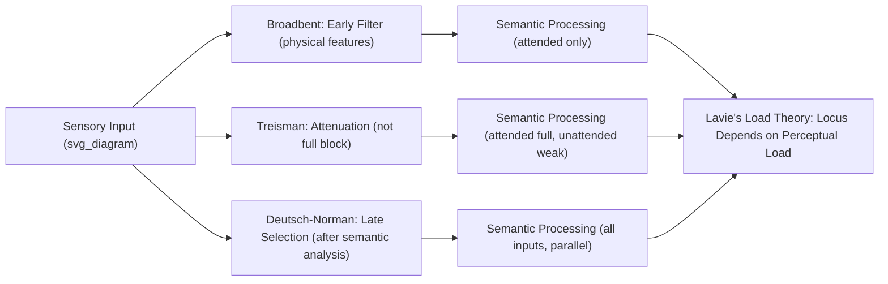

## Theories of Selective and Divided Attention

### Overview

Attention refers to the set of mechanisms that prioritize processing of behaviorally relevant information while filtering or deprioritizing irrelevant information, given the brain's fundamentally limited processing capacity. Selective attention theories address how and where in the processing stream this filtering occurs, while divided attention research addresses the extent to which multiple tasks or stimuli can be processed concurrently, and the capacity limits that constrain this. These theoretical traditions have evolved substantially from early information-processing "bottleneck" models toward more graded, resource-based, and neurally grounded contemporary frameworks.

---

### Part 1: Selective Attention — Filter Theories

**Broadbent's Early Selection (Filter) Theory (1958)**

Proposed that attention operates as an all-or-none filter early in processing, based on simple physical characteristics (e.g., spatial location, pitch, ear of presentation), selecting one input channel for full semantic processing while unattended channels are blocked prior to meaning extraction.

$$\text{Input} \rightarrow \text{Sensory Buffer} \rightarrow \text{Filter (physical features)} \rightarrow \text{Semantic Processing}$$

**Key Evidence and Limitation**: Broadbent's model was strongly motivated by dichotic listening studies, in which listeners typically report almost no memory for the content of an unattended auditory channel. However, subsequent studies (notably the "cocktail party" finding that one's own name is often noticed even in an unattended channel) demonstrated that some semantic processing of "unattended" information does occur, posing a direct challenge to a strictly all-or-none early filter.

**Treisman's Attenuation Theory (1964)**

Revised the early-selection model to propose that unattended information is not completely blocked but rather **attenuated** (reduced in signal strength) rather than eliminated, such that highly salient or contextually important unattended stimuli (e.g., one's own name, or words highly expected in context) can still occasionally break through and be consciously processed if their activation threshold is sufficiently low.

$$\text{Activation}_{\text{unattended}} = A_{\text{stimulus}} \times \text{Attenuation Factor}, \quad \text{Threshold}_{\text{word}} \text{ varies by salience/context}$$

**Deutsch-Norman Late Selection Theory**

Proposed the opposite extreme: all incoming stimuli are processed to the level of semantic meaning automatically and in parallel, with attentional selection occurring only later, at the stage of response selection or conscious awareness/memory encoding — meaning the bottleneck is located after, rather than before, semantic analysis.

[Inference] The early- vs. late-selection debate is now widely regarded as not fully resolved by a single universal answer; contemporary consensus (informed substantially by Lavie's load theory, below) suggests the locus of selection is flexible and depends on task demands, particularly perceptual processing load, rather than attention operating at a single, fixed processing stage across all conditions.

---

### Part 2: Perceptual Load Theory (Lavie)

**Key Points**

Load theory proposes a resolution to the early/late selection debate by arguing that the locus of selective attention depends on the perceptual load of the attended task:

- **High perceptual load** (attended task is demanding/complex): Available processing capacity is fully consumed by the relevant task, leaving no residual capacity to process irrelevant/distractor stimuli — producing early-selection-like outcomes (distractor interference is minimal).
- **Low perceptual load** (attended task is simple/undemanding): Spare processing capacity automatically "spills over" to process irrelevant stimuli, producing late-selection-like outcomes (distractor interference/processing is more likely).

$$\text{Distractor Processing} \propto \left(\text{Total Capacity} - \text{Load}_{\text{relevant task}}\right)$$

This framework has been influential in reconciling seemingly conflicting evidence for both early- and late-selection accounts by treating selection locus as a graded, task-dependent variable rather than a fixed architectural property of the attentional system.

---

### Part 3: Attentional Spotlight and Zoom-Lens Models

**Key Points**

Spatial visual attention has been influentially conceptualized as operating like a **spotlight** (Posner) — a spatially bounded region of enhanced processing that can be voluntarily or reflexively moved across the visual field, with processing benefits (faster/more accurate detection) for stimuli falling within its beam.

- **Zoom-lens extension**: Proposes that the spotlight's spatial extent is adjustable (like a zoom lens), with a trade-off between spatial extent and processing efficiency/gain — a narrowly focused spotlight provides stronger enhancement over a small area, while a broadly diffused spotlight provides weaker enhancement over a larger area.

$$\text{Gain}(\text{location}) \propto \frac{1}{\text{Spotlight Area}}$$

reflecting a proposed fixed total "resource" distributed across the attended spatial extent, such that expanding attentional focus proportionally reduces per-location processing enhancement.

**Object-Based Attention**

An alternative/complementary framework proposes that attention can also select based on perceptual objects/groupings rather than purely continuous spatial regions — demonstrated by studies showing faster attentional shifts between two locations on the same perceptual object compared to equidistant shifts spanning two separate objects, suggesting object structure itself influences how attention is allocated, not merely raw spatial distance.

---

### Part 4: Divided Attention and Capacity Theories

**Key Points**

- **Kahneman's capacity/resource model (1973)**: Proposed a single, limited, and flexibly allocatable pool of general attentional resources shared across tasks; performance on concurrent tasks degrades as combined demand exceeds total available capacity, with allocation influenced by arousal level, momentary intentions, and evaluation of task demands.
- **Multiple resource theory (Wickens)**: Proposed that rather than a single undifferentiated resource pool, attention comprises multiple, partially independent resource pools differentiated along dimensions such as processing stage (perceptual/cognitive vs. response), sensory modality (visual vs. auditory), and processing code (spatial vs. verbal) — predicting that dual-task interference should be substantially greater when two concurrent tasks draw on the same resource pool (e.g., two visual-spatial tasks) than when they draw on different pools (e.g., one visual-spatial and one auditory-verbal task), a pattern with reasonable empirical support in the dual-task performance literature.

$$\text{Interference}(T_1, T_2) \propto \text{Overlap}(\text{Resource Pools}_{T_1}, \text{Resource Pools}_{T_2})$$

**Central Bottleneck (Structural) Models**

An alternative account (particularly influential in explaining the **psychological refractory period**, PRP) proposes a strict structural bottleneck at the stage of response selection: regardless of resource availability, only one task can undergo response selection at a time, forcing serial processing at this specific stage even when perceptual and motor stages could in principle operate in parallel — producing characteristic RT slowing for the second of two closely-timed tasks (the PRP effect) that scales with the temporal proximity of the two task onsets.

[Inference] Resource-based (graded capacity) and structural bottleneck (strict serial) accounts of divided attention are not necessarily mutually exclusive, and much contemporary dual-task research attempts to characterize which specific processing stages show strict bottleneck-like serial limitations versus more graded, resource-dependent capacity sharing.

---

### Illustrative Diagram: Selection Locus Across Theories

### Neural Correlates

**Key Points**

- **Frontoparietal attention network**: Dorsal frontoparietal regions (intraparietal sulcus, frontal eye fields) support voluntary, goal-directed ("top-down") attentional control, while a more ventral, right-lateralized network (temporoparietal junction, ventral frontal cortex) supports stimulus-driven, reflexive ("bottom-up") reorienting to salient or unexpected stimuli — a distinction formalized in Corbetta and Shulman's influential dorsal/ventral attention network model.
- **Biased competition model (Desimone and Duncan)**: Proposes that multiple stimuli in the visual field compete for neural representation, and attention operates by biasing this competition in favor of goal-relevant/attended stimuli, implemented via top-down signals that enhance attended-stimulus-related neural firing and/or suppress competing unattended-stimulus representations — a well-supported framework at the single-neuron level in primate visual cortex studies.

### Example: Driving While Talking on a Hands-Free Phone

1. Under **load theory**, if driving conditions are perceptually demanding (heavy traffic, complex navigation decisions — high perceptual load), spare capacity for processing the phone conversation's content is minimal, and conversation-related interference with driving performance should be comparatively limited.
2. Under conditions of low driving perceptual load (straight, empty highway), spare capacity "spills over," and semantic processing of conversational content competes more directly with driving-relevant processing.
3. From a **multiple resource theory** perspective, because both driving (visual-spatial) and conversation comprehension/production (auditory-verbal) draw on at least partially distinct resource pools, some degree of concurrent performance is possible, though certain shared stages (e.g., central decision-making/response selection) may still produce interference.
4. From a **central bottleneck** perspective, if a sudden driving hazard requires rapid response selection (e.g., braking) at the same moment a conversational response is being formulated, response-selection-stage serial bottlenecking (analogous to the PRP effect) could measurably delay the driving response — a mechanism proposed as one contributing factor in documented real-world associations between phone use and increased collision risk, [Inference] though real-world driving impairment findings involve additional contributing factors beyond laboratory dual-task paradigms alone.

### Clinical and Experimental Evidence

- **Unilateral spatial neglect**: Damage to right hemisphere attention networks (particularly temporoparietal junction) produces a striking failure to attend to or report stimuli in contralesional (typically left) space, despite intact primary sensory pathways — providing strong evidence for attention as a distinct process from basic sensory processing, and directly implicating the ventral attention network in spatial awareness.
- **ADHD research**: Some studies report atypical activation and connectivity within frontoparietal and default mode networks during sustained and selective attention tasks in ADHD populations. [Unverified] Findings vary considerably across studies and specific attention paradigms, and the field has not converged on a single unified neural account of attentional differences in ADHD.
- **Inattentional blindness studies** (e.g., the "invisible gorilla" paradigm): Demonstrate that even salient, unexpected stimuli can go completely unnoticed when attention is heavily engaged elsewhere, providing striking real-world-relevant support for capacity-limited, load-dependent accounts of conscious perception.

### Common Misconceptions

- **Myth**: Attention is a single, unitary mechanism operating identically across all tasks and modalities.

  **Fact**: Contemporary theory and evidence support multiple, at least partially dissociable attentional mechanisms/networks (spatial, feature-based, object-based; top-down vs. bottom-up; and potentially separate or overlapping resource pools across modalities).
- **Myth**: True multitasking (fully parallel processing of two demanding tasks) is a common human capability that simply requires practice.

  **Fact**: While some task combinations show minimal interference (particularly when drawing on distinct resource pools per multiple resource theory, or during highly automatized/overlearned tasks), extensive dual-task and bottleneck research indicates fundamental structural limitations — particularly at response-selection stages — that constrain genuine parallel processing of most non-automatized concurrent task demands.

### Related Topics

- Multisensory integration and sensory processing limits
- Unilateral spatial neglect and parietal attention networks
- Biased competition model of visual attention
- Psychological refractory period and dual-task performance
- Inattentional blindness and change blindness
- Frontoparietal control networks and executive function
- Automaticity and skill acquisition