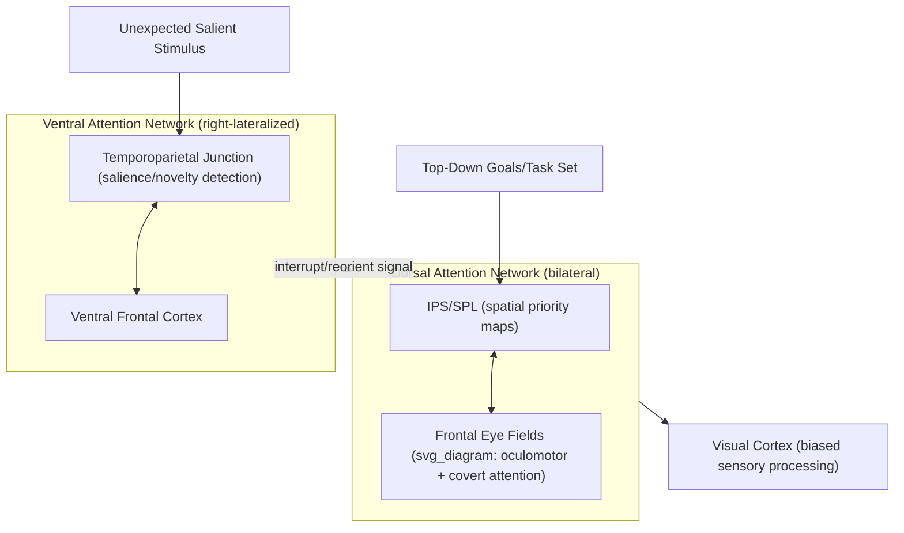

## Dorsal and Ventral Attention Networks

### Overview

The dorsal and ventral attention networks are two largely dissociable but interacting large-scale cortical systems, formalized primarily through the work of Corbetta and Shulman, that together support the allocation of visuospatial attention. The dorsal network implements voluntary, goal-directed ("top-down") attentional control, while the ventral network implements stimulus-driven, reflexive ("bottom-up") reorienting to salient or behaviorally relevant unexpected events — a functional division supported by converging evidence from neuroimaging, lesion studies, and neurophysiology.

### Dorsal Attention Network

**Key Points — Core Nodes**

- **Intraparietal sulcus (IPS) / superior parietal lobule (SPL)**: Encodes spatial priority maps, integrating current goals with stimulus salience to represent the relative behavioral importance of locations across the visual field.
- **Frontal eye fields (FEF)**: Premotor region controlling voluntary saccadic eye movements; also implicated in covert (non-oculomotor) spatial attention shifts, consistent with the premotor theory of attention, which proposes shared or overlapping mechanisms between attentional orienting and oculomotor planning.
- **Bilateral organization**: Unlike the ventral network, the dorsal attention network is organized bilaterally (present in both hemispheres), consistent with its role in representing and directing attention across the full visual field.

**Function**

The dorsal network is engaged during top-down, endogenous attentional orienting — for example, using a symbolic cue (an arrow) to voluntarily direct attention to a specific spatial location in anticipation of a target, independent of whether a salient stimulus is actually present there. It maintains and updates spatial priority maps that bias sensory processing in visual cortex in favor of goal-relevant locations, consistent with the biased competition framework of attentional selection.

$$\text{Priority}(x) = w_{\text{goal}} \cdot G(x) + w_{\text{salience}} \cdot S(x)$$

where the priority assigned to location $x$ reflects a weighted combination of goal-relevance $G(x)$ (top-down) and stimulus salience $S(x)$ (bottom-up), with the dorsal network primarily implementing the goal-driven component of this combined priority signal.

### Ventral Attention Network

**Key Points — Core Nodes**

- **Temporoparietal junction (TPJ)**: A key node for detecting behaviorally relevant, salient, or unexpected stimuli, particularly those appearing outside the current focus of attention.
- **Ventral frontal cortex (VFC)**: Includes portions of inferior frontal gyrus and middle frontal gyrus; works with TPJ to interrupt ongoing attentional allocation and trigger reorienting toward the new stimulus.
- **Right-lateralization**: Unlike the bilateral dorsal network, the ventral attention network shows strong right-hemisphere lateralization in humans — a feature with direct clinical relevance (see spatial neglect, below).

**Function**

The ventral network is engaged by bottom-up, exogenous attentional capture — for example, when an unexpected, salient stimulus appears at an unattended location and "interrupts" ongoing goal-directed processing, triggering reorienting of the dorsal network's spatial priority map toward the new location. [Inference] The ventral network is generally proposed to act as a "circuit breaker," transiently interrupting and redirecting dorsal network-maintained attentional allocation rather than independently generating sustained spatial attention itself — a functional characterization that remains somewhat schematic and continues to be refined by more detailed connectivity and lesion-based studies.

### Interaction Between the Two Networks

**Key Points**

The two networks are anatomically distinct (minimally overlapping) but functionally interactive, connected via specific structural and functional pathways that allow salient bottom-up events detected by the ventral network to modulate the dorsal network's ongoing spatial priority representation.

$$\text{Priority}_{\text{updated}}(x_{\text{new}}) = \text{Priority}_{\text{prior}}(x_{\text{new}}) + \Delta_{\text{VAN interrupt signal}}$$

reflecting how a ventral network-detected salient event at a previously low-priority location $x_{\text{new}}$ can transiently boost that location's priority within the dorsal network's spatial map, redirecting attention. [Inference] The precise effective connectivity and directional signaling dynamics between these networks (e.g., whether ventral-to-dorsal signaling is strictly one-directional or involves substantial reciprocal modulation) remain an active area of methodological refinement using techniques such as dynamic causal modeling and high-resolution functional connectivity analysis.

### Illustrative Network Diagram

### Example: Driving and Reacting to a Pedestrian Stepping Off the Curb

1. Under normal goal-directed driving, the dorsal attention network (IPS/SPL, FEF) maintains a spatial priority map weighted toward task-relevant locations — the road ahead, mirrors, traffic signals — biasing visual cortex to preferentially process information from these goal-relevant regions.
2. If a pedestrian unexpectedly steps into the street from a peripheral, previously low-priority location, this salient, behaviorally significant event is detected by the right-lateralized ventral attention network (TPJ, VFC).
3. The ventral network generates an interrupt signal, transiently overriding ongoing dorsal-network-maintained spatial priorities and rapidly reallocating the dorsal network's spatial map toward the pedestrian's location.
4. This produces both a covert (and typically overt, via FEF-driven saccade) reorienting of attention toward the pedestrian, supporting the rapid detection and behavioral response (braking) necessary to avoid a collision — illustrating the adaptive, safety-relevant function of maintaining sensitivity to unexpected salient events even while engaged in goal-directed, top-down-guided behavior.

### Clinical Evidence

- **Unilateral spatial neglect**: Right hemisphere lesions, particularly involving TPJ and adjacent ventral frontal cortex, are strongly associated with left-sided spatial neglect — a failure to attend to, respond to, or even consciously acknowledge stimuli in left (contralesional) space, despite intact primary visual pathways. [Inference] The right lateralization of the ventral attention network is proposed as a key explanatory factor for why neglect following right hemisphere damage is typically more severe and persistent than neglect following comparable left hemisphere damage (where the bilaterally-organized dorsal network and the intact right-hemisphere ventral network can provide greater compensatory attentional coverage of the affected visual field), though the precise structural/network mechanisms underlying this asymmetry continue to be investigated.
- **Balint's syndrome**: Bilateral posterior parietal (dorsal attention network) damage can produce simultanagnosia (inability to perceive more than one object at a time), optic ataxia, and impaired voluntary visual attention shifting, supporting the dorsal network's role in constructing and maintaining spatially organized, goal-directed visual attention.
- **ADHD and default mode network interactions**: [Unverified] Some research proposes atypical dynamic interaction between attention networks (dorsal/ventral) and the default mode network in ADHD, potentially contributing to attentional lapses; findings across studies vary in specific network measures reported and the field has not converged on a single agreed neural account.

### Common Misconceptions

- **Myth**: The dorsal and ventral attention networks correspond directly and exclusively to "attention" versus "awareness" as separate constructs.

  **Fact**: Both networks contribute to attentional processing specifically (spatial allocation and reorienting), and their relationship to the broader, more theoretically contested construct of conscious awareness is a related but distinct research question, not a direct one-to-one mapping.
- **Myth**: Bottom-up (ventral network) attentional capture always overrides top-down (dorsal network) goals.

  **Fact**: The degree to which a salient stimulus captures attention is itself modulated by top-down factors (e.g., current task relevance, perceptual load per load theory), and highly focused, high-load top-down attention can substantially reduce ventral-network-mediated capture by irrelevant salient distractors.

### Related Topics

- Theories of selective and divided attention
- Unilateral spatial neglect and parietal lesions
- Biased competition model of visual attention
- Premotor theory of attention and frontal eye fields
- Balint's syndrome and simultanagnosia
- Default mode network and attentional lapses
- Salience detection and bottom-up capture