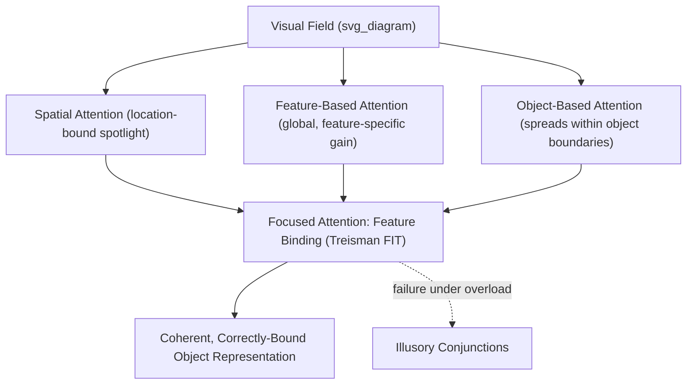

## Spatial, Feature, and Object Based Attention

### Overview

Visual attention can select information along multiple, at least partially dissociable dimensions: **where** something is (spatial attention), **what** perceptual features it has (feature-based attention), and **which perceptual grouping or entity** it belongs to (object-based attention). These three selection modes are not mutually exclusive — most real-world attentional allocation involves some combination of all three — but each has distinct behavioral signatures, proposed neural mechanisms, and dissociable patterns of impairment, making their theoretical and empirical separation a productive framework for understanding visual selection.

---

### Part 1: Spatial Attention

**Key Points**

Spatial attention selects information based on retinotopic/spatial location, independent of the specific features or objects present there — often conceptualized (per Posner's influential model) as an attentional "spotlight" that can be voluntarily or reflexively directed to enhance processing within a bounded region of space.

- **Endogenous (voluntary) spatial attention**: Directed based on top-down goals/expectations (e.g., a predictive symbolic cue), engaging the dorsal frontoparietal attention network (IPS, FEF).
- **Exogenous (reflexive) spatial attention**: Automatically captured by a sudden, salient peripheral event, engaging faster, more transient facilitation followed (at longer cue-target intervals) by **inhibition of return** — a well-documented phenomenon in which previously attended/inspected locations show slowed subsequent responding, [Inference] proposed to serve an adaptive function of biasing visual search/foraging away from already-inspected locations toward novel ones.

$$\text{Gain}(x) = f\left(|x - x_{\text{focus}}|\right)$$

where processing gain at location $x$ is a function (typically modeled as a Gaussian-like gradient) of spatial distance from the current attentional focus $x_{\text{focus}}$, consistent with the graded, spatially-organized nature of the attentional spotlight/zoom-lens.

---

### Part 2: Feature-Based Attention

**Key Points**

Feature-based attention selects a particular stimulus feature or feature value (e.g., a specific color, orientation, or direction of motion) and enhances processing of that feature **globally across the entire visual field**, not merely at a specific spatial location — a defining characteristic that distinguishes it sharply from spatially-restricted spatial attention.

**Feature Similarity Gain Model**

A well-supported computational account proposes that attending to a specific feature value (e.g., "red") produces a multiplicative gain enhancement on neurons tuned to that feature (and similarly-tuned neighboring feature values), scaled by each neuron's tuning similarity to the attended feature, and applied uniformly across visual space.

$$R_i' = R_i \times \left[1 + \beta \cdot \text{sim}(f_i, f_{\text{attended}})\right]$$

where $R_i'$ is a neuron's attention-modulated response, $R_i$ is its baseline (unattended) response, $\beta$ is a gain parameter, and $\text{sim}(f_i, f_{\text{attended}})$ reflects the similarity between the neuron's preferred feature $f_i$ and the currently attended feature — producing global, space-independent modulation demonstrated experimentally by simultaneous enhancement of neural responses to the attended feature at unattended spatial locations.

**Behavioral Evidence**

Visual search for a target defined by a single, easily discriminable feature (e.g., "find the red item") tends to proceed efficiently and in a spatially parallel manner ("pop-out" search, largely independent of the number of distractors), consistent with feature-based attention operating as an efficient global filter, in contrast to search for targets defined by a specific conjunction of features (see below).

---

### Part 3: Object-Based Attention

**Key Points**

Object-based attention proposes that attention can select based on perceptual objects or groupings (as organized by principles such as Gestalt grouping) rather than purely continuous spatial regions, such that attending to one part of an object facilitates processing of other parts of the same object, even when those parts are spatially farther from the current focus than an equidistant location on a different object.

**Same-Object Advantage**

The classic experimental signature (established by Egly, Driver, and Rafal) demonstrates that when attention is cued to one end of an elongated object, subsequent target detection is faster for a target appearing at the *other end of the same object* than for an equidistant target appearing on a *different object* — a "same-object advantage" that cannot be explained by spatial distance alone, since spatial distance is matched between the two conditions.

$$RT_{\text{same-object}} < RT_{\text{different-object}} \quad \text{(at matched spatial distance)}$$

[Inference] This finding is generally interpreted as evidence that attention, once allocated, tends to spread preferentially within the boundaries of a perceptually segmented object, though the precise underlying mechanism (e.g., whether this reflects genuinely object-based spreading of a spatial gradient versus a more general effect of perceptual grouping on spatial attention allocation) has been the subject of some ongoing theoretical refinement.

---

### Feature Integration Theory (Treisman): Combining the Three Modes

**Key Points**

Treisman's influential Feature Integration Theory (FIT) proposes a two-stage account of visual processing that helps organize how spatial, feature-based, and object-based attention jointly support object perception:

1. **Preattentive stage**: Basic features (color, orientation, motion direction) are registered rapidly and in parallel across the visual field, without requiring focused attention — supporting efficient, spatially parallel "pop-out" search for single-feature targets.
2. **Focused attention stage**: Correctly binding multiple separate features into a coherent, spatially-localized object representation (the **binding problem**) requires serial, spatially-directed attention to each location in turn — explaining why visual search for a target defined by a *conjunction* of features (e.g., "find the red vertical item" among red horizontal and green vertical distractors) is typically slower and scales with the number of distractors (serial search), in contrast to efficient single-feature pop-out search.

**Illusory Conjunctions**

Under conditions of very brief stimulus presentation or divided/overloaded attention, features from different objects can be incorrectly combined (e.g., perceiving a "red X" when a red O and a green X were actually presented separately), providing striking direct behavioral evidence for the proposed binding role of focused spatial attention in accurately combining preattentively-registered features into correct object representations.

---

### Illustrative Diagram: Three Attention Modes and Their Interaction

### Example: Searching for a Friend Wearing a Red Jacket in a Crowd

1. **Feature-based attention**: If "red" is a sufficiently distinctive, easily discriminable feature within the crowd, feature-based attention can globally enhance processing of red-colored regions across the entire visual field in a spatially parallel manner, supporting relatively efficient "pop-out"-like detection of red-clothed individuals.
2. **Spatial attention**: Once one or more red-jacket candidates are identified, spatial attention is deployed sequentially to each candidate location to evaluate whether the full conjunction of features (red jacket AND the friend's specific face/build) matches.
3. **Object-based attention**: As spatial attention settles on a specific candidate, attention tends to spread across that person's full bounded form (the perceptual "object"), facilitating integrated processing of jacket color, build, and (as gaze shifts) facial features as belonging to a single coherent entity, rather than as independently floating features.
4. **Feature binding**: Treisman's focused-attention stage correctly combines the red-jacket feature with the specific facial features of that spatially-attended individual, avoiding the illusory-conjunction risk of misattributing a nearby stranger's red jacket to the friend's face, or vice versa.

### Neural Correlates

- **Spatial attention**: Modulates retinotopically-organized visual cortex (V1 onward) in a location-specific manner, with enhancement strongest for stimuli within the attended spatial region.
- **Feature-based attention**: Produces feature-tuned modulation that can be measured across the *entire* retinotopic map, including in regions of visual cortex representing currently unattended spatial locations — a key neurophysiological signature distinguishing it from purely spatial attention.
- **Object-based attention**: Associated with modulation in higher-order visual areas (e.g., lateral occipital cortex) involved in object/shape representation, as well as measurable spillover modulation within the spatial extent of an attended object in earlier retinotopic areas.

### Clinical and Experimental Evidence

- **Balint's syndrome**: Bilateral posterior parietal damage impairs the ability to voluntarily deploy spatial attention to multiple locations/objects (simultanagnosia), providing lesion-based support for parietal cortex's role in spatially-directed, serial focused attention as proposed in Feature Integration Theory.
- **Visual search asymptotic slope studies**: The reliable behavioral dissociation between flat (parallel, feature "pop-out") and steep (serial, conjunction) search-time-by-set-size slopes remains one of the most robust and widely replicated behavioral signatures supporting a two-stage (preattentive/focused) processing architecture, though [Inference] the strict feedforward serial/parallel dichotomy of the original FIT model has been refined by subsequent guided-search and related models proposing more graded, parallel-with-priority search mechanisms.
- **Unilateral neglect and object-based effects**: Some neglect patients show evidence of object-based attentional deficits (e.g., neglecting the contralesional half of a single object even when it is rotated into ipsilesional space), suggesting object-centered (rather than purely viewer-centered/spatial) reference frames can also be relevant to certain attentional and neglect phenomena.

### Common Misconceptions

- **Myth**: Spatial, feature-based, and object-based attention are entirely separate, non-interacting systems.

  **Fact**: These selection modes operate concurrently and interactively in typical visual behavior — spatial attention is often deployed to specific objects, and feature-based enhancement operates within and across those spatially/object-attended regions, as illustrated in the visual search example above.
- **Myth**: Efficient "pop-out" visual search proves that attention is entirely unnecessary for simple feature detection.

  **Fact**: While pop-out search is fast and largely set-size-independent (consistent with parallel, preattentive processing), this does not mean attention is completely absent — some degree of attentional modulation and feature-based gain likely contributes even to seemingly effortless, parallel feature detection.

### Related Topics

- Theories of selective and divided attention
- Dorsal and ventral attention networks
- Feature integration theory and the binding problem
- Visual search and guided search models
- Balint's syndrome and simultanagnosia
- Illusory conjunctions and feature misbinding
- Inhibition of return and visual foraging