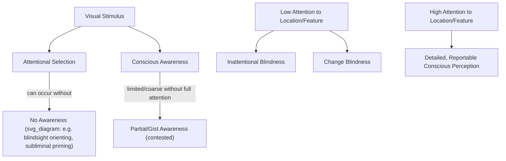

## Attention and Perceptual Awareness

### Overview

Attention and perceptual (conscious) awareness are closely related but empirically and theoretically dissociable constructs: attention refers to selective prioritization of information processing, while awareness refers to the subjective, reportable experience of a stimulus. A substantial body of research has sought to determine whether attention is necessary and/or sufficient for conscious perception, using experimental paradigms that manipulate one variable while holding the other constant — a research program that has produced evidence for meaningful dissociation between the two constructs, while also demonstrating their extensive normal interdependence.

### Theoretical Positions on the Attention-Awareness Relationship

**Key Points — Four Logical Possibilities**

| Position | Claim |
| --- | --- |
| Attention necessary and sufficient | Attention is both required for and automatically produces awareness |
| Attention necessary but not sufficient | Awareness requires attention, but attended stimuli are not always consciously perceived |
| Attention sufficient but not necessary | Attention guarantees awareness, but awareness can occur without attention |
| Attention neither necessary nor sufficient | Attention and awareness are fully dissociable processes |

[Inference] Contemporary research generally favors a position closer to "attention and awareness are dissociable but strongly interacting" rather than full identity, though which of the more specific positions above (or context-dependent combinations) best characterizes the relationship remains actively debated, with different experimental paradigms sometimes yielding seemingly conflicting conclusions depending on methodology and the specific awareness measure used.

### Evidence for Dissociation: Attention Without Awareness

**Key Points**

- **Subliminal/masked priming studies**: Stimuli presented too briefly or too degraded (e.g., via backward visual masking) for conscious identification can nonetheless influence subsequent behavior (e.g., priming responses to a related subsequent stimulus) and can be shown, in some paradigms, to still attract or be modulated by spatial attention — suggesting attentional selection mechanisms can operate on stimuli that never reach conscious report.
- **Blindsight**: Patients with V1 (primary visual cortex) damage can, in some cases, show above-chance ability to localize, discriminate, or orient attention toward visual stimuli presented in their "blind" field, despite reporting no conscious visual experience of those stimuli — a striking clinical dissociation suggesting some visual processing (potentially including limited attentional orienting, via preserved subcortical pathways such as the retino-colliculo-pulvinar-cortical route) can occur entirely outside conscious awareness.

[Inference] The specific attentional capacities preserved in blindsight (versus purely reflexive orienting without genuine "attention" in the full cognitive sense) remains a topic of careful methodological debate, given the difficulty of fully dissociating attentional orienting from more basic subcortical reflexive responses in this population.

### Evidence for Dissociation: Awareness Without (Full) Attention

**Key Points**

- **Gist perception under inattention**: Some studies suggest that coarse, holistic scene "gist" (e.g., general scene category — indoor vs. outdoor, natural vs. urban) can be extracted and, in some paradigms, reported even under conditions of divided or minimal focused attention, suggesting a degree of awareness for coarse global properties may not require the same focused attentional resources needed for detailed object-level perception. [Unverified] The degree to which this reflects genuine awareness entirely independent of any attentional resource allocation, versus a lower attentional threshold for coarse/global versus fine/local processing, remains debated, and some researchers argue rapid gist extraction still depends on some minimal form of distributed attention rather than being fully attention-independent.
- **Iconic memory and partial report studies**: Sperling's classic partial-report paradigm demonstrated that observers have access to a very brief, high-capacity, but rapidly decaying sensory (iconic) memory store containing more information than can be consciously reported via full report — suggesting a form of rich, pre-attentive sensory registration that exceeds what focused attention/working memory can subsequently access and report, illustrating a partial dissociation between raw sensory registration and attentionally-mediated conscious report.

### Inattentional Blindness: Evidence That Attention May Be Necessary for Awareness

**Key Points**

A large body of evidence, most famously the "invisible gorilla" selective attention paradigm (Simons and Chabris), demonstrates that even highly salient, unexpected stimuli presented in full view can go completely unnoticed (unreported, and by some measures unremembered) when an observer's attention is heavily engaged in a demanding unrelated task.

$$P(\text{awareness}) \propto f\left(\text{attentional resources allocated to stimulus location/feature}\right)$$

reflecting the general finding that the probability of consciously noticing/reporting a stimulus increases with attentional resources directed toward it, and can approach zero for even highly visible stimuli under conditions of severe attentional load elsewhere — providing some of the most compelling behavioral evidence that focused attention plays at minimum a strong facilitating, and by some interpretations necessary, role in typical conscious visual perception of specific, effortfully-detected details.

**Change Blindness**

Related paradigms demonstrate that substantial visual changes between successive scene presentations (e.g., across an eye-movement-induced saccade, a brief flicker interruption, or an edited film cut) frequently go unnoticed unless attention happens to be directed to the specific changing region at the time of the change — again suggesting focused attention is closely tied to detailed conscious registration of specific stimulus properties/changes, even when low-level visual sensitivity to the change would otherwise be sufficient to detect it.

### Illustrative Diagram: Dissociation Evidence Summary

### Neural Correlates

**Key Points**

- **Neural correlates of consciousness (NCC) research**: A substantial research effort has sought to identify the minimal neural activity patterns sufficient for a specific conscious percept, using paradigms such as binocular rivalry (where a constant physical stimulus produces alternating conscious percepts) that allow dissociation of stimulus-driven activity from activity correlating specifically with conscious report.
- **Global Workspace Theory / Global Neuronal Workspace**: [Inference] An influential theoretical framework proposing that conscious access occurs when information is broadcast widely across a distributed frontoparietal "workspace" network, and that attention serves as a key gating mechanism controlling which information gains this broad access — a framework with substantial supporting evidence but, like other major theories of consciousness (e.g., Integrated Information Theory), not without significant ongoing theoretical and empirical debate regarding its completeness and specific predictions.
- **Frontoparietal network overlap**: The frontoparietal networks implicated in attentional control (see Dorsal/Ventral Attention Networks) show substantial anatomical and functional overlap with networks proposed as central to conscious access in global workspace-type frameworks, [Inference] though whether this reflects a shared underlying mechanism or merely correlated/co-occurring processes remains a matter of ongoing theoretical interpretation rather than a fully settled empirical conclusion.

### Example: Missing an Unexpected Event While Focused on a Task

1. An observer is instructed to attentively count a specific type of event in a complex, rapidly changing visual display (analogous to the classic "count the basketball passes" inattentional blindness paradigm), directing sustained focused attention to specific task-relevant stimulus features and locations.
2. An unexpected, salient, and fully visible stimulus (e.g., a person in a distinctive costume) appears and moves through the display for several seconds, well within the observer's foveal/parafoveal visual field at various points.
3. Because attentional resources are heavily allocated to the counting task's specific features (ball passes) rather than the unexpected stimulus's location/features, the unexpected stimulus frequently fails to reach conscious awareness — the observer subsequently reports no memory of having seen it, despite the stimulus's high objective visual salience.
4. This demonstrates that basic visual sensitivity/exposure to a stimulus is not sufficient for conscious perception; some minimal threshold of attentional allocation to that stimulus's location or relevant features appears necessary for typical, effortful conscious registration and subsequent reportability — though debate continues regarding whether some minimal, non-zero level of attention was nonetheless allocated (supporting a graded rather than strictly all-or-none relationship between attention and awareness).

### Clinical Evidence

- **Blindsight (as above)**: Provides some of the clearest clinical evidence for attention-like processing occurring in the apparent absence of conscious visual awareness, implicating preserved extrastriate/subcortical visual pathways that bypass damaged V1.
- **Hemispatial neglect**: While primarily characterized as a disorder of spatial attention, many neglect patients also show striking failures of conscious awareness for contralesional stimuli (sometimes described by patients as if that side of space simply does not exist), illustrating the close real-world coupling between attentional deficits and corresponding awareness deficits in clinical populations, even though laboratory dissociation paradigms in healthy individuals demonstrate the two constructs are not strictly identical.
- **Disorders of consciousness research**: Studies of patients with severely impaired consciousness (e.g., vegetative/unresponsive wakefulness states versus minimally conscious states) have used covert attentional/awareness paradigms (e.g., neuroimaging-based mental imagery tasks) to probe for residual awareness not detectable via standard behavioral assessment, [Inference] representing an application of attention-awareness dissociation research with substantial clinical and ethical significance, though interpretation of individual cases remains methodologically and clinically complex.

### Common Misconceptions

- **Myth**: Attention and conscious awareness are simply two names for the same underlying process.

  **Fact**: Multiple converging lines of evidence (blindsight, subliminal priming, inattentional blindness, iconic memory) demonstrate meaningful behavioral and neural dissociations between the two constructs, even though they are normally tightly coupled and mutually interacting in typical perception.
- **Myth**: Inattentional blindness demonstrates that unattended stimuli are not processed by the brain at all.

  **Fact**: Substantial evidence (e.g., from priming and neuroimaging studies) suggests unattended/unreported stimuli often still receive meaningful sensory and even some semantic processing; what is absent is specifically the attentionally-mediated processing typically required for detailed conscious report and explicit memory encoding, not necessarily all neural processing of the stimulus.

### Related Topics

- Theories of selective and divided attention
- Dorsal and ventral attention networks
- Blindsight and residual visual function after V1 damage
- Inattentional blindness and change blindness
- Global Workspace Theory and neural correlates of consciousness
- Binocular rivalry as a consciousness research paradigm
- Hemispatial neglect and awareness deficits