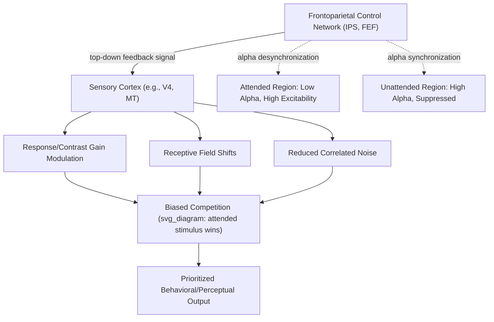

## Neural Mechanisms of Attentional Control

### Overview

Attentional control refers to the neural mechanisms by which top-down goals and bottom-up salience signals modulate ongoing sensory processing to prioritize behaviorally relevant information. This involves specific single-neuron physiological signatures (gain modulation, receptive field shifts), well-characterized oscillatory dynamics, and coordinated large-scale network interactions between control regions (frontoparietal cortex) and the sensory areas whose processing they bias.

### Single-Neuron Physiological Signatures of Attention

**Key Points — Core Mechanisms**

- **Response gain modulation**: Directing attention to a stimulus within a neuron's receptive field typically increases that neuron's firing rate to the stimulus, without necessarily changing the neuron's fundamental tuning preference (the neuron still prefers the same orientation/direction/color, but responds more strongly overall when attended) — a multiplicative scaling effect well-documented across multiple visual areas (V4, MT, IT).
- **Contrast gain modulation**: An alternative/complementary mechanism in which attention effectively shifts a neuron's contrast-response function leftward, such that the neuron behaves as if the stimulus had higher physical contrast than it objectively does — particularly prominent in some V4 and MT recordings. [Inference] Whether attentional effects are better characterized as response gain, contrast gain, or a mixture depends on specific stimulus and attentional conditions, and reconciling these different reported gain profiles across studies remains an active area of computational and physiological research.
- **Receptive field shifts**: Attending to a location near a neuron's receptive field boundary can cause that receptive field to shift and/or shrink toward the attended location, effectively increasing spatial resolution and sensitivity in the vicinity of the attended point — demonstrated in area V4 and MT recordings, and interpreted as a mechanism for enhancing spatial discrimination at behaviorally relevant locations.
- **Reduced neuronal response variability and correlated noise**: Attention has been shown to reduce trial-to-trial variability and, notably, to reduce inter-neuronal noise correlations within a local population — a mechanism proposed to substantially improve the information-carrying capacity (signal-to-noise ratio) of an attended population's collective response, potentially independent of any change in mean firing rate.

$$\text{SNR}_{\text{population}} \propto \frac{\left(\sum_i R_i\right)^2}{\text{Var}\left(\sum_i R_i\right)}$$

where population signal-to-noise ratio depends not only on individual neuron response magnitude $R_i$ but critically on the covariance structure (correlated noise) across the population — meaning attention-related reductions in shared noise correlations can improve population coding fidelity even without proportional increases in mean firing rate, a mechanism considered by many in the field to be at least as important as simple gain increases.

### Biased Competition Model (Desimone and Duncan)

**Key Points**

A foundational computational framework proposing that multiple stimuli within a neuron's receptive field (or within a cortical area more broadly) compete for neural representation via mutual suppression, and that attention operates by biasing this competition in favor of the behaviorally relevant/attended stimulus — implemented via top-down signals (originating from frontoparietal control regions) that enhance the effective "strength" of the attended stimulus's representation relative to unattended competitors.

$$R_{\text{neuron}} = \frac{w_{\text{attended}} \cdot R_{\text{attended stim}} + w_{\text{unattended}} \cdot R_{\text{unattended stim}}}{w_{\text{attended}} + w_{\text{unattended}}}, \quad w_{\text{attended}} > w_{\text{unattended}}$$

where a neuron's response to multiple simultaneously-present stimuli within its receptive field reflects a competitively-weighted combination, with top-down attentional signals increasing the relative weight ($w$) assigned to the attended stimulus — well-supported by classic single-unit studies showing that a neuron's response to a preferred-plus-nonpreferred stimulus pair shifts toward resembling the response to the preferred stimulus alone when attention is directed to that preferred stimulus.

### Oscillatory Dynamics and Attention

**Key Points**

- **Alpha-band oscillations (~8–12 Hz)**: Increased alpha power over sensory cortical regions is associated with functional inhibition/deprioritization of the corresponding unattended sensory representation, while decreased alpha power over regions representing attended information is associated with facilitated processing — providing an EEG/MEG-measurable oscillatory signature of spatially-specific attentional allocation, sometimes conceptualized as a "gating by inhibition" mechanism.
- **Gamma-band synchronization (~30–80+ Hz)**: Attention has been associated with increased gamma-band synchronization among neurons representing attended stimuli, proposed (in the influential "communication through coherence" framework) as a mechanism facilitating effective inter-areal communication of attended information by temporally aligning the excitability windows of sending and receiving neural populations. [Inference] While gamma-synchronization findings are robust across numerous studies, the specific causal role of gamma coherence in supporting attentional selection (versus being a correlated byproduct of other attentional mechanisms) remains a topic of ongoing debate in systems neuroscience.
- **Theta-band rhythms and attentional sampling**: Some research proposes that even sustained visual attention is not continuous but instead cycles at theta-band frequencies (~4–8 Hz), with attentional sensitivity periodically waxing and waning even at a single fixed attended location — a "rhythmic attention" framework with growing but [Unverified] not yet fully settled empirical support regarding its generality across tasks and attentional conditions.

### Large-Scale Network Interactions

**Key Points**

Top-down attentional control signals are proposed to originate in frontoparietal control regions (dorsal attention network: IPS, FEF; see Dorsal/Ventral Attention Networks) and propagate to sensory cortex via feedback connections, biasing local competition and gain in favor of goal-relevant representations.

$$\text{Sensory Response}(x, t) = f\left(\text{Bottom-up Input}(x, t), \, \text{Top-down Signal}_{\text{frontoparietal}}(x, t)\right)$$

where sensory cortical responses at a given location $x$ and time $t$ reflect the combination of bottom-up sensory drive and a top-down modulatory signal originating from control regions — with evidence from techniques such as transcranial magnetic stimulation (TMS) of FEF/IPS causally modulating downstream visual cortical responses, and Granger causality/dynamic causal modeling analyses of neuroimaging data generally supporting predominantly feedback (frontoparietal-to-sensory) directional influence during top-down attentional tasks.

### Illustrative Mechanism Diagram

### Example: Attending to One of Two Overlapping Moving Dot Patterns

1. Two spatially overlapping random-dot motion patterns move in different directions within a single MT neuron's receptive field; without attention, the neuron's response reflects a weighted average of its tuning to both directions (biased competition, unweighted).
2. When the observer is cued to attend to one specific motion direction, top-down signals from frontoparietal control regions (via feedback connections) bias the local competition in MT, increasing the effective weight of the attended-direction input relative to the unattended-direction input.
3. This produces a measurable shift in the neuron's firing rate toward resembling its response to the attended motion direction alone — a hallmark biased-competition signature — alongside potential contrast-gain-like enhancement of the attended pattern's effective salience.
4. Concurrently, EEG recordings would likely show reduced alpha power over cortical regions representing the attended motion direction/location, and possibly increased gamma-band synchronization among the subset of MT neurons preferentially responsive to the attended direction, facilitating more effective downstream communication of the attended-motion signal to areas involved in perceptual decision-making (e.g., area LIP, in classic motion-discrimination decision studies).

### Clinical and Experimental Evidence

- **TMS studies of FEF/IPS**: Transcranial magnetic stimulation applied to frontal eye fields or intraparietal sulcus has been shown to causally modulate attention-related visual cortical excitability and behavioral performance on spatial attention tasks, providing causal (not merely correlational) support for frontoparietal-to-sensory top-down control.
- **Parkinson's disease and attentional control**: [Unverified] Some studies report attentional control deficits (e.g., in switching or sustaining top-down attentional allocation) associated with basal ganglia/dopaminergic dysfunction in Parkinson's disease, though findings vary across specific attentional subdomains and task paradigms tested, and the relationship between basal ganglia pathology and cortical attentional network function remains an active research area.
- **ADHD and oscillatory/network measures**: Some EEG and neuroimaging studies report atypical alpha modulation, frontoparietal network connectivity, or theta/beta ratio measures in ADHD populations during attentional tasks. [Unverified] As with related attention-network clinical findings noted elsewhere, results vary substantially across specific studies and measures, and no single neural marker has achieved consensus diagnostic or mechanistic status for ADHD.

### Common Misconceptions

- **Myth**: Attentional enhancement of neural responses is solely a matter of increasing overall firing rate ("turning up the volume").

  **Fact**: Substantial evidence indicates attention also improves population coding fidelity through reduced correlated noise and improved receptive field precision (spatial resolution enhancement), mechanisms that can improve information transmission independent of, or in addition to, simple mean firing rate increases.
- **Myth**: Top-down attentional signals originate in and are confined to visual cortex itself.

  **Fact**: Substantial anatomical, physiological (TMS), and connectivity evidence supports frontoparietal control regions (particularly FEF and IPS within the dorsal attention network) as the primary source of top-down attentional feedback signals that modulate sensory cortical processing, rather than attention being generated locally within sensory areas alone.

### Related Topics

- Dorsal and ventral attention networks
- Spatial, feature, and object based attention
- Attention and perceptual awareness
- Biased competition model of visual attention
- Alpha oscillations and cortical inhibition
- Communication through coherence and gamma synchronization
- Population coding and correlated neural noise