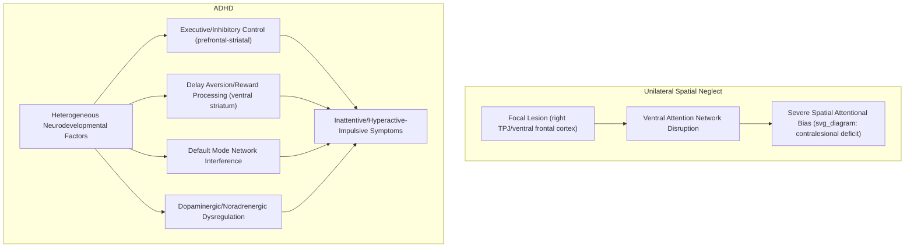

## Disorders of Attention Including Neglect and ADHD

### Overview

Disorders of attention span a wide clinical spectrum, from focal, acquired lesion-based syndromes with well-characterized anatomical correlates (unilateral spatial neglect) to complex, heterogeneous neurodevelopmental conditions with distributed, still-being-characterized neural underpinnings (ADHD). Examining both provides complementary insight into attentional neuroscience: neglect demonstrates the consequences of damage to specific attentional network nodes, while ADHD illustrates the challenges of mapping a behaviorally-defined, likely multi-mechanism clinical syndrome onto specific neural systems.

---

### Part 1: Unilateral Spatial Neglect

**Key Points — Core Clinical Features**

- A failure to attend, orient, or respond to stimuli presented on the side of space contralateral to a brain lesion, most commonly the left side following right hemisphere damage, and critically, **not attributable to primary sensory or motor deficits alone** (patients typically have intact visual fields and motor capacity on the neglected side).
- Most frequently associated with lesions involving the right temporoparietal junction (TPJ) and adjacent ventral frontal cortex — core nodes of the ventral attention network — though lesions to other regions (including subcortical structures, such as the thalamus and basal ganglia) can also produce neglect-like syndromes.
- Right hemisphere lesions produce neglect substantially more frequently and severely than comparable left hemisphere lesions, [Inference] an asymmetry generally attributed to the right-lateralized organization of the ventral attention network combined with the bilateral organization of the dorsal attention network, such that right hemisphere damage removes ventral network function entirely while leaving no equivalent unimpaired system to compensate, whereas left hemisphere damage still leaves the intact right-hemisphere ventral network capable of providing broader attentional coverage.

**Clinical Manifestations**

- **Contralesional extinction**: Milder than frank neglect; a contralesional stimulus is detected normally when presented alone but fails to be detected when a competing ipsilesional stimulus is presented simultaneously, revealing an attentional (rather than purely sensory) competitive bias.
- **Personal neglect**: Failure to attend to or groom the contralesional side of one's own body.
- **Allocentric vs. egocentric neglect**: Neglect can manifest relative to the observer's own body midline (egocentric) and/or relative to the intrinsic left-right structure of individual objects regardless of their position in the visual field (allocentric/object-centered) — patients can show dissociable patterns of each, [Inference] suggesting neglect may reflect impairment across multiple, at least partially separable spatial reference frames rather than a single unified spatial deficit.
- **Anosognosia for neglect**: Many patients show striking unawareness of their own deficit, sometimes denying any problem despite objectively severe neglect on formal testing — itself considered a further manifestation of the broader attentional/awareness disruption.

**Assessment**

- **Line bisection task**: Patients asked to mark the midpoint of a horizontal line typically bisect it substantially rightward of true center.
- **Cancellation tasks**: Patients asked to mark all targets scattered across a page typically omit targets on the contralesional (usually left) side.
- **Drawing/copying tasks**: Neglect patients frequently omit contralesional details when copying a figure or drawing from memory (e.g., a clock missing numbers on the left side).

$$\text{Detection}(x) \propto \begin{cases} \text{near-normal} & x \in \text{ipsilesional space} \\ \text{severely impaired} & x \in \text{contralesional space} \end{cases}$$

reflecting the characteristically severe spatial gradient in detection/response probability across the vertical midline, a hallmark quantitative signature distinguishing neglect from a generalized (non-lateralized) attentional impairment.

---

### Part 2: Attention-Deficit/Hyperactivity Disorder (ADHD)

**Key Points — Core Clinical Features**

ADHD is a neurodevelopmental condition characterized by persistent, developmentally inappropriate patterns of inattention and/or hyperactivity-impulsivity that impair functioning across multiple settings, with onset in childhood (per current diagnostic frameworks) though frequently persisting, sometimes with evolving symptom presentation, into adulthood.

- **Inattentive presentation**: Difficulty sustaining attention, apparent failure to listen, poor organization, distractibility, forgetfulness.
- **Hyperactive-impulsive presentation**: Excessive motor activity, difficulty remaining seated/still, interrupting, difficulty waiting turns, impulsive decision-making.
- **Combined presentation**: Clinically significant symptoms from both domains.

**Proposed Neurocognitive Mechanisms**

[Inference] Unlike neglect, ADHD does not have a single, well-established, universally agreed anatomical or mechanistic account; multiple, potentially complementary theoretical frameworks have been proposed, and the condition is increasingly understood as neurobiologically and cognitively heterogeneous:

- **Executive function/inhibitory control deficit models**: Propose core impairment in response inhibition and executive control (implicating prefrontal-striatal circuitry), consistent with performance patterns on tasks such as the stop-signal and go/no-go paradigms.
- **Delay aversion/motivational models**: Propose that impulsive, seemingly attention-related behaviors partly reflect altered reward/delay processing (implicating dopaminergic reward circuitry, including ventral striatum) rather than a purely "cold" cognitive-control deficit.
- **Default mode network interference models**: Propose that ADHD-related attentional lapses reflect atypical (insufficiently suppressed) default mode network activity intruding on task-positive network engagement during sustained attention demands — [Unverified] an influential but still actively investigated and refined framework, with findings varying across specific studies and analytic approaches.
- **Dopaminergic/noradrenergic dysregulation**: Pharmacological evidence (efficacy of stimulant medications acting on dopamine and norepinephrine transporters) and some neuroimaging findings support a role for catecholaminergic dysregulation, though [Inference] the precise mechanistic link between neurotransmitter-level findings and specific cognitive/attentional symptom profiles remains incompletely characterized.

**Neuroimaging Findings**

[Unverified] Meta-analyses have reported modest structural differences (e.g., slightly reduced volume in some frontal, striatal, and cerebellar regions) and functional connectivity differences (including within frontoparietal attention networks and default mode network) in ADHD populations relative to comparison groups; however, effect sizes at the individual level are generally described in the literature as small and with substantial overlap between clinical and non-clinical groups, such that no single neuroimaging marker currently has established diagnostic utility for individual patients, and findings continue to be refined by larger, better-powered studies.

---

### Illustrative Diagram: Contrasting Mechanisms

### Example: Contrasting Presentations in Everyday Function

**Neglect**: A patient with right parietal stroke, when asked to read a page of text, reliably begins reading from the middle of each line rather than the true left margin, and when eating a plated meal, consumes only the food on the right half of the plate — despite having normal visual acuity and no report of visual field loss on standard confrontation testing, illustrating the attentional (rather than primary sensory) nature of the deficit and its pervasive impact on everyday spatially-organized tasks.

**ADHD**: A child with the inattentive presentation may perform adequately on brief, novel, or highly engaging tasks (e.g., a video game with frequent, salient reward feedback) but shows pronounced difficulty sustaining attention and performance on longer, less inherently stimulating tasks (e.g., completing a worksheet of repetitive arithmetic problems) — a pattern [Inference] often cited as consistent with motivational/delay-aversion accounts emphasizing task-dependent variability in attentional engagement, though executive-function-based accounts would also predict difficulty maintaining top-down control over an extended, effortful task regardless of specific motivational context.

### Treatment Approaches

**Neglect**

- **Prism adaptation therapy**: Wearing prism glasses that shift the visual field, requiring recalibration of visuomotor pointing, has shown some evidence of producing after-effects that transiently improve neglect symptoms, [Unverified] though effect durability and the precise underlying mechanism remain topics of ongoing research.
- **Visual scanning training**: Explicit behavioral training to systematically scan toward the neglected side.
- **Limb activation/optokinetic stimulation**: Various techniques aimed at engaging or stimulating processing of the neglected side or hemisphere.

**ADHD**

- **Stimulant medications** (methylphenidate, amphetamine-based compounds): First-line pharmacological treatment for many patients, acting on dopaminergic/noradrenergic systems; efficacy is well-established in the clinical literature for symptom reduction, though individual response varies.
- **Non-stimulant medications**: Alternative pharmacological options (e.g., atomoxetine, certain alpha-2 agonists) for patients who do not respond to or cannot tolerate stimulants.
- **Behavioral interventions**: Structured behavioral therapy, parent training, and classroom/environmental accommodations, often used alongside or, in some cases/guidelines, before pharmacological treatment depending on age, severity, and clinical context.

### Common Misconceptions

- **Myth**: Neglect is caused by blindness or visual field loss on the affected side.

  **Fact**: Neglect is fundamentally an attentional disorder; patients frequently have intact visual fields, and the deficit reflects failure to attend to/process available sensory information rather than failure to sense it.
- **Myth**: ADHD reflects a simple, unitary deficit ("can't pay attention") with a single, well-established neural cause.

  **Fact**: Current evidence supports ADHD as a heterogeneous condition with multiple proposed, potentially interacting cognitive and neurobiological contributing mechanisms (executive/inhibitory, motivational/reward-based, network-interference-based), rather than a single unified deficit with one clear anatomical or neurochemical signature.

### Related Topics

- Dorsal and ventral attention networks
- Neural mechanisms of attentional control
- Default mode network and attentional lapses
- Prefrontal-striatal circuitry and executive function
- Dopaminergic reward systems and motivation
- Prism adaptation and rehabilitation approaches
- Anosognosia and impaired self-awareness of deficit