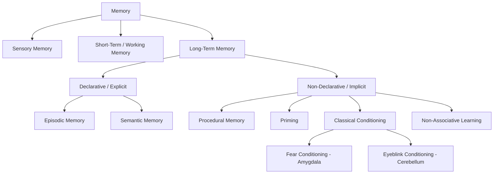

## Taxonomy of Memory Systems

### Overview

Memory is not a unitary faculty but a collection of dissociable systems, each supported by distinct neural substrates, each with its own encoding, storage, and retrieval principles, and each dissociable from the others via neuropsychological lesion studies, neuroimaging, and pharmacological manipulation. The dominant organizing framework distinguishes memory first along a temporal axis (how long information is retained) and then, within long-term memory, along a declarative/non-declarative axis (whether the content is consciously accessible).

### Temporal Taxonomy

**Sensory Memory**

- Extremely brief, high-capacity, modality-specific buffer that holds a nearly complete sensory trace before further processing.
- *Iconic memory* (visual): duration approximately 250–500 ms; classically demonstrated by Sperling's partial-report paradigm.
- *Echoic memory* (auditory): duration approximately 2–4 seconds, substantially longer than iconic memory because auditory events are inherently sequential and require a longer window for integration.
- Sensory memory is pre-attentive and pre-categorical; without attentional selection, the trace decays and is lost.

**Short-Term Memory (STM) / Working Memory (WM)**

- Limited-capacity, temporary storage system that holds information for roughly 15–30 seconds without rehearsal.
- Classic capacity estimate: Miller's "magical number seven, plus or minus two" (7 ± 2 chunks); later refined by Cowan to approximately 4 chunks when rehearsal/chunking strategies are controlled for.
- Working memory extends STM by adding active manipulation of held information, not just passive storage.
- Baddeley and Hitch's multicomponent model of working memory:
  - **Phonological loop**: subvocal rehearsal of verbal/acoustic information; supports language comprehension and vocabulary acquisition.
  - **Visuospatial sketchpad**: temporary storage/manipulation of visual and spatial information.
  - **Central executive**: attentional control system that allocates resources, coordinates the two "slave" subsystems, and manages switching between tasks.
  - **Episodic buffer** (added later): integrates information from the loop, sketchpad, and long-term memory into unified, multimodal episodic representations.
- Primary neural substrate: dorsolateral prefrontal cortex (DLPFC), supported by parietal cortex for storage buffers and by domain-specific posterior regions (e.g., auditory cortex for phonological information, occipito-parietal regions for visuospatial information).

**Long-Term Memory (LTM)**

- Comparatively unlimited-capacity store with retention lasting from minutes to a lifetime.
- Encoding into LTM classically depends on the medial temporal lobe (MTL) system, particularly the hippocampus, though consolidated long-term memories become progressively less hippocampus-dependent over time (see systems consolidation).
- LTM subdivides into declarative and non-declarative systems, detailed below.

### Declarative (Explicit) Memory

Declarative memory refers to memory for facts and events that can be consciously recollected and verbally declared. It is dependent on the hippocampus and surrounding MTL structures (entorhinal, perirhinal, and parahippocampal cortices) for encoding, though it becomes cortically distributed with consolidation.

**Episodic Memory**

- Memory for personally experienced events, bound to a specific spatiotemporal context ("what," "where," "when").
- Tulving's concept of "mental time travel": episodic retrieval involves autonoetic consciousness, a subjective sense of re-experiencing the past.
- Heavily dependent on the hippocampus for pattern separation (encoding highly similar events as distinct, non-overlapping traces) and pattern completion (retrieving a full memory from a partial cue).
- Example: recalling the specific conversation you had over coffee yesterday morning, including who was present and what was said.

**Semantic Memory**

- Memory for general world knowledge, facts, and concepts, decontextualized from the specific episode in which they were learned.
- Example: knowing that Paris is the capital of France, without necessarily remembering when or how you learned this fact.
- Initially hippocampus-dependent at encoding but becomes represented in distributed neocortical networks (notably anterior temporal lobe as a semantic "hub") as memories consolidate; this is a key piece of evidence for standard systems consolidation theory.
- Dissociable from episodic memory: patients with semantic dementia (anterior temporal lobe atrophy) show degraded conceptual knowledge with relatively preserved episodic recall of recent events, whereas patients with hippocampal amnesia (e.g., patient H.M.) show the opposite pattern — severely impaired episodic memory with retained general semantic knowledge acquired before injury.

### Non-Declarative (Implicit) Memory

Non-declarative memory encompasses forms of memory expressed through performance rather than conscious recollection; it does not require hippocampal function and is often preserved in amnesic patients.

**Procedural Memory**

- Memory for skills and habits, including motor and cognitive procedures (e.g., riding a bicycle, typing, mirror-tracing tasks).
- Primary substrates: basal ganglia (striatum) and cerebellum, with contributions from motor and premotor cortex.
- Classic demonstration: amnesic patient H.M. showed normal improvement across days on the mirror-tracing task despite having no explicit recollection of ever having performed it before.

**Priming**

- Facilitated processing of a stimulus due to prior exposure, without conscious awareness of the earlier encounter.
- *Perceptual priming*: relies on the form/structure of the stimulus; associated with occipital and other sensory neocortical regions.
- *Conceptual priming*: relies on meaning; associated with more anterior/semantic regions.
- Example: faster identification of a word fragment ("_LEPHANT") after having seen the word "ELEPHANT" earlier in an unrelated task.

**Classical (Pavlovian) Conditioning**

- Learning an association between a neutral conditioned stimulus (CS) and an unconditioned stimulus (US) that elicits a reflexive response.
- *Delay/trace eyeblink conditioning*: depends critically on the cerebellum (interpositus nucleus) for the timed motor response.
- *Fear conditioning*: depends on the amygdala, particularly the basolateral and central nuclei, for association formation and expression (e.g., freezing behavior).

**Non-Associative Learning**

- **Habituation**: decreased behavioral response to a repeated, innocuous stimulus.
- **Sensitization**: increased behavioral response following exposure to a strong or noxious stimulus.
- Extensively characterized at the synaptic level in *Aplysia californica* by Eric Kandel's group, providing a foundational model for the cellular mechanisms of learning.

### Working Memory vs. Short-Term Memory: A Note on Terminology

[Inference] Although often used interchangeably in introductory contexts, cognitive neuroscience typically distinguishes STM (passive maintenance) from working memory (active maintenance plus manipulation), a distinction that matters more in some theoretical traditions (e.g., Baddeley's model) than others (e.g., unitary-resource accounts).

### Summary Table

| System | Duration | Capacity | Awareness | Key Structure(s) |
| --- | --- | --- | --- | --- |
| Sensory memory | Milliseconds to seconds | High, modality-specific | Pre-attentive | Sensory cortices |
| Short-term / working memory | Seconds to ~1 min | Limited (~4–7 chunks) | Conscious | DLPFC, parietal cortex |
| Episodic memory | Minutes to lifetime | Very large | Conscious, autonoetic | Hippocampus, MTL |
| Semantic memory | Minutes to lifetime | Very large | Conscious, noetic | Anterior temporal lobe, distributed neocortex |
| Procedural memory | Minutes to lifetime | Large | Non-conscious | Basal ganglia, cerebellum |
| Priming | Minutes to months | Large | Non-conscious | Sensory/associative neocortex |
| Classical conditioning | Minutes to lifetime | N/A | Non-conscious | Cerebellum, amygdala |

### Diagram: Memory Systems Taxonomy

### Diagram: Neural Substrate Mapping (svg_diagram)

<svg xmlns="http://www.w3.org/2000/svg" viewBox="0 0 760 420">
\<style\>
.box { fill: #f5f5f5; stroke: #333; stroke-width: 1.5; }
.decl { fill: #dbe9f7; stroke: #2b5f8a; stroke-width: 1.5; }
.nondecl { fill: #f7e6d0; stroke: #8a5a2b; stroke-width: 1.5; }
.label { font-family: sans-serif; font-size: 13px; fill: #111; text-anchor: middle; }
.title { font-family: sans-serif; font-size: 16px; fill: #111; text-anchor: middle; font-weight: bold; }
.arrow { stroke: #555; stroke-width: 1.5; fill: none; marker-end: url(#arrow); }
\</style\>
<text x="380" y="24" class="title">Neural Substrate Mapping of Memory Systems (svg_diagram)</text>
<rect x="300" y="40" width="160" height="36" rx="6" class="box" />
<text x="380" y="63" class="label">Long-Term Memory</text>
<rect x="140" y="120" width="180" height="36" rx="6" class="decl" />
<text x="230" y="143" class="label">Declarative (Hippocampus, MTL)</text>
<rect x="440" y="120" width="200" height="36" rx="6" class="nondecl" />
<text x="540" y="143" class="label">Non-Declarative (Striatum, Cerebellum, Amygdala)</text>
<line x1="380" y1="76" x2="230" y2="120" class="arrow" />
<line x1="380" y1="76" x2="540" y2="120" class="arrow" />
<rect x="90" y="200" width="140" height="34" rx="6" class="decl" />
<text x="160" y="222" class="label">Episodic (Hippocampus)</text>
<rect x="260" y="200" width="150" height="34" rx="6" class="decl" />
<text x="335" y="222" class="label">Semantic (Ant. Temporal Lobe)</text>
<line x1="230" y1="156" x2="160" y2="200" class="arrow" />
<line x1="230" y1="156" x2="335" y2="200" class="arrow" />
<rect x="420" y="200" width="120" height="34" rx="6" class="nondecl" />
<text x="480" y="222" class="label">Procedural (Basal Ganglia)</text>
<rect x="560" y="200" width="100" height="34" rx="6" class="nondecl" />
<text x="610" y="222" class="label">Priming (Neocortex)</text>
<rect x="420" y="250" width="240" height="34" rx="6" class="nondecl" />
<text x="540" y="272" class="label">Classical Conditioning (Cerebellum, Amygdala)</text>
<line x1="540" y1="156" x2="480" y2="200" class="arrow" />
<line x1="540" y1="156" x2="610" y2="200" class="arrow" />
<line x1="540" y1="156" x2="540" y2="250" class="arrow" />
</svg>

### Key Points

- Memory systems dissociate along two major axes: **duration** (sensory → short-term/working → long-term) and, within long-term memory, **conscious accessibility** (declarative vs. non-declarative).
- The hippocampus and MTL are necessary for encoding new declarative memories but are not required for most forms of non-declarative learning, which instead recruit the basal ganglia, cerebellum, amygdala, and neocortical sensory systems.
- Double dissociations (e.g., H.M. vs. semantic dementia patients) provide the strongest evidence that these are separable systems rather than a single unitary memory faculty.
- Episodic and semantic memory both depend on the hippocampus at encoding but diverge over time as semantic knowledge becomes cortically distributed through consolidation.

### Related Topics

- Systems consolidation theory and the standard model of hippocampal-neocortical dialogue
- Multiple trace theory as an alternative to standard consolidation
- Long-term potentiation (LTP) as the synaptic mechanism underlying memory storage
- Working memory neural models (e.g., persistent activity in prefrontal cortex)
- Amnesia syndromes: anterograde vs. retrograde amnesia
- Pattern separation and pattern completion in the dentate gyrus/CA3
- The role of sleep in memory consolidation
- Reconsolidation and memory updating