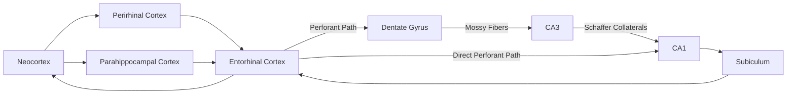

## Hippocampal Formation and Encoding

### Anatomical Organization

The hippocampal formation is a set of interconnected allocortical and periallocortical structures situated in the medial temporal lobe. It comprises:

- **Dentate gyrus (DG)**: V-shaped/C-shaped cell layer containing densely packed granule cells; site of adult neurogenesis in the mammalian brain.
- **Hippocampus proper (Cornu Ammonis)**: subdivided into **CA3**, **CA2**, and **CA1** fields, each with distinct connectivity and physiological properties.
- **Subiculum**: primary output structure that relays processed information from CA1 back to cortical and subcortical targets.
- **Entorhinal cortex (EC)**: the principal gateway between the hippocampus and the rest of the neocortex; divided into medial entorhinal cortex (MEC, more spatial) and lateral entorhinal cortex (LEC, more object/context-related).

Together with the **perirhinal cortex** and **parahippocampal cortex** (which feed into the entorhinal cortex), these structures constitute the broader medial temporal lobe (MTL) memory system.

### The Trisynaptic Circuit

The canonical intrahippocampal circuit is a largely unidirectional loop:

1. **Perforant path**: entorhinal cortex layer II → dentate gyrus granule cells (first synapse).
2. **Mossy fibers**: dentate gyrus → CA3 pyramidal cells (second synapse).
3. **Schaffer collaterals**: CA3 → CA1 pyramidal cells (third synapse).
4. CA1 → subiculum → entorhinal cortex layer V/VI → back out to neocortex.

A parallel **direct perforant path** also runs from entorhinal cortex layer III directly to CA1, bypassing the DG and CA3 stages; this pathway is thought to support a faster, less pattern-separated route into the hippocampus.

### Computational Roles of Hippocampal Subfields

**Dentate Gyrus: Pattern Separation**

- The DG has a very high ratio of granule cells to entorhinal input cells (expansion recoding) and sparse, weak firing, which together orthogonalize similar input patterns into distinct, non-overlapping representations.
- Functionally, this minimizes interference between similar experiences (e.g., remembering where you parked today as distinct from where you parked yesterday).
- Adult-born granule cells in the DG are thought to contribute disproportionately to pattern separation shortly after their maturation.

**CA3: Pattern Completion and Autoassociation**

- CA3 pyramidal cells have extensive recurrent collateral connections among themselves, forming an autoassociative network.
- This recurrent architecture allows a partial or degraded cue to reactivate a complete, previously stored pattern (pattern completion) — the neural basis of recalling a whole event from a single fragment (e.g., a smell triggering a full memory).
- CA3 is also implicated in rapid, one-trial (or few-trial) encoding, consistent with its proposed role as an episodic "index" structure.

**CA1: Comparator and Novelty Detection**

- CA1 receives converging input from both CA3 (via Schaffer collaterals) and entorhinal cortex layer III (via the direct perforant path), allowing it to compare predicted input (from CA3) against actual current input (from EC).
- This comparator function is proposed to underlie novelty/mismatch detection, which can modulate attention and further encoding.

### Synaptic Mechanism of Encoding: Long-Term Potentiation (LTP)

Long-term potentiation is the leading candidate cellular/synaptic mechanism for memory encoding in the hippocampus, first described by Bliss and Lømo in the perforant path–dentate gyrus synapse.

**NMDA-Receptor-Dependent LTP (Schaffer collateral–CA1 synapse)**

1. Under normal (resting) conditions, the NMDA receptor channel pore is blocked by a magnesium ion ($Mg^{2+}$) in a voltage-dependent manner.
2. Repetitive/high-frequency presynaptic glutamate release combined with sufficient postsynaptic depolarization (achieved via AMPA receptor activation) relieves the $Mg^{2+}$ block.
3. With the block removed, the NMDA receptor allows calcium ion ($Ca^{2+}$) influx into the postsynaptic spine.
4. The resulting rise in intracellular $[Ca^{2+}]$ triggers second-messenger cascades, notably activation of **CaMKII** (calcium/calmodulin-dependent protein kinase II).
5. CaMKII phosphorylates existing AMPA receptors (increasing their conductance) and promotes trafficking of additional AMPA receptors into the postsynaptic membrane, increasing synaptic strength.
6. **Late-phase LTP** additionally requires gene transcription and new protein synthesis, converting early, transient potentiation (lasting hours) into a stable, structural change (lasting days to weeks) — this transcription-dependent phase is a core substrate of the synaptic consolidation process.

The NMDA receptor's dual requirement (presynaptic glutamate release AND postsynaptic depolarization) makes it a coincidence detector, giving LTP its associative property: synapses that are active in temporal correlation with strong postsynaptic activity are the ones potentiated, providing a plausible cellular analog of Hebbian learning ("cells that fire together, wire together").

[Inference] Mossy fiber LTP at the DG–CA3 synapse is comparatively NMDA-receptor-independent and instead relies primarily on presynaptic mechanisms (e.g., changes in presynaptic $Ca^{2+}$ signaling via kainate receptors), a distinction that is well-established in the electrophysiology literature but less commonly emphasized in introductory treatments.

$$\Delta w_{ij} \propto \left[Ca^{2+}\right]_{post} \cdot \text{(presynaptic activity)}_i \cdot \text{(postsynaptic depolarization)}_j$$

### Spatial and Contextual Encoding

- **Place cells**: pyramidal neurons in CA1 (and CA3) that fire selectively when an animal occupies a specific location in its environment (its "place field"); discovered by O'Keefe and Dostrovsky.
- **Grid cells**: found in medial entorhinal cortex, fire in a periodic, hexagonal spatial pattern across the environment, providing a metric coordinate system for space; discovered by the Mosers.
- Together, place and grid cells form the empirical basis of O'Keefe and Nadel's **cognitive map theory**, which proposes that the hippocampus constructs an internal, allocentric representation of space that also scaffolds episodic memory more broadly (binding "what" happened to "where" and "when").
- The 2014 Nobel Prize in Physiology or Medicine was awarded jointly to O'Keefe and the Mosers for this body of work.

### Encoding vs. Consolidation vs. Retrieval

- **Encoding**: the initial registration of an experience into a hippocampus-dependent memory trace, dependent on LTP-like synaptic strengthening across the trisynaptic circuit.
- **Consolidation**: the process by which this initially labile, hippocampus-dependent trace is stabilized, both at the synaptic level (protein-synthesis-dependent stabilization, occurring over hours) and at the systems level (gradual transfer of the memory trace to distributed neocortical networks, occurring over weeks to years, partly via hippocampal-neocortical dialogue during slow-wave sleep, including sharp-wave ripple events).
- **Retrieval**: reactivation of the stored trace, which in the hippocampal system frequently relies on CA3-mediated pattern completion from a partial cue.

### Clinical and Lesion Evidence

- **Patient H.M. (Henry Molaison)**: bilateral medial temporal lobectomy (including hippocampus, amygdala, and surrounding cortex) for intractable epilepsy resulted in severe anterograde amnesia for declarative memory, with relatively preserved short-term memory, intelligence, and procedural learning — foundational evidence that the hippocampus is specifically necessary for forming new declarative memories, not for retaining remote ones or for non-declarative learning.
- **Patient E.P.**, and rodent/primate lesion studies with more selective hippocampal damage, have helped further dissociate the specific contributions of hippocampus proper versus surrounding perirhinal/parahippocampal cortex (the latter more associated with item familiarity, the former more associated with recollection and relational/associative binding).

### Key Points

- The hippocampal formation processes information through a largely unidirectional trisynaptic circuit (EC → DG → CA3 → CA1 → subiculum → EC).
- The DG performs pattern separation; CA3 performs pattern completion via recurrent autoassociative connections; CA1 acts as a comparator between predicted and actual input.
- NMDA-receptor-dependent LTP at the Schaffer collateral–CA1 synapse is the best-characterized cellular mechanism proposed to underlie hippocampal encoding, operating via a coincidence-detection mechanism that gives it Hebbian, associative properties.
- Place cells (hippocampus) and grid cells (entorhinal cortex) provide the neurophysiological substrate for the cognitive map theory of hippocampal function.
- Bilateral hippocampal/MTL damage (e.g., patient H.M.) produces severe anterograde amnesia for declarative memory while sparing short-term memory and non-declarative learning, establishing the hippocampus's necessity for new declarative encoding.

### Related Topics

- Systems-level memory consolidation and the standard consolidation model vs. multiple trace theory
- Sharp-wave ripples and hippocampal replay during sleep
- Long-term depression (LTD) as the inverse synaptic mechanism to LTP
- Theta rhythm and its role in encoding/retrieval dynamics
- Perirhinal cortex and the recollection/familiarity distinction in recognition memory
- Adult hippocampal neurogenesis and its functional significance
- Grid cell/place cell coding models and path integration