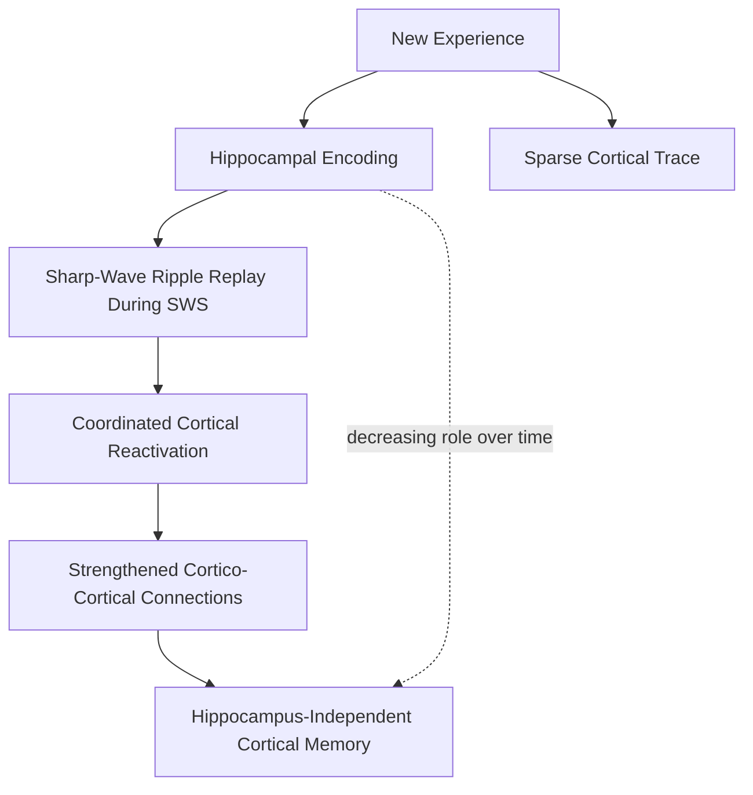

## Systems Consolidation Theory

### Overview

Systems consolidation theory addresses how memories change their neural dependency over time following initial encoding. It is distinct from **synaptic (cellular) consolidation**, which stabilizes an individual memory trace at the level of synapses over minutes to hours (via protein-synthesis-dependent late-phase LTP). Systems consolidation instead operates over a much longer timescale — weeks, months, or years — and concerns the reorganization of memory traces across large-scale brain networks, specifically the gradual shift of declarative memory dependence from the hippocampus to distributed regions of the neocortex.

### The Core Empirical Phenomenon: Temporally Graded Retrograde Amnesia

The central observation motivating systems consolidation theory is that hippocampal damage does not erase all previously formed declarative memories equally:

- **Recent memories** (formed shortly before the lesion) are typically severely impaired.
- **Remote memories** (formed long before the lesion, often years to decades earlier) are relatively spared.

This pattern — temporally graded retrograde amnesia — has been documented in human amnesic patients with hippocampal damage and reproduced in animal lesion studies (e.g., rodent contextual fear conditioning, spatial water maze memory), where lesions made shortly after training impair memory but lesions made long after training (with a comparable retention interval before testing) leave memory largely intact.

[Inference] The precise time course of this gradient varies considerably across studies, species, and memory type (episodic-like vs. semantic-like), and is one of the more actively debated empirical parameters in the field rather than a fixed, universal value.

### The Standard Model of Systems Consolidation

The classical (or "standard") model, associated with work by Squire, Alvarez, and colleagues, proposes:

1. At encoding, a new memory trace is represented conjointly in both the hippocampus and relevant neocortical regions, but the hippocampus is initially indispensable for binding and retrieving the distributed cortical components as a coherent whole.
2. Over subsequent periods — particularly during **slow-wave sleep** — the hippocampus repeatedly "replays" the encoded pattern, reactivating the associated neocortical ensembles in a coordinated, time-compressed manner.
3. This repeated reactivation, thought to be driven substantially by **hippocampal sharp-wave ripples** coordinated with cortical slow oscillations and thalamic sleep spindles, progressively strengthens direct cortico-cortical connections among the components of the memory.
4. As cortico-cortical connections strengthen, the memory becomes capable of being retrieved via cortical connections alone, without hippocampal involvement — the memory has been "transferred" out of the hippocampus.
5. Once fully consolidated, the memory is hippocampus-independent, explaining why hippocampal damage spares remote (fully consolidated) memories while sparing recent (still hippocampus-dependent) ones is impossible.

### Multiple Trace Theory: An Alternative Account

Multiple Trace Theory (MTT), proposed by Nadel and Moscovitch, challenges the standard model's claim that all declarative memories eventually become fully hippocampus-independent. MTT proposes:

- Every time a memory is retrieved, a **new hippocampal trace** is created (in addition to the original), progressively strengthening and enriching a multi-trace hippocampal-cortical network.
- **Semantic memory** can indeed become hippocampus-independent over time, consistent with the standard model, because semantic knowledge is gradually extracted and generalized across multiple related episodes into schema-like cortical representations.
- **Episodic memory**, by contrast, remains **permanently hippocampus-dependent**, no matter how remote, because its richly contextualized, detailed nature requires the pattern-separation and pattern-completion machinery unique to the hippocampus. Under MTT, the appearance of "sparing" of remote episodic memories in amnesic patients is explained by such memories having become semanticized (schematic, gist-like) rather than truly independent of the hippocampus.
- A closely related extension, the **Trace Transformation Theory**, explicitly frames this as episodic traces being gradually "transformed" into more schematic, semantic-like representations with a parallel shift in dependence from hippocampus toward ventromedial prefrontal cortex and other neocortical regions, rather than a strict binary switch.

### Comparing the Two Models

| Feature | Standard Consolidation Model | Multiple Trace Theory |
| --- | --- | --- |
| Fate of episodic memory | Eventually hippocampus-independent | Permanently hippocampus-dependent |
| Fate of semantic memory | Eventually hippocampus-independent | Eventually hippocampus-independent |
| Role of retrieval | Passive strengthening via replay | Creates new hippocampal traces each time |
| Predicted retrograde gradient for episodic memory | Flattens out (remote memories spared) | Should remain steep indefinitely (remote *episodic* memories still vulnerable) |
| Key supporting evidence | Temporally graded amnesia in semantic/factual memory tasks | Some amnesic patients show retrograde amnesia for autobiographical episodic detail extending across the entire lifespan, even for very remote events |

### Neural Mechanisms Supporting Consolidation

- **Sharp-wave ripples (SWRs)**: high-frequency (~150–250 Hz) oscillatory events generated in CA3/CA1 during slow-wave sleep and quiet wakefulness, accompanied by compressed reactivation ("replay") of place-cell sequences corresponding to recently experienced spatial trajectories.
- **Slow oscillations and sleep spindles**: cortical slow oscillations (<1 Hz) are thought to temporally organize thalamocortical sleep spindles and hippocampal SWRs into a nested hierarchy, creating windows during which hippocampal-to-cortical information transfer is favored.
- **Active systems consolidation hypothesis** (Born, Rasch, and colleagues): frames slow-wave sleep specifically (rather than sleep generally) as an active, not merely passive, process in which the temporal coupling of these three oscillatory events drives the redistribution of memory traces from hippocampus to neocortex.

### Ventromedial Prefrontal Cortex (vmPFC) and Schema-Based Consolidation

- Emerging evidence assigns the vmPFC a role in accelerating consolidation when new information is consistent with a pre-existing **schema** (an organized body of prior knowledge).
- [Inference] Some models propose that schema-congruent information can bypass some degree of the typical hippocampal "waiting period," being integrated into cortical/vmPFC networks more rapidly than schema-incongruent information — this is an active area of research with evidence primarily from rodent studies (e.g., the "event arena" paradigm) and is not yet as firmly established as the core standard-model/MTT contrast.

### Clinical Relevance

- Patients with damage restricted primarily to the hippocampus (sparing surrounding MTL cortex) tend to show more temporally limited retrograde amnesia, consistent with eventual hippocampal independence for at least some memory content.
- Patients with more extensive MTL damage (including perirhinal/parahippocampal/entorhinal cortex) often show more extensive, flatter retrograde amnesia gradients, implicating these surrounding structures in the consolidation process itself, not merely the hippocampus proper.
- [Inference] The degree to which any individual case supports the standard model versus MTT often depends heavily on how "episodic detail" versus "semantic gist" is operationally measured in memory testing, which is a persistent methodological complication in this literature.

### Key Points

- Systems consolidation is distinct from synaptic consolidation: it concerns network-level reorganization over weeks to years, not synapse-level stabilization over minutes to hours.
- The core evidence is temporally graded retrograde amnesia: recent memories are more vulnerable to hippocampal damage than remote ones.
- The standard model proposes eventual full hippocampal independence for all declarative memory, driven by sleep-dependent hippocampal-to-cortical replay via sharp-wave ripples.
- Multiple Trace Theory proposes that episodic memory remains permanently hippocampus-dependent, while only semantic memory becomes cortex-independent, with retrieval creating new hippocampal traces rather than simply strengthening cortical ones.
- Sharp-wave ripples, slow oscillations, and sleep spindles are the primary oscillatory mechanisms implicated in driving the hippocampal-to-neocortical dialogue that supports consolidation.

### Related Topics

- Sharp-wave ripple physiology and hippocampal replay/preplay
- Sleep stages and their differential roles in declarative vs. procedural memory consolidation
- Schema theory and the vmPFC's role in rapid cortical integration
- Reconsolidation: the re-destabilization and re-stabilization of memories upon retrieval
- Autobiographical memory and remote memory testing methodologies
- Semantic dementia as a lesion model for testing consolidation theories
- Targeted memory reactivation (TMR) as an experimental sleep-consolidation manipulation